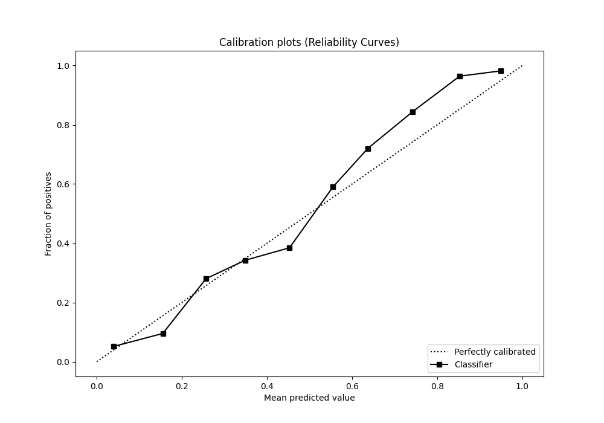

# Summary of 46_RandomForest

[<< Go back](../README.md)

## Random Forest
- **n_jobs**: -1
- **criterion**: entropy
- **max_features**: 0.7
- **min_samples_split**: 40
- **max_depth**: 3
- **eval_metric_name**: f1
- **explain_level**: 0

## Validation
 - **validation_type**: kfold
 - **shuffle**: True
 - **stratify**: True
 - **k_folds**: 5

## Optimized metric
f1

## Training time

19.4 seconds

## Metric details
|           |    score |   threshold |
|:----------|---------:|------------:|
| logloss   | 0.544762 | nan         |
| auc       | 0.802623 | nan         |
| f1        | 0.742892 |   0.501894  |
| accuracy  | 0.74     |   0.501894  |
| precision | 1        |   0.901459  |
| recall    | 1        |   0.0708505 |
| mcc       | 0.480017 |   0.501894  |

## Metric details with threshold from accuracy metric
|           |    score |   threshold |
|:----------|---------:|------------:|
| logloss   | 0.544762 |  nan        |
| auc       | 0.802623 |  nan        |
| f1        | 0.742892 |    0.501894 |
| accuracy  | 0.74     |    0.501894 |
| precision | 0.737423 |    0.501894 |
| recall    | 0.748443 |    0.501894 |
| mcc       | 0.480017 |    0.501894 |

## Confusion matrix (at threshold=0.501894)
|                 |   Predicted as -1.0 |   Predicted as 1.0 |
|:----------------|--------------------:|-------------------:|
| Labeled as -1.0 |                 583 |                214 |
| Labeled as 1.0  |                 202 |                601 |

## Learning curves

## Confusion Matrix

## Normalized Confusion Matrix

## ROC Curve

## Kolmogorov-Smirnov Statistic

## Precision-Recall Curve

## Calibration Curve

## Cumulative Gains Curve

## Lift Curve

[<< Go back](../README.md)
