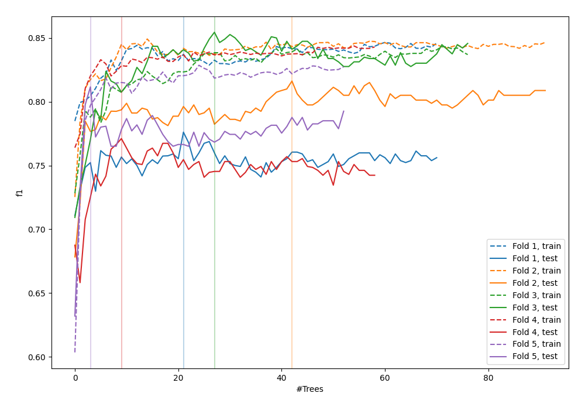
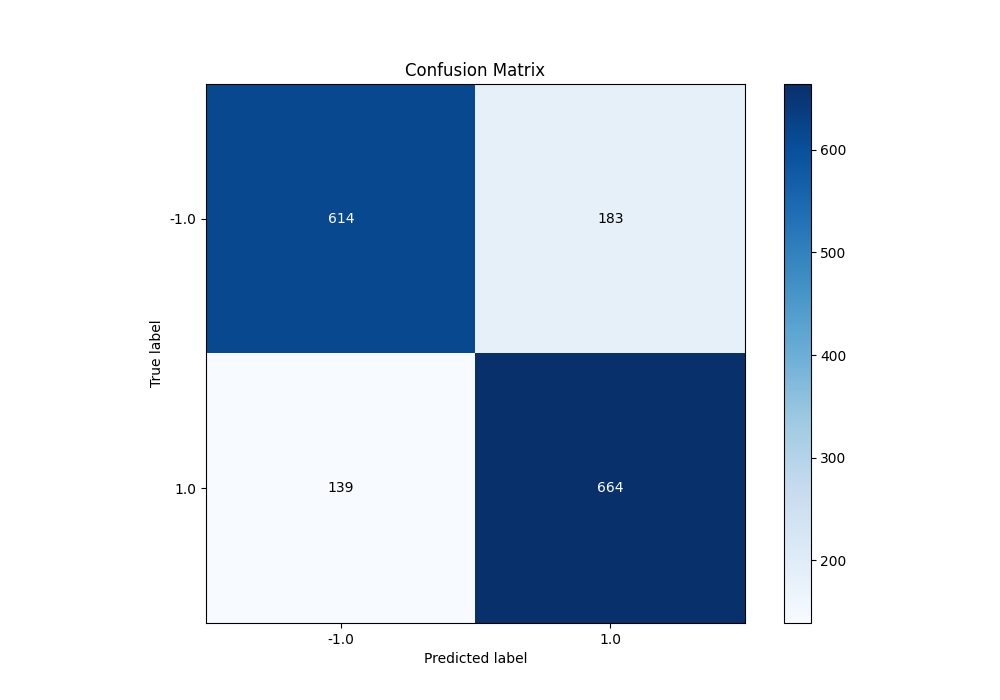
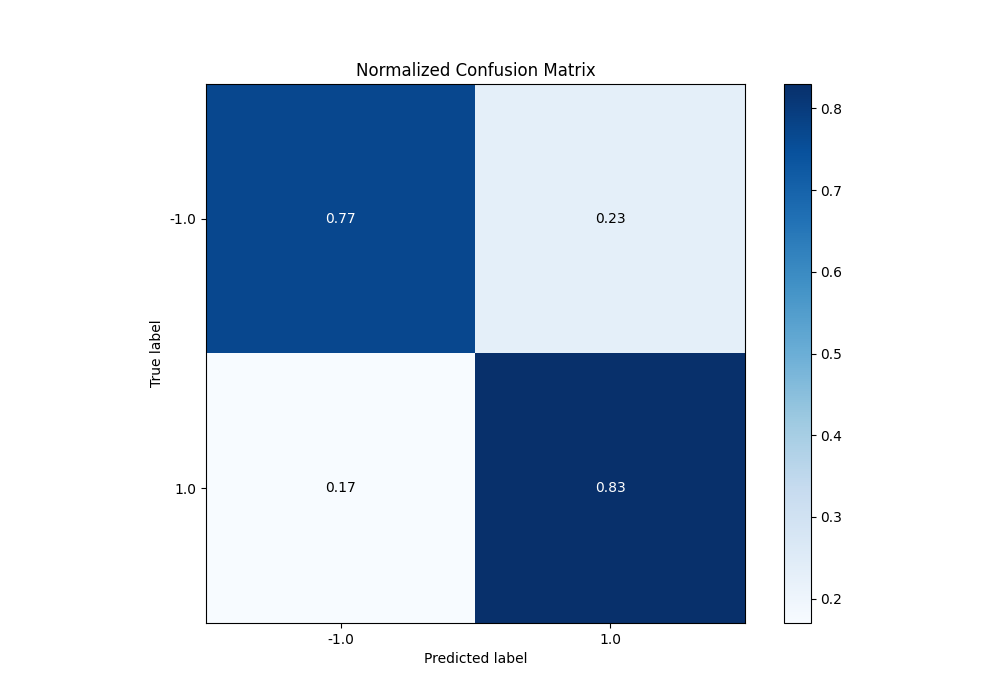
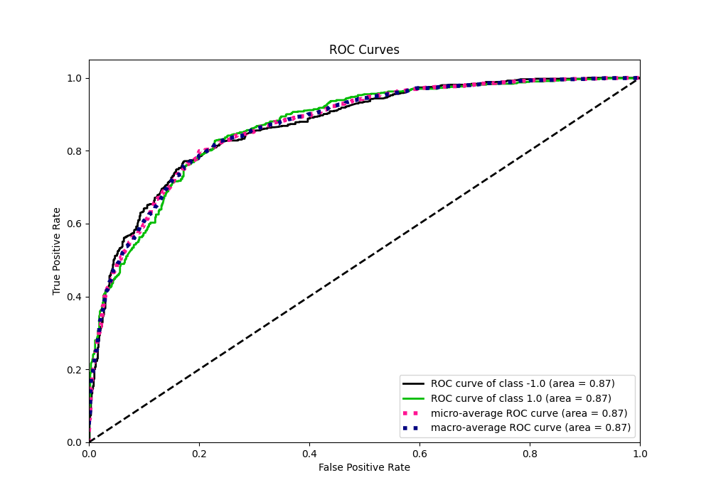
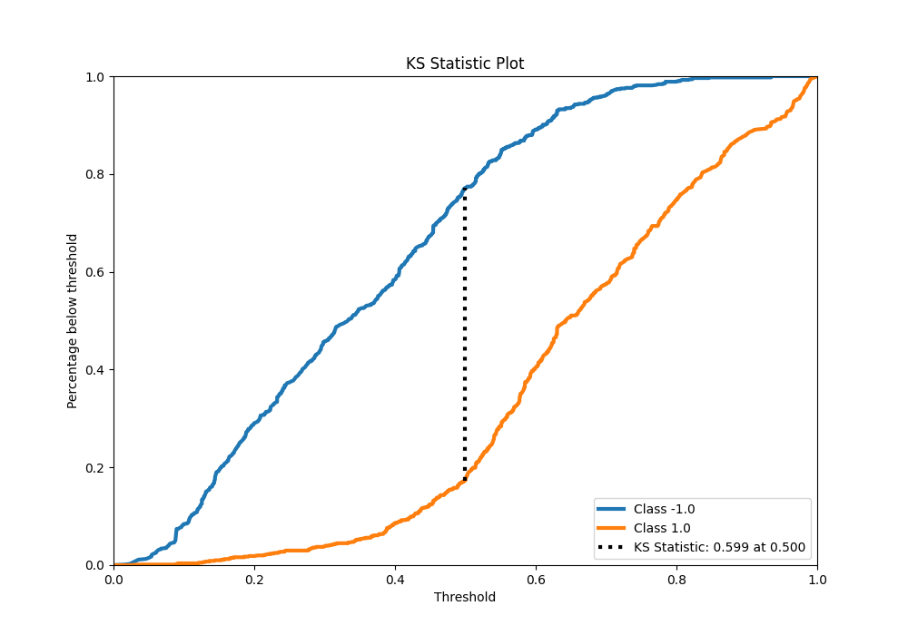
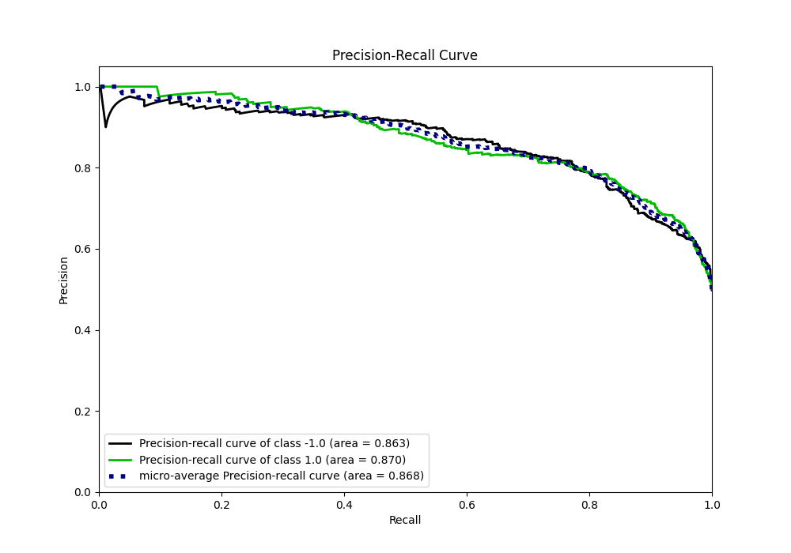
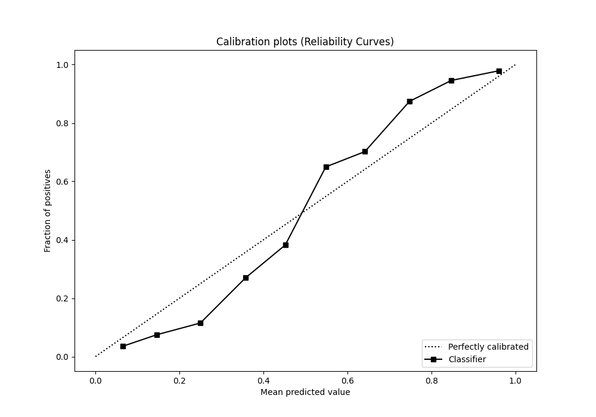
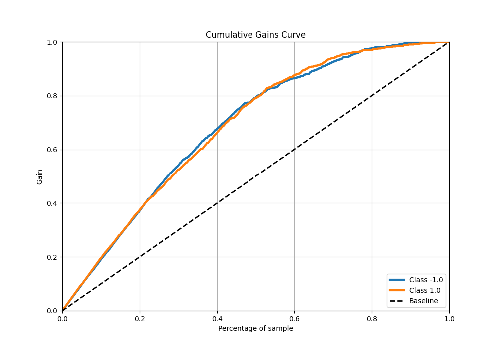
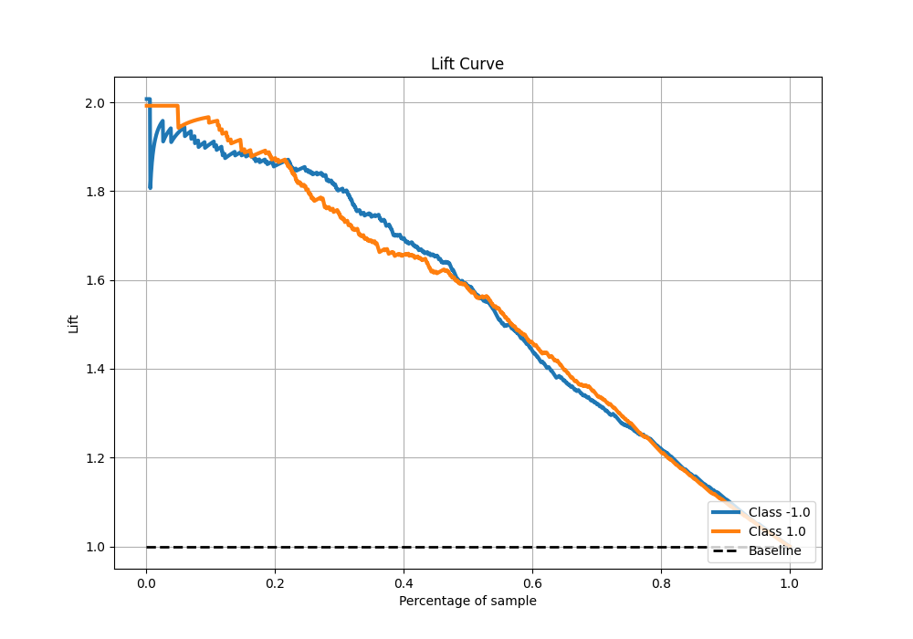

# Summary of 47_RandomForest

[<< Go back](../README.md)

## Random Forest
- **n_jobs**: -1
- **criterion**: entropy
- **max_features**: 0.7
- **min_samples_split**: 30
- **max_depth**: 4
- **eval_metric_name**: f1
- **explain_level**: 0

## Validation
 - **validation_type**: kfold
 - **shuffle**: True
 - **stratify**: True
 - **k_folds**: 5

## Optimized metric
f1

## Training time

17.4 seconds

## Metric details
|           |    score |   threshold |
|:----------|---------:|------------:|
| logloss   | 0.476567 | nan         |
| auc       | 0.868833 | nan         |
| f1        | 0.804848 |   0.499351  |
| accuracy  | 0.79875  |   0.499351  |
| precision | 1        |   0.934467  |
| recall    | 1        |   0.0142086 |
| mcc       | 0.598317 |   0.499351  |

## Metric details with threshold from accuracy metric
|           |    score |   threshold |
|:----------|---------:|------------:|
| logloss   | 0.476567 |  nan        |
| auc       | 0.868833 |  nan        |
| f1        | 0.804848 |    0.499351 |
| accuracy  | 0.79875  |    0.499351 |
| precision | 0.783943 |    0.499351 |
| recall    | 0.826899 |    0.499351 |
| mcc       | 0.598317 |    0.499351 |

## Confusion matrix (at threshold=0.499351)
|                 |   Predicted as -1.0 |   Predicted as 1.0 |
|:----------------|--------------------:|-------------------:|
| Labeled as -1.0 |                 614 |                183 |
| Labeled as 1.0  |                 139 |                664 |

## Learning curves

## Confusion Matrix

## Normalized Confusion Matrix

## ROC Curve

## Kolmogorov-Smirnov Statistic

## Precision-Recall Curve

## Calibration Curve

## Cumulative Gains Curve

## Lift Curve

[<< Go back](../README.md)
