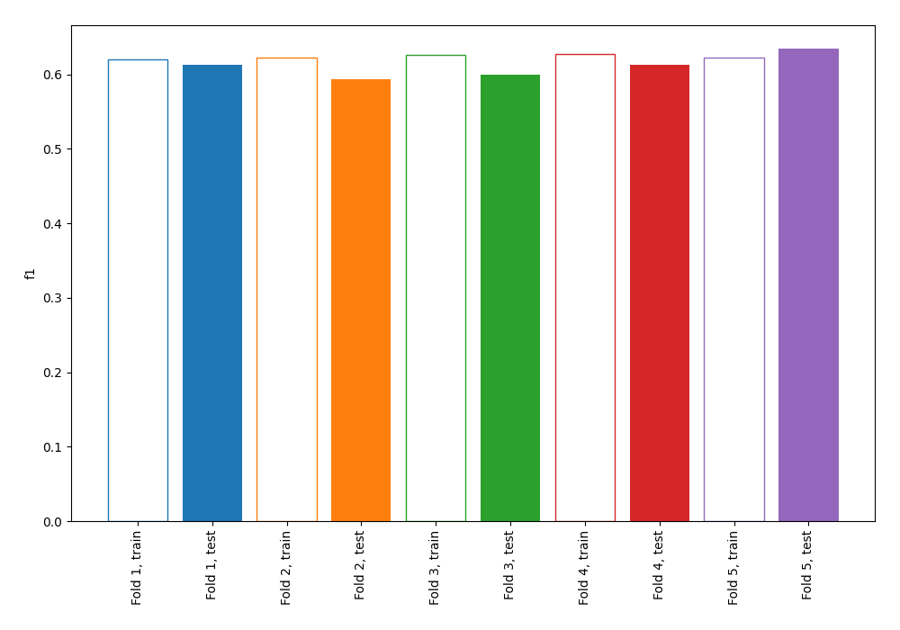
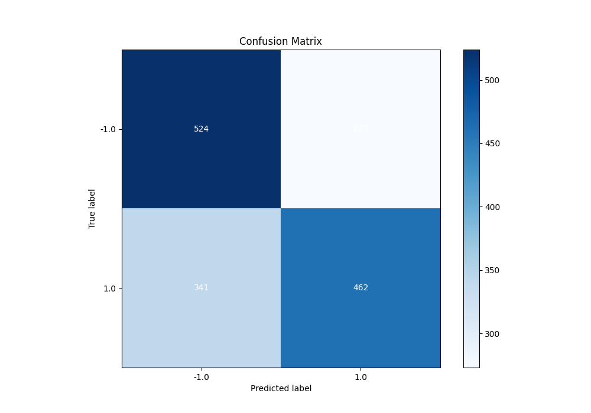
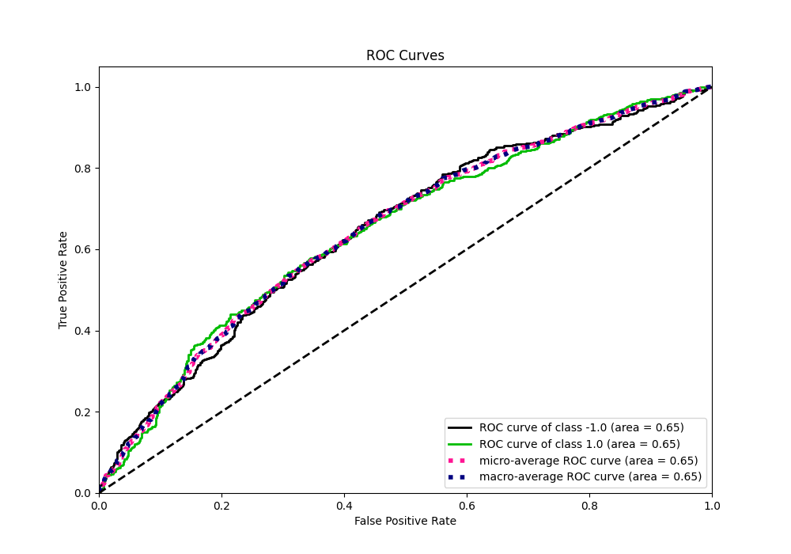
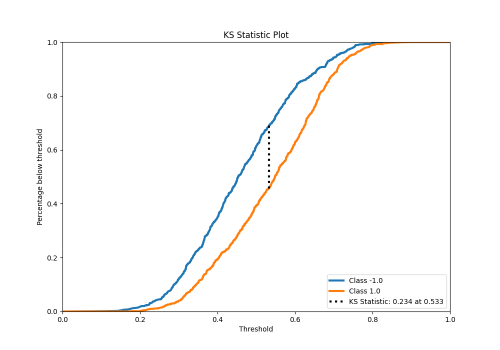
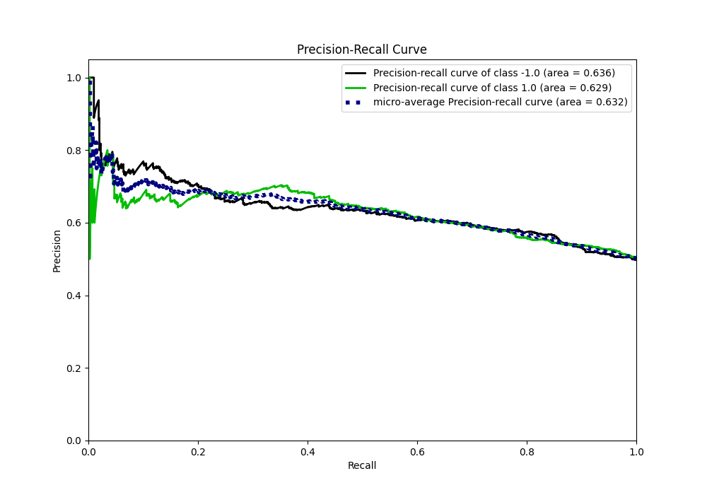
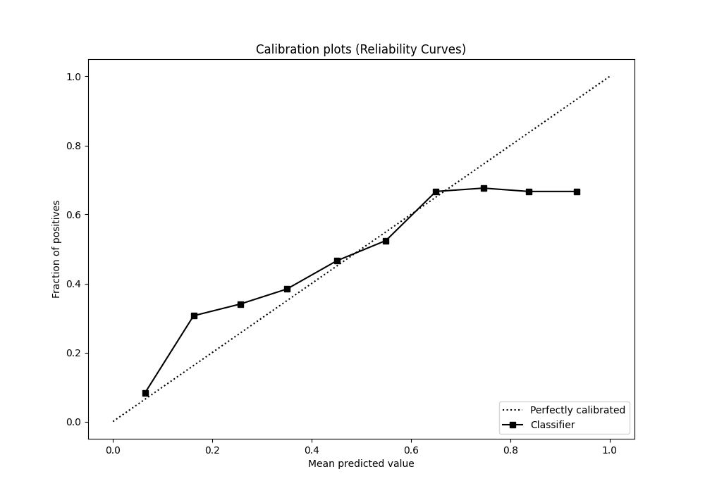
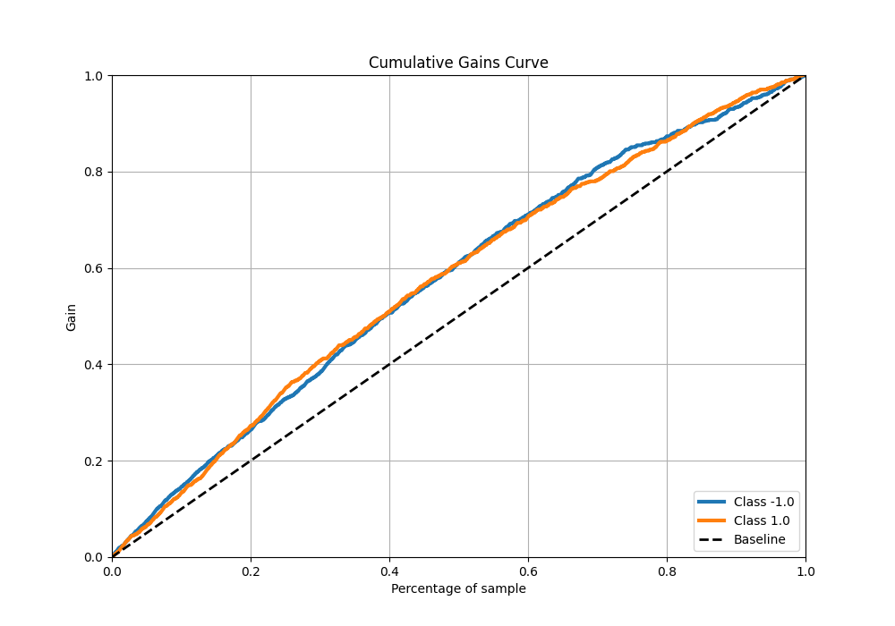
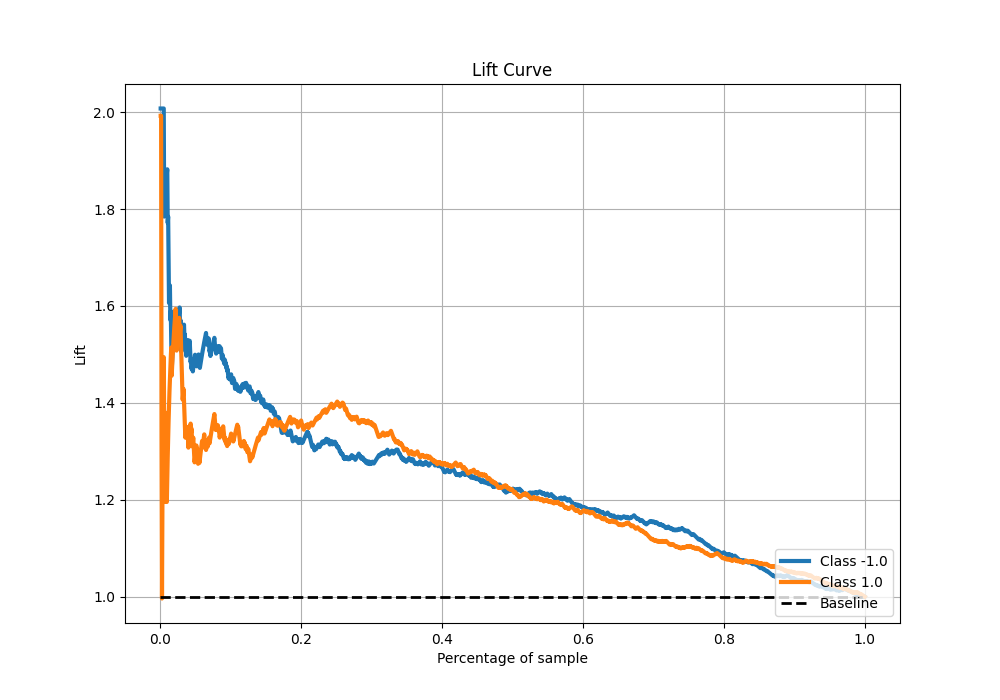

# Summary of 4_Linear

[<< Go back](../README.md)

## Logistic Regression (Linear)
- **n_jobs**: -1
- **explain_level**: 0

## Validation
 - **validation_type**: kfold
 - **shuffle**: True
 - **stratify**: True
 - **k_folds**: 5

## Optimized metric
f1

## Training time

13.8 seconds

## Metric details
|           |    score |   threshold |
|:----------|---------:|------------:|
| logloss   | 0.659482 |  nan        |
| auc       | 0.649509 |  nan        |
| f1        | 0.6781   |    0.301132 |
| accuracy  | 0.61625  |    0.515004 |
| precision | 0.774194 |    0.772227 |
| recall    | 1        |    0.101604 |
| mcc       | 0.236369 |    0.589296 |

## Metric details with threshold from accuracy metric
|           |    score |   threshold |
|:----------|---------:|------------:|
| logloss   | 0.659482 |  nan        |
| auc       | 0.649509 |  nan        |
| f1        | 0.60078  |    0.515004 |
| accuracy  | 0.61625  |    0.515004 |
| precision | 0.628571 |    0.515004 |
| recall    | 0.575342 |    0.515004 |
| mcc       | 0.233579 |    0.515004 |

## Confusion matrix (at threshold=0.515004)
|                 |   Predicted as -1.0 |   Predicted as 1.0 |
|:----------------|--------------------:|-------------------:|
| Labeled as -1.0 |                 524 |                273 |
| Labeled as 1.0  |                 341 |                462 |

## Learning curves

## Confusion Matrix

## Normalized Confusion Matrix

## ROC Curve

## Kolmogorov-Smirnov Statistic

## Precision-Recall Curve

## Calibration Curve

## Cumulative Gains Curve

## Lift Curve

[<< Go back](../README.md)
