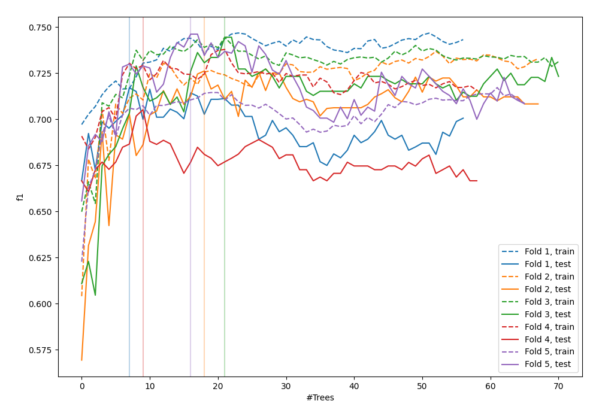
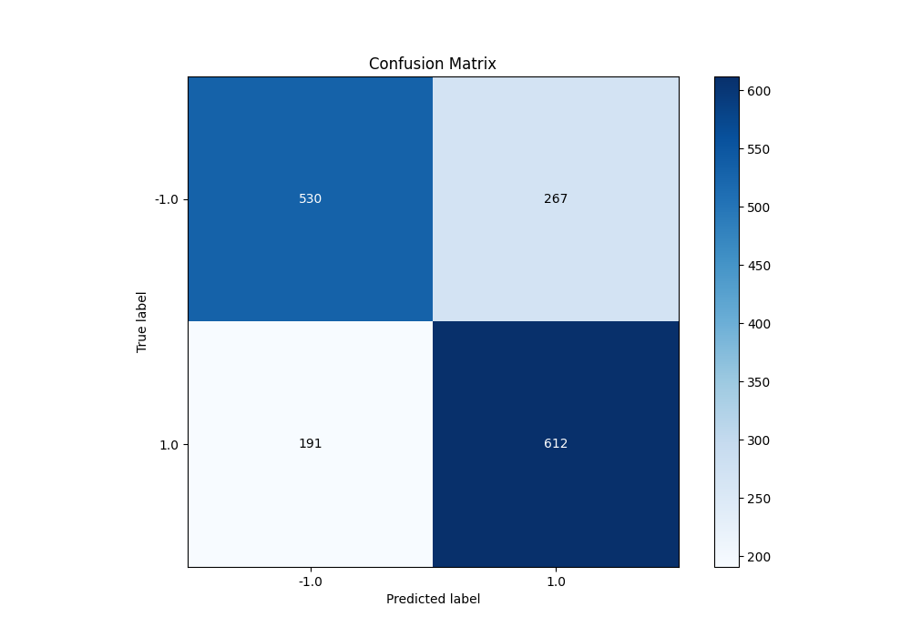
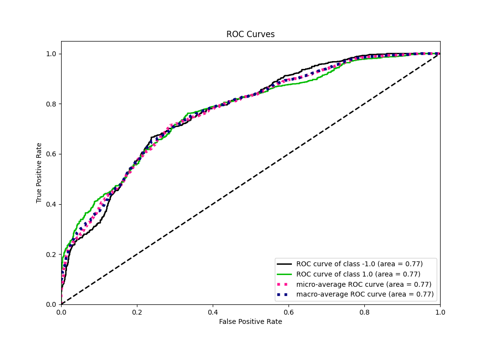
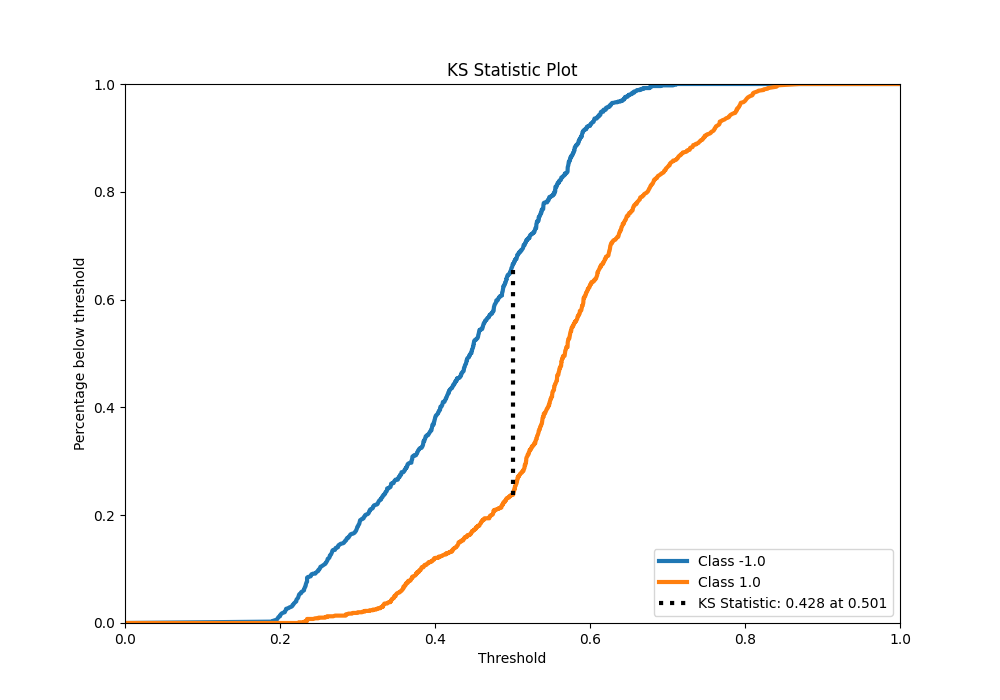
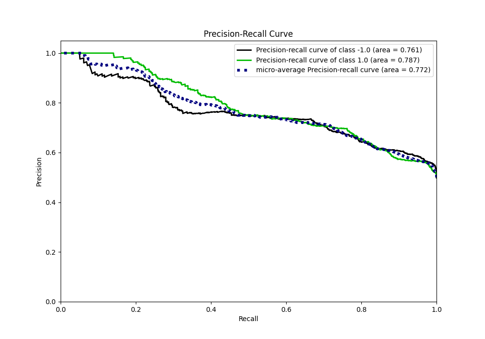
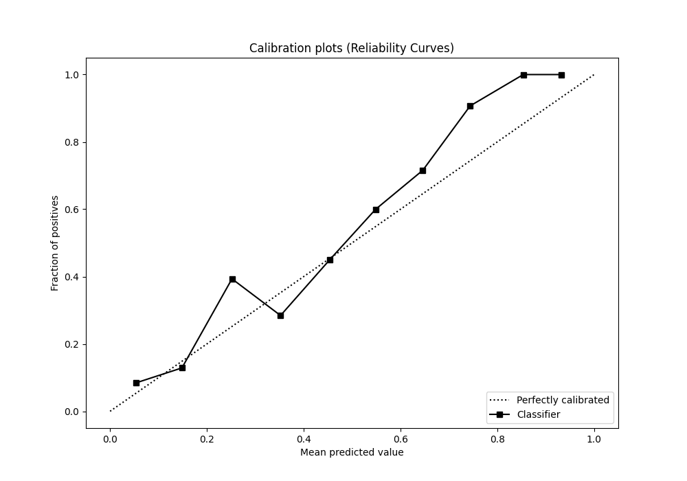
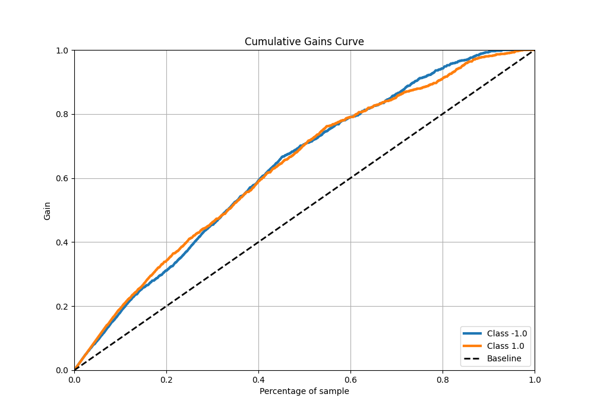
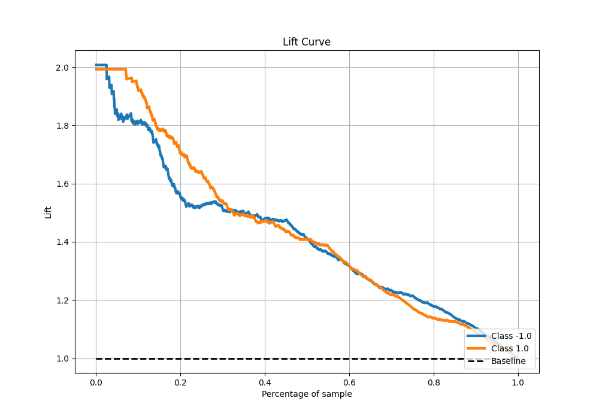

# Summary of 50_ExtraTrees

[<< Go back](../README.md)

## Extra Trees Classifier (Extra Trees)
- **n_jobs**: -1
- **criterion**: gini
- **max_features**: 1.0
- **min_samples_split**: 30
- **max_depth**: 3
- **eval_metric_name**: f1
- **explain_level**: 0

## Validation
 - **validation_type**: kfold
 - **shuffle**: True
 - **stratify**: True
 - **k_folds**: 5

## Optimized metric
f1

## Training time

14.0 seconds

## Metric details
|           |    score |   threshold |
|:----------|---------:|------------:|
| logloss   | 0.593858 |  nan        |
| auc       | 0.769671 |  nan        |
| f1        | 0.727705 |    0.500359 |
| accuracy  | 0.71375  |    0.500359 |
| precision | 1        |    0.712991 |
| recall    | 1        |    0.170776 |
| mcc       | 0.429231 |    0.500359 |

## Metric details with threshold from accuracy metric
|           |    score |   threshold |
|:----------|---------:|------------:|
| logloss   | 0.593858 |  nan        |
| auc       | 0.769671 |  nan        |
| f1        | 0.727705 |    0.500359 |
| accuracy  | 0.71375  |    0.500359 |
| precision | 0.696246 |    0.500359 |
| recall    | 0.762142 |    0.500359 |
| mcc       | 0.429231 |    0.500359 |

## Confusion matrix (at threshold=0.500359)
|                 |   Predicted as -1.0 |   Predicted as 1.0 |
|:----------------|--------------------:|-------------------:|
| Labeled as -1.0 |                 530 |                267 |
| Labeled as 1.0  |                 191 |                612 |

## Learning curves

## Confusion Matrix

## Normalized Confusion Matrix

## ROC Curve

## Kolmogorov-Smirnov Statistic

## Precision-Recall Curve

## Calibration Curve

## Cumulative Gains Curve

## Lift Curve

[<< Go back](../README.md)
