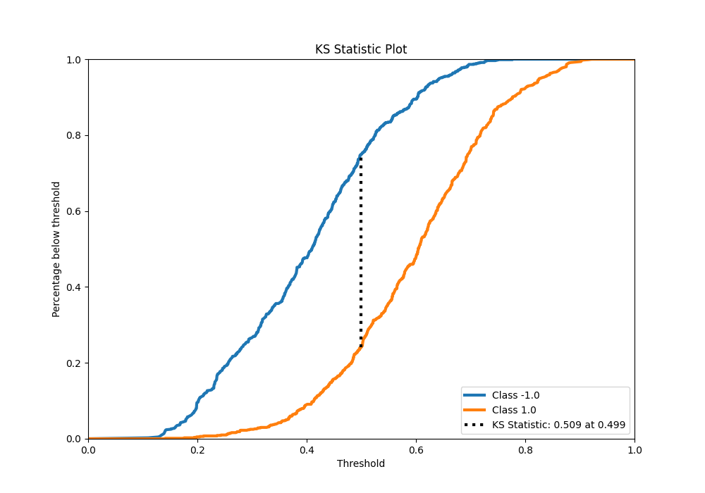
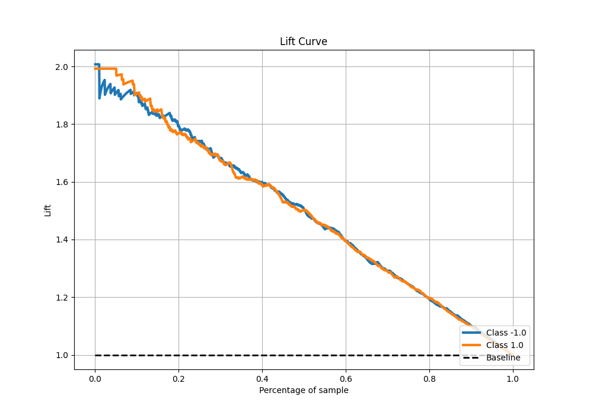

# Summary of 51_ExtraTrees

[<< Go back](../README.md)

## Extra Trees Classifier (Extra Trees)
- **n_jobs**: -1
- **criterion**: gini
- **max_features**: 0.8
- **min_samples_split**: 50
- **max_depth**: 4
- **eval_metric_name**: f1
- **explain_level**: 0

## Validation
 - **validation_type**: kfold
 - **shuffle**: True
 - **stratify**: True
 - **k_folds**: 5

## Optimized metric
f1

## Training time

16.7 seconds

## Metric details
|           |    score |   threshold |
|:----------|---------:|------------:|
| logloss   | 0.547622 | nan         |
| auc       | 0.827779 | nan         |
| f1        | 0.764162 |   0.465886  |
| accuracy  | 0.75375  |   0.497386  |
| precision | 1        |   0.780246  |
| recall    | 1        |   0.0989854 |
| mcc       | 0.507522 |   0.497386  |

## Metric details with threshold from accuracy metric
|           |    score |   threshold |
|:----------|---------:|------------:|
| logloss   | 0.547622 |  nan        |
| auc       | 0.827779 |  nan        |
| f1        | 0.756489 |    0.497386 |
| accuracy  | 0.75375  |    0.497386 |
| precision | 0.75092  |    0.497386 |
| recall    | 0.762142 |    0.497386 |
| mcc       | 0.507522 |    0.497386 |

## Confusion matrix (at threshold=0.497386)
|                 |   Predicted as -1.0 |   Predicted as 1.0 |
|:----------------|--------------------:|-------------------:|
| Labeled as -1.0 |                 594 |                203 |
| Labeled as 1.0  |                 191 |                612 |

## Learning curves

## Confusion Matrix

## Normalized Confusion Matrix

## ROC Curve

## Kolmogorov-Smirnov Statistic

## Precision-Recall Curve

## Calibration Curve

## Cumulative Gains Curve

## Lift Curve

[<< Go back](../README.md)
