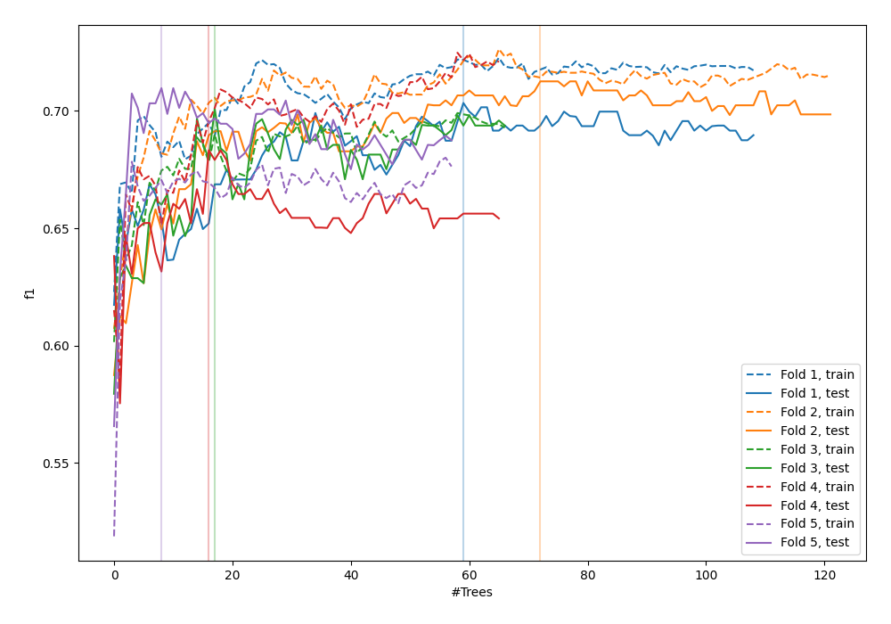
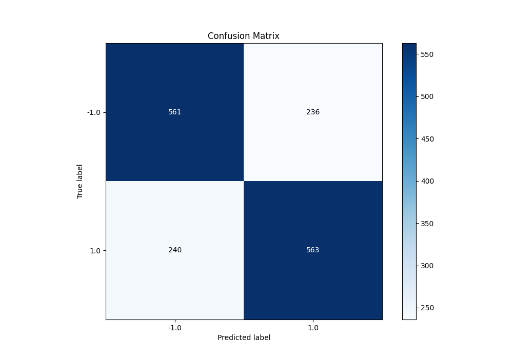
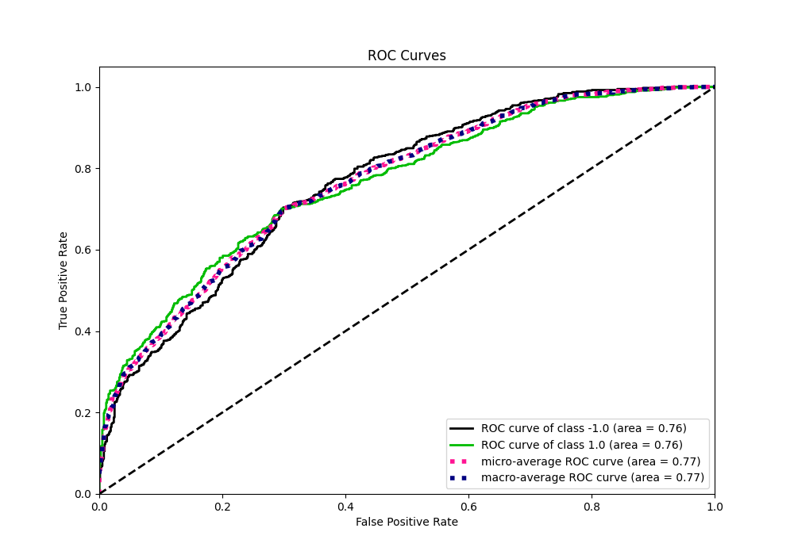
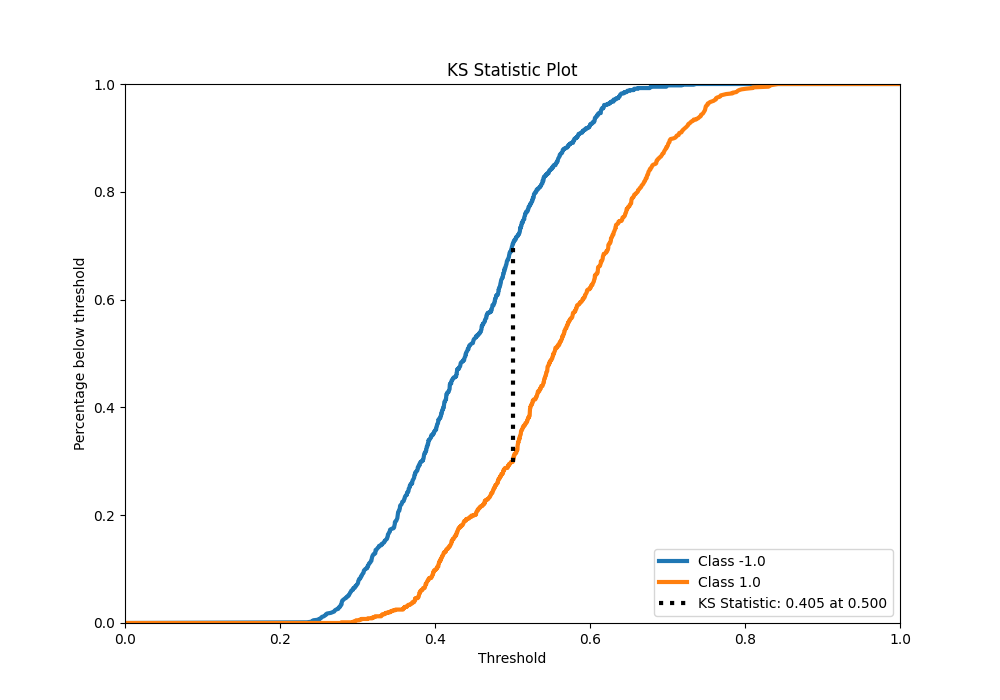
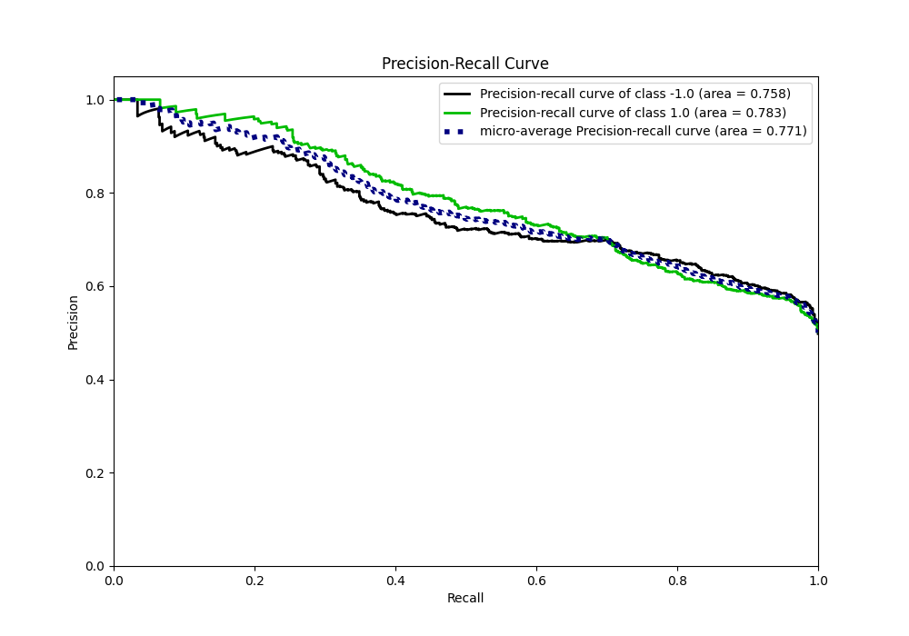
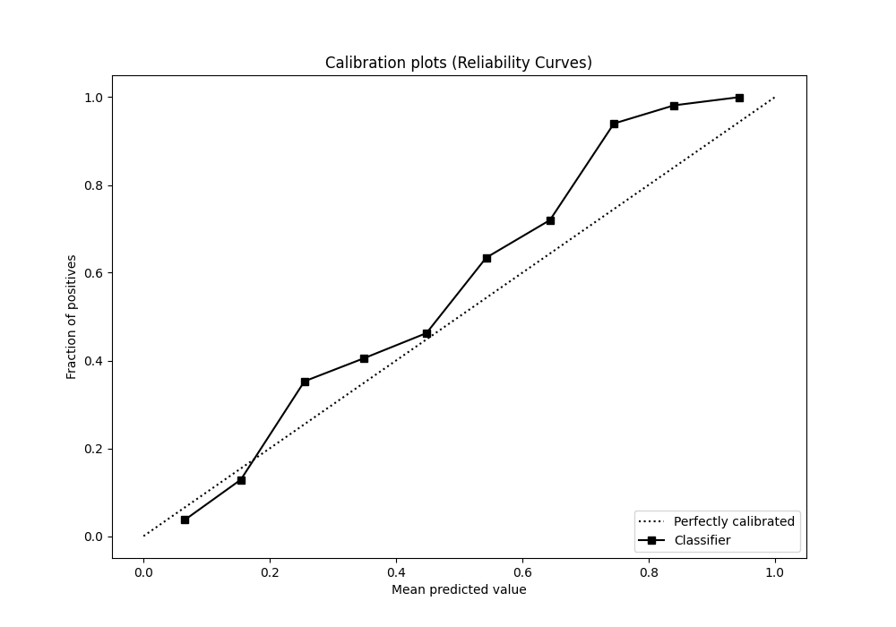
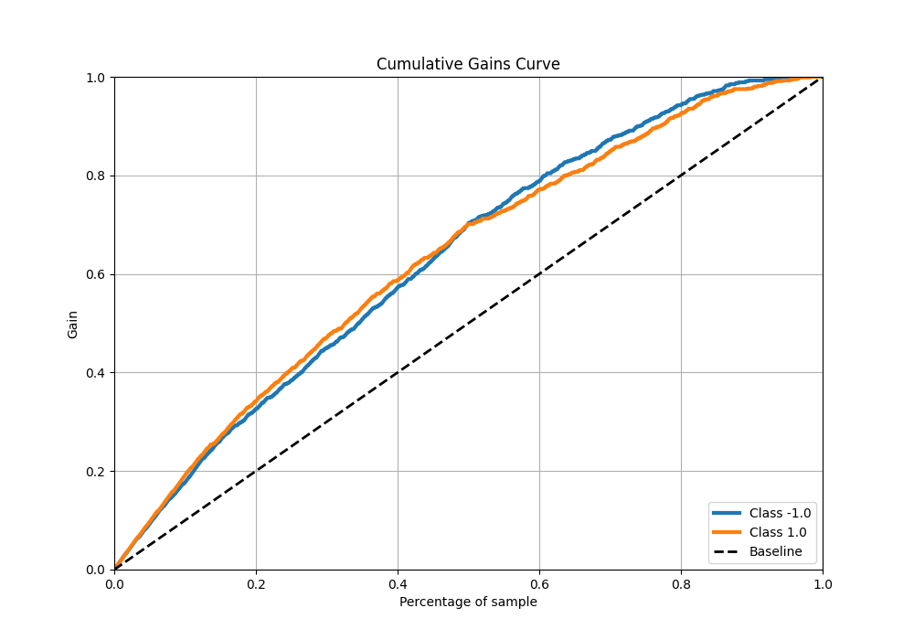
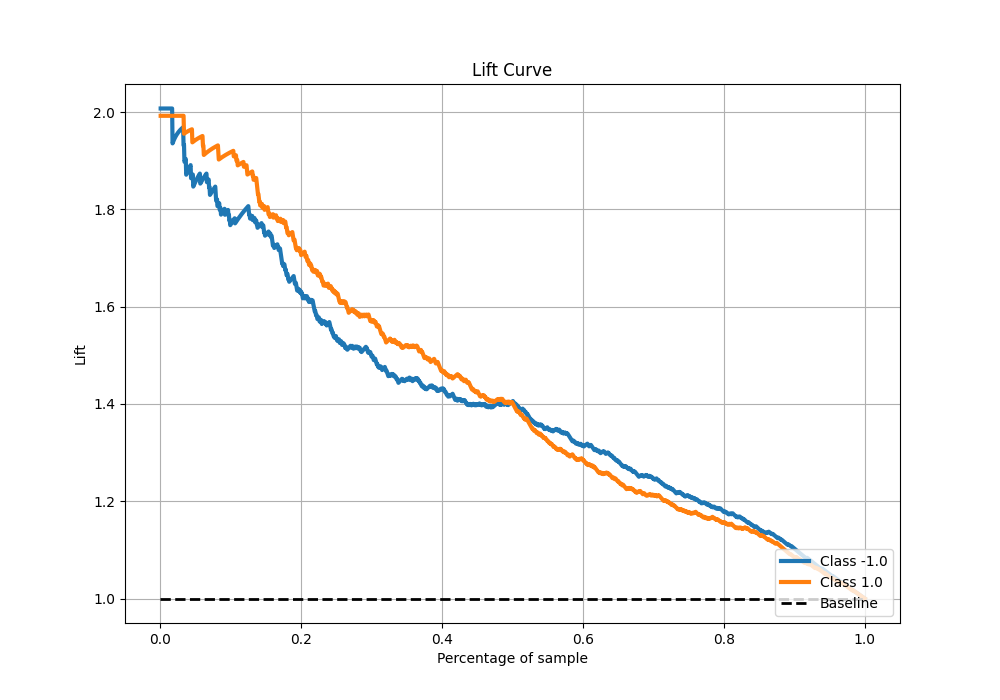

# Summary of 52_ExtraTrees

[<< Go back](../README.md)

## Extra Trees Classifier (Extra Trees)
- **n_jobs**: -1
- **criterion**: gini
- **max_features**: 0.7
- **min_samples_split**: 50
- **max_depth**: 3
- **eval_metric_name**: f1
- **explain_level**: 0

## Validation
 - **validation_type**: kfold
 - **shuffle**: True
 - **stratify**: True
 - **k_folds**: 5

## Optimized metric
f1

## Training time

16.5 seconds

## Metric details
|           |    score |   threshold |
|:----------|---------:|------------:|
| logloss   | 0.60578  |  nan        |
| auc       | 0.76495  |  nan        |
| f1        | 0.716432 |    0.379097 |
| accuracy  | 0.7025   |    0.500359 |
| precision | 1        |    0.743059 |
| recall    | 1        |    0.211176 |
| mcc       | 0.405008 |    0.500359 |

## Metric details with threshold from accuracy metric
|           |    score |   threshold |
|:----------|---------:|------------:|
| logloss   | 0.60578  |  nan        |
| auc       | 0.76495  |  nan        |
| f1        | 0.702871 |    0.500359 |
| accuracy  | 0.7025   |    0.500359 |
| precision | 0.704631 |    0.500359 |
| recall    | 0.701121 |    0.500359 |
| mcc       | 0.405008 |    0.500359 |

## Confusion matrix (at threshold=0.500359)
|                 |   Predicted as -1.0 |   Predicted as 1.0 |
|:----------------|--------------------:|-------------------:|
| Labeled as -1.0 |                 561 |                236 |
| Labeled as 1.0  |                 240 |                563 |

## Learning curves

## Confusion Matrix

## Normalized Confusion Matrix

## ROC Curve

## Kolmogorov-Smirnov Statistic

## Precision-Recall Curve

## Calibration Curve

## Cumulative Gains Curve

## Lift Curve

[<< Go back](../README.md)
