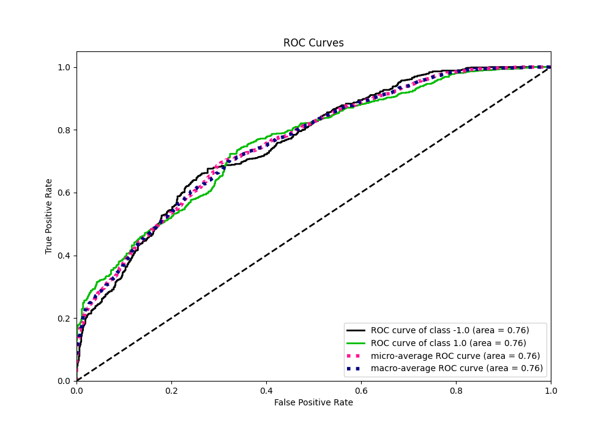

# Summary of 55_ExtraTrees

[<< Go back](../README.md)

## Extra Trees Classifier (Extra Trees)
- **n_jobs**: -1
- **criterion**: entropy
- **max_features**: 0.7
- **min_samples_split**: 40
- **max_depth**: 3
- **eval_metric_name**: f1
- **explain_level**: 0

## Validation
 - **validation_type**: kfold
 - **shuffle**: True
 - **stratify**: True
 - **k_folds**: 5

## Optimized metric
f1

## Training time

18.5 seconds

## Metric details
|           |    score |   threshold |
|:----------|---------:|------------:|
| logloss   | 0.610638 |  nan        |
| auc       | 0.757468 |  nan        |
| f1        | 0.715607 |    0.48135  |
| accuracy  | 0.6975   |    0.493891 |
| precision | 1        |    0.690464 |
| recall    | 1        |    0.169096 |
| mcc       | 0.395937 |    0.493891 |

## Metric details with threshold from accuracy metric
|           |    score |   threshold |
|:----------|---------:|------------:|
| logloss   | 0.610638 |  nan        |
| auc       | 0.757468 |  nan        |
| f1        | 0.709484 |    0.493891 |
| accuracy  | 0.6975   |    0.493891 |
| precision | 0.68482  |    0.493891 |
| recall    | 0.73599  |    0.493891 |
| mcc       | 0.395937 |    0.493891 |

## Confusion matrix (at threshold=0.493891)
|                 |   Predicted as -1.0 |   Predicted as 1.0 |
|:----------------|--------------------:|-------------------:|
| Labeled as -1.0 |                 525 |                272 |
| Labeled as 1.0  |                 212 |                591 |

## Learning curves

## Confusion Matrix

## Normalized Confusion Matrix

## ROC Curve

## Kolmogorov-Smirnov Statistic

## Precision-Recall Curve

## Calibration Curve

## Cumulative Gains Curve

## Lift Curve

[<< Go back](../README.md)
