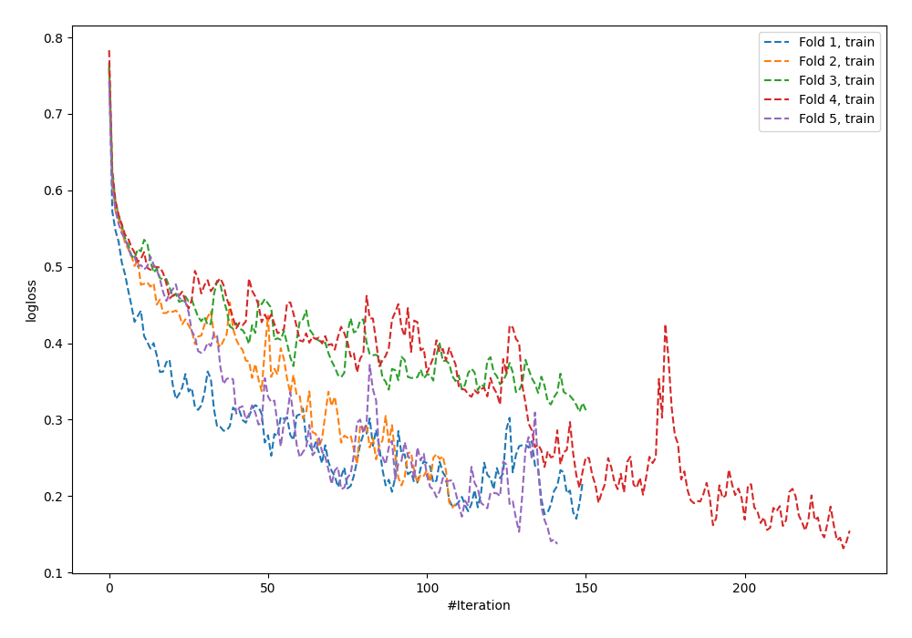
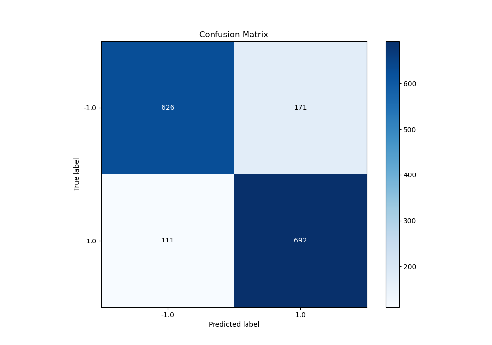
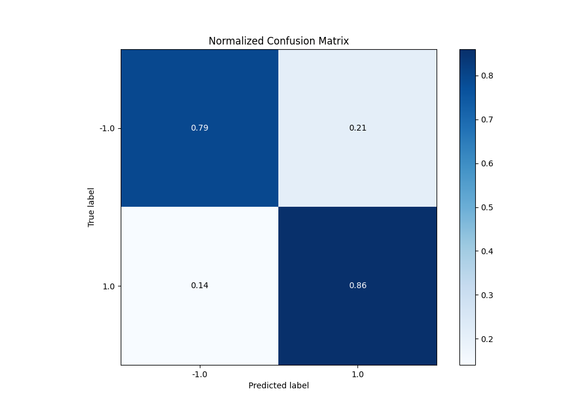
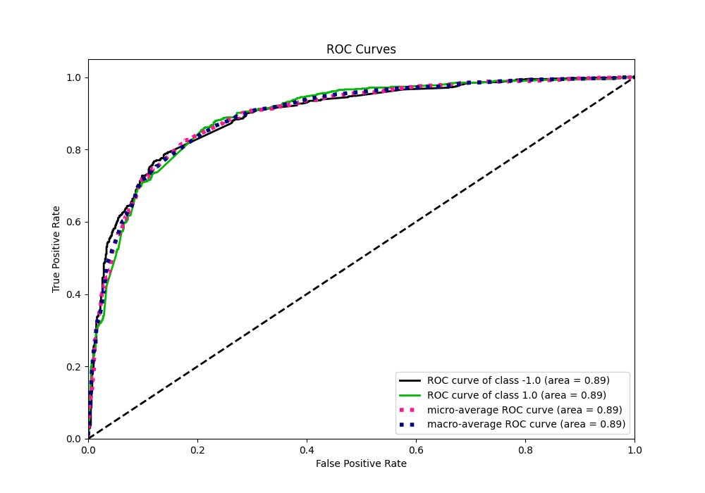
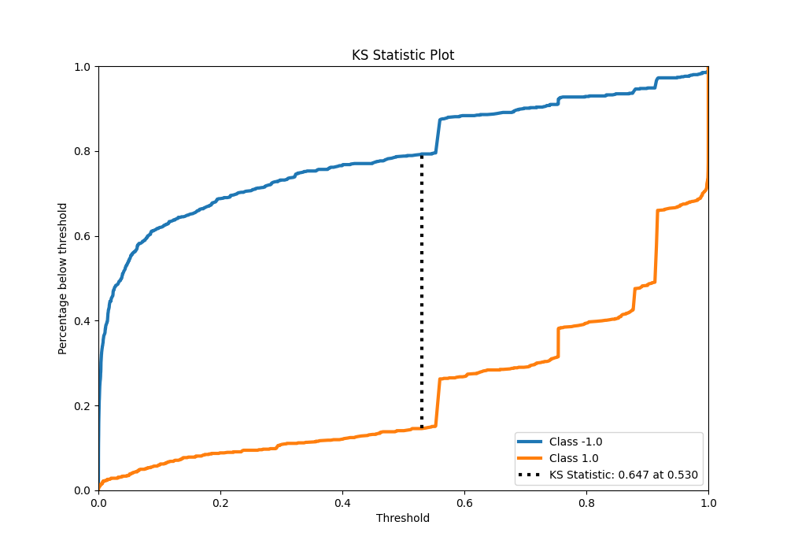
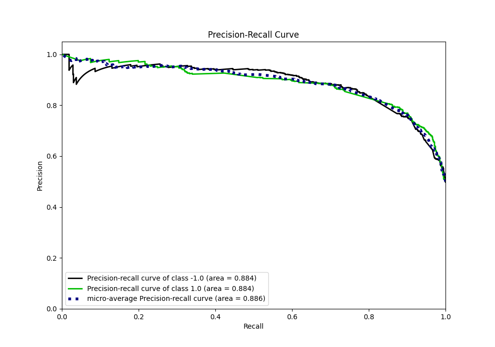
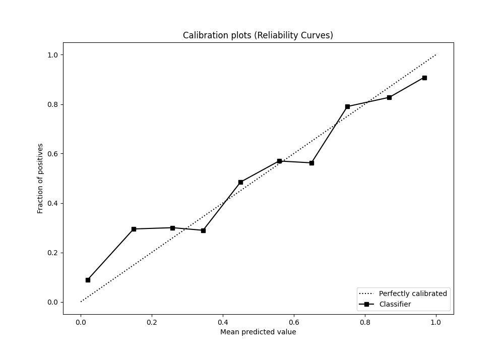
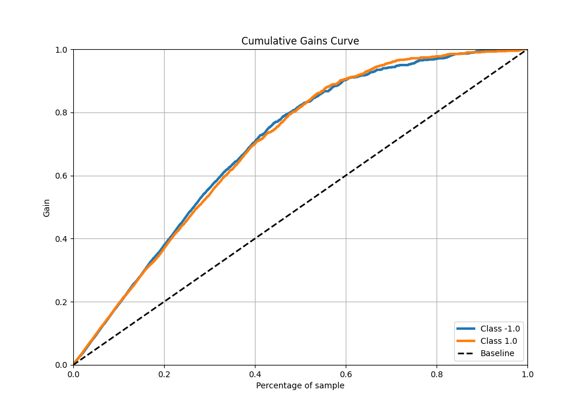
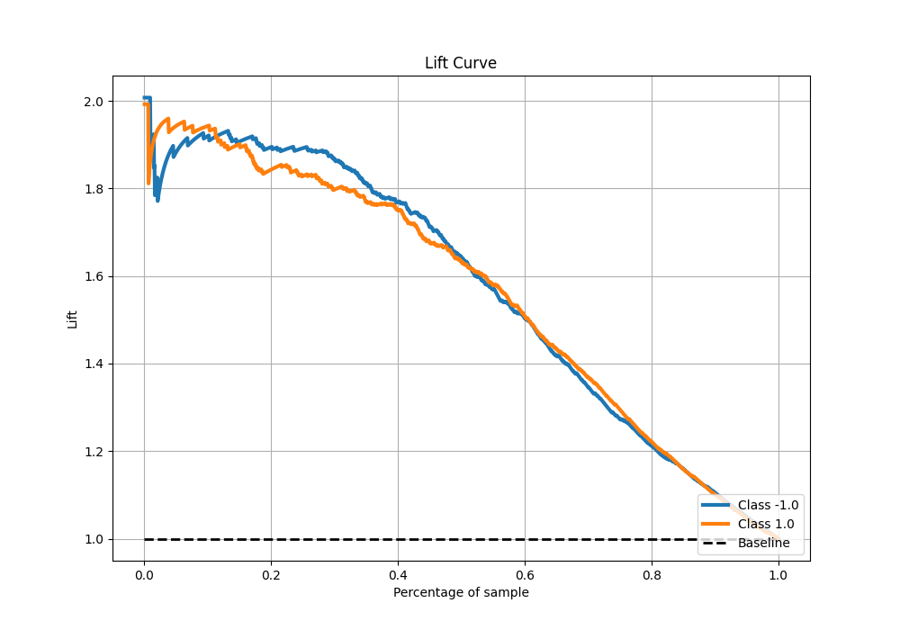

# Summary of 57_NeuralNetwork

[<< Go back](../README.md)

## Neural Network
- **n_jobs**: -1
- **dense_1_size**: 32
- **dense_2_size**: 4
- **learning_rate**: 0.1
- **explain_level**: 0

## Validation
 - **validation_type**: kfold
 - **shuffle**: True
 - **stratify**: True
 - **k_folds**: 5

## Optimized metric
f1

## Training time

10.9 seconds

## Metric details
|           |    score |     threshold |
|:----------|---------:|--------------:|
| logloss   | 0.52136  | nan           |
| auc       | 0.894414 | nan           |
| f1        | 0.832744 |   0.394081    |
| accuracy  | 0.82375  |   0.487258    |
| precision | 0.978947 |   1           |
| recall    | 1        |   3.38604e-11 |
| mcc       | 0.649225 |   0.487258    |

## Metric details with threshold from accuracy metric
|           |    score |   threshold |
|:----------|---------:|------------:|
| logloss   | 0.52136  |  nan        |
| auc       | 0.894414 |  nan        |
| f1        | 0.830732 |    0.487258 |
| accuracy  | 0.82375  |    0.487258 |
| precision | 0.801854 |    0.487258 |
| recall    | 0.861768 |    0.487258 |
| mcc       | 0.649225 |    0.487258 |

## Confusion matrix (at threshold=0.487258)
|                 |   Predicted as -1.0 |   Predicted as 1.0 |
|:----------------|--------------------:|-------------------:|
| Labeled as -1.0 |                 626 |                171 |
| Labeled as 1.0  |                 111 |                692 |

## Learning curves

## Confusion Matrix

## Normalized Confusion Matrix

## ROC Curve

## Kolmogorov-Smirnov Statistic

## Precision-Recall Curve

## Calibration Curve

## Cumulative Gains Curve

## Lift Curve

[<< Go back](../README.md)
