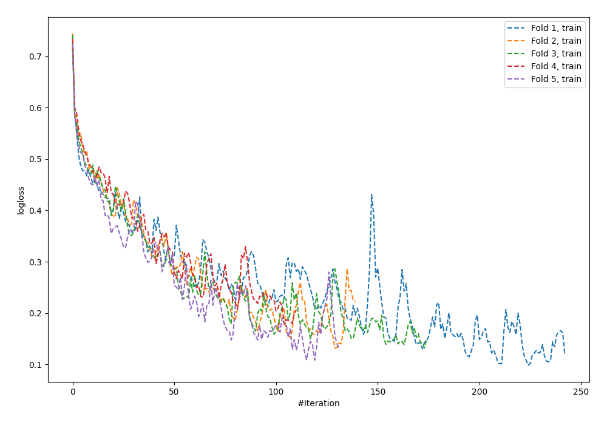
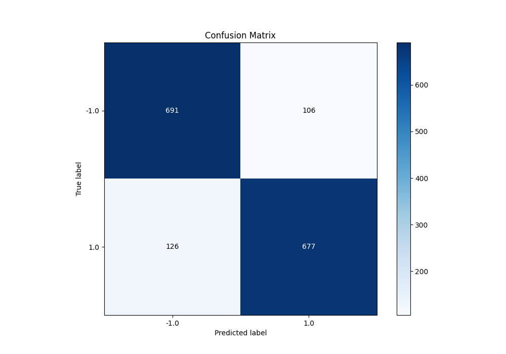
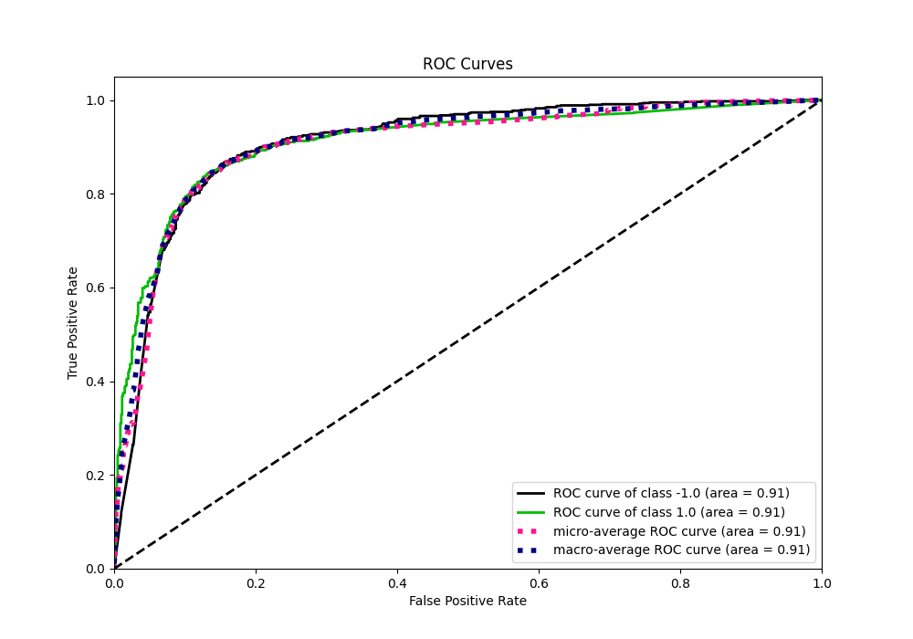
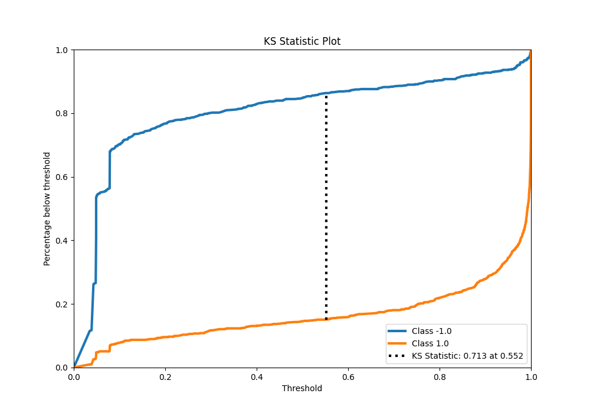
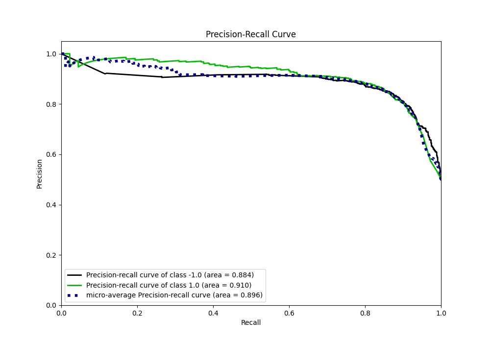
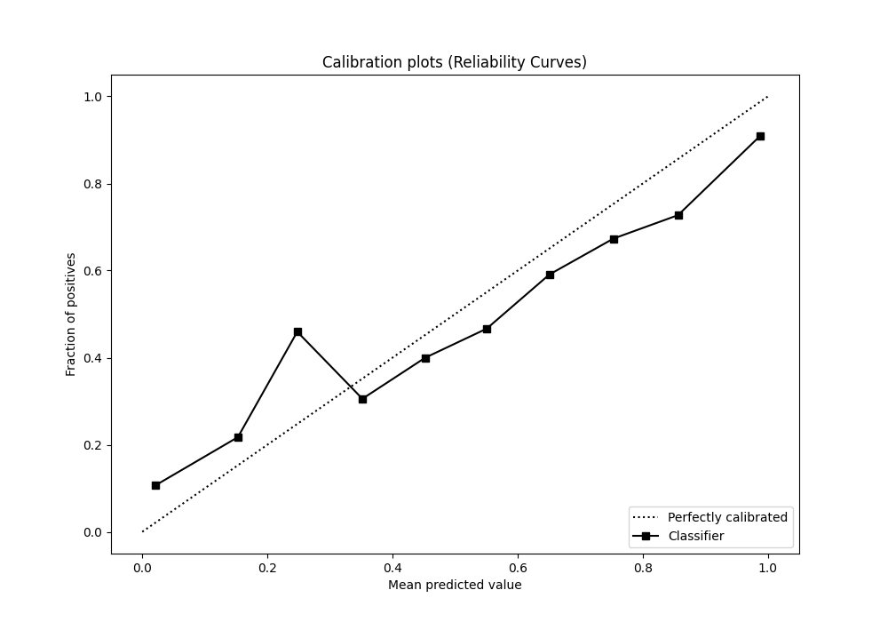
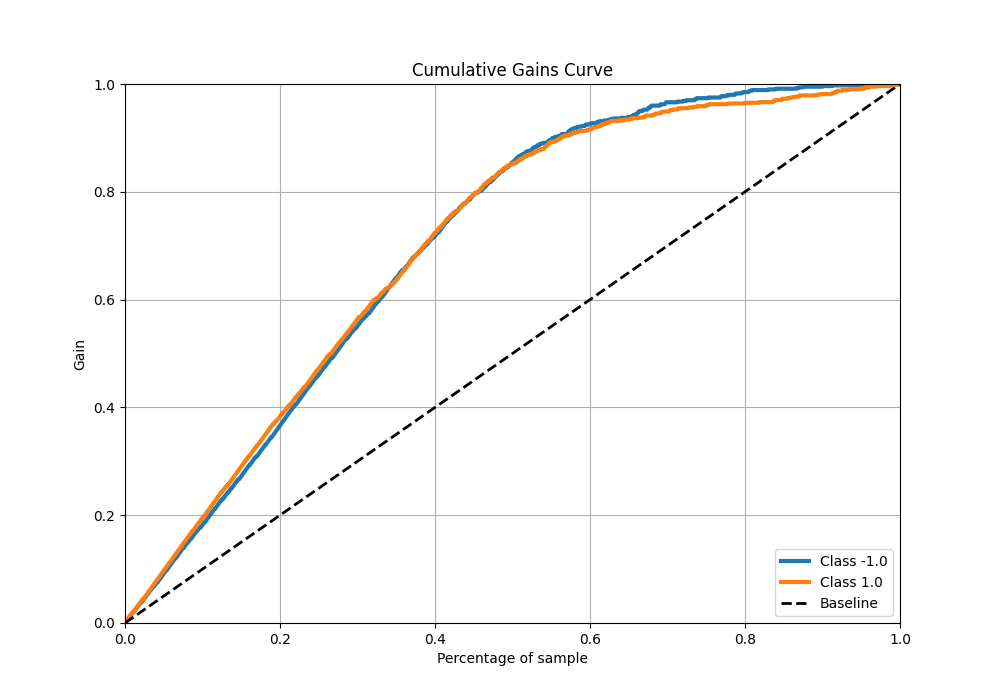
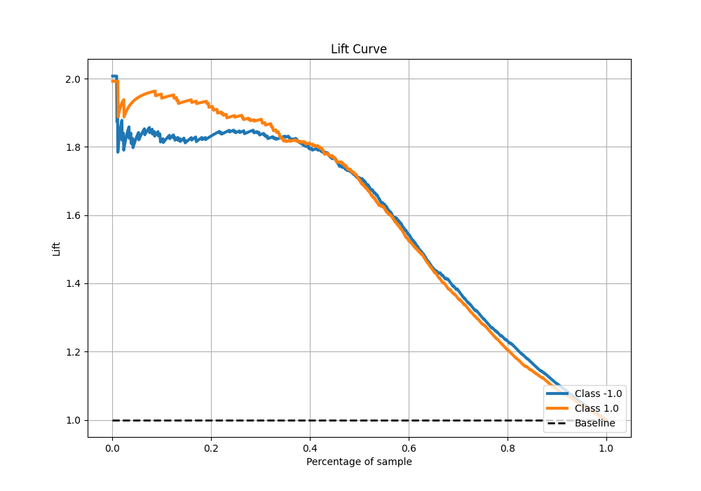

# Summary of 58_NeuralNetwork

[<< Go back](../README.md)

## Neural Network
- **n_jobs**: -1
- **dense_1_size**: 64
- **dense_2_size**: 4
- **learning_rate**: 0.05
- **explain_level**: 0

## Validation
 - **validation_type**: kfold
 - **shuffle**: True
 - **stratify**: True
 - **k_folds**: 5

## Optimized metric
f1

## Training time

23.8 seconds

## Metric details
|           |    score |   threshold |
|:----------|---------:|------------:|
| logloss   | 0.459607 | nan         |
| auc       | 0.909906 | nan         |
| f1        | 0.853933 |   0.524445  |
| accuracy  | 0.855    |   0.57758   |
| precision | 1        |   1         |
| recall    | 1        |   0.0315062 |
| mcc       | 0.710245 |   0.57758   |

## Metric details with threshold from accuracy metric
|           |    score |   threshold |
|:----------|---------:|------------:|
| logloss   | 0.459607 |   nan       |
| auc       | 0.909906 |   nan       |
| f1        | 0.85372  |     0.57758 |
| accuracy  | 0.855    |     0.57758 |
| precision | 0.864623 |     0.57758 |
| recall    | 0.843088 |     0.57758 |
| mcc       | 0.710245 |     0.57758 |

## Confusion matrix (at threshold=0.57758)
|                 |   Predicted as -1.0 |   Predicted as 1.0 |
|:----------------|--------------------:|-------------------:|
| Labeled as -1.0 |                 691 |                106 |
| Labeled as 1.0  |                 126 |                677 |

## Learning curves

## Confusion Matrix

## Normalized Confusion Matrix

## ROC Curve

## Kolmogorov-Smirnov Statistic

## Precision-Recall Curve

## Calibration Curve

## Cumulative Gains Curve

## Lift Curve

[<< Go back](../README.md)
