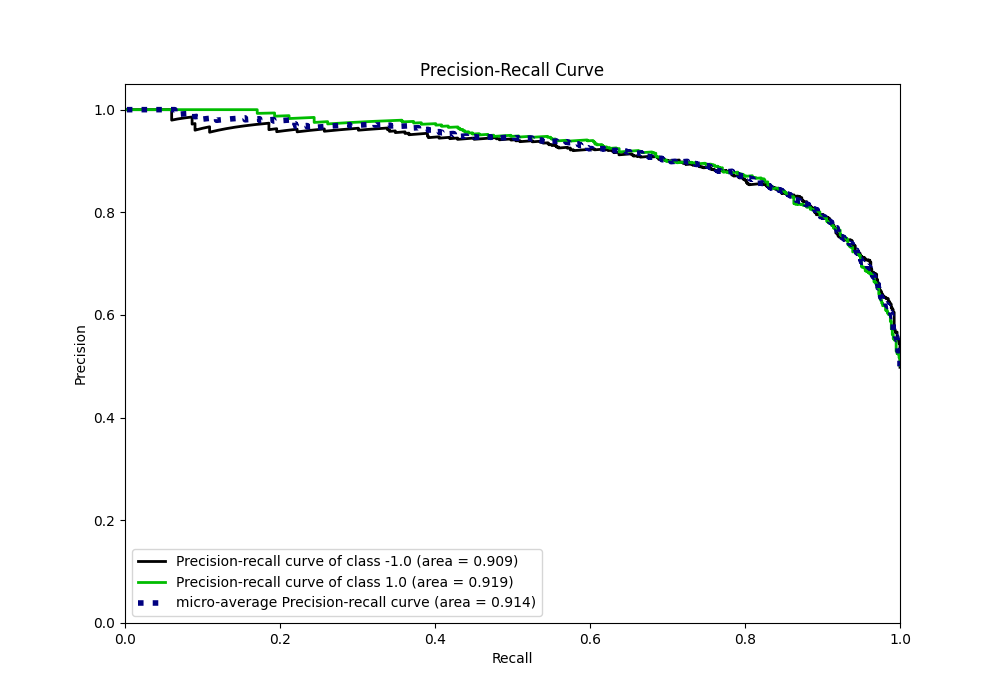

# Summary of 59_NeuralNetwork

[<< Go back](../README.md)

## Neural Network
- **n_jobs**: -1
- **dense_1_size**: 16
- **dense_2_size**: 16
- **learning_rate**: 0.01
- **explain_level**: 0

## Validation
 - **validation_type**: kfold
 - **shuffle**: True
 - **stratify**: True
 - **k_folds**: 5

## Optimized metric
f1

## Training time

12.1 seconds

## Metric details
|           |    score |     threshold |
|:----------|---------:|--------------:|
| logloss   | 0.381264 | nan           |
| auc       | 0.915922 | nan           |
| f1        | 0.845777 |   0.459443    |
| accuracy  | 0.84625  |   0.57082     |
| precision | 1        |   0.994972    |
| recall    | 1        |   7.54754e-11 |
| mcc       | 0.69325  |   0.57082     |

## Metric details with threshold from accuracy metric
|           |    score |   threshold |
|:----------|---------:|------------:|
| logloss   | 0.381264 |   nan       |
| auc       | 0.915922 |   nan       |
| f1        | 0.843312 |     0.57082 |
| accuracy  | 0.84625  |     0.57082 |
| precision | 0.863103 |     0.57082 |
| recall    | 0.824408 |     0.57082 |
| mcc       | 0.69325  |     0.57082 |

## Confusion matrix (at threshold=0.57082)
|                 |   Predicted as -1.0 |   Predicted as 1.0 |
|:----------------|--------------------:|-------------------:|
| Labeled as -1.0 |                 692 |                105 |
| Labeled as 1.0  |                 141 |                662 |

## Learning curves

## Confusion Matrix

## Normalized Confusion Matrix

## ROC Curve

## Kolmogorov-Smirnov Statistic

## Precision-Recall Curve

## Calibration Curve

## Cumulative Gains Curve

## Lift Curve

[<< Go back](../README.md)
