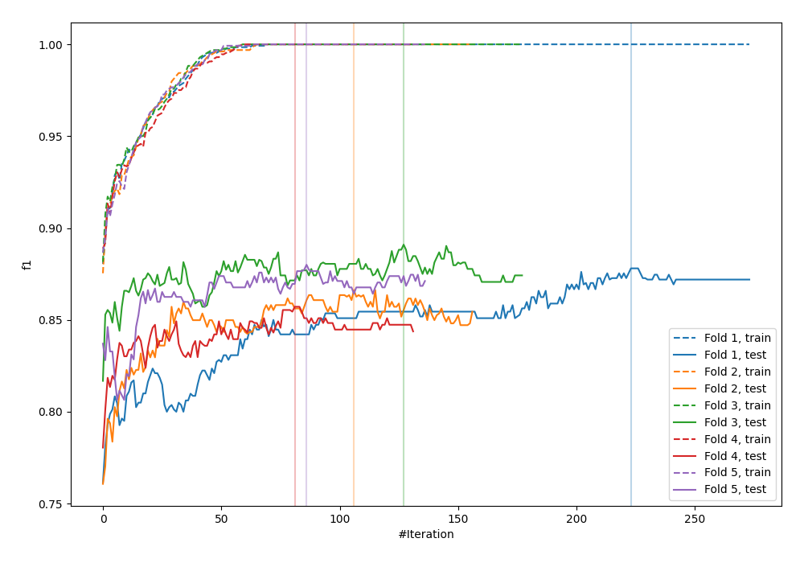
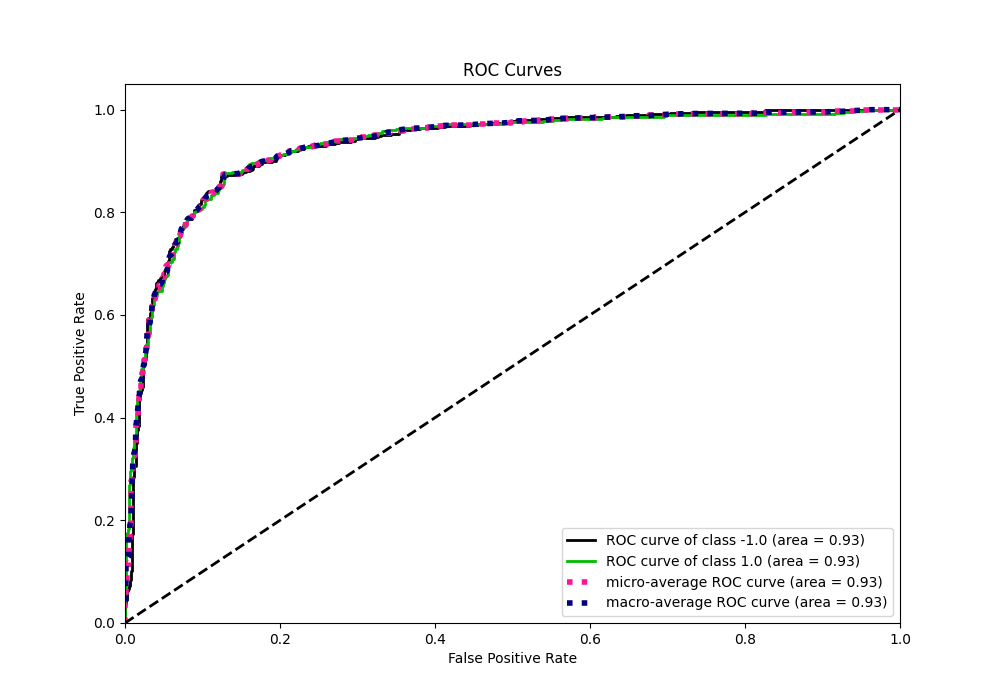
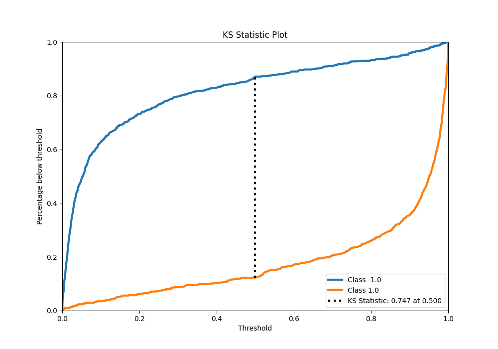
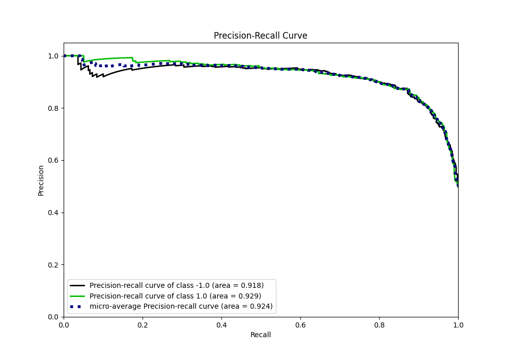
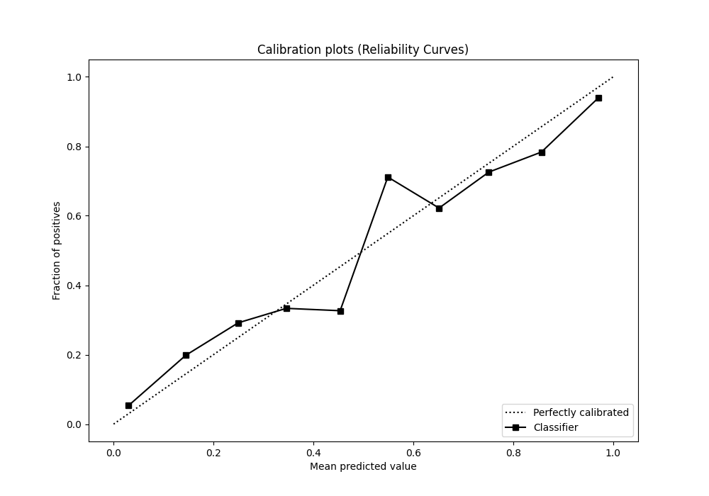
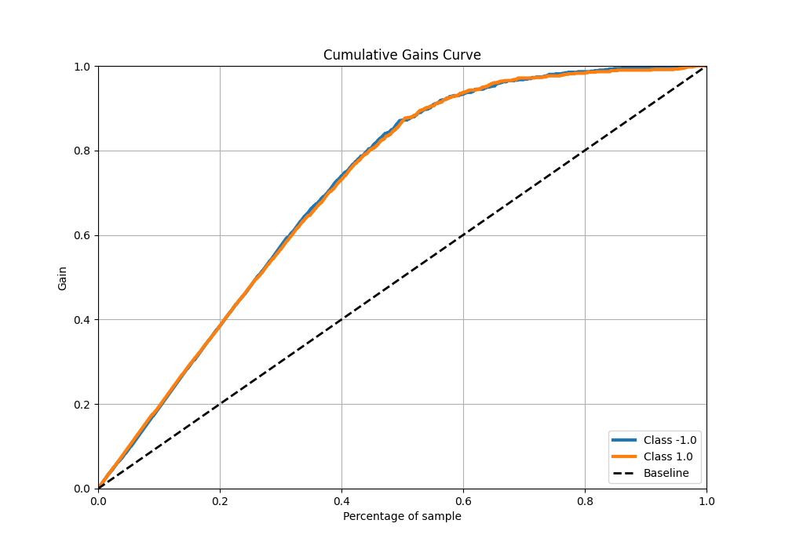
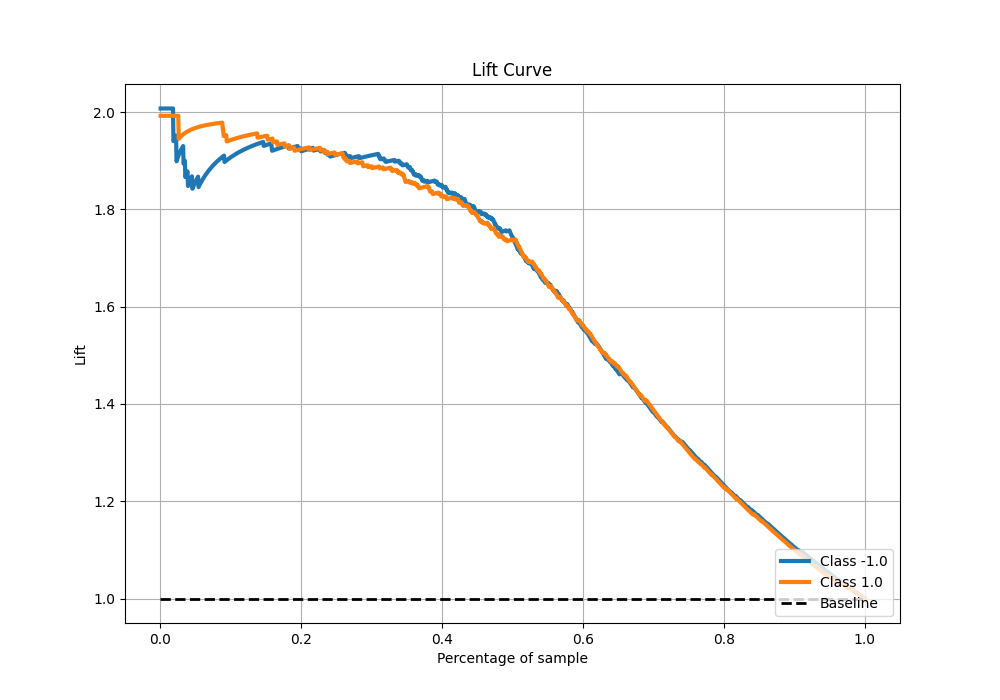

# Summary of 5_Default_LightGBM

[<< Go back](../README.md)

## LightGBM
- **n_jobs**: -1
- **objective**: binary
- **num_leaves**: 63
- **learning_rate**: 0.05
- **feature_fraction**: 0.9
- **bagging_fraction**: 0.9
- **min_data_in_leaf**: 10
- **metric**: custom
- **custom_eval_metric_name**: f1
- **explain_level**: 0

## Validation
 - **validation_type**: kfold
 - **shuffle**: True
 - **stratify**: True
 - **k_folds**: 5

## Optimized metric
f1

## Training time

36.9 seconds

## Metric details
|           |    score |     threshold |
|:----------|---------:|--------------:|
| logloss   | 0.352433 | nan           |
| auc       | 0.929696 | nan           |
| f1        | 0.871446 |   0.492784    |
| accuracy  | 0.87     |   0.492784    |
| precision | 1        |   0.999513    |
| recall    | 1        |   1.81766e-05 |
| mcc       | 0.740065 |   0.492784    |

## Metric details with threshold from accuracy metric
|           |    score |   threshold |
|:----------|---------:|------------:|
| logloss   | 0.352433 |  nan        |
| auc       | 0.929696 |  nan        |
| f1        | 0.871446 |    0.492784 |
| accuracy  | 0.87     |    0.492784 |
| precision | 0.865031 |    0.492784 |
| recall    | 0.877958 |    0.492784 |
| mcc       | 0.740065 |    0.492784 |

## Confusion matrix (at threshold=0.492784)
|                 |   Predicted as -1.0 |   Predicted as 1.0 |
|:----------------|--------------------:|-------------------:|
| Labeled as -1.0 |                 687 |                110 |
| Labeled as 1.0  |                  98 |                705 |

## Learning curves

## Confusion Matrix

## Normalized Confusion Matrix

## ROC Curve

## Kolmogorov-Smirnov Statistic

## Precision-Recall Curve

## Calibration Curve

## Cumulative Gains Curve

## Lift Curve

[<< Go back](../README.md)
