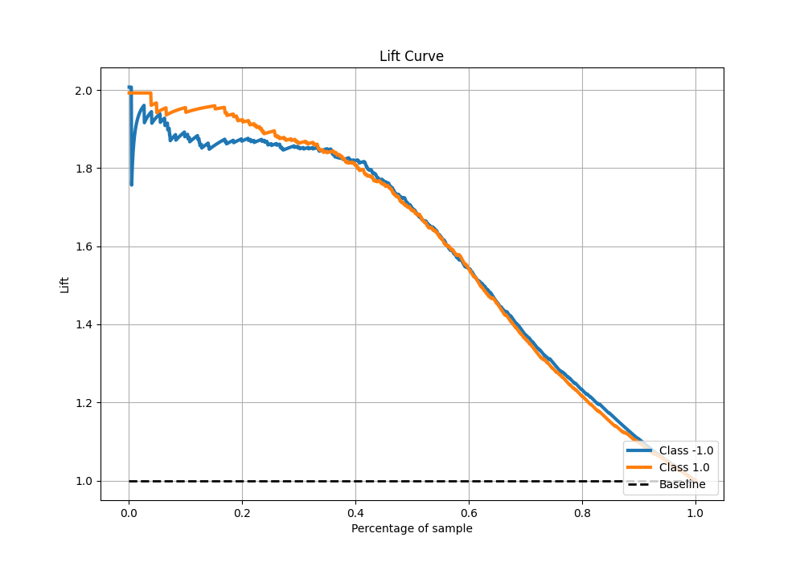

# Summary of 60_NeuralNetwork

[<< Go back](../README.md)

## Neural Network
- **n_jobs**: -1
- **dense_1_size**: 16
- **dense_2_size**: 8
- **learning_rate**: 0.01
- **explain_level**: 0

## Validation
 - **validation_type**: kfold
 - **shuffle**: True
 - **stratify**: True
 - **k_folds**: 5

## Optimized metric
f1

## Training time

12.9 seconds

## Metric details
|           |    score |     threshold |
|:----------|---------:|--------------:|
| logloss   | 0.416663 | nan           |
| auc       | 0.914371 | nan           |
| f1        | 0.852341 |   0.383886    |
| accuracy  | 0.8475   |   0.45294     |
| precision | 1        |   0.999947    |
| recall    | 1        |   4.27558e-10 |
| mcc       | 0.695382 |   0.45294     |

## Metric details with threshold from accuracy metric
|           |    score |   threshold |
|:----------|---------:|------------:|
| logloss   | 0.416663 |   nan       |
| auc       | 0.914371 |   nan       |
| f1        | 0.850673 |     0.45294 |
| accuracy  | 0.8475   |     0.45294 |
| precision | 0.836342 |     0.45294 |
| recall    | 0.865504 |     0.45294 |
| mcc       | 0.695382 |     0.45294 |

## Confusion matrix (at threshold=0.45294)
|                 |   Predicted as -1.0 |   Predicted as 1.0 |
|:----------------|--------------------:|-------------------:|
| Labeled as -1.0 |                 661 |                136 |
| Labeled as 1.0  |                 108 |                695 |

## Learning curves

## Confusion Matrix

## Normalized Confusion Matrix

## ROC Curve

## Kolmogorov-Smirnov Statistic

## Precision-Recall Curve

## Calibration Curve

## Cumulative Gains Curve

## Lift Curve

[<< Go back](../README.md)
