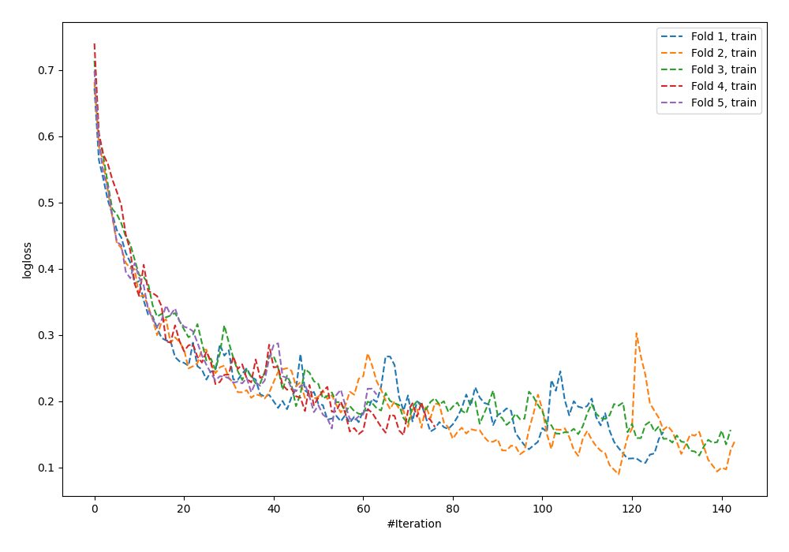
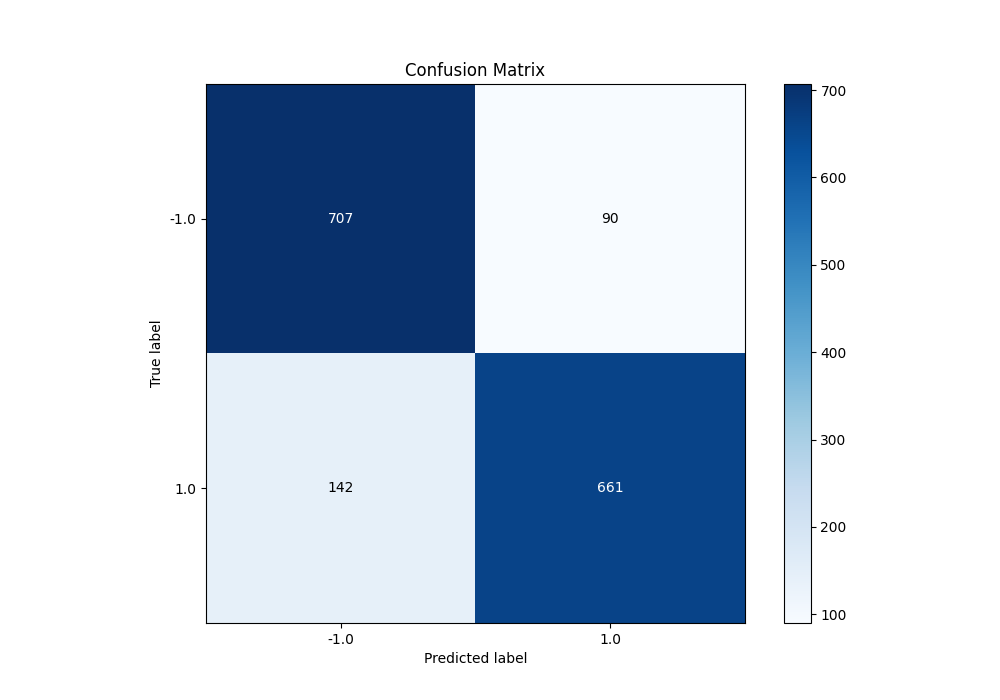
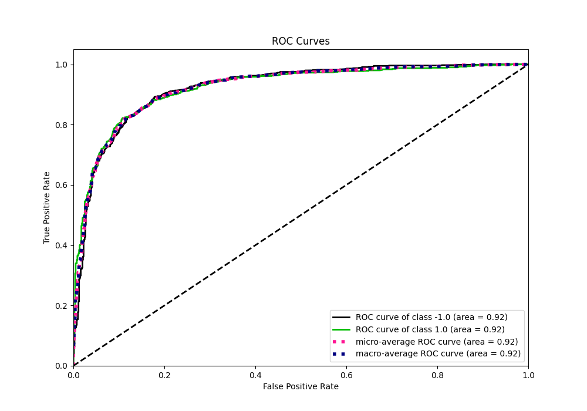
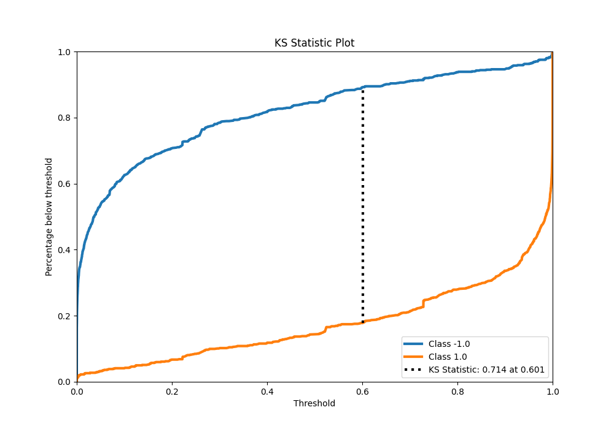
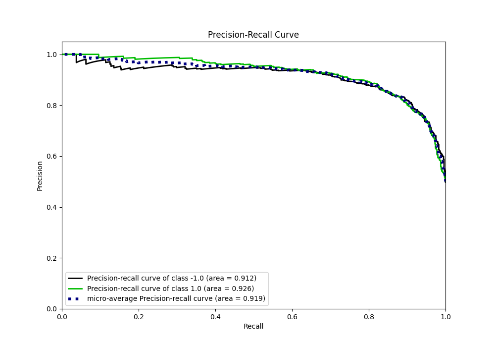
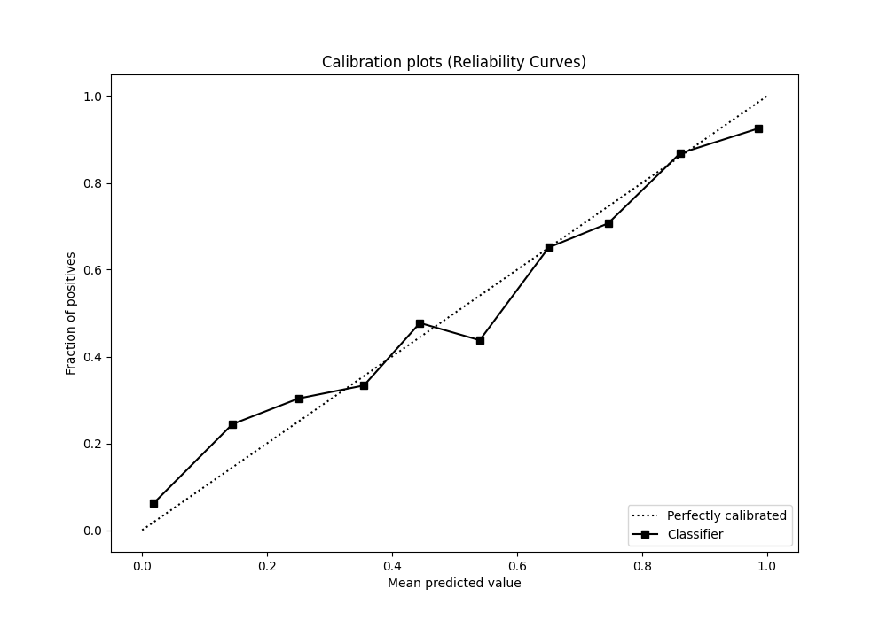
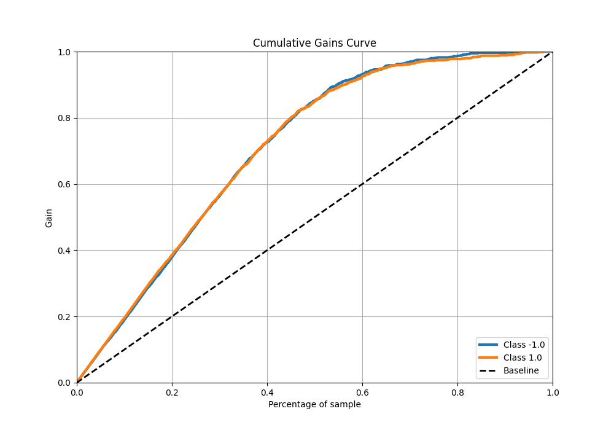
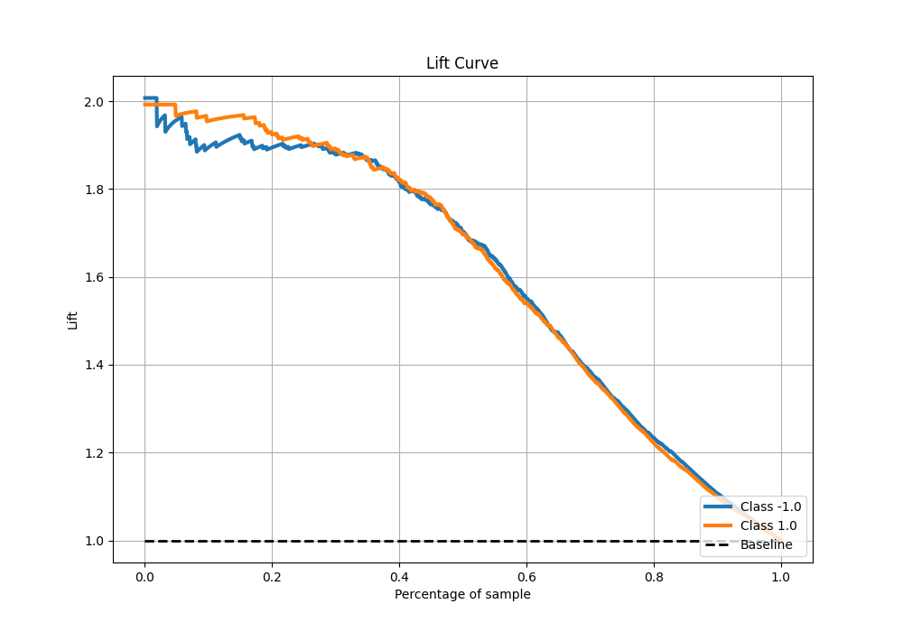

# Summary of 61_NeuralNetwork

[<< Go back](../README.md)

## Neural Network
- **n_jobs**: -1
- **dense_1_size**: 16
- **dense_2_size**: 16
- **learning_rate**: 0.08
- **explain_level**: 0

## Validation
 - **validation_type**: kfold
 - **shuffle**: True
 - **stratify**: True
 - **k_folds**: 5

## Optimized metric
f1

## Training time

13.2 seconds

## Metric details
|           |    score |     threshold |
|:----------|---------:|--------------:|
| logloss   | 0.445198 | nan           |
| auc       | 0.922927 | nan           |
| f1        | 0.85697  |   0.411824    |
| accuracy  | 0.855    |   0.595681    |
| precision | 1        |   1           |
| recall    | 1        |   3.15887e-20 |
| mcc       | 0.711571 |   0.595681    |

## Metric details with threshold from accuracy metric
|           |    score |   threshold |
|:----------|---------:|------------:|
| logloss   | 0.445198 |  nan        |
| auc       | 0.922927 |  nan        |
| f1        | 0.850708 |    0.595681 |
| accuracy  | 0.855    |    0.595681 |
| precision | 0.88016  |    0.595681 |
| recall    | 0.823163 |    0.595681 |
| mcc       | 0.711571 |    0.595681 |

## Confusion matrix (at threshold=0.595681)
|                 |   Predicted as -1.0 |   Predicted as 1.0 |
|:----------------|--------------------:|-------------------:|
| Labeled as -1.0 |                 707 |                 90 |
| Labeled as 1.0  |                 142 |                661 |

## Learning curves

## Confusion Matrix

## Normalized Confusion Matrix

## ROC Curve

## Kolmogorov-Smirnov Statistic

## Precision-Recall Curve

## Calibration Curve

## Cumulative Gains Curve

## Lift Curve

[<< Go back](../README.md)
