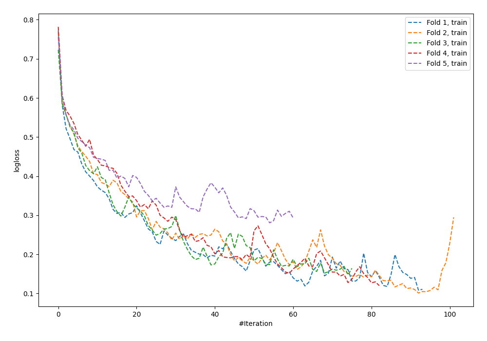
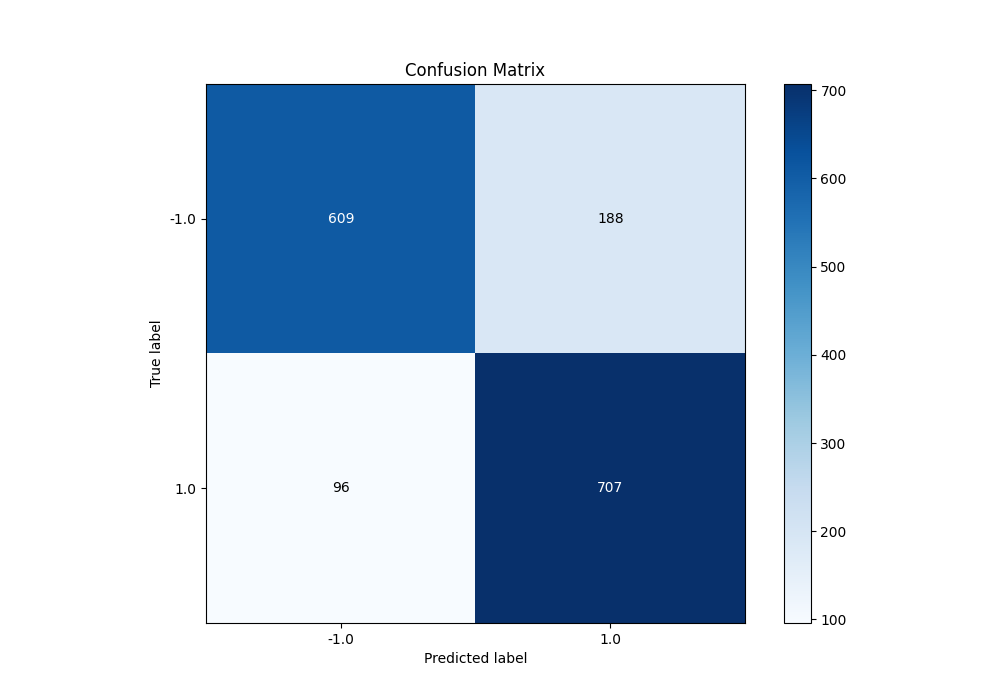
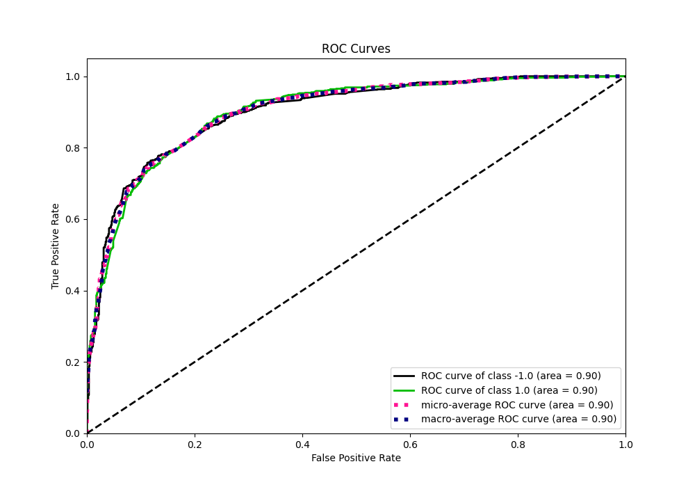
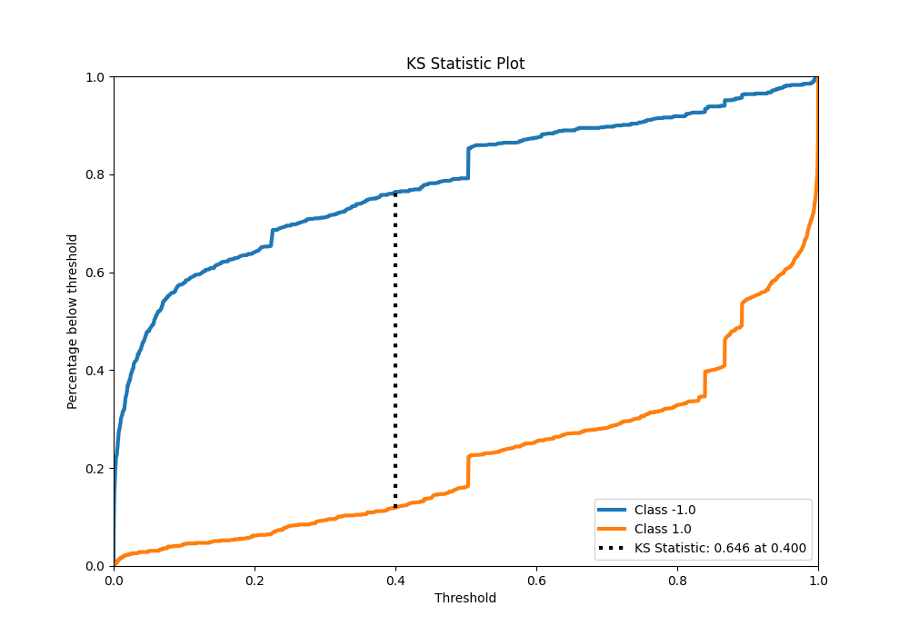
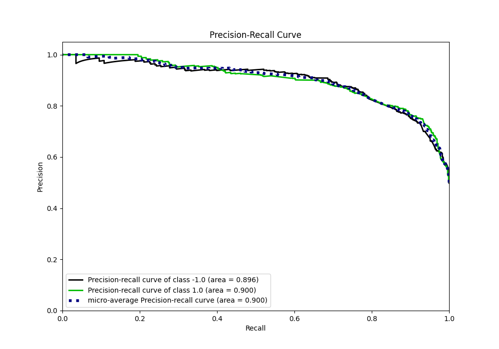
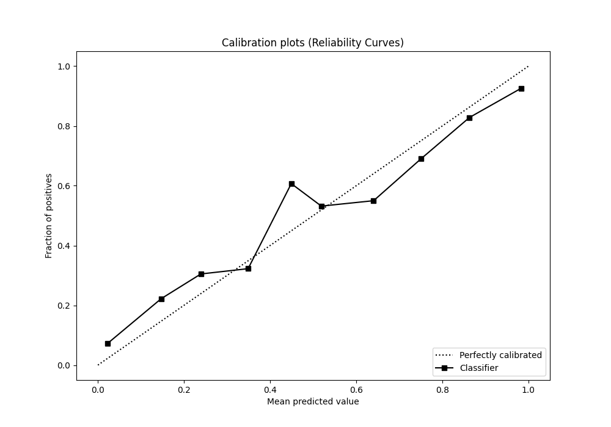
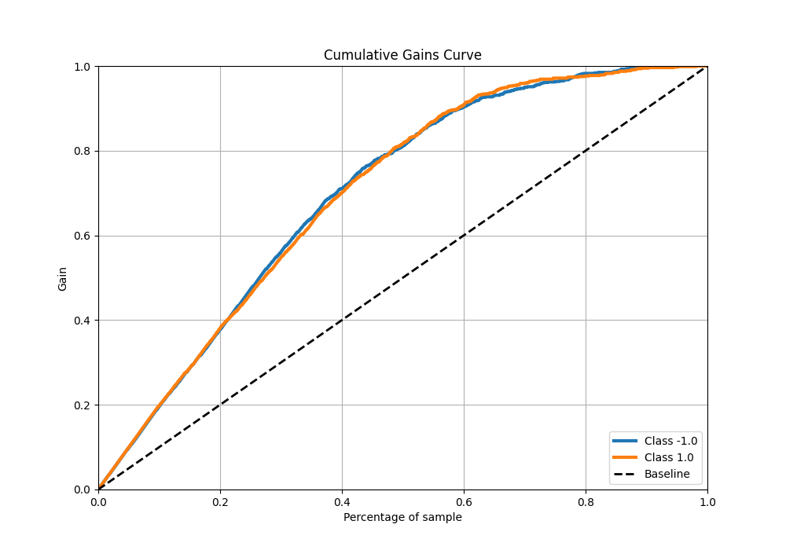
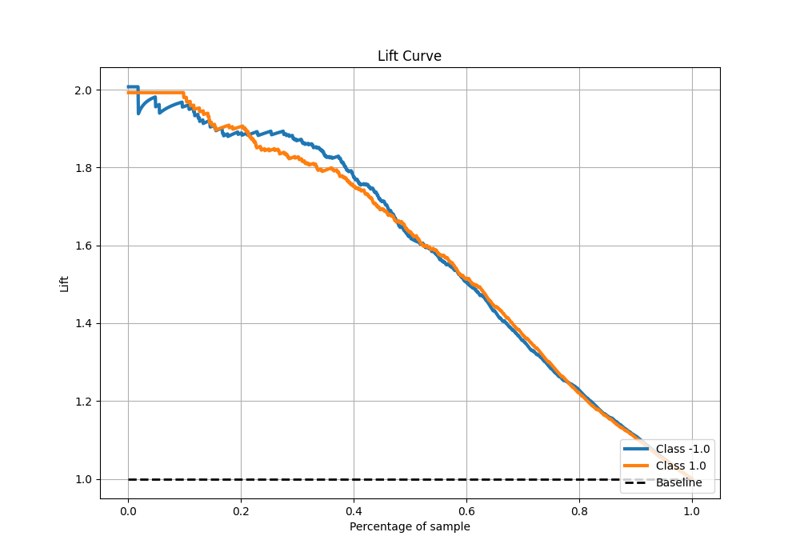

# Summary of 62_NeuralNetwork

[<< Go back](../README.md)

## Neural Network
- **n_jobs**: -1
- **dense_1_size**: 64
- **dense_2_size**: 16
- **learning_rate**: 0.05
- **explain_level**: 0

## Validation
 - **validation_type**: kfold
 - **shuffle**: True
 - **stratify**: True
 - **k_folds**: 5

## Optimized metric
f1

## Training time

16.3 seconds

## Metric details
|           |    score |     threshold |
|:----------|---------:|--------------:|
| logloss   | 0.439046 | nan           |
| auc       | 0.90066  | nan           |
| f1        | 0.832744 |   0.402319    |
| accuracy  | 0.8225   |   0.402319    |
| precision | 1        |   0.999193    |
| recall    | 1        |   1.47338e-09 |
| mcc       | 0.649153 |   0.402319    |

## Metric details with threshold from accuracy metric
|           |    score |   threshold |
|:----------|---------:|------------:|
| logloss   | 0.439046 |  nan        |
| auc       | 0.90066  |  nan        |
| f1        | 0.832744 |    0.402319 |
| accuracy  | 0.8225   |    0.402319 |
| precision | 0.789944 |    0.402319 |
| recall    | 0.880448 |    0.402319 |
| mcc       | 0.649153 |    0.402319 |

## Confusion matrix (at threshold=0.402319)
|                 |   Predicted as -1.0 |   Predicted as 1.0 |
|:----------------|--------------------:|-------------------:|
| Labeled as -1.0 |                 609 |                188 |
| Labeled as 1.0  |                  96 |                707 |

## Learning curves

## Confusion Matrix

## Normalized Confusion Matrix

## ROC Curve

## Kolmogorov-Smirnov Statistic

## Precision-Recall Curve

## Calibration Curve

## Cumulative Gains Curve

## Lift Curve

[<< Go back](../README.md)
