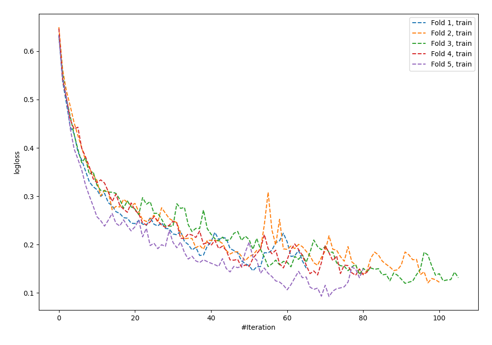
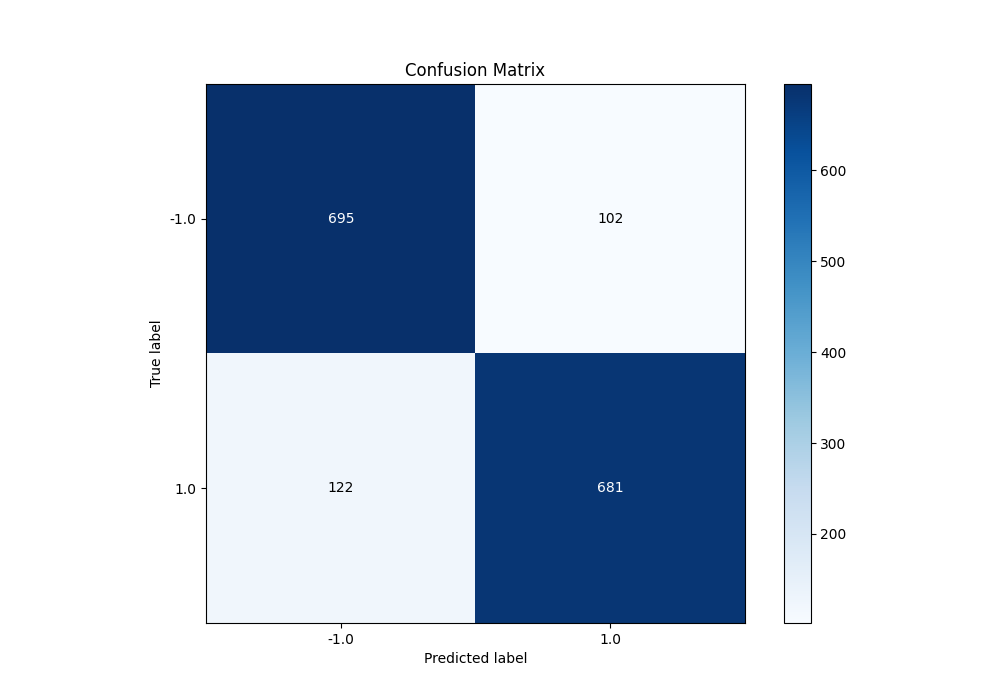
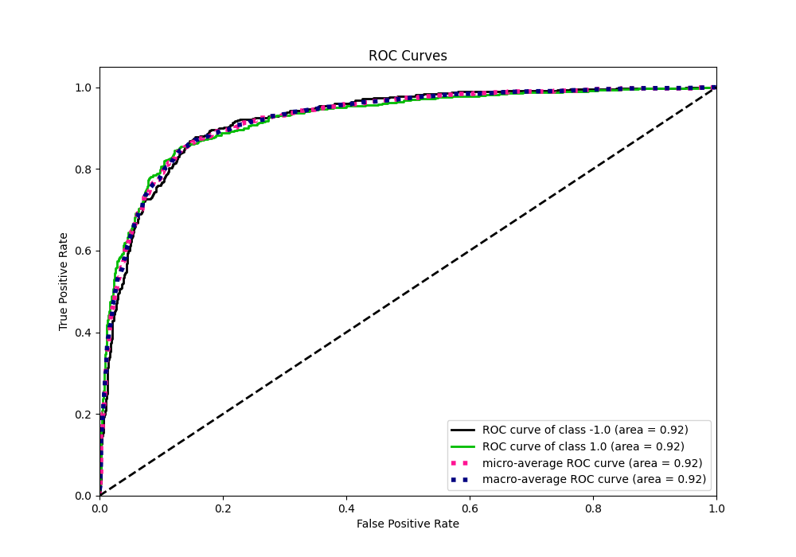
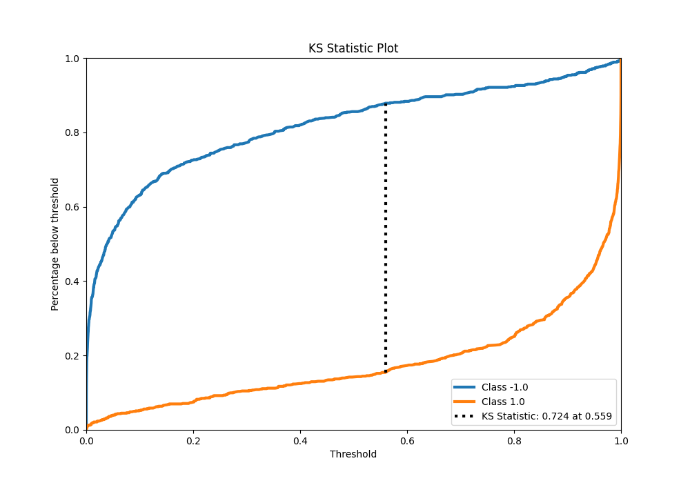
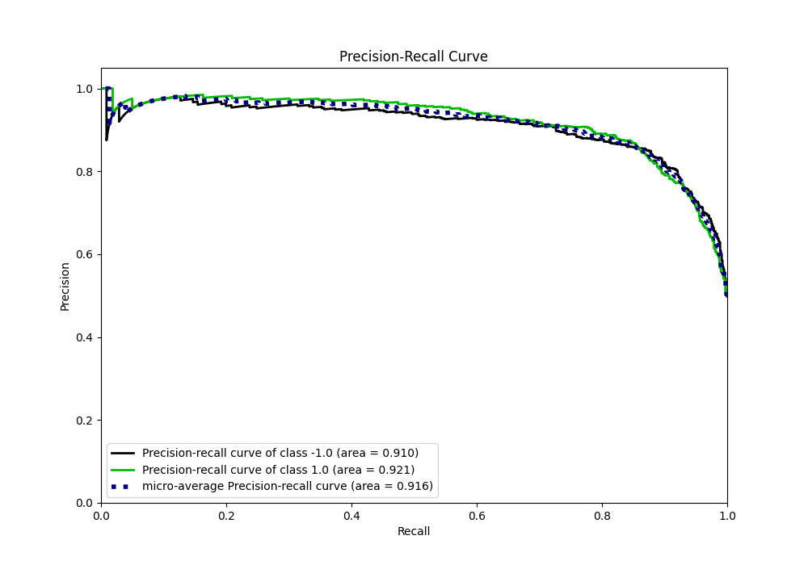
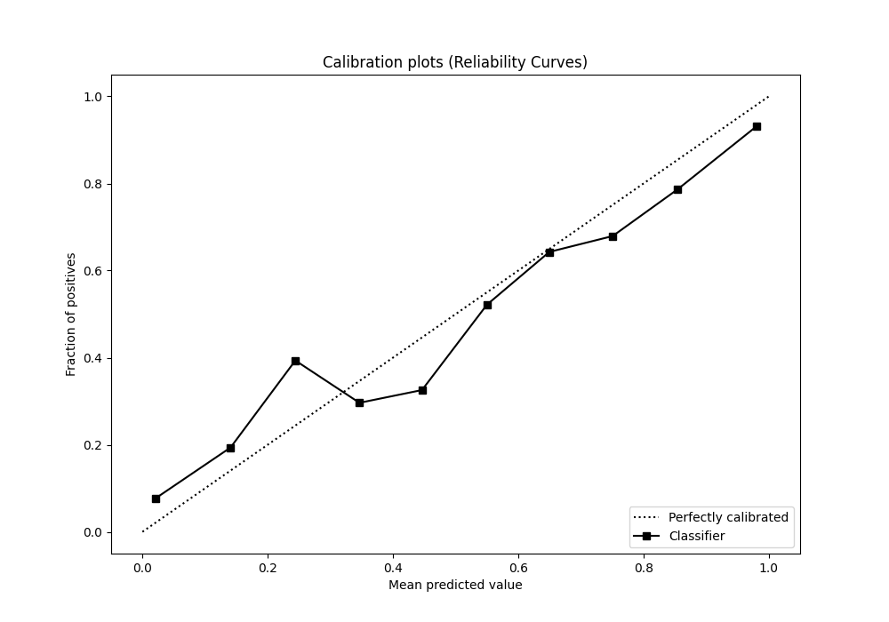
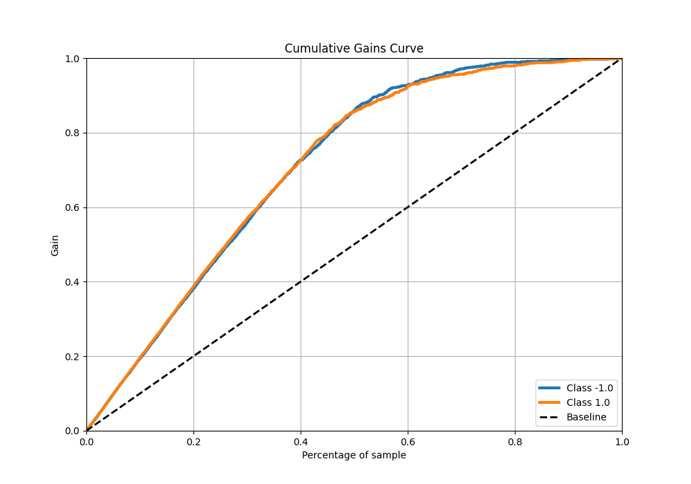
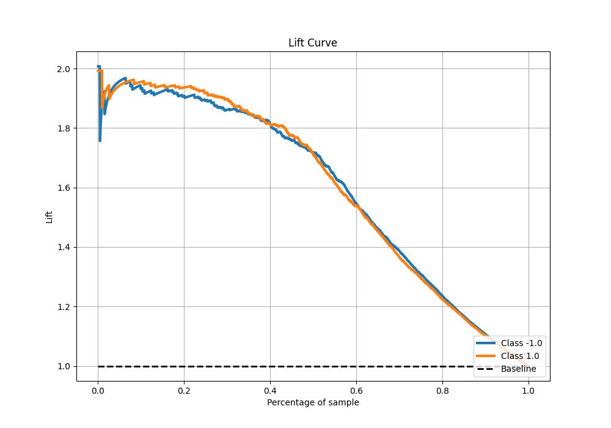

# Summary of 63_NeuralNetwork

[<< Go back](../README.md)

## Neural Network
- **n_jobs**: -1
- **dense_1_size**: 16
- **dense_2_size**: 16
- **learning_rate**: 0.05
- **explain_level**: 0

## Validation
 - **validation_type**: kfold
 - **shuffle**: True
 - **stratify**: True
 - **k_folds**: 5

## Optimized metric
f1

## Training time

12.8 seconds

## Metric details
|           |    score |     threshold |
|:----------|---------:|--------------:|
| logloss   | 0.417916 | nan           |
| auc       | 0.921513 | nan           |
| f1        | 0.858764 |   0.54499     |
| accuracy  | 0.86     |   0.54499     |
| precision | 1        |   1           |
| recall    | 1        |   2.22268e-09 |
| mcc       | 0.720247 |   0.54499     |

## Metric details with threshold from accuracy metric
|           |    score |   threshold |
|:----------|---------:|------------:|
| logloss   | 0.417916 |   nan       |
| auc       | 0.921513 |   nan       |
| f1        | 0.858764 |     0.54499 |
| accuracy  | 0.86     |     0.54499 |
| precision | 0.869732 |     0.54499 |
| recall    | 0.84807  |     0.54499 |
| mcc       | 0.720247 |     0.54499 |

## Confusion matrix (at threshold=0.54499)
|                 |   Predicted as -1.0 |   Predicted as 1.0 |
|:----------------|--------------------:|-------------------:|
| Labeled as -1.0 |                 695 |                102 |
| Labeled as 1.0  |                 122 |                681 |

## Learning curves

## Confusion Matrix

## Normalized Confusion Matrix

## ROC Curve

## Kolmogorov-Smirnov Statistic

## Precision-Recall Curve

## Calibration Curve

## Cumulative Gains Curve

## Lift Curve

[<< Go back](../README.md)
