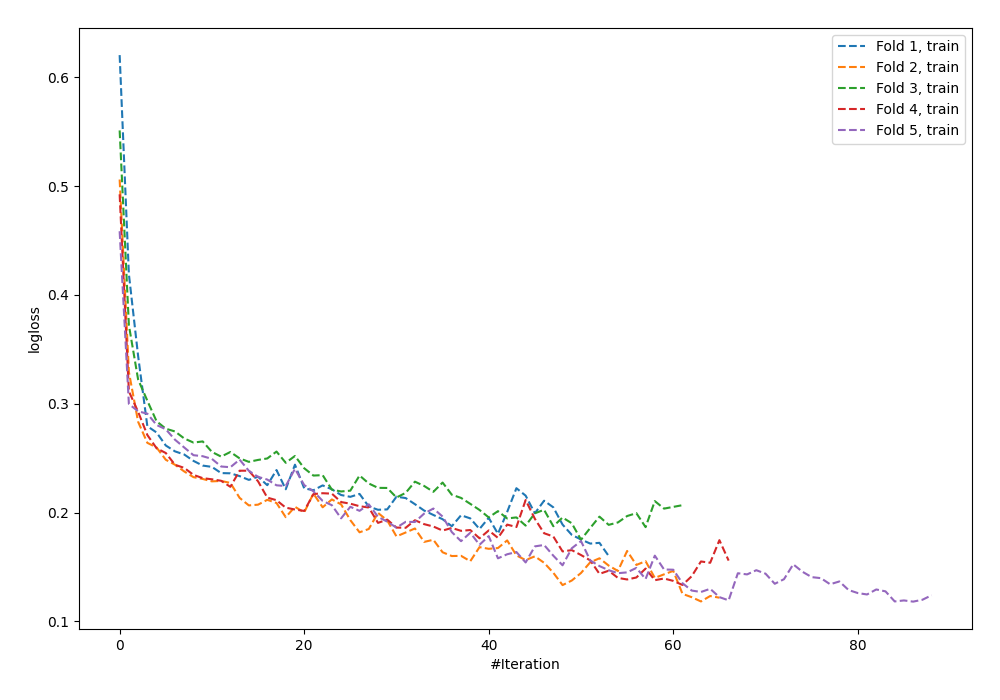
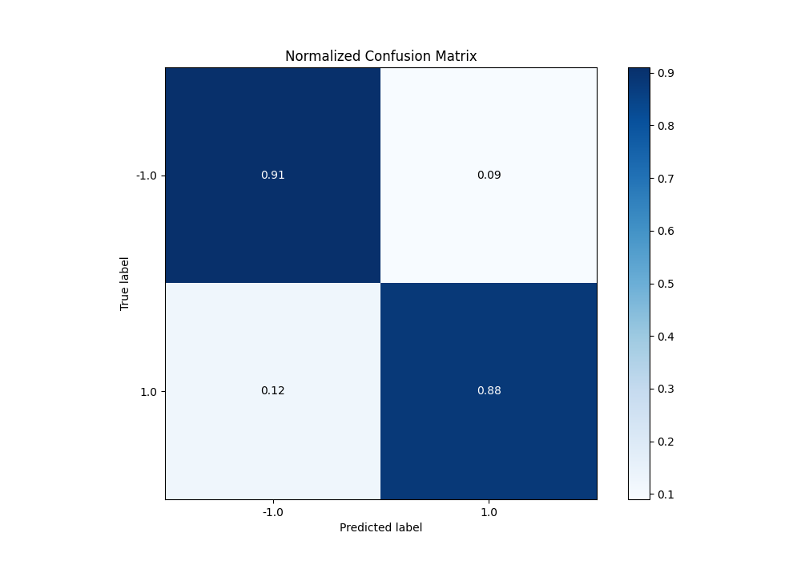
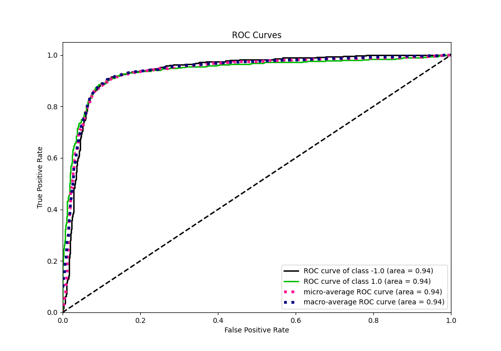
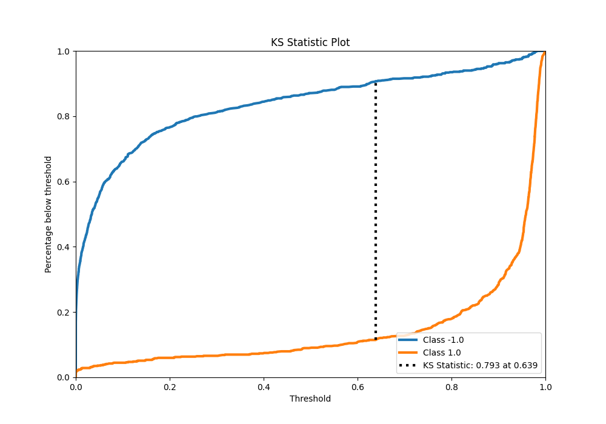
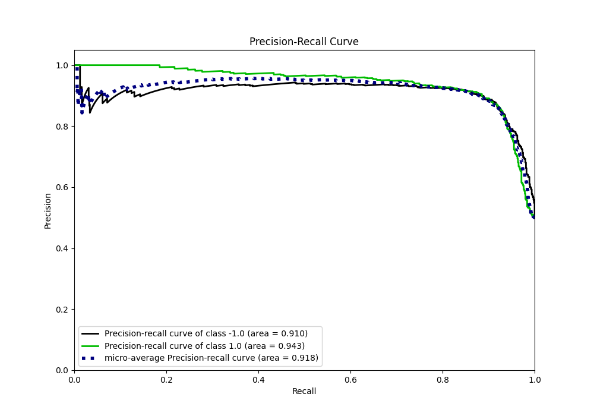
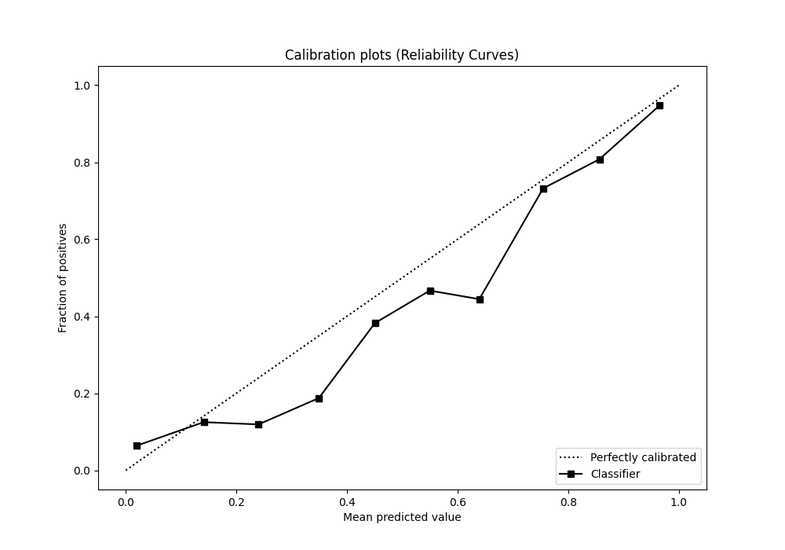
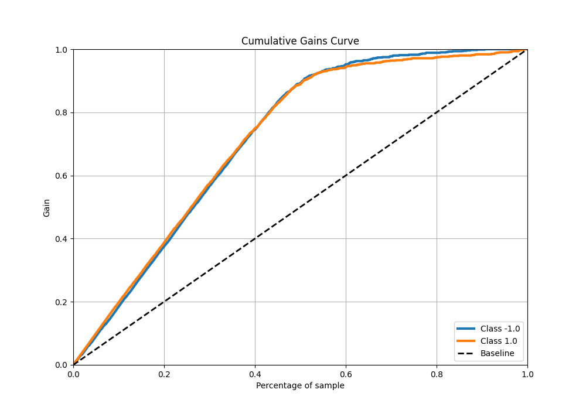
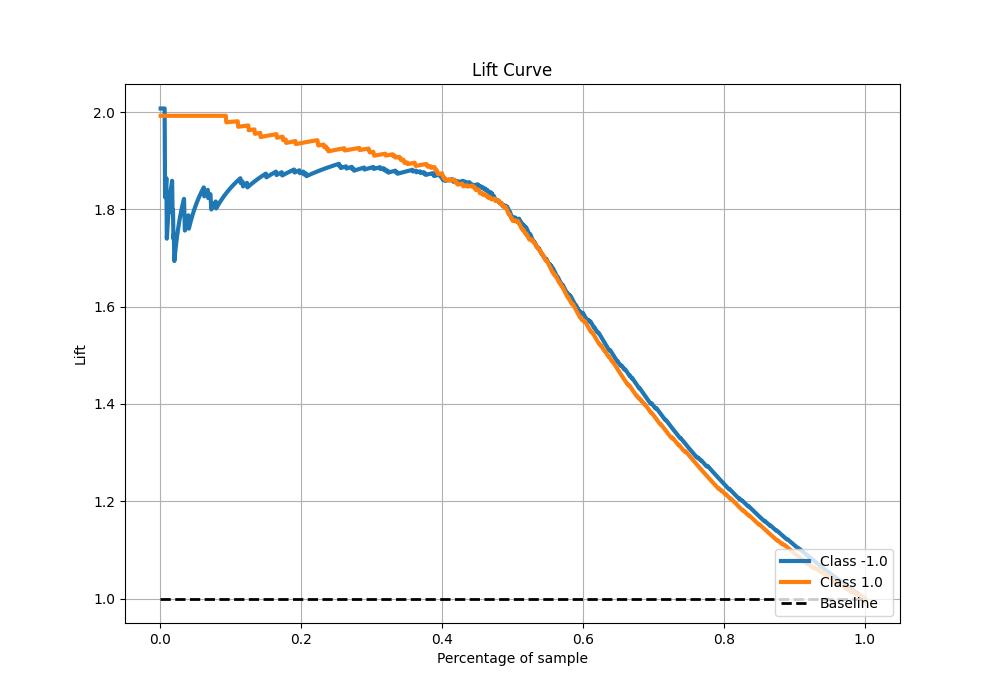

# Summary of 63_NeuralNetwork_Stacked

[<< Go back](../README.md)

## Neural Network
- **n_jobs**: -1
- **dense_1_size**: 16
- **dense_2_size**: 16
- **learning_rate**: 0.05
- **explain_level**: 0

## Validation
 - **validation_type**: kfold
 - **shuffle**: True
 - **stratify**: True
 - **k_folds**: 5

## Optimized metric
f1

## Training time

21.3 seconds

## Metric details
|           |    score |     threshold |
|:----------|---------:|--------------:|
| logloss   | 0.385338 | nan           |
| auc       | 0.937994 | nan           |
| f1        | 0.894932 |   0.560057    |
| accuracy  | 0.895    |   0.641507    |
| precision | 1        |   0.982034    |
| recall    | 1        |   4.59353e-19 |
| mcc       | 0.790264 |   0.641507    |

## Metric details with threshold from accuracy metric
|           |    score |   threshold |
|:----------|---------:|------------:|
| logloss   | 0.385338 |  nan        |
| auc       | 0.937994 |  nan        |
| f1        | 0.894073 |    0.641507 |
| accuracy  | 0.895    |    0.641507 |
| precision | 0.905492 |    0.641507 |
| recall    | 0.882939 |    0.641507 |
| mcc       | 0.790264 |    0.641507 |

## Confusion matrix (at threshold=0.641507)
|                 |   Predicted as -1.0 |   Predicted as 1.0 |
|:----------------|--------------------:|-------------------:|
| Labeled as -1.0 |                 723 |                 74 |
| Labeled as 1.0  |                  94 |                709 |

## Learning curves

## Confusion Matrix

## Normalized Confusion Matrix

## ROC Curve

## Kolmogorov-Smirnov Statistic

## Precision-Recall Curve

## Calibration Curve

## Cumulative Gains Curve

## Lift Curve

[<< Go back](../README.md)
