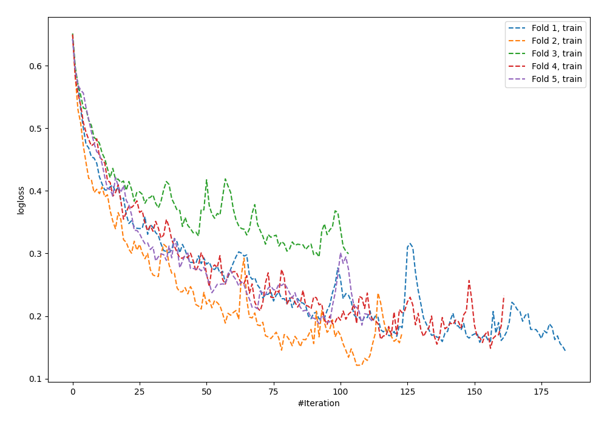
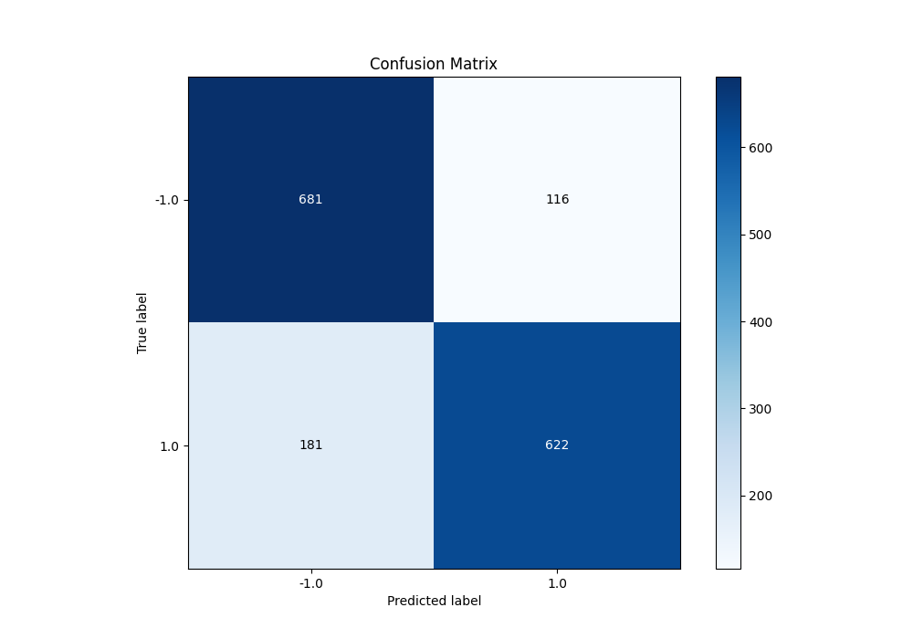
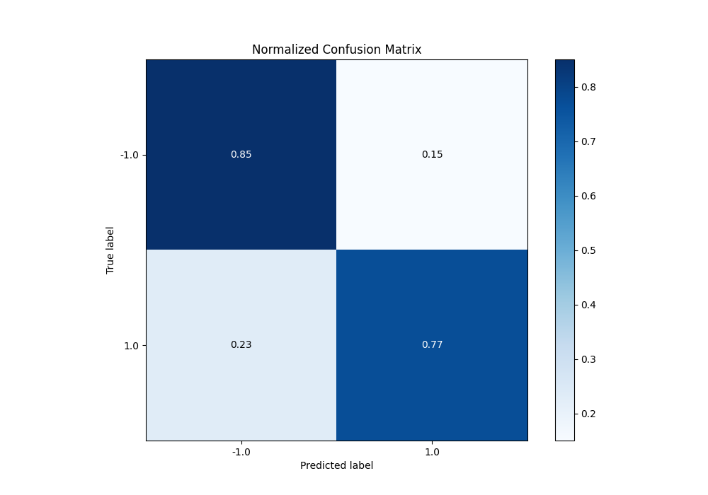
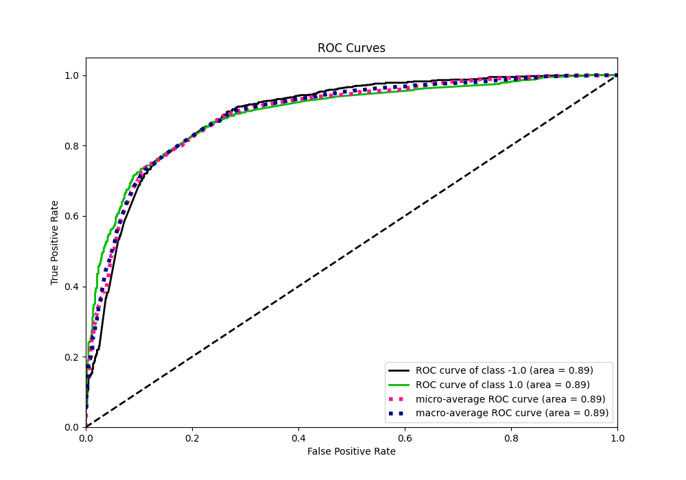
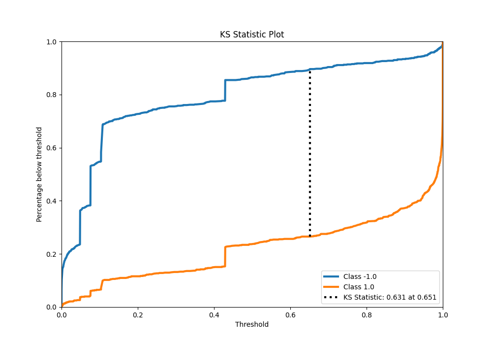
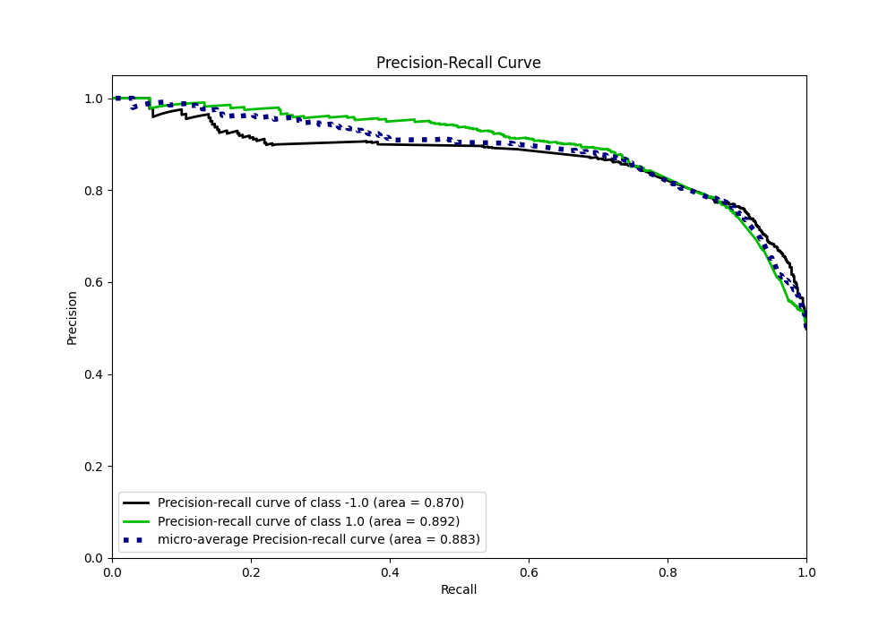
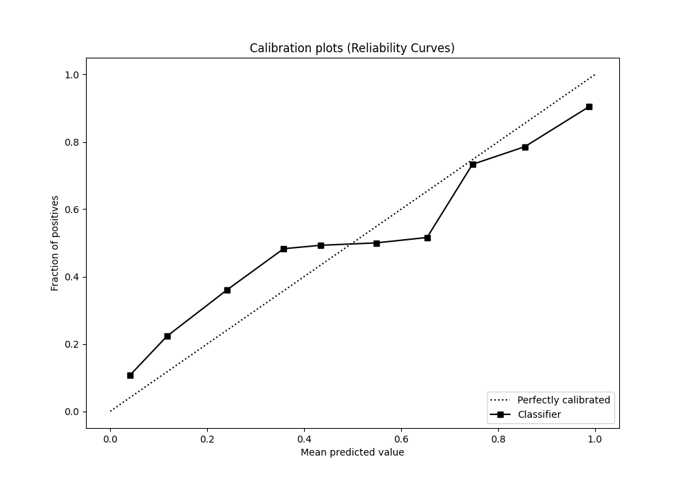
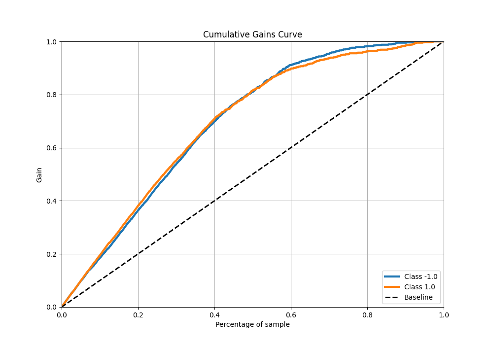
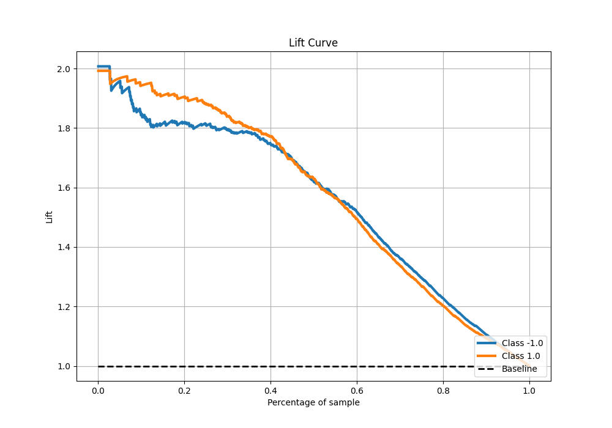

# Summary of 64_NeuralNetwork

[<< Go back](../README.md)

## Neural Network
- **n_jobs**: -1
- **dense_1_size**: 32
- **dense_2_size**: 4
- **learning_rate**: 0.05
- **explain_level**: 0

## Validation
 - **validation_type**: kfold
 - **shuffle**: True
 - **stratify**: True
 - **k_folds**: 5

## Optimized metric
f1

## Training time

15.1 seconds

## Metric details
|           |    score |     threshold |
|:----------|---------:|--------------:|
| logloss   | 0.530658 | nan           |
| auc       | 0.88926  | nan           |
| f1        | 0.823322 |   0.28082     |
| accuracy  | 0.814375 |   0.42941     |
| precision | 1        |   1           |
| recall    | 1        |   4.99953e-18 |
| mcc       | 0.636438 |   0.664948    |

## Metric details with threshold from accuracy metric
|           |    score |   threshold |
|:----------|---------:|------------:|
| logloss   | 0.530658 |   nan       |
| auc       | 0.88926  |   nan       |
| f1        | 0.807268 |     0.42941 |
| accuracy  | 0.814375 |     0.42941 |
| precision | 0.842818 |     0.42941 |
| recall    | 0.774595 |     0.42941 |
| mcc       | 0.630943 |     0.42941 |

## Confusion matrix (at threshold=0.42941)
|                 |   Predicted as -1.0 |   Predicted as 1.0 |
|:----------------|--------------------:|-------------------:|
| Labeled as -1.0 |                 681 |                116 |
| Labeled as 1.0  |                 181 |                622 |

## Learning curves

## Confusion Matrix

## Normalized Confusion Matrix

## ROC Curve

## Kolmogorov-Smirnov Statistic

## Precision-Recall Curve

## Calibration Curve

## Cumulative Gains Curve

## Lift Curve

[<< Go back](../README.md)
