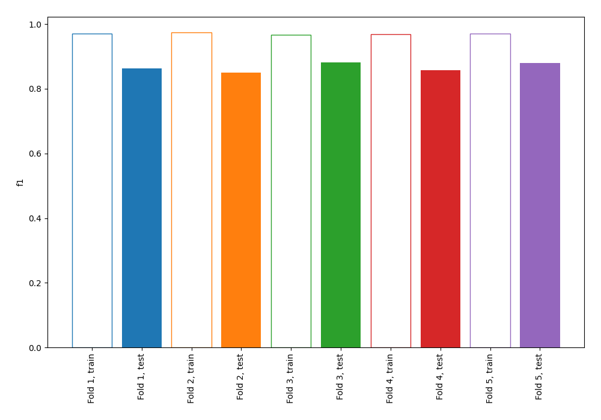
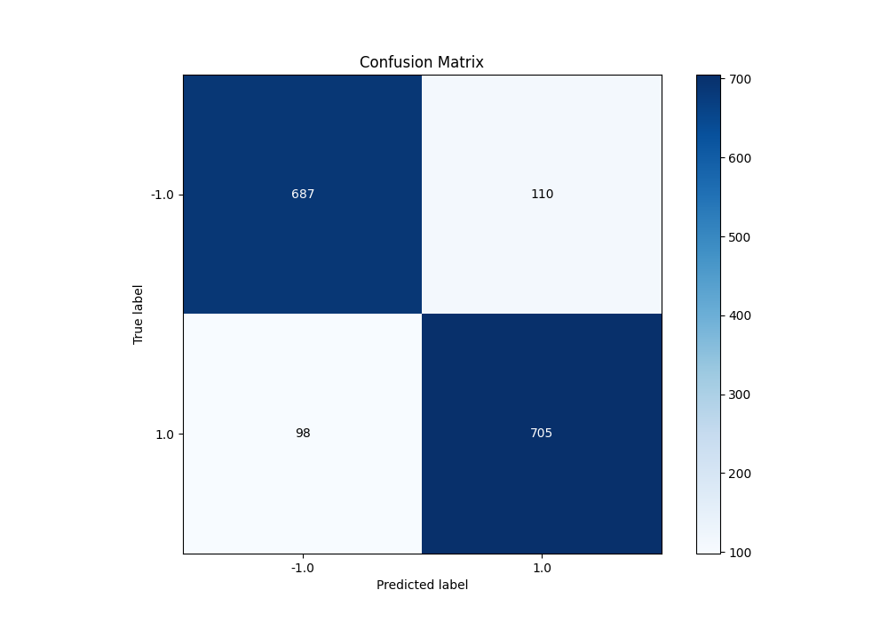
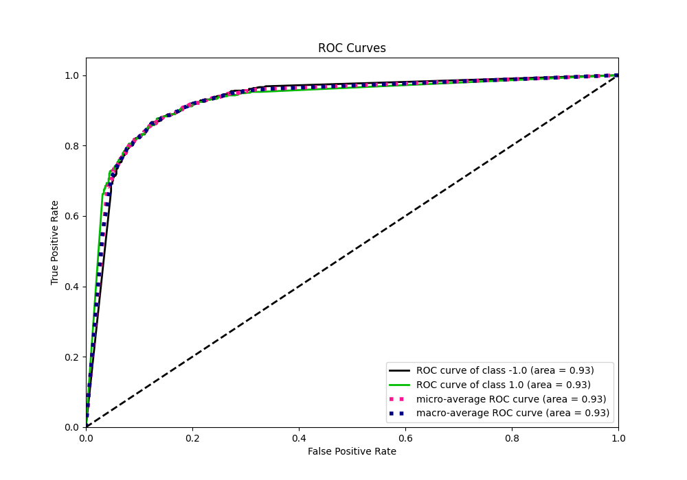
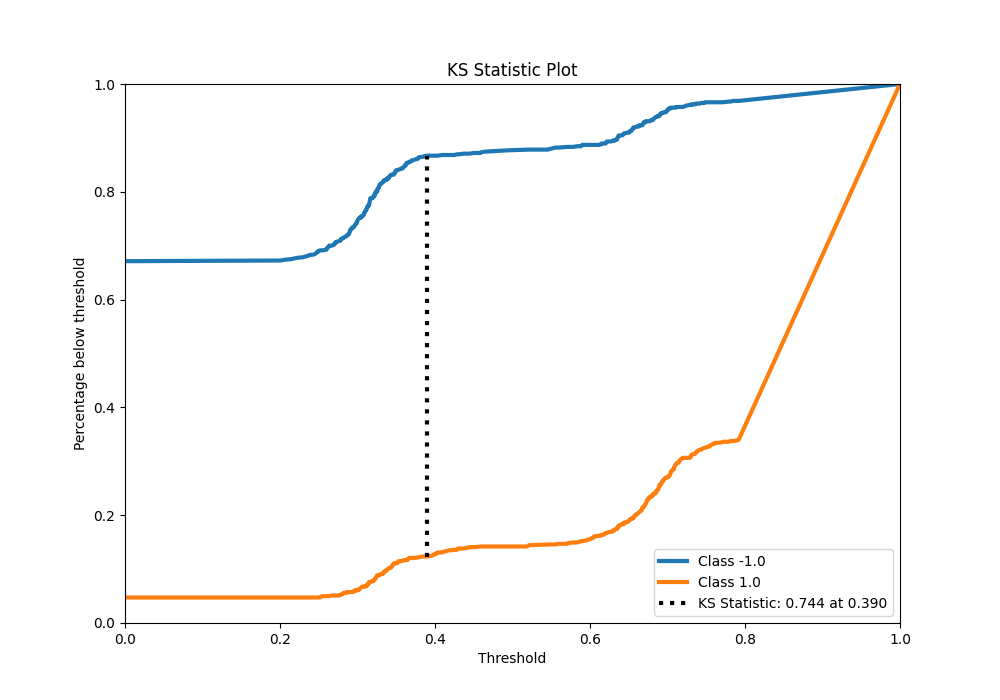
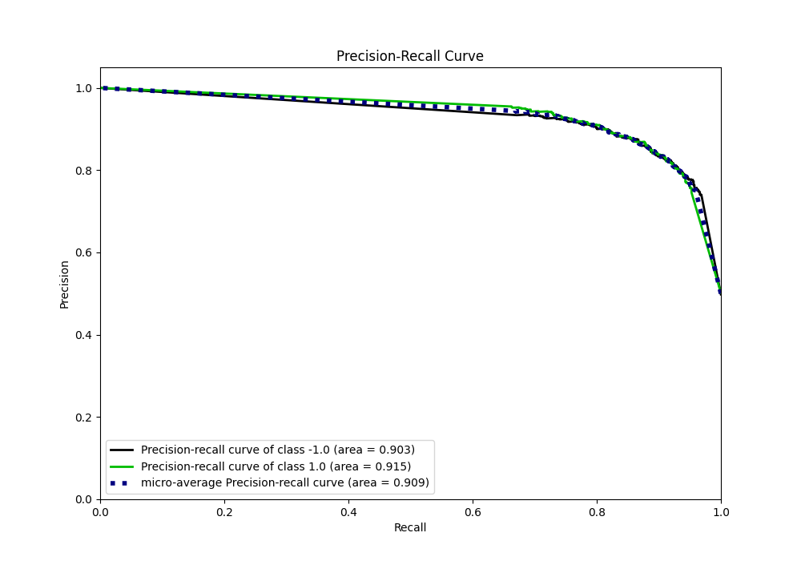
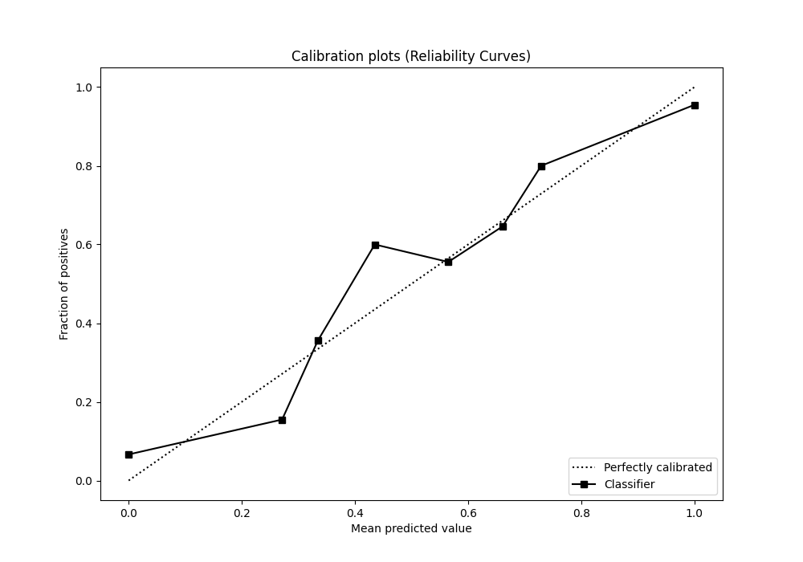
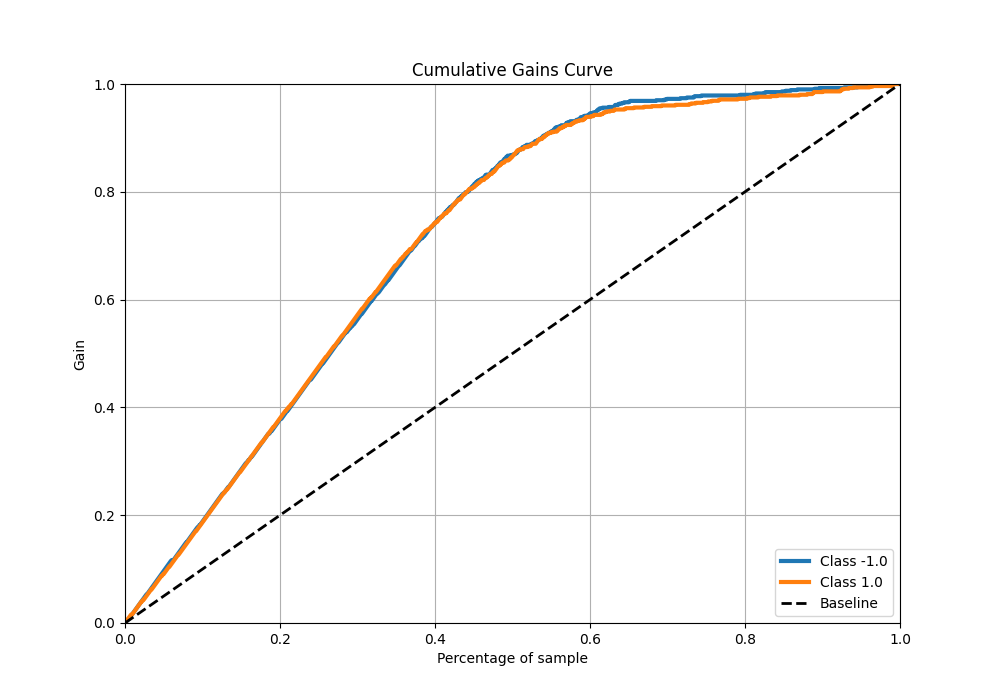
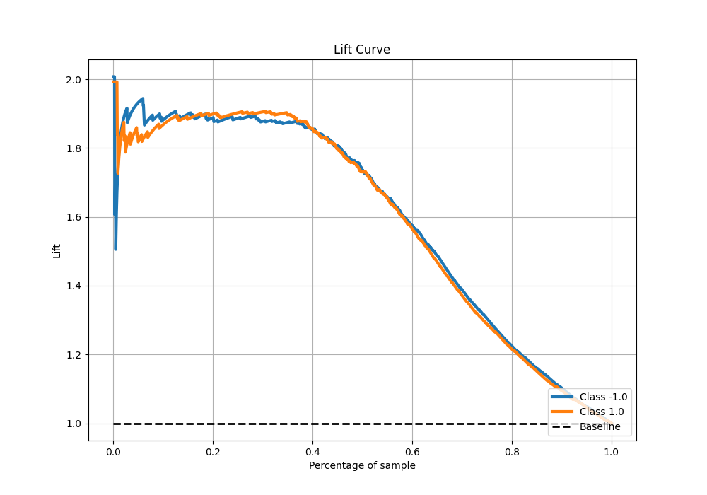

# Summary of 67_NearestNeighbors_KMeansFeatures

[<< Go back](../README.md)

## k-Nearest Neighbors (Nearest Neighbors)
- **n_jobs**: -1
- **n_neighbors**: 3
- **weights**: distance
- **explain_level**: 0

## Validation
 - **validation_type**: kfold
 - **shuffle**: True
 - **stratify**: True
 - **k_folds**: 5

## Optimized metric
f1

## Training time

11.8 seconds

## Metric details
|           |    score |   threshold |
|:----------|---------:|------------:|
| logloss   | 0.723272 |  nan        |
| auc       | 0.92661  |  nan        |
| f1        | 0.871446 |    0.37841  |
| accuracy  | 0.87     |    0.37841  |
| precision | 0.953488 |    0.780161 |
| recall    | 0.952677 |    0        |
| mcc       | 0.740065 |    0.37841  |

## Metric details with threshold from accuracy metric
|           |    score |   threshold |
|:----------|---------:|------------:|
| logloss   | 0.723272 |   nan       |
| auc       | 0.92661  |   nan       |
| f1        | 0.871446 |     0.37841 |
| accuracy  | 0.87     |     0.37841 |
| precision | 0.865031 |     0.37841 |
| recall    | 0.877958 |     0.37841 |
| mcc       | 0.740065 |     0.37841 |

## Confusion matrix (at threshold=0.37841)
|                 |   Predicted as -1.0 |   Predicted as 1.0 |
|:----------------|--------------------:|-------------------:|
| Labeled as -1.0 |                 687 |                110 |
| Labeled as 1.0  |                  98 |                705 |

## Learning curves

## Confusion Matrix

## Normalized Confusion Matrix

## ROC Curve

## Kolmogorov-Smirnov Statistic

## Precision-Recall Curve

## Calibration Curve

## Cumulative Gains Curve

## Lift Curve

[<< Go back](../README.md)
