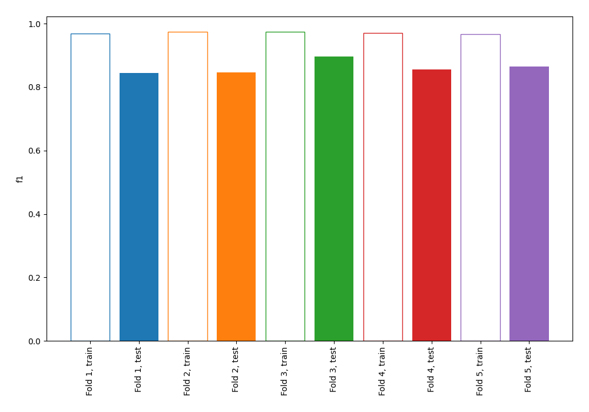
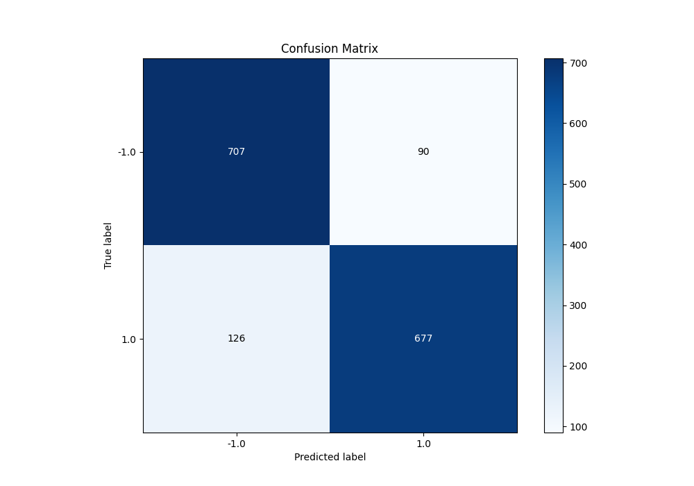
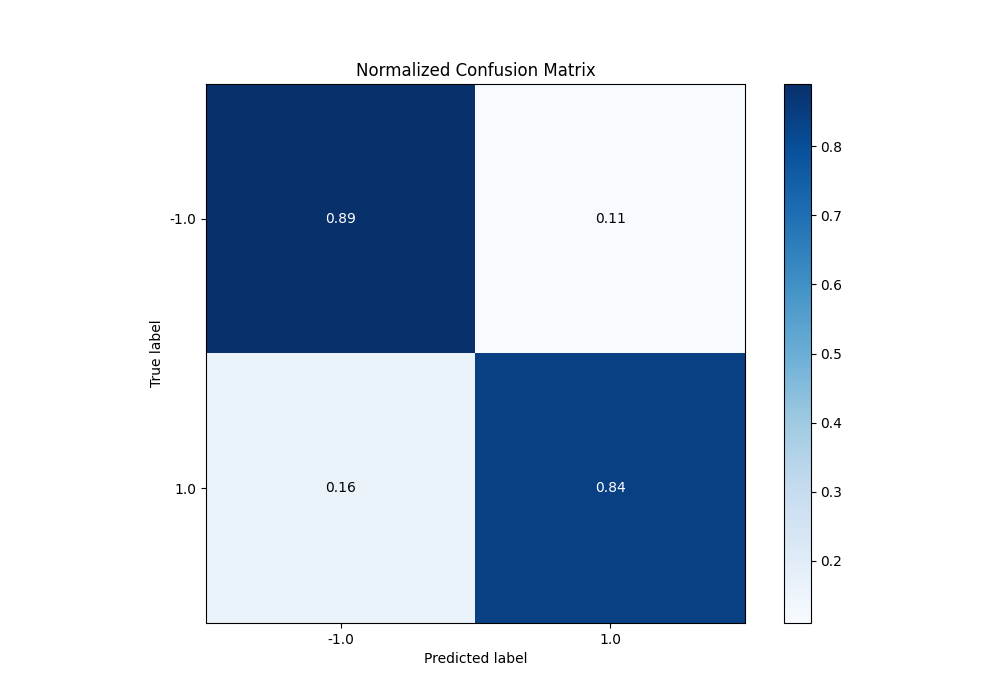
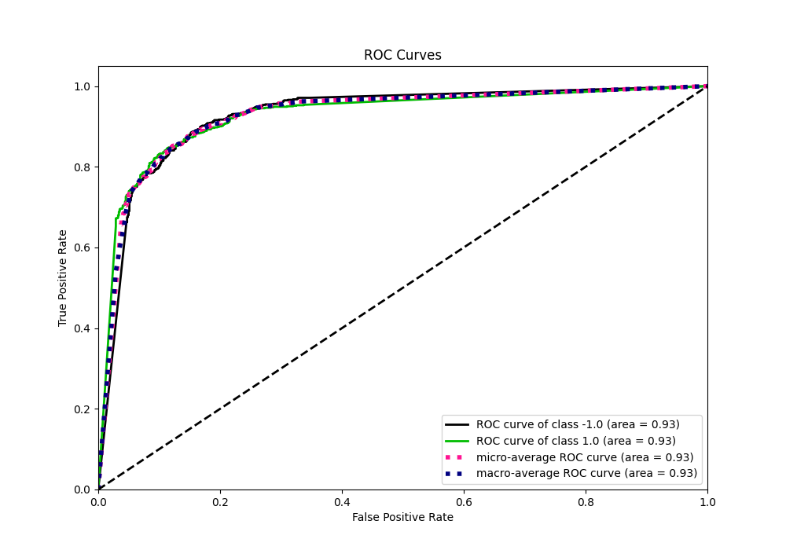
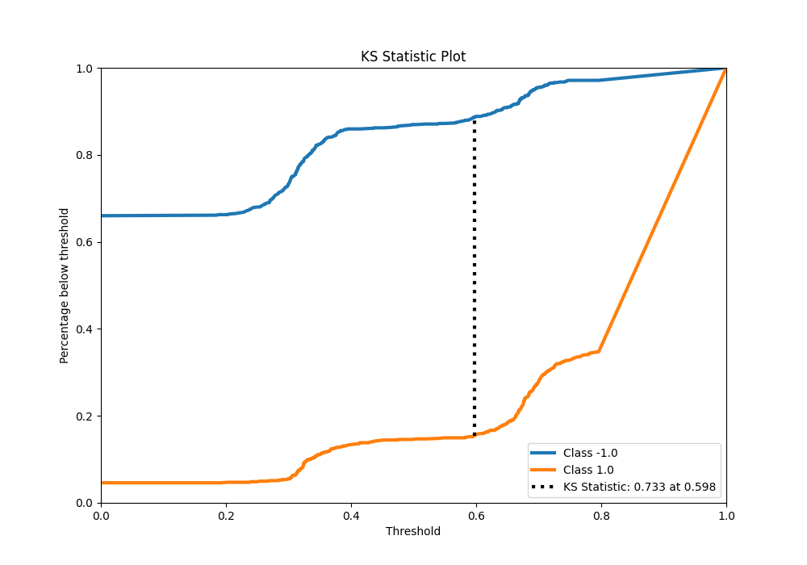
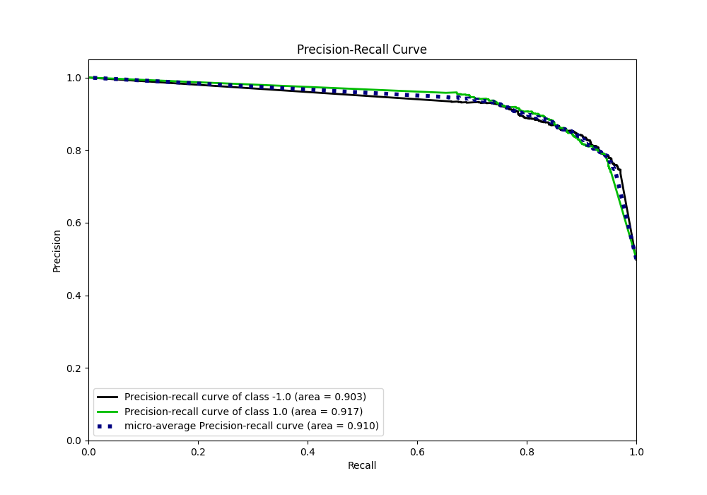
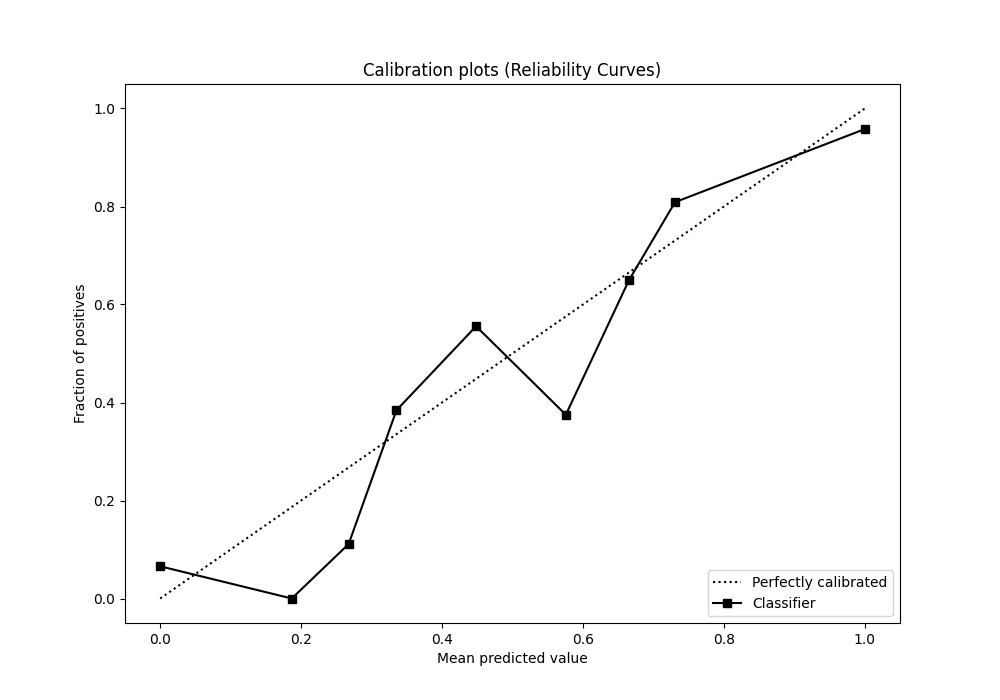
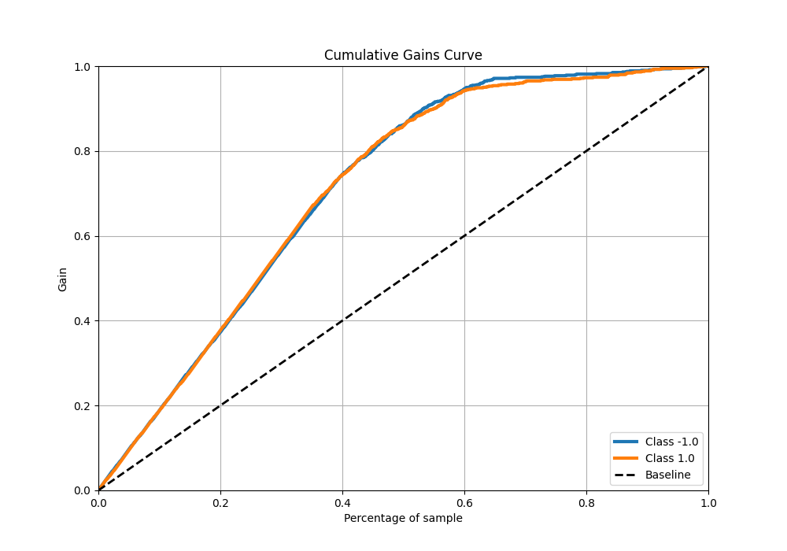
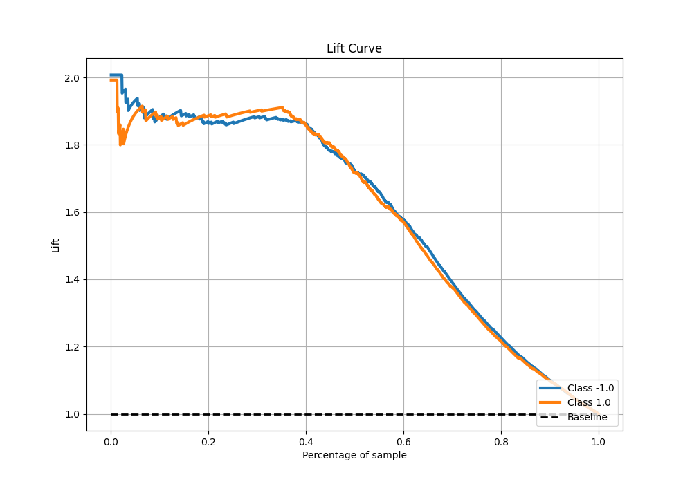

# Summary of 68_NearestNeighbors_KMeansFeatures

[<< Go back](../README.md)

## k-Nearest Neighbors (Nearest Neighbors)
- **n_jobs**: -1
- **n_neighbors**: 3
- **weights**: distance
- **explain_level**: 0

## Validation
 - **validation_type**: kfold
 - **shuffle**: True
 - **stratify**: True
 - **k_folds**: 5

## Optimized metric
f1

## Training time

12.0 seconds

## Metric details
|           |    score |   threshold |
|:----------|---------:|------------:|
| logloss   | 0.705674 |  nan        |
| auc       | 0.926579 |  nan        |
| f1        | 0.865266 |    0.384871 |
| accuracy  | 0.865    |    0.599124 |
| precision | 0.958855 |    0.75693  |
| recall    | 0.953923 |    0        |
| mcc       | 0.731608 |    0.62925  |

## Metric details with threshold from accuracy metric
|           |    score |   threshold |
|:----------|---------:|------------:|
| logloss   | 0.705674 |  nan        |
| auc       | 0.926579 |  nan        |
| f1        | 0.86242  |    0.599124 |
| accuracy  | 0.865    |    0.599124 |
| precision | 0.88266  |    0.599124 |
| recall    | 0.843088 |    0.599124 |
| mcc       | 0.730782 |    0.599124 |

## Confusion matrix (at threshold=0.599124)
|                 |   Predicted as -1.0 |   Predicted as 1.0 |
|:----------------|--------------------:|-------------------:|
| Labeled as -1.0 |                 707 |                 90 |
| Labeled as 1.0  |                 126 |                677 |

## Learning curves

## Confusion Matrix

## Normalized Confusion Matrix

## ROC Curve

## Kolmogorov-Smirnov Statistic

## Precision-Recall Curve

## Calibration Curve

## Cumulative Gains Curve

## Lift Curve

[<< Go back](../README.md)
