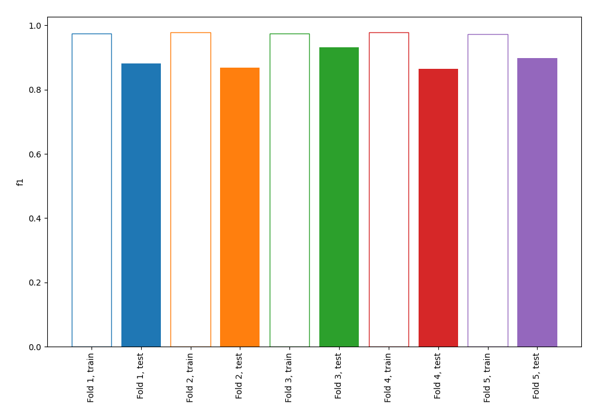
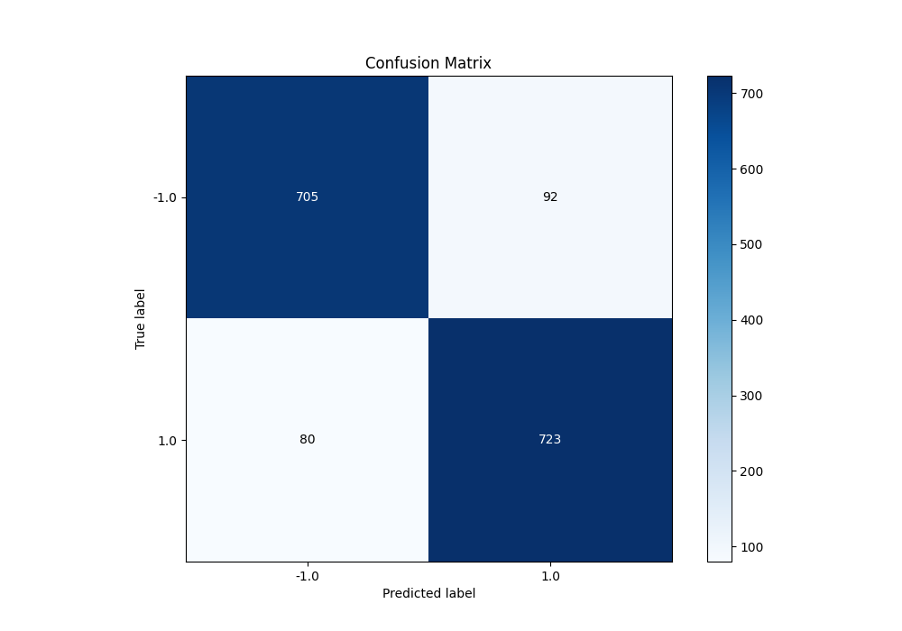
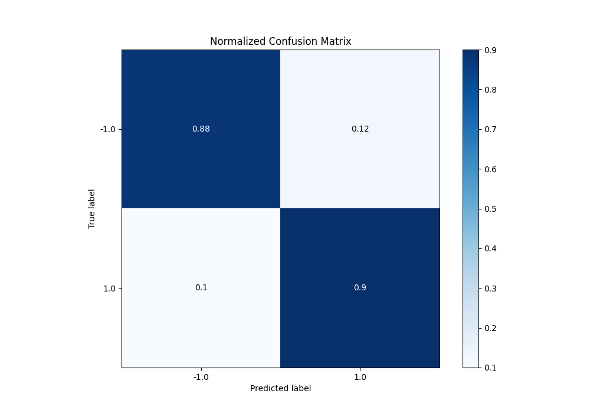
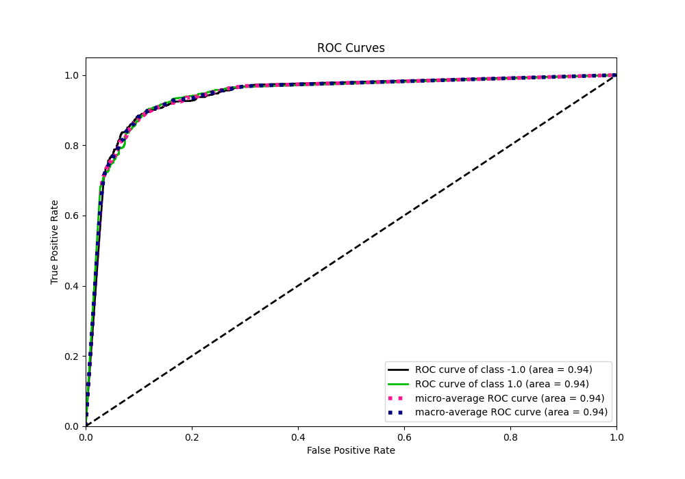
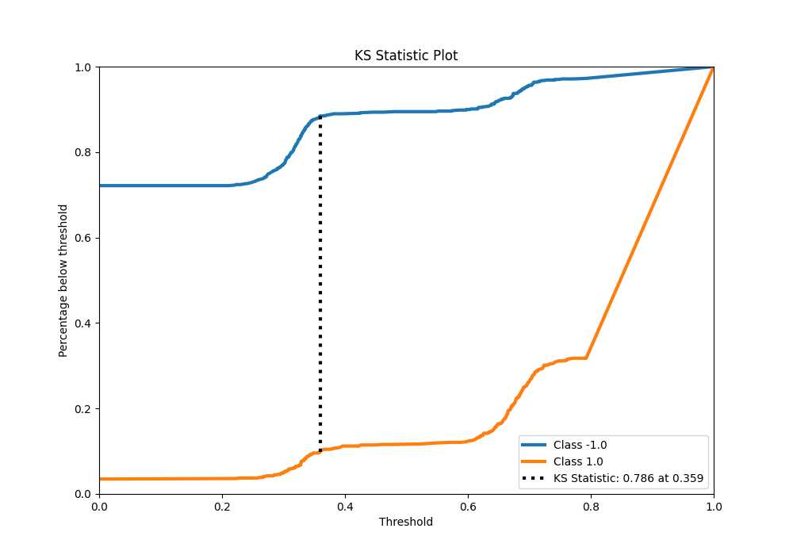
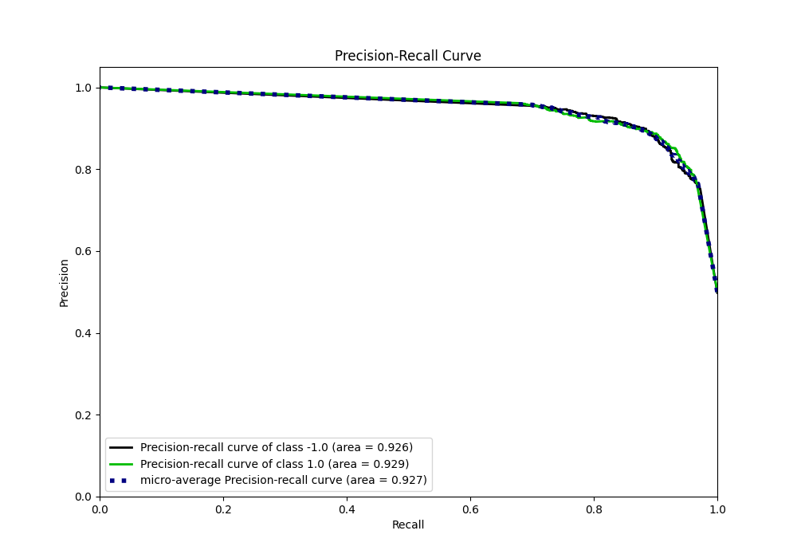
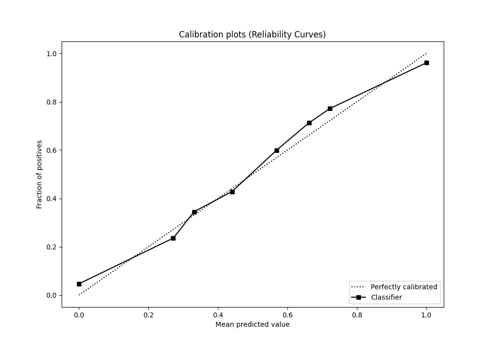
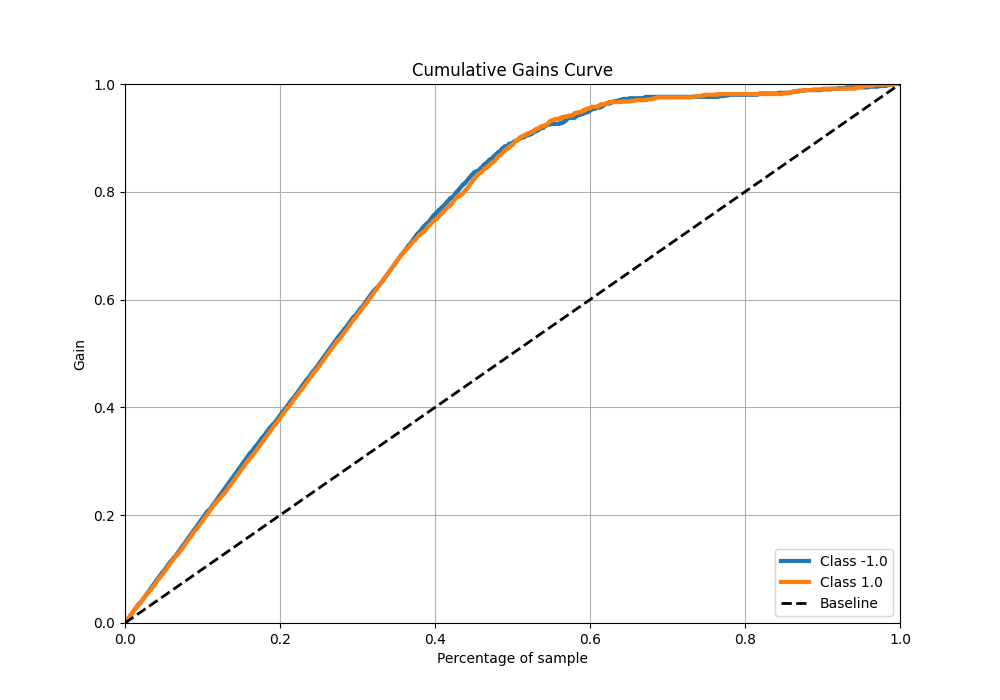
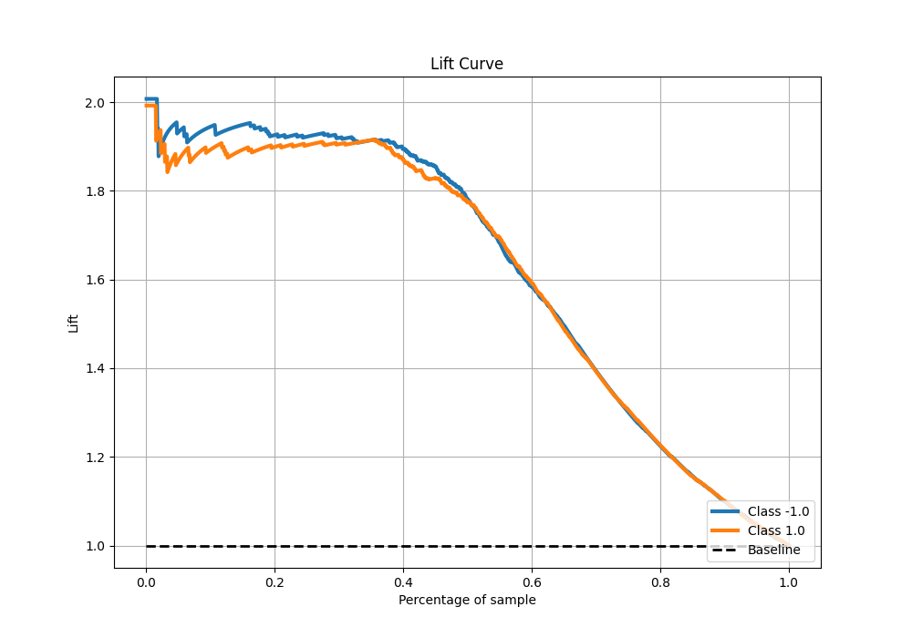

# Summary of 69_NearestNeighbors

[<< Go back](../README.md)

## k-Nearest Neighbors (Nearest Neighbors)
- **n_jobs**: -1
- **n_neighbors**: 3
- **weights**: distance
- **explain_level**: 0

## Validation
 - **validation_type**: kfold
 - **shuffle**: True
 - **stratify**: True
 - **k_folds**: 5

## Optimized metric
f1

## Training time

8.3 seconds

## Metric details
|           |    score |   threshold |
|:----------|---------:|------------:|
| logloss   | 0.592921 |  nan        |
| auc       | 0.941813 |  nan        |
| f1        | 0.893696 |    0.359892 |
| accuracy  | 0.8925   |    0.359892 |
| precision | 0.96     |    0.760996 |
| recall    | 0.965131 |    0        |
| mcc       | 0.785073 |    0.359892 |

## Metric details with threshold from accuracy metric
|           |    score |   threshold |
|:----------|---------:|------------:|
| logloss   | 0.592921 |  nan        |
| auc       | 0.941813 |  nan        |
| f1        | 0.893696 |    0.359892 |
| accuracy  | 0.8925   |    0.359892 |
| precision | 0.887117 |    0.359892 |
| recall    | 0.900374 |    0.359892 |
| mcc       | 0.785073 |    0.359892 |

## Confusion matrix (at threshold=0.359892)
|                 |   Predicted as -1.0 |   Predicted as 1.0 |
|:----------------|--------------------:|-------------------:|
| Labeled as -1.0 |                 705 |                 92 |
| Labeled as 1.0  |                  80 |                723 |

## Learning curves

## Confusion Matrix

## Normalized Confusion Matrix

## ROC Curve

## Kolmogorov-Smirnov Statistic

## Precision-Recall Curve

## Calibration Curve

## Cumulative Gains Curve

## Lift Curve

[<< Go back](../README.md)
