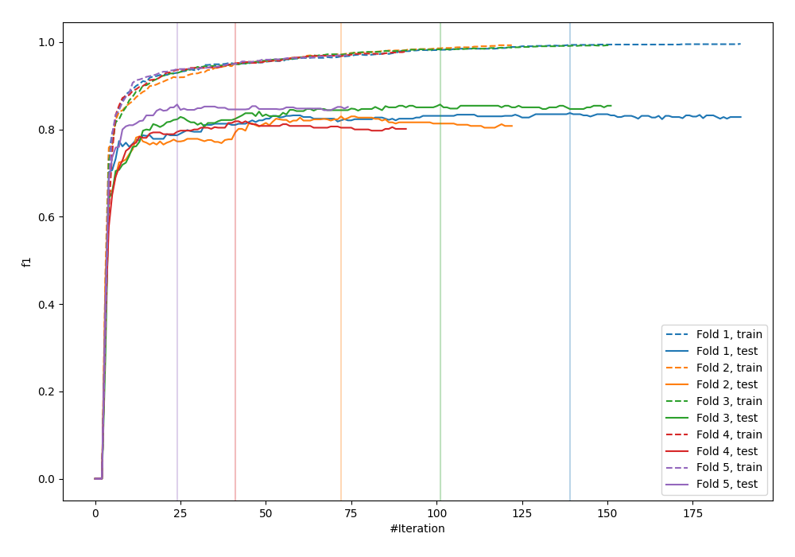
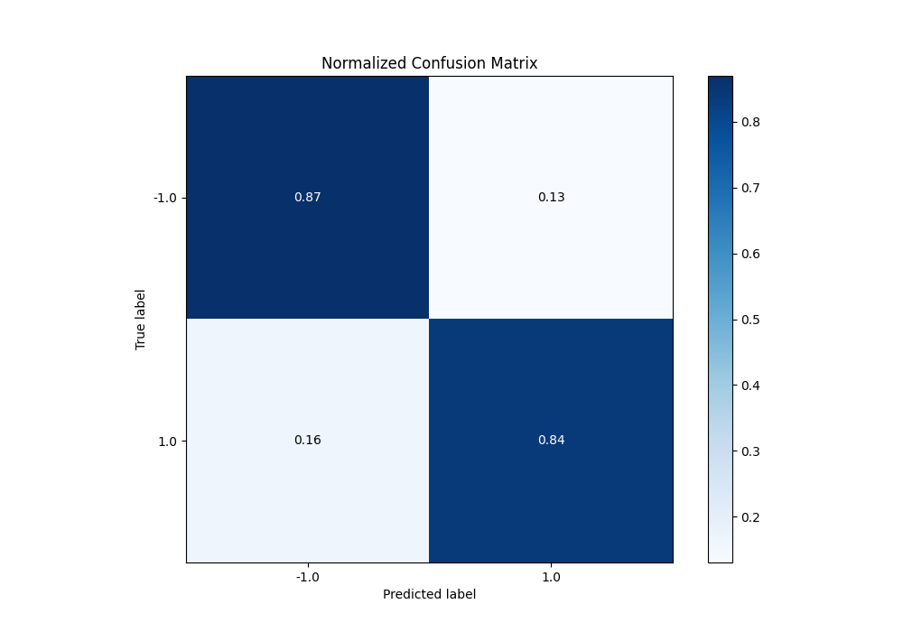
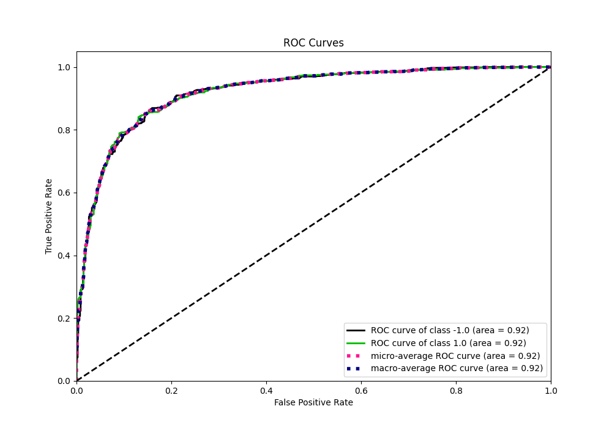
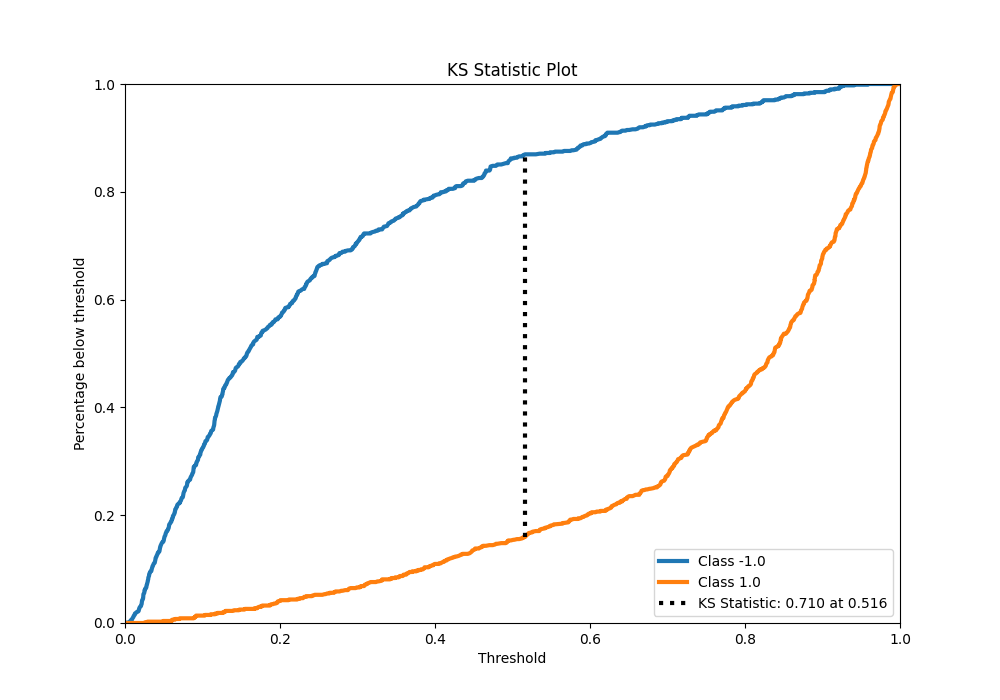
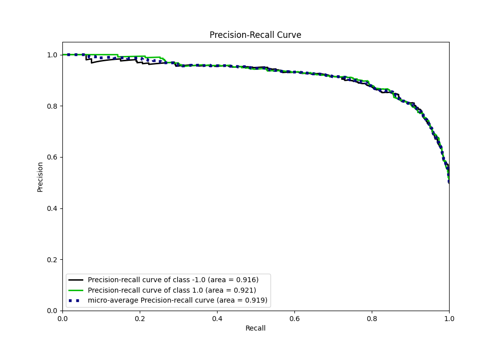
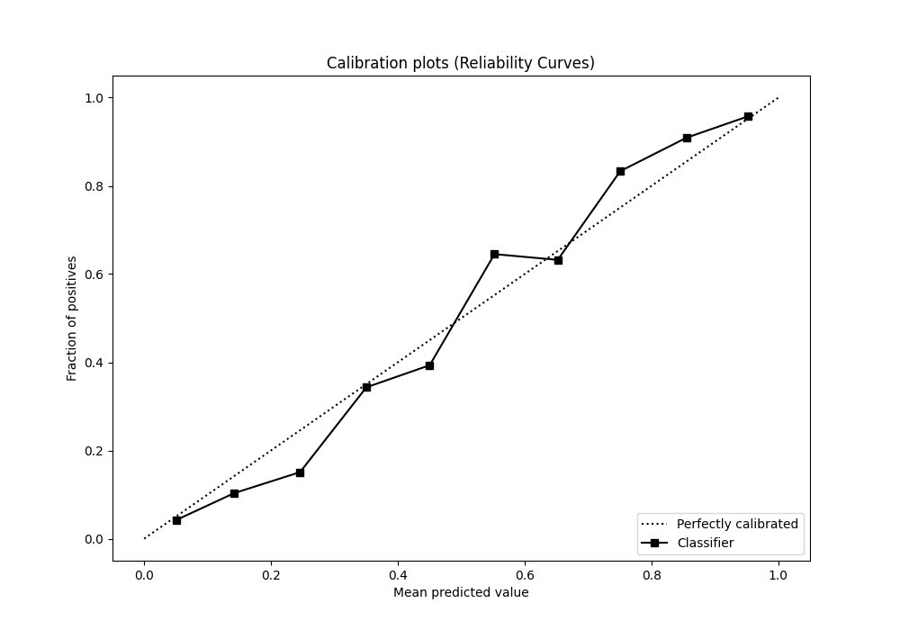
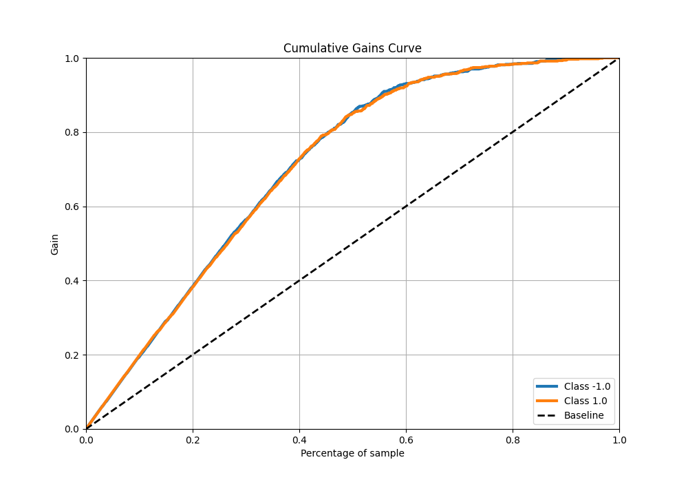
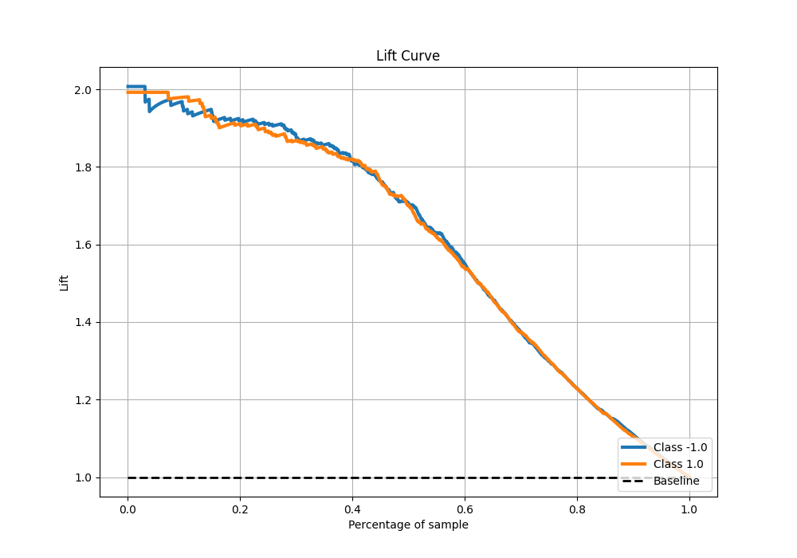

# Summary of 6_Default_Xgboost

[<< Go back](../README.md)

## Extreme Gradient Boosting (Xgboost)
- **n_jobs**: -1
- **objective**: binary:logistic
- **eta**: 0.075
- **max_depth**: 6
- **min_child_weight**: 1
- **subsample**: 1.0
- **colsample_bytree**: 1.0
- **eval_metric**: f1
- **explain_level**: 0

## Validation
 - **validation_type**: kfold
 - **shuffle**: True
 - **stratify**: True
 - **k_folds**: 5

## Optimized metric
f1

## Training time

17.7 seconds

## Metric details
|           |    score |    threshold |
|:----------|---------:|-------------:|
| logloss   | 0.36277  | nan          |
| auc       | 0.920736 | nan          |
| f1        | 0.852459 |   0.51308    |
| accuracy  | 0.85375  |   0.51308    |
| precision | 1        |   0.959878   |
| recall    | 1        |   0.00418338 |
| mcc       | 0.707744 |   0.51308    |

## Metric details with threshold from accuracy metric
|           |    score |   threshold |
|:----------|---------:|------------:|
| logloss   | 0.36277  |   nan       |
| auc       | 0.920736 |   nan       |
| f1        | 0.852459 |     0.51308 |
| accuracy  | 0.85375  |     0.51308 |
| precision | 0.863346 |     0.51308 |
| recall    | 0.841843 |     0.51308 |
| mcc       | 0.707744 |     0.51308 |

## Confusion matrix (at threshold=0.51308)
|                 |   Predicted as -1.0 |   Predicted as 1.0 |
|:----------------|--------------------:|-------------------:|
| Labeled as -1.0 |                 690 |                107 |
| Labeled as 1.0  |                 127 |                676 |

## Learning curves

## Confusion Matrix

## Normalized Confusion Matrix

## ROC Curve

## Kolmogorov-Smirnov Statistic

## Precision-Recall Curve

## Calibration Curve

## Cumulative Gains Curve

## Lift Curve

[<< Go back](../README.md)
