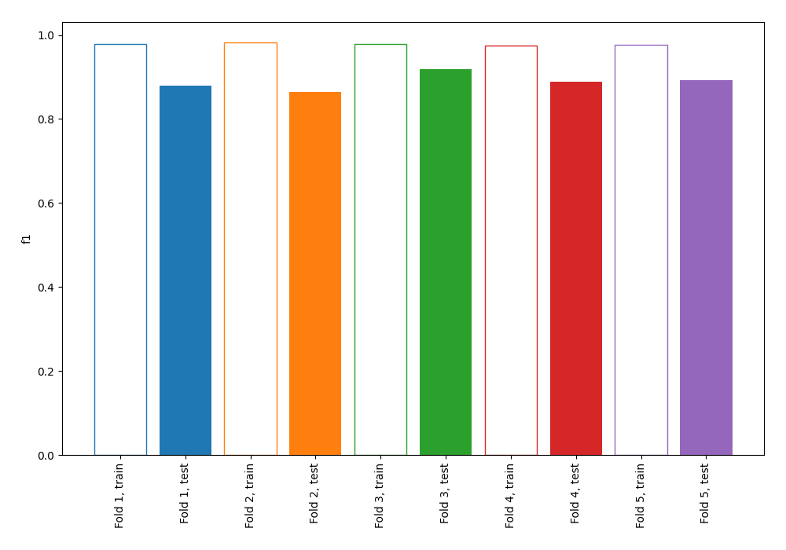
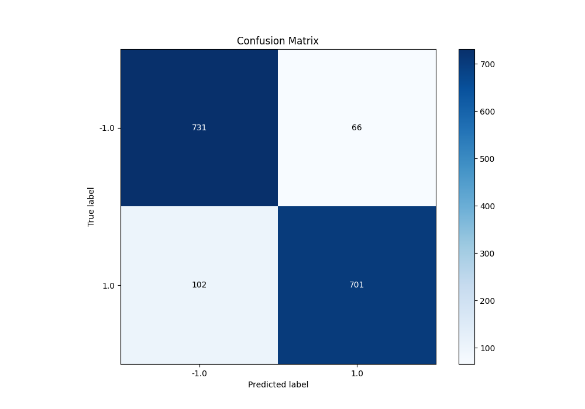
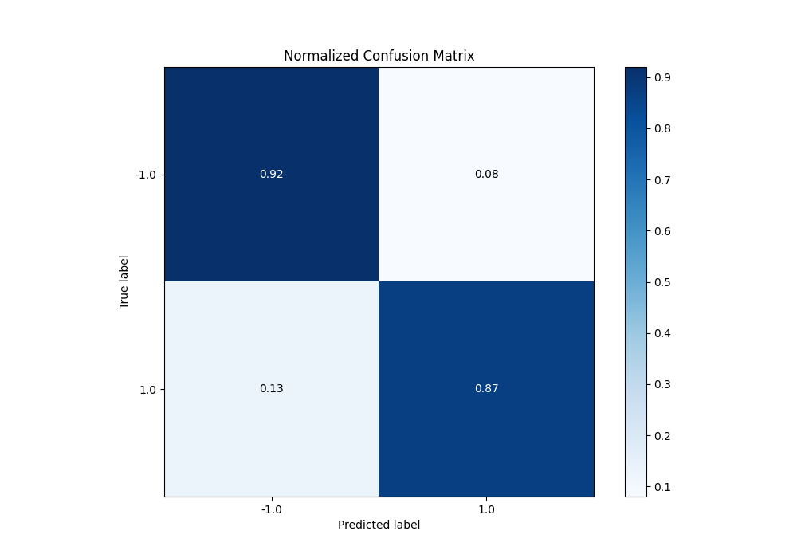
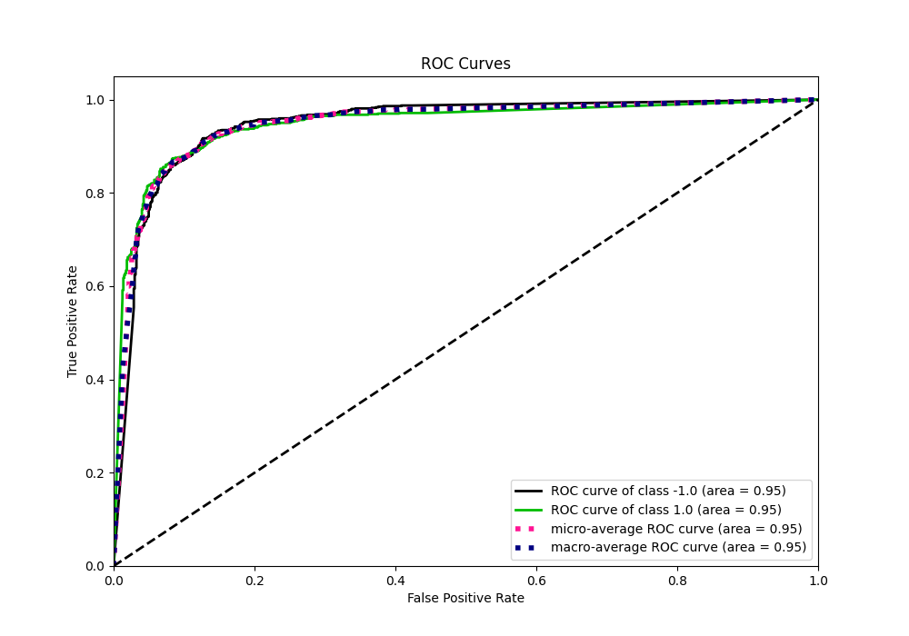
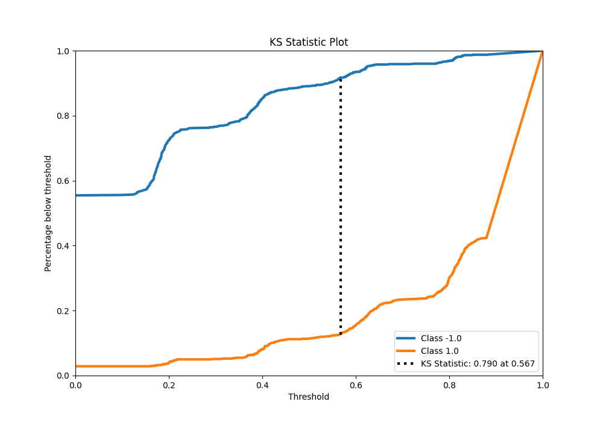
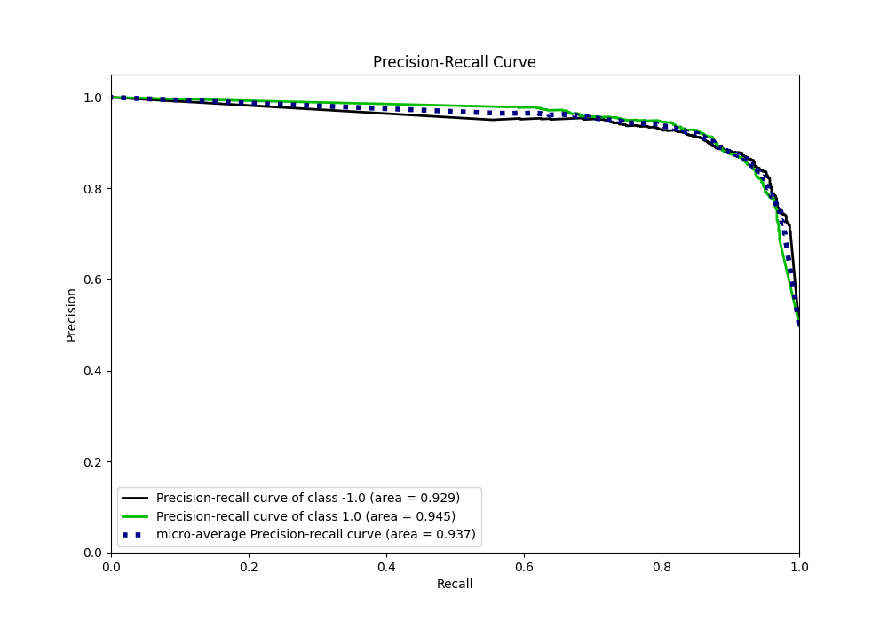
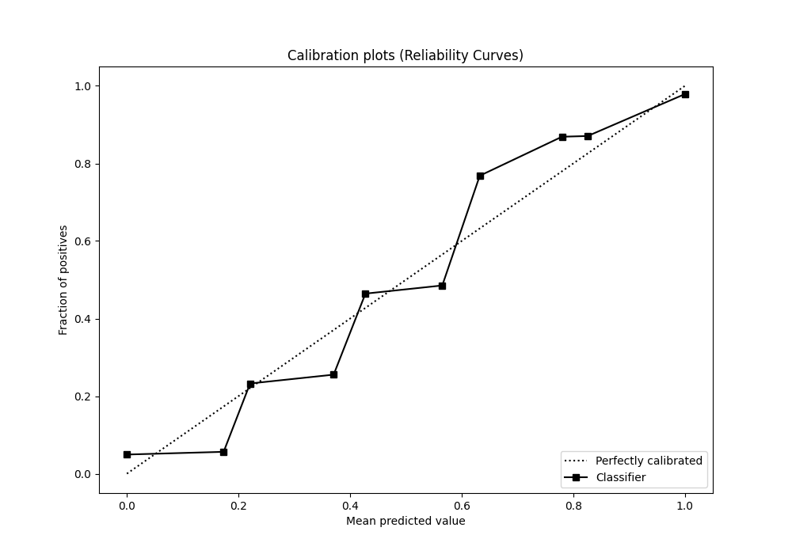
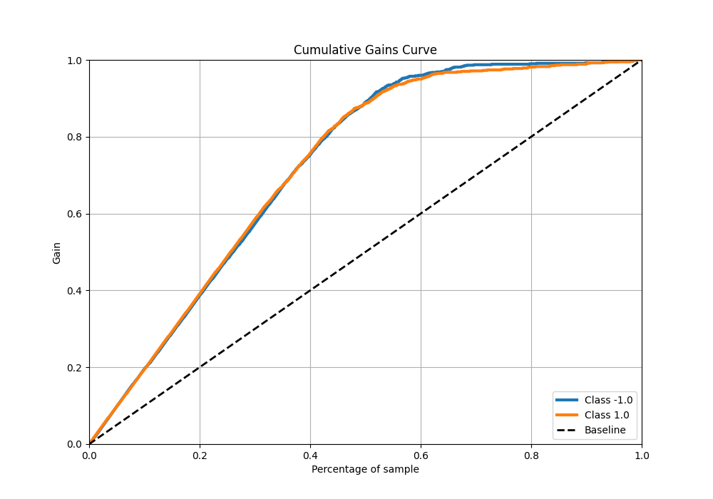
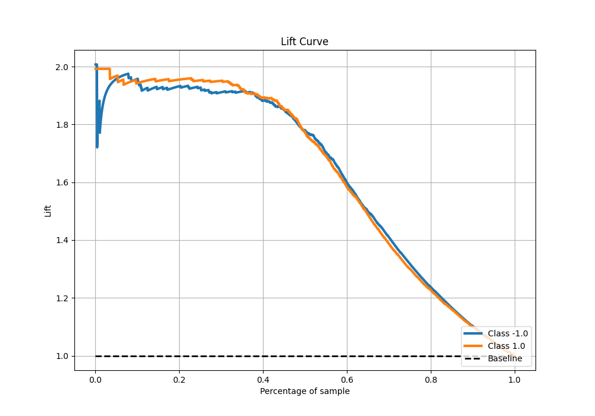

# Summary of 73_NearestNeighbors

[<< Go back](../README.md)

## k-Nearest Neighbors (Nearest Neighbors)
- **n_jobs**: -1
- **n_neighbors**: 5
- **weights**: distance
- **explain_level**: 0

## Validation
 - **validation_type**: kfold
 - **shuffle**: True
 - **stratify**: True
 - **k_folds**: 5

## Optimized metric
f1

## Training time

11.5 seconds

## Metric details
|           |    score |   threshold |
|:----------|---------:|------------:|
| logloss   | 0.48685  |  nan        |
| auc       | 0.947318 |  nan        |
| f1        | 0.892994 |    0.567604 |
| accuracy  | 0.895    |    0.567604 |
| precision | 0.979123 |    0.85863  |
| recall    | 0.971357 |    0        |
| mcc       | 0.790833 |    0.567604 |

## Metric details with threshold from accuracy metric
|           |    score |   threshold |
|:----------|---------:|------------:|
| logloss   | 0.48685  |  nan        |
| auc       | 0.947318 |  nan        |
| f1        | 0.892994 |    0.567604 |
| accuracy  | 0.895    |    0.567604 |
| precision | 0.91395  |    0.567604 |
| recall    | 0.872976 |    0.567604 |
| mcc       | 0.790833 |    0.567604 |

## Confusion matrix (at threshold=0.567604)
|                 |   Predicted as -1.0 |   Predicted as 1.0 |
|:----------------|--------------------:|-------------------:|
| Labeled as -1.0 |                 731 |                 66 |
| Labeled as 1.0  |                 102 |                701 |

## Learning curves

## Confusion Matrix

## Normalized Confusion Matrix

## ROC Curve

## Kolmogorov-Smirnov Statistic

## Precision-Recall Curve

## Calibration Curve

## Cumulative Gains Curve

## Lift Curve

[<< Go back](../README.md)
