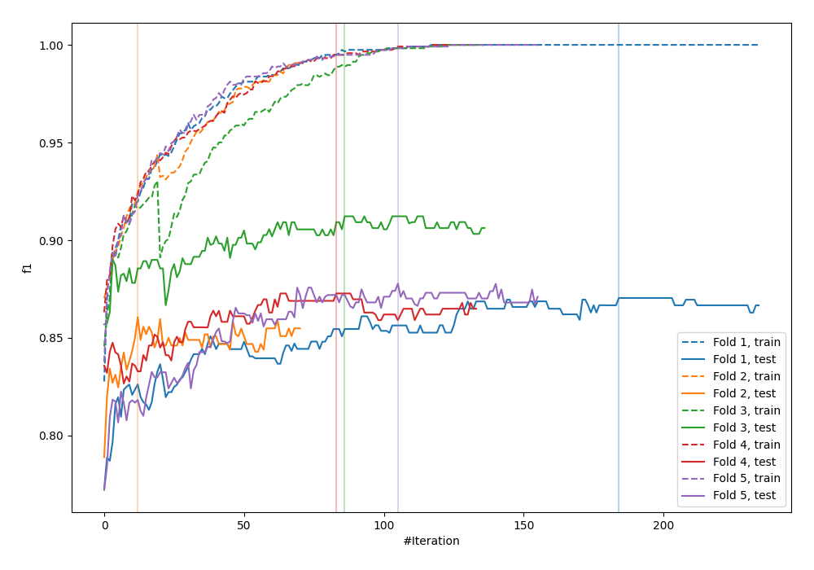
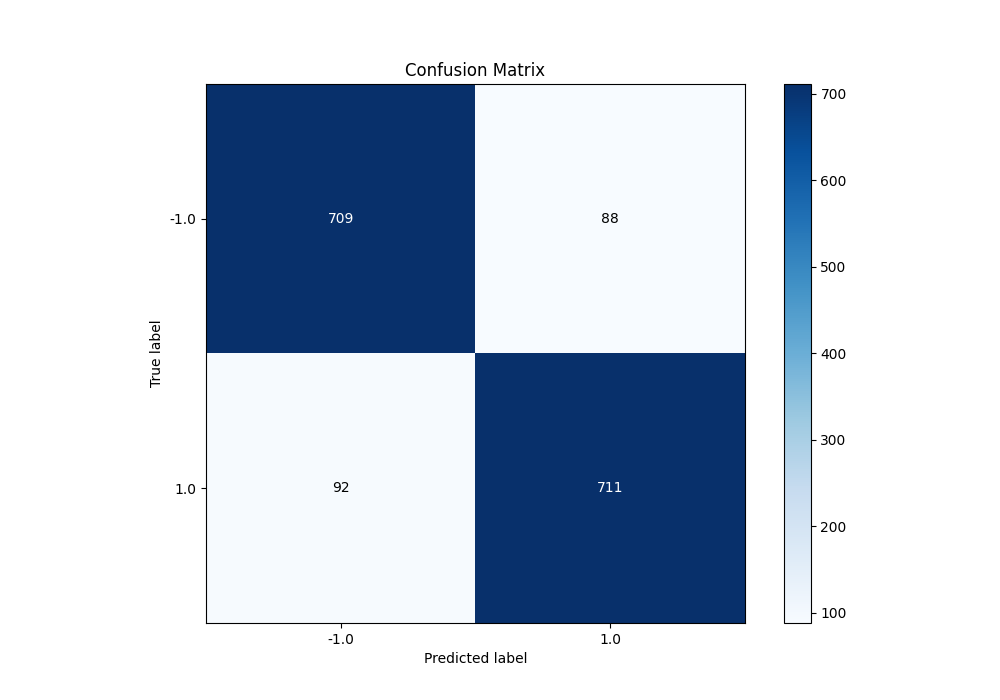
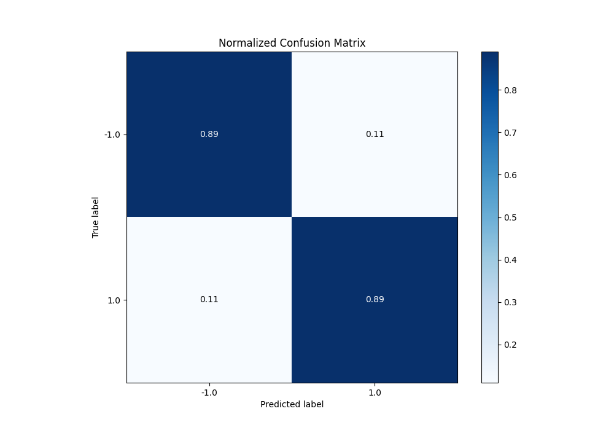
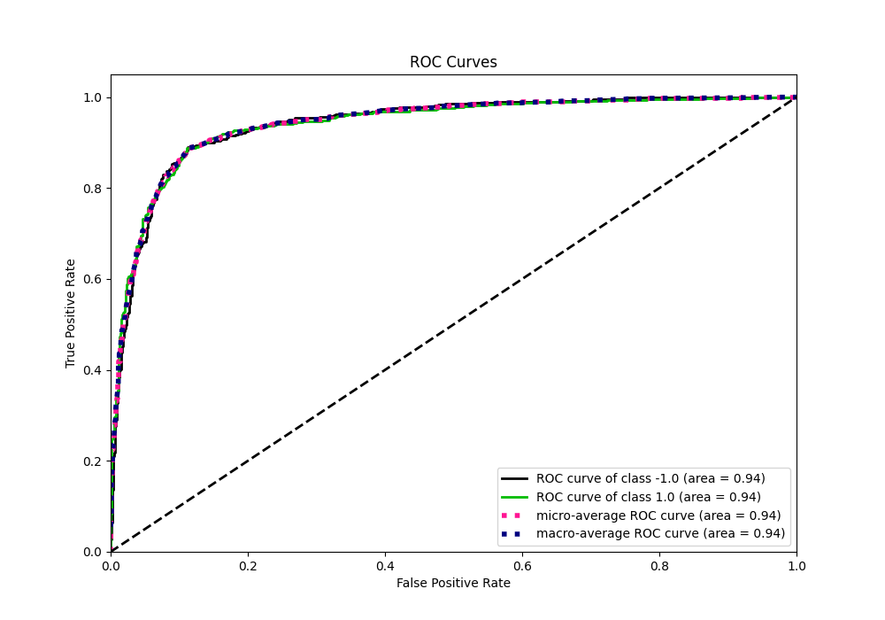
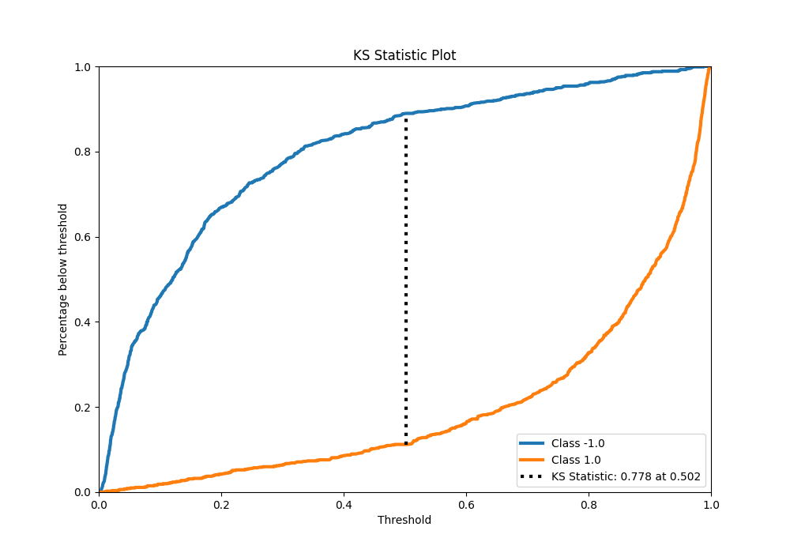
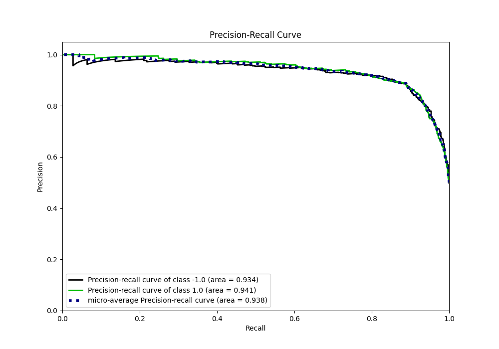
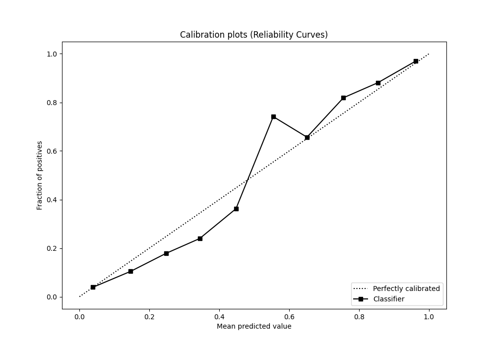
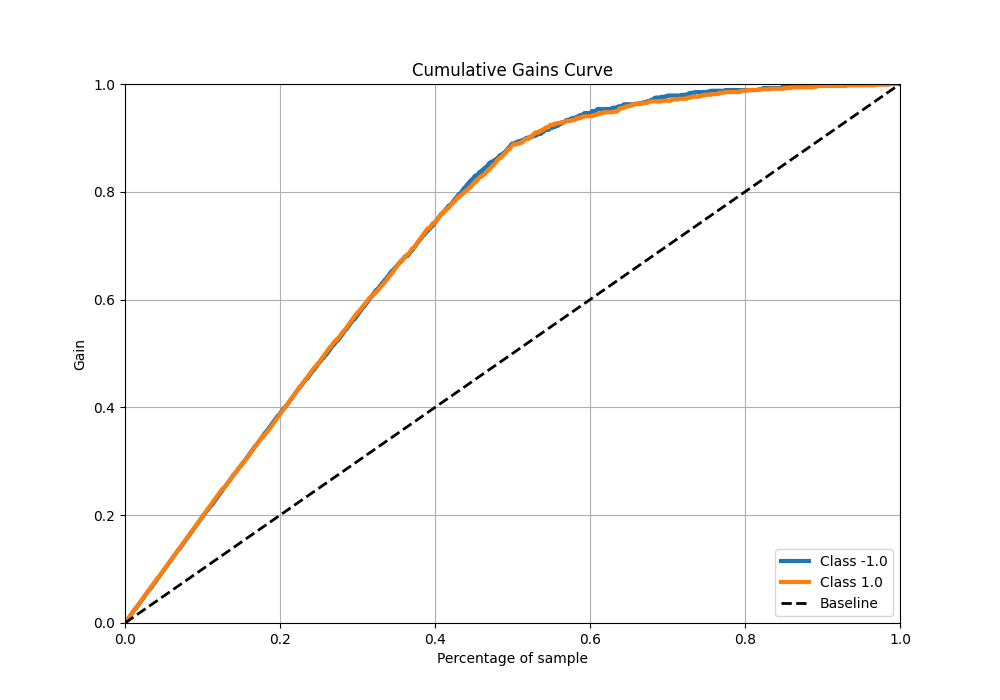
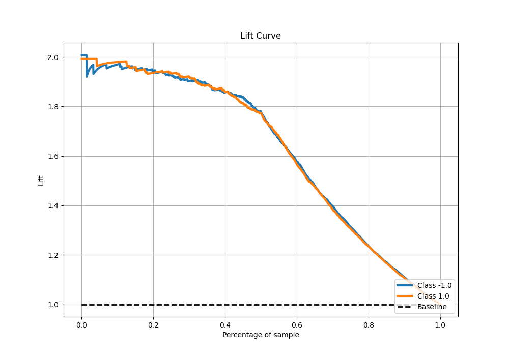

# Summary of 77_CatBoost_BoostOnErrors

[<< Go back](../README.md)

## CatBoost
- **n_jobs**: -1
- **learning_rate**: 0.1
- **depth**: 9
- **rsm**: 1.0
- **loss_function**: Logloss
- **eval_metric**: F1
- **explain_level**: 0

## Validation
 - **validation_type**: kfold
 - **shuffle**: True
 - **stratify**: True
 - **k_folds**: 5

## Optimized metric
f1

## Training time

39.3 seconds

## Metric details
|           |    score |    threshold |
|:----------|---------:|-------------:|
| logloss   | 0.311477 | nan          |
| auc       | 0.94053  | nan          |
| f1        | 0.88764  |   0.511779   |
| accuracy  | 0.8875   |   0.511779   |
| precision | 1        |   0.988708   |
| recall    | 1        |   0.00316651 |
| mcc       | 0.775011 |   0.511779   |

## Metric details with threshold from accuracy metric
|           |    score |   threshold |
|:----------|---------:|------------:|
| logloss   | 0.311477 |  nan        |
| auc       | 0.94053  |  nan        |
| f1        | 0.88764  |    0.511779 |
| accuracy  | 0.8875   |    0.511779 |
| precision | 0.889862 |    0.511779 |
| recall    | 0.88543  |    0.511779 |
| mcc       | 0.775011 |    0.511779 |

## Confusion matrix (at threshold=0.511779)
|                 |   Predicted as -1.0 |   Predicted as 1.0 |
|:----------------|--------------------:|-------------------:|
| Labeled as -1.0 |                 709 |                 88 |
| Labeled as 1.0  |                  92 |                711 |

## Learning curves

## Confusion Matrix

## Normalized Confusion Matrix

## ROC Curve

## Kolmogorov-Smirnov Statistic

## Precision-Recall Curve

## Calibration Curve

## Cumulative Gains Curve

## Lift Curve

[<< Go back](../README.md)
