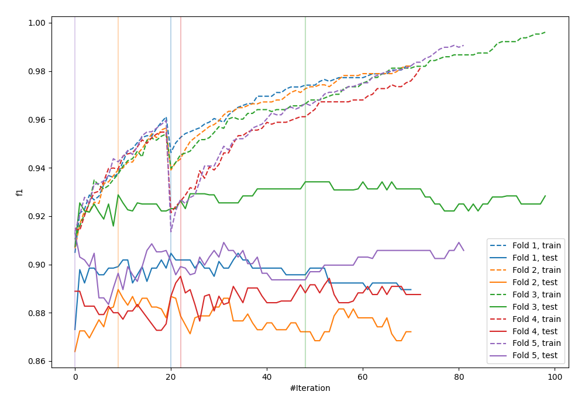
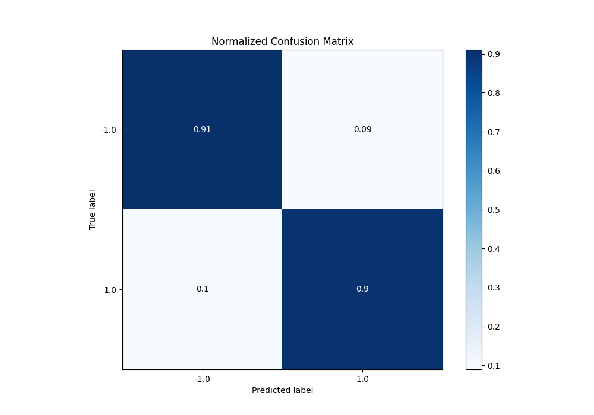
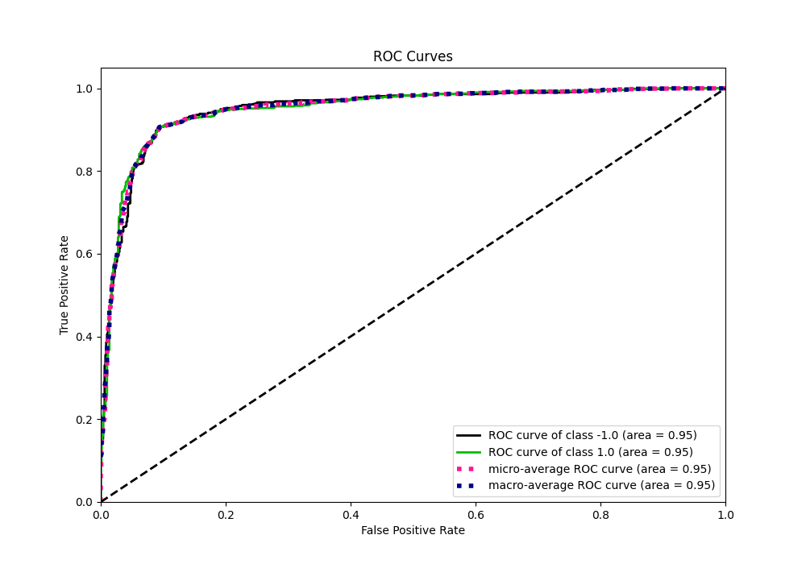
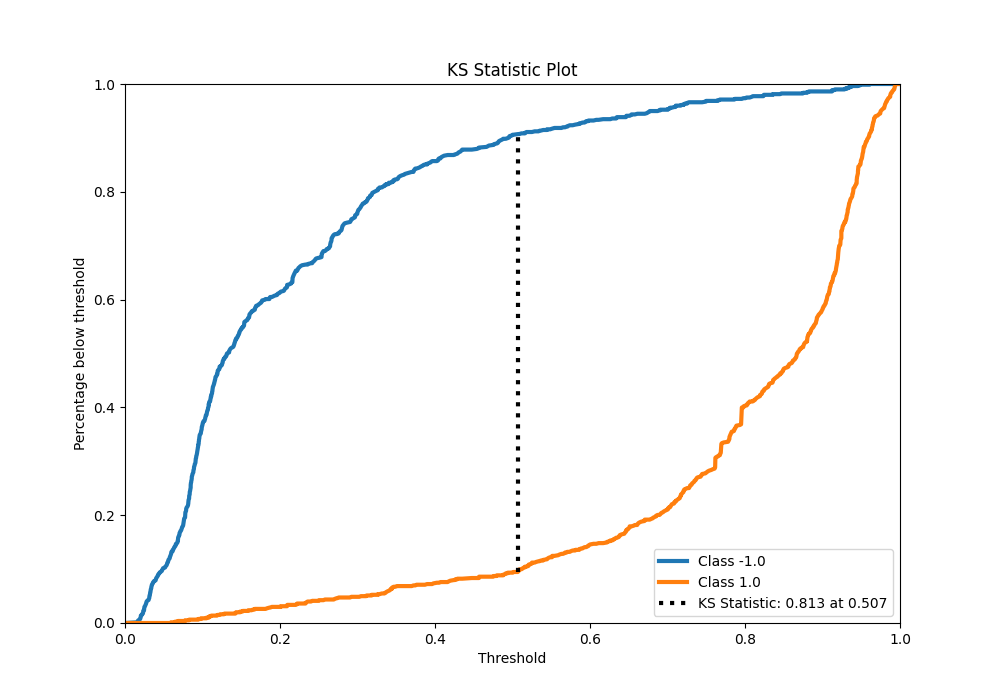
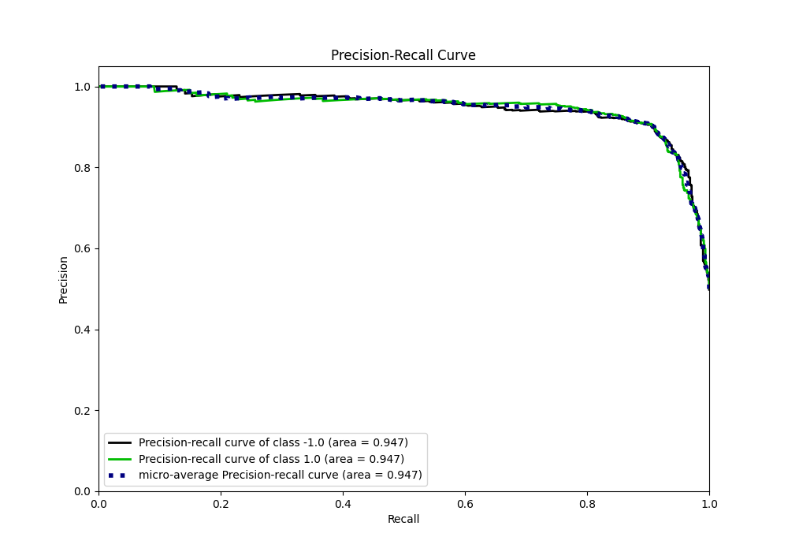
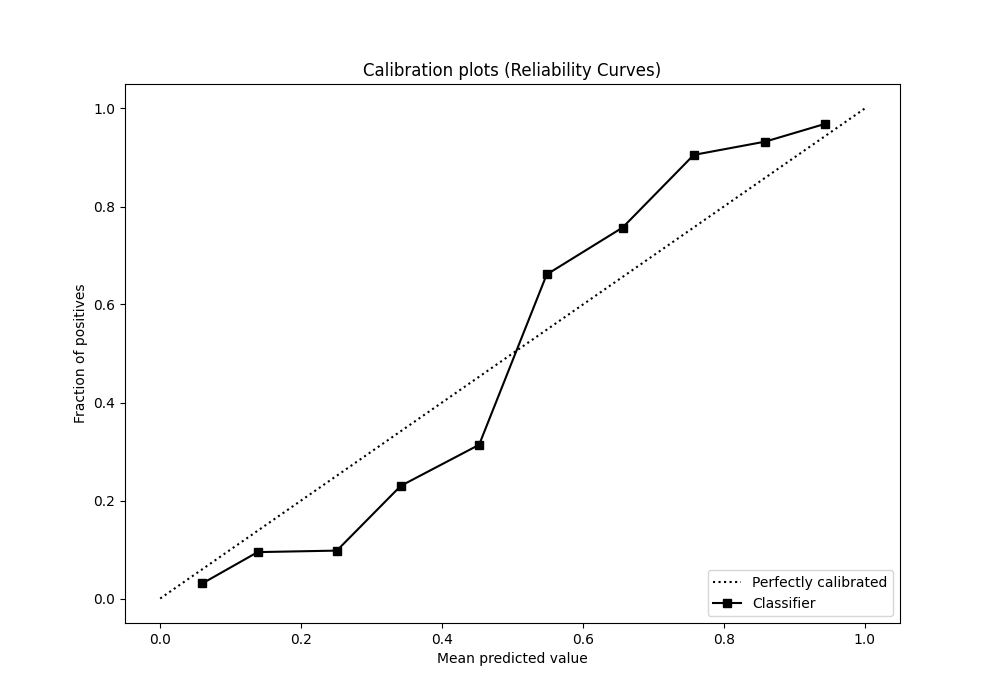
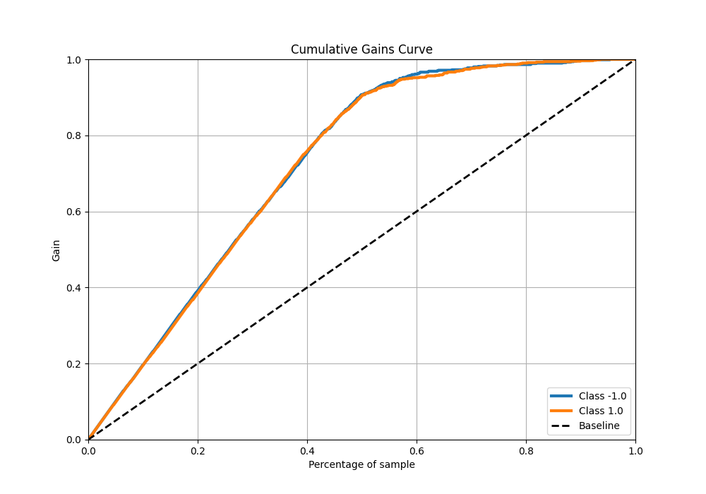
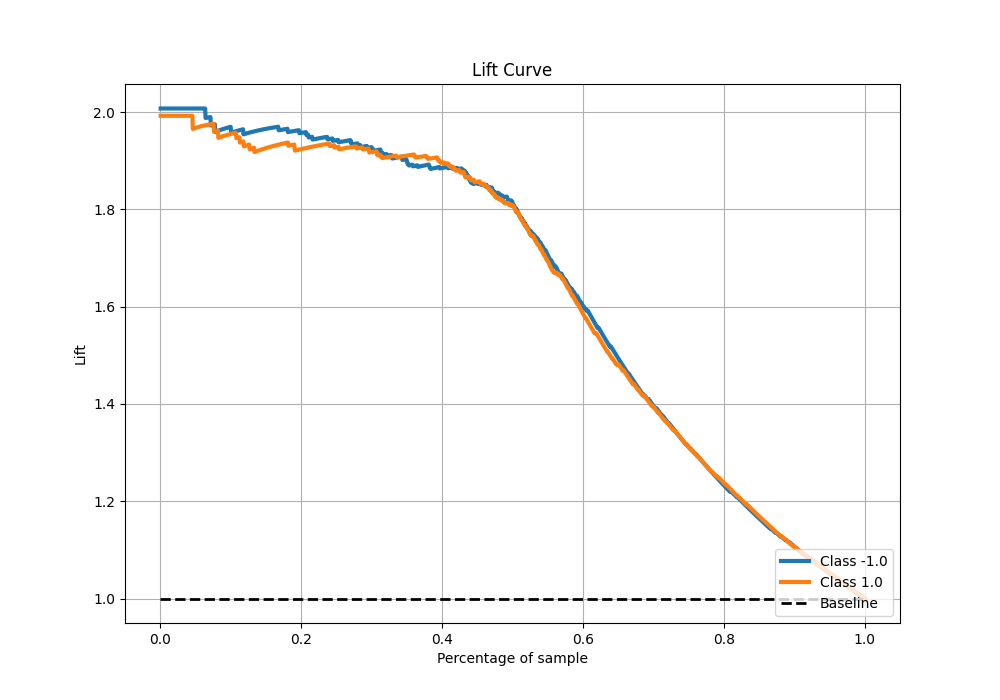

# Summary of 77_CatBoost_Stacked

[<< Go back](../README.md)

## CatBoost
- **n_jobs**: -1
- **learning_rate**: 0.1
- **depth**: 9
- **rsm**: 1.0
- **loss_function**: Logloss
- **eval_metric**: F1
- **explain_level**: 0

## Validation
 - **validation_type**: kfold
 - **shuffle**: True
 - **stratify**: True
 - **k_folds**: 5

## Optimized metric
f1

## Training time

65.6 seconds

## Metric details
|           |    score |   threshold |
|:----------|---------:|------------:|
| logloss   | 0.301728 | nan         |
| auc       | 0.949996 | nan         |
| f1        | 0.905119 |   0.508456  |
| accuracy  | 0.905    |   0.508456  |
| precision | 1        |   0.964527  |
| recall    | 1        |   0.0137546 |
| mcc       | 0.810011 |   0.508456  |

## Metric details with threshold from accuracy metric
|           |    score |   threshold |
|:----------|---------:|------------:|
| logloss   | 0.301728 |  nan        |
| auc       | 0.949996 |  nan        |
| f1        | 0.905119 |    0.508456 |
| accuracy  | 0.905    |    0.508456 |
| precision | 0.907384 |    0.508456 |
| recall    | 0.902864 |    0.508456 |
| mcc       | 0.810011 |    0.508456 |

## Confusion matrix (at threshold=0.508456)
|                 |   Predicted as -1.0 |   Predicted as 1.0 |
|:----------------|--------------------:|-------------------:|
| Labeled as -1.0 |                 723 |                 74 |
| Labeled as 1.0  |                  78 |                725 |

## Learning curves

## Confusion Matrix

## Normalized Confusion Matrix

## ROC Curve

## Kolmogorov-Smirnov Statistic

## Precision-Recall Curve

## Calibration Curve

## Cumulative Gains Curve

## Lift Curve

[<< Go back](../README.md)
