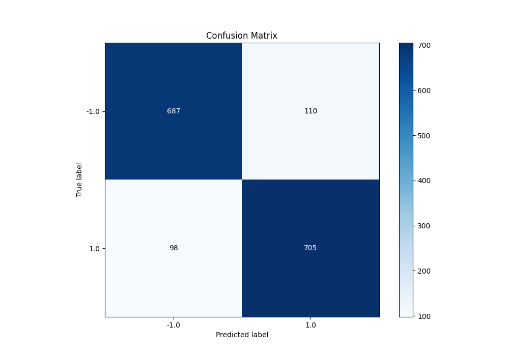
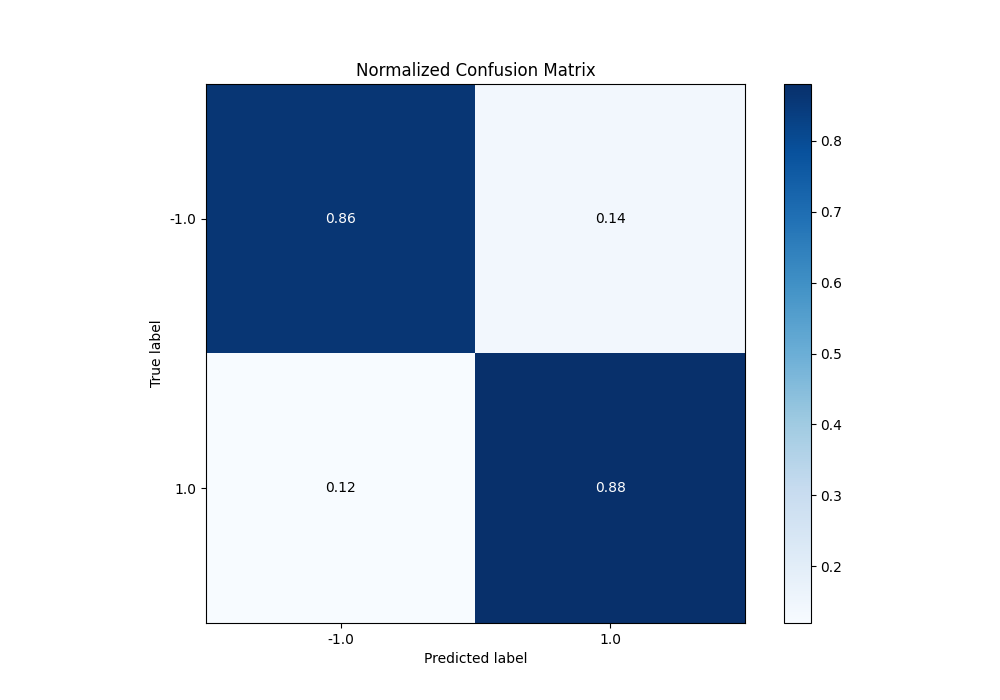

# Summary of 80_CatBoost

[<< Go back](../README.md)

## CatBoost
- **n_jobs**: -1
- **learning_rate**: 0.025
- **depth**: 8
- **rsm**: 0.9
- **loss_function**: Logloss
- **eval_metric**: F1
- **explain_level**: 0

## Validation
 - **validation_type**: kfold
 - **shuffle**: True
 - **stratify**: True
 - **k_folds**: 5

## Optimized metric
f1

## Training time

20.7 seconds

## Metric details
|           |    score |   threshold |
|:----------|---------:|------------:|
| logloss   | 0.490912 |  nan        |
| auc       | 0.921698 |  nan        |
| f1        | 0.871446 |    0.498513 |
| accuracy  | 0.87     |    0.498513 |
| precision | 1        |    0.82281  |
| recall    | 1        |    0.124391 |
| mcc       | 0.740065 |    0.498513 |

## Metric details with threshold from accuracy metric
|           |    score |   threshold |
|:----------|---------:|------------:|
| logloss   | 0.490912 |  nan        |
| auc       | 0.921698 |  nan        |
| f1        | 0.871446 |    0.498513 |
| accuracy  | 0.87     |    0.498513 |
| precision | 0.865031 |    0.498513 |
| recall    | 0.877958 |    0.498513 |
| mcc       | 0.740065 |    0.498513 |

## Confusion matrix (at threshold=0.498513)
|                 |   Predicted as -1.0 |   Predicted as 1.0 |
|:----------------|--------------------:|-------------------:|
| Labeled as -1.0 |                 687 |                110 |
| Labeled as 1.0  |                  98 |                705 |

## Learning curves

## Confusion Matrix

## Normalized Confusion Matrix

## ROC Curve

## Kolmogorov-Smirnov Statistic

## Precision-Recall Curve

## Calibration Curve

## Cumulative Gains Curve

## Lift Curve

[<< Go back](../README.md)
