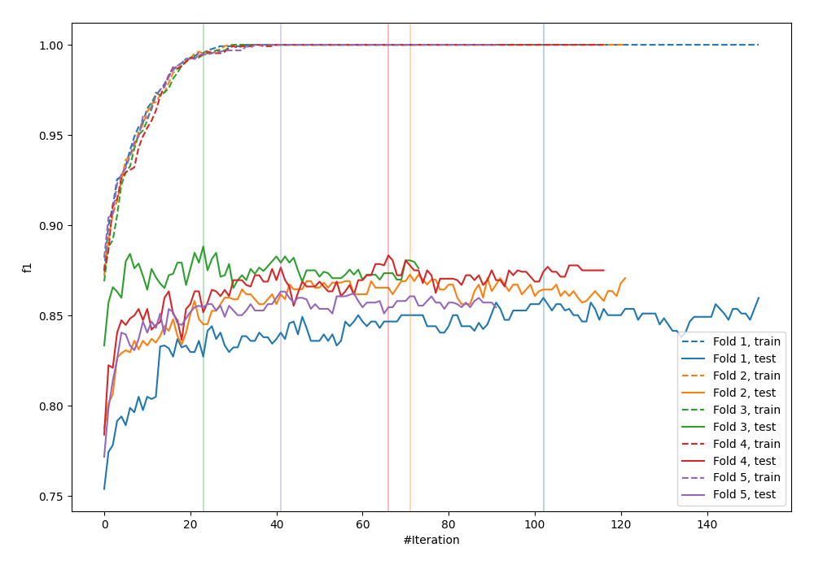
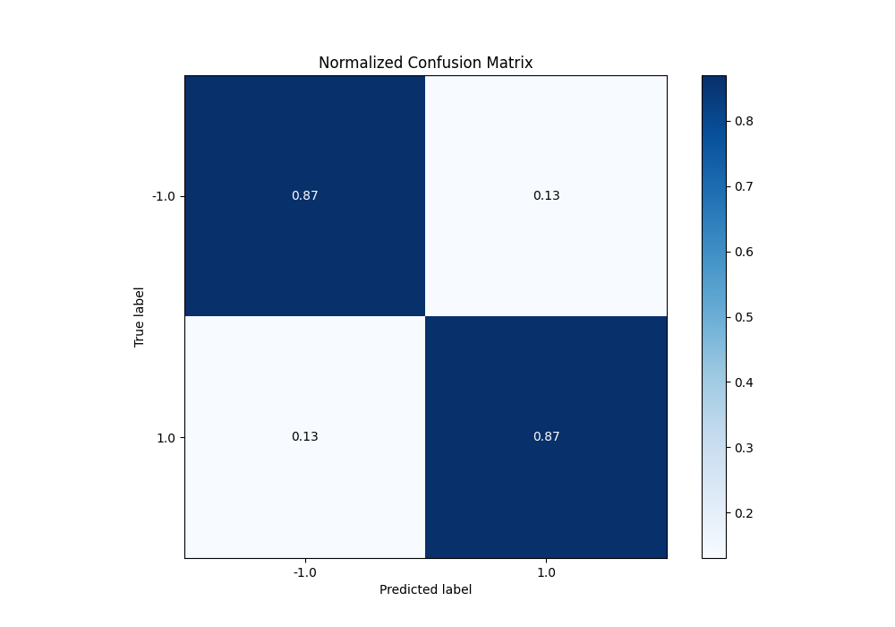
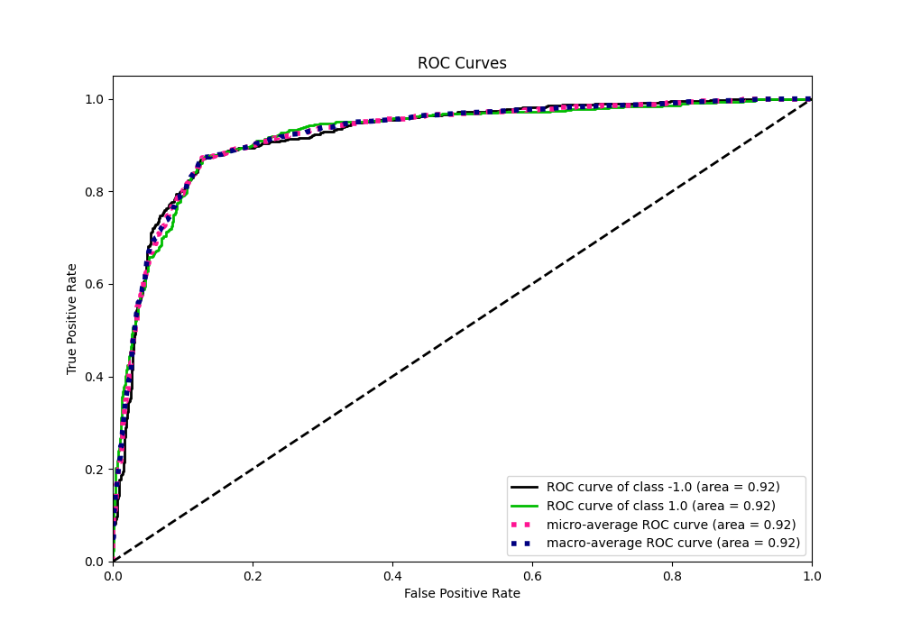
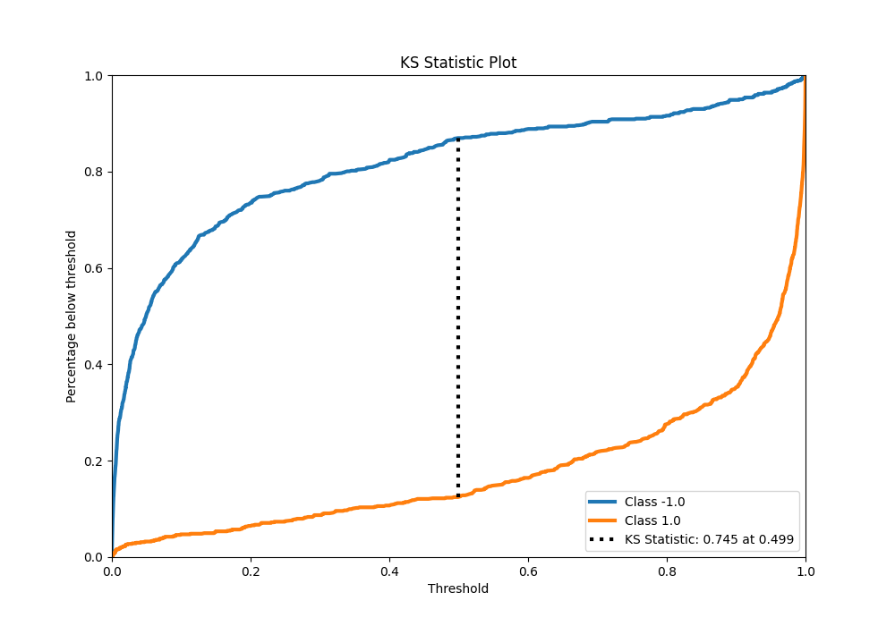
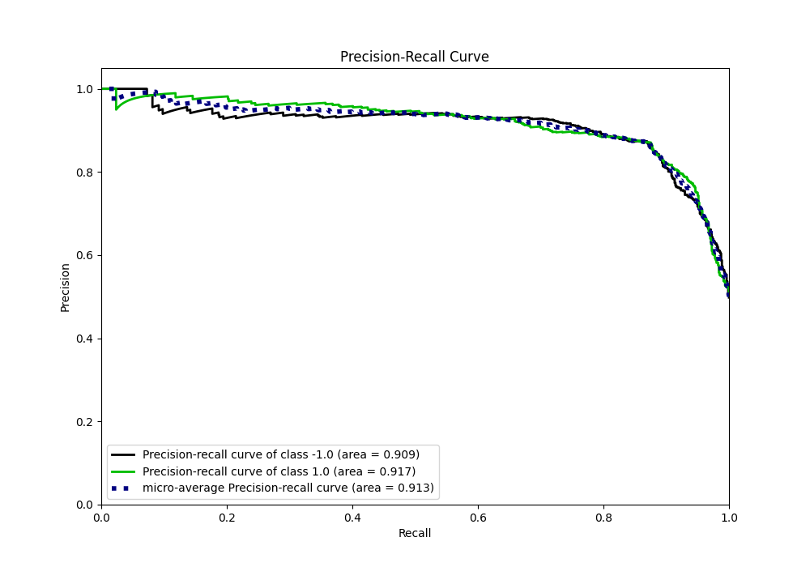
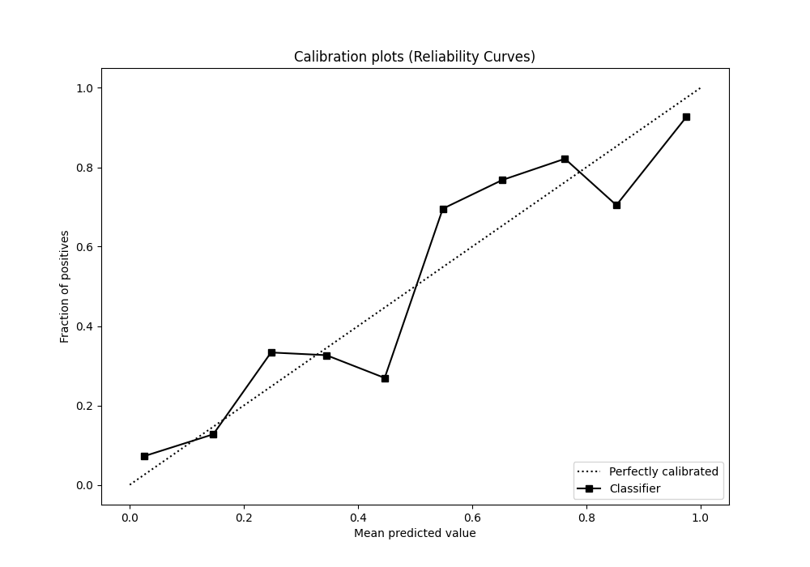
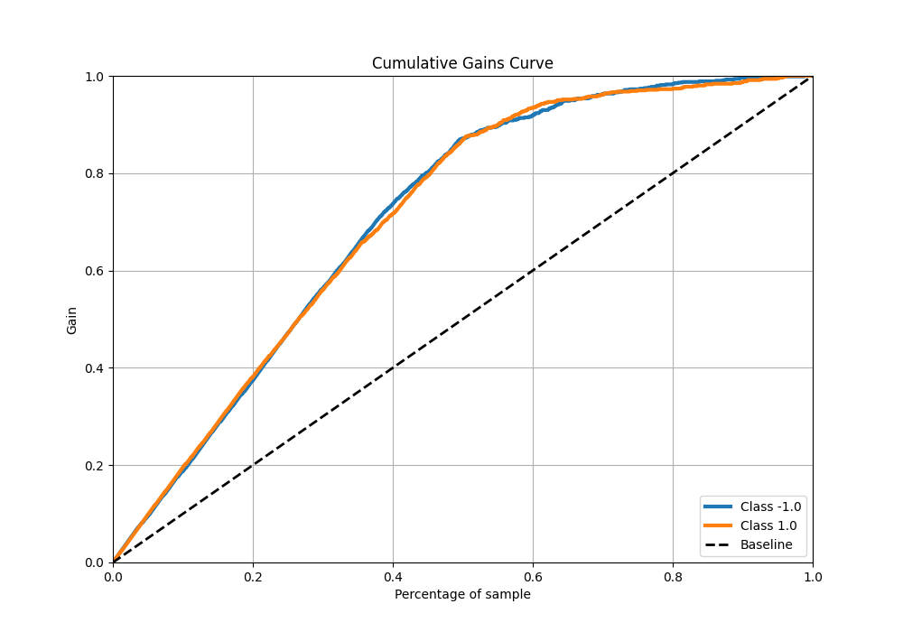
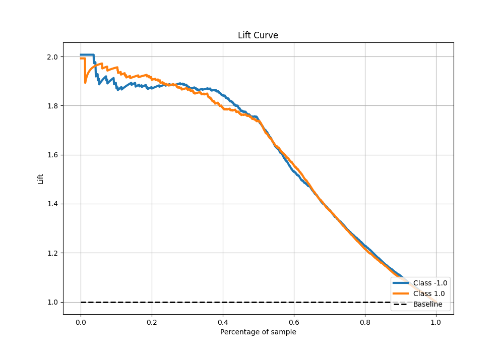

# Summary of 81_LightGBM

[<< Go back](../README.md)

## LightGBM
- **n_jobs**: -1
- **objective**: binary
- **num_leaves**: 31
- **learning_rate**: 0.2
- **feature_fraction**: 1.0
- **bagging_fraction**: 0.9
- **min_data_in_leaf**: 10
- **metric**: custom
- **custom_eval_metric_name**: f1
- **explain_level**: 0

## Validation
 - **validation_type**: kfold
 - **shuffle**: True
 - **stratify**: True
 - **k_folds**: 5

## Optimized metric
f1

## Training time

20.2 seconds

## Metric details
|           |    score |     threshold |
|:----------|---------:|--------------:|
| logloss   | 0.393953 | nan           |
| auc       | 0.920004 | nan           |
| f1        | 0.87021  |   0.481648    |
| accuracy  | 0.87     |   0.519639    |
| precision | 1        |   0.999934    |
| recall    | 1        |   1.74527e-05 |
| mcc       | 0.74001  |   0.519639    |

## Metric details with threshold from accuracy metric
|           |    score |   threshold |
|:----------|---------:|------------:|
| logloss   | 0.393953 |  nan        |
| auc       | 0.920004 |  nan        |
| f1        | 0.870162 |    0.519639 |
| accuracy  | 0.87     |    0.519639 |
| precision | 0.87234  |    0.519639 |
| recall    | 0.867995 |    0.519639 |
| mcc       | 0.74001  |    0.519639 |

## Confusion matrix (at threshold=0.519639)
|                 |   Predicted as -1.0 |   Predicted as 1.0 |
|:----------------|--------------------:|-------------------:|
| Labeled as -1.0 |                 695 |                102 |
| Labeled as 1.0  |                 106 |                697 |

## Learning curves

## Confusion Matrix

## Normalized Confusion Matrix

## ROC Curve

## Kolmogorov-Smirnov Statistic

## Precision-Recall Curve

## Calibration Curve

## Cumulative Gains Curve

## Lift Curve

[<< Go back](../README.md)
