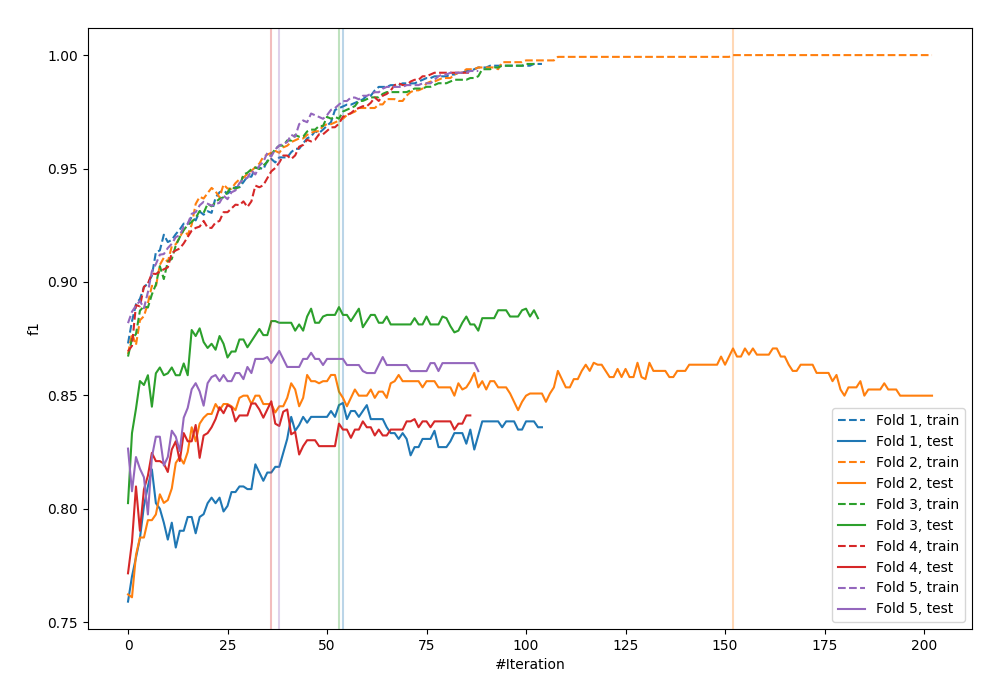
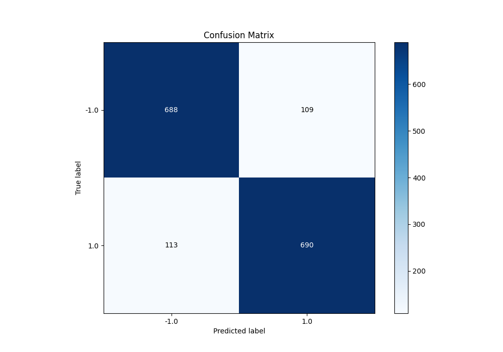
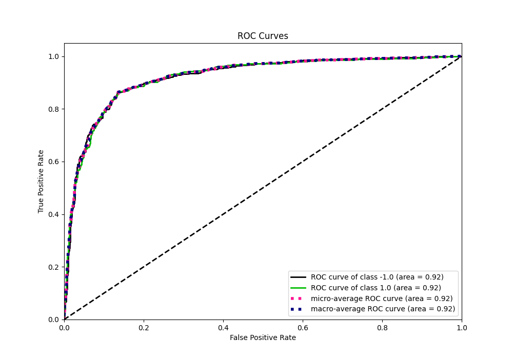
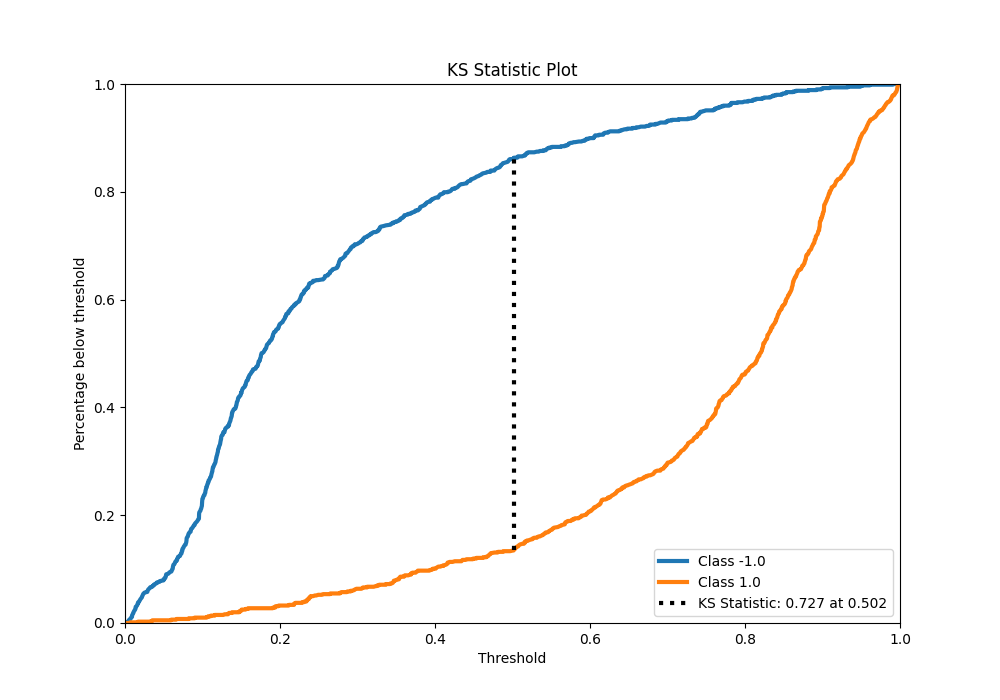
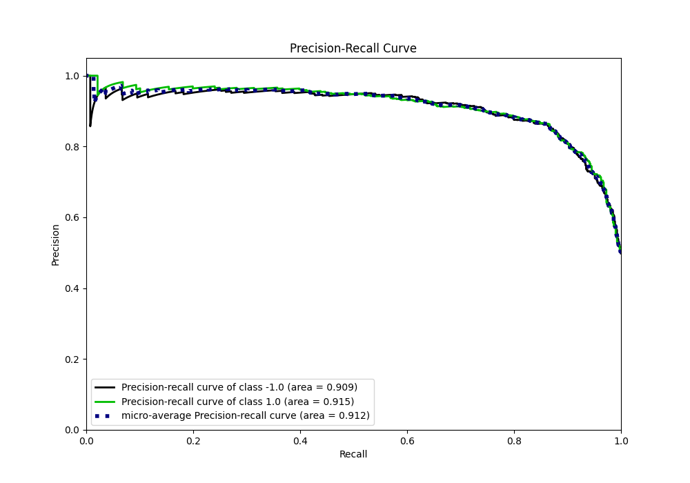
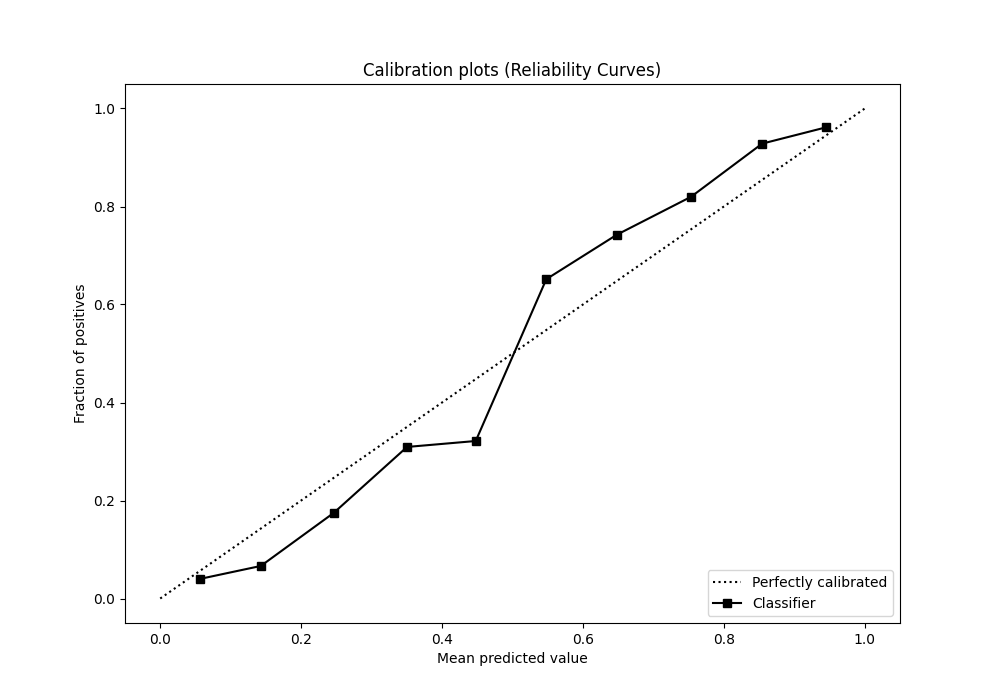
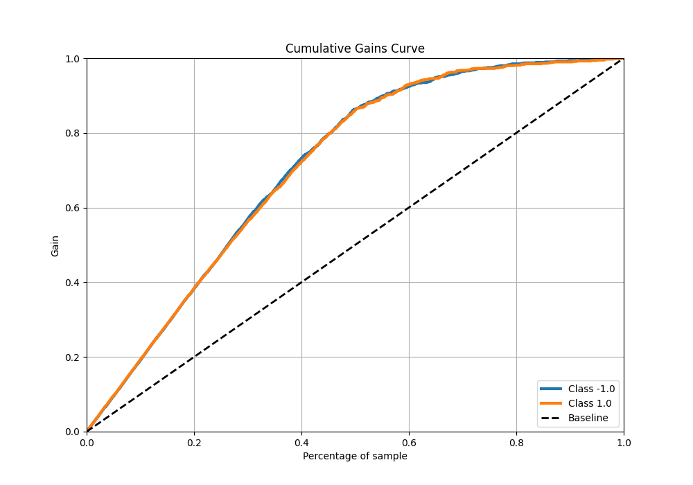
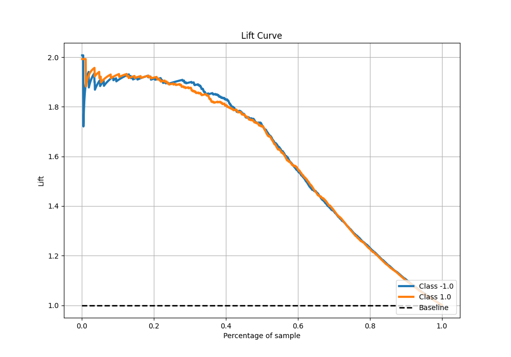

# Summary of 85_LightGBM

[<< Go back](../README.md)

## LightGBM
- **n_jobs**: -1
- **objective**: binary
- **num_leaves**: 31
- **learning_rate**: 0.05
- **feature_fraction**: 0.9
- **bagging_fraction**: 0.9
- **min_data_in_leaf**: 10
- **metric**: custom
- **custom_eval_metric_name**: f1
- **explain_level**: 0

## Validation
 - **validation_type**: kfold
 - **shuffle**: True
 - **stratify**: True
 - **k_folds**: 5

## Optimized metric
f1

## Training time

20.8 seconds

## Metric details
|           |    score |   threshold |
|:----------|---------:|------------:|
| logloss   | 0.374325 | nan         |
| auc       | 0.920058 | nan         |
| f1        | 0.861557 |   0.487419  |
| accuracy  | 0.86125  |   0.505474  |
| precision | 1        |   0.993523  |
| recall    | 1        |   0.0031575 |
| mcc       | 0.72251  |   0.505474  |

## Metric details with threshold from accuracy metric
|           |    score |   threshold |
|:----------|---------:|------------:|
| logloss   | 0.374325 |  nan        |
| auc       | 0.920058 |  nan        |
| f1        | 0.861423 |    0.505474 |
| accuracy  | 0.86125  |    0.505474 |
| precision | 0.863579 |    0.505474 |
| recall    | 0.859278 |    0.505474 |
| mcc       | 0.72251  |    0.505474 |

## Confusion matrix (at threshold=0.505474)
|                 |   Predicted as -1.0 |   Predicted as 1.0 |
|:----------------|--------------------:|-------------------:|
| Labeled as -1.0 |                 688 |                109 |
| Labeled as 1.0  |                 113 |                690 |

## Learning curves

## Confusion Matrix

## Normalized Confusion Matrix

## ROC Curve

## Kolmogorov-Smirnov Statistic

## Precision-Recall Curve

## Calibration Curve

## Cumulative Gains Curve

## Lift Curve

[<< Go back](../README.md)
