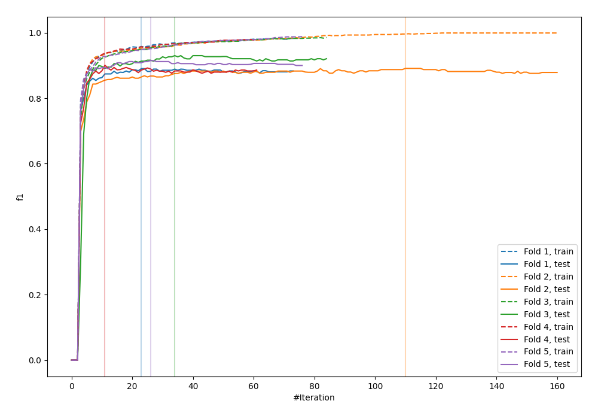
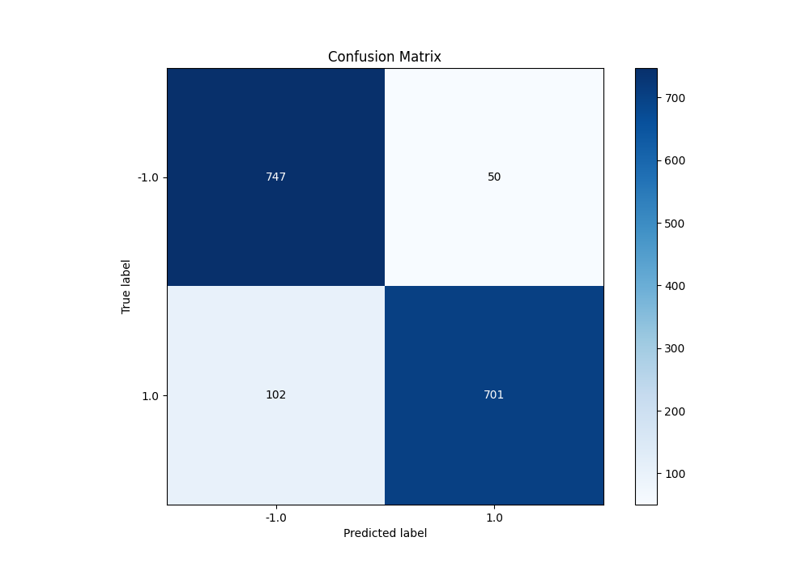
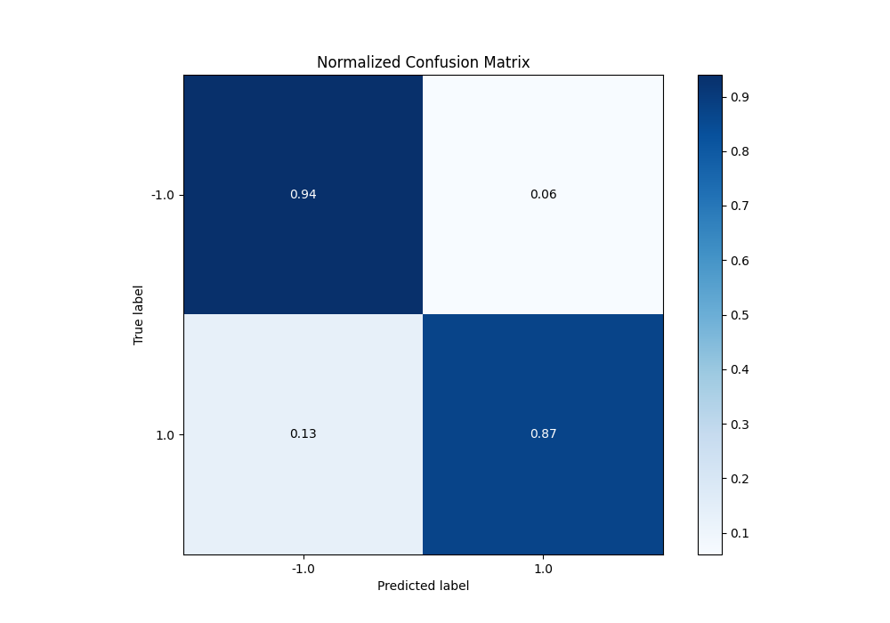
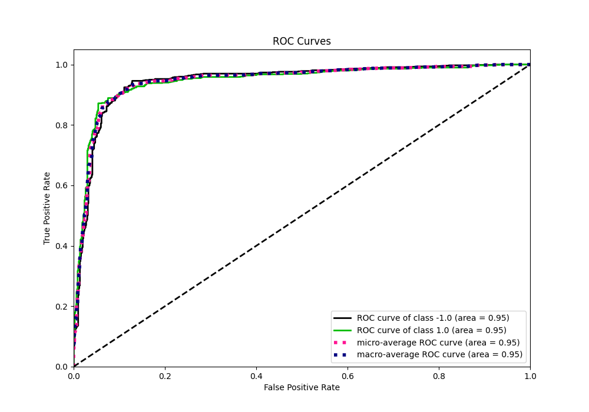
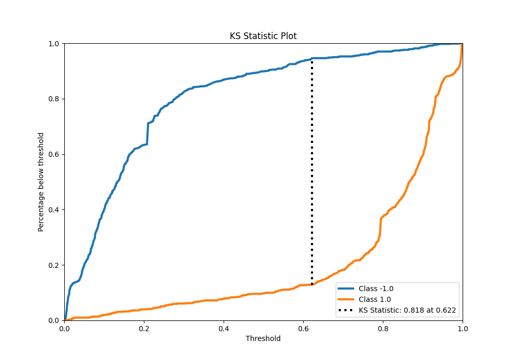
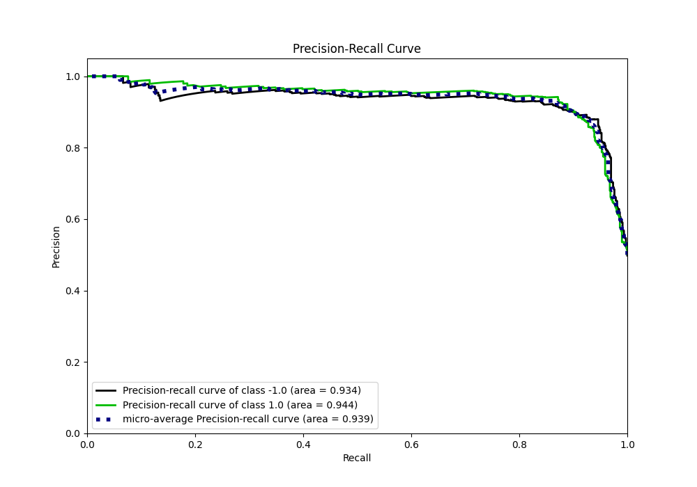
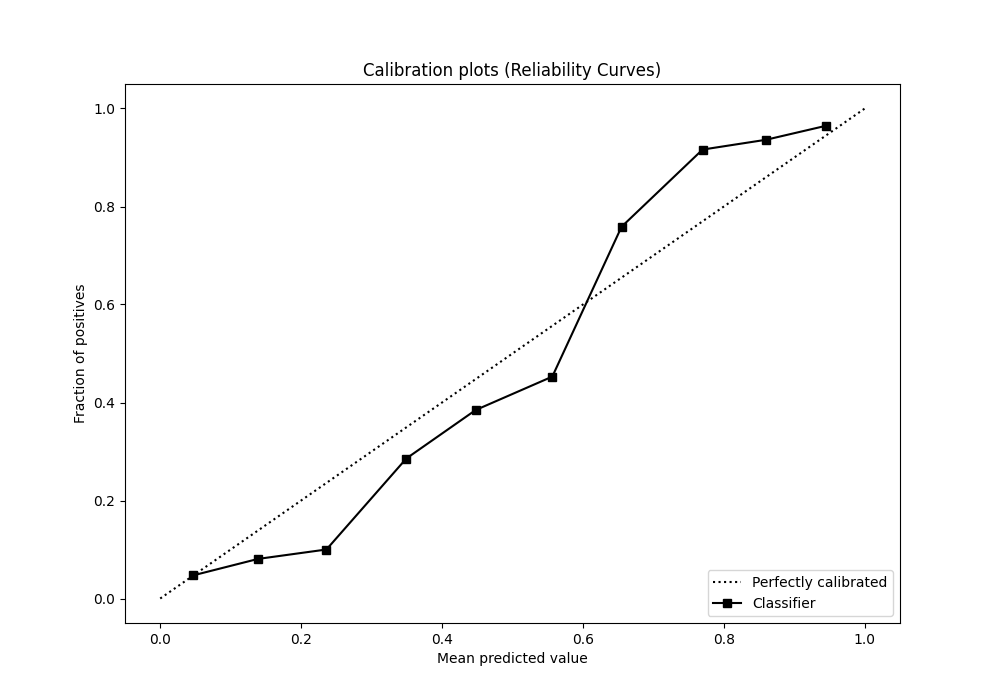
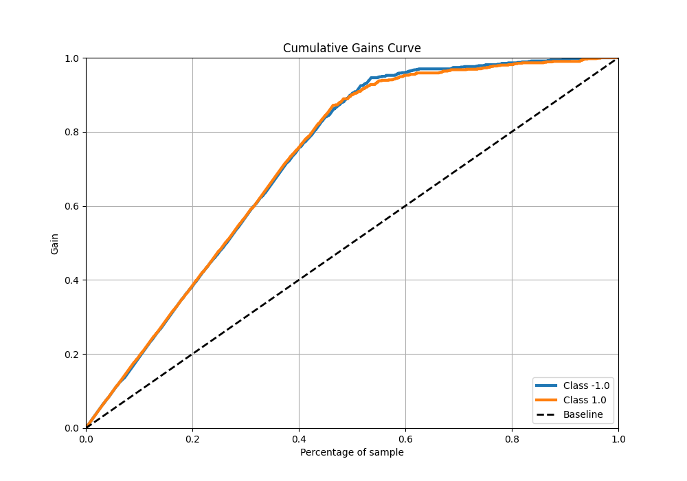
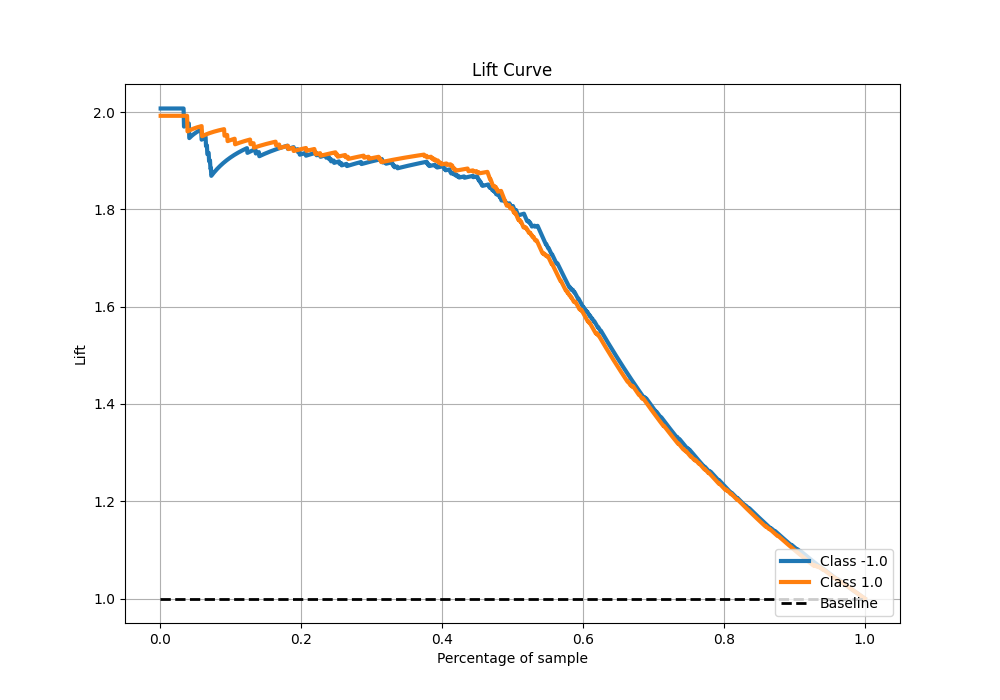

# Summary of 87_Xgboost_Stacked

[<< Go back](../README.md)

## Extreme Gradient Boosting (Xgboost)
- **n_jobs**: -1
- **objective**: binary:logistic
- **eta**: 0.075
- **max_depth**: 8
- **min_child_weight**: 1
- **subsample**: 0.6
- **colsample_bytree**: 0.5
- **eval_metric**: f1
- **explain_level**: 0

## Validation
 - **validation_type**: kfold
 - **shuffle**: True
 - **stratify**: True
 - **k_folds**: 5

## Optimized metric
f1

## Training time

27.5 seconds

## Metric details
|           |    score |    threshold |
|:----------|---------:|-------------:|
| logloss   | 0.302178 | nan          |
| auc       | 0.945397 | nan          |
| f1        | 0.902622 |   0.524831   |
| accuracy  | 0.905    |   0.604101   |
| precision | 1        |   0.995614   |
| recall    | 1        |   0.00174285 |
| mcc       | 0.811759 |   0.604101   |

## Metric details with threshold from accuracy metric
|           |    score |   threshold |
|:----------|---------:|------------:|
| logloss   | 0.302178 |  nan        |
| auc       | 0.945397 |  nan        |
| f1        | 0.902188 |    0.604101 |
| accuracy  | 0.905    |    0.604101 |
| precision | 0.933422 |    0.604101 |
| recall    | 0.872976 |    0.604101 |
| mcc       | 0.811759 |    0.604101 |

## Confusion matrix (at threshold=0.604101)
|                 |   Predicted as -1.0 |   Predicted as 1.0 |
|:----------------|--------------------:|-------------------:|
| Labeled as -1.0 |                 747 |                 50 |
| Labeled as 1.0  |                 102 |                701 |

## Learning curves

## Confusion Matrix

## Normalized Confusion Matrix

## ROC Curve

## Kolmogorov-Smirnov Statistic

## Precision-Recall Curve

## Calibration Curve

## Cumulative Gains Curve

## Lift Curve

[<< Go back](../README.md)
