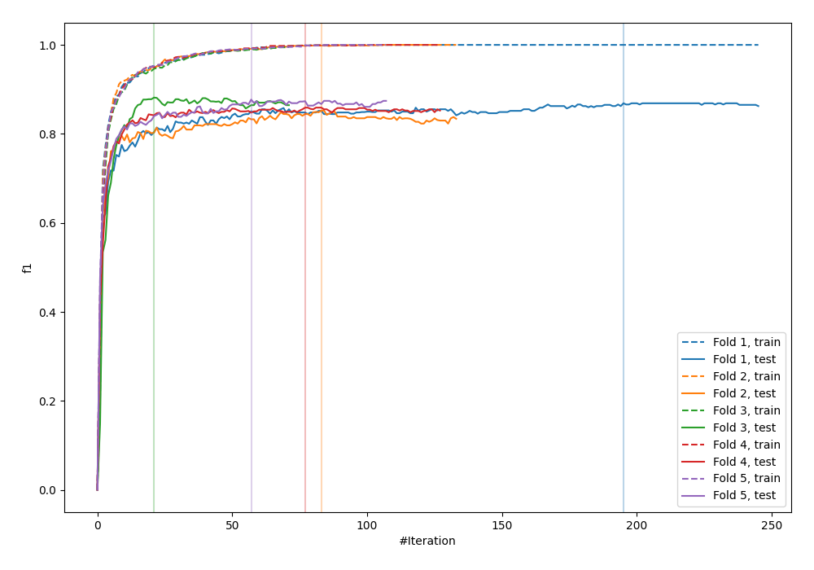
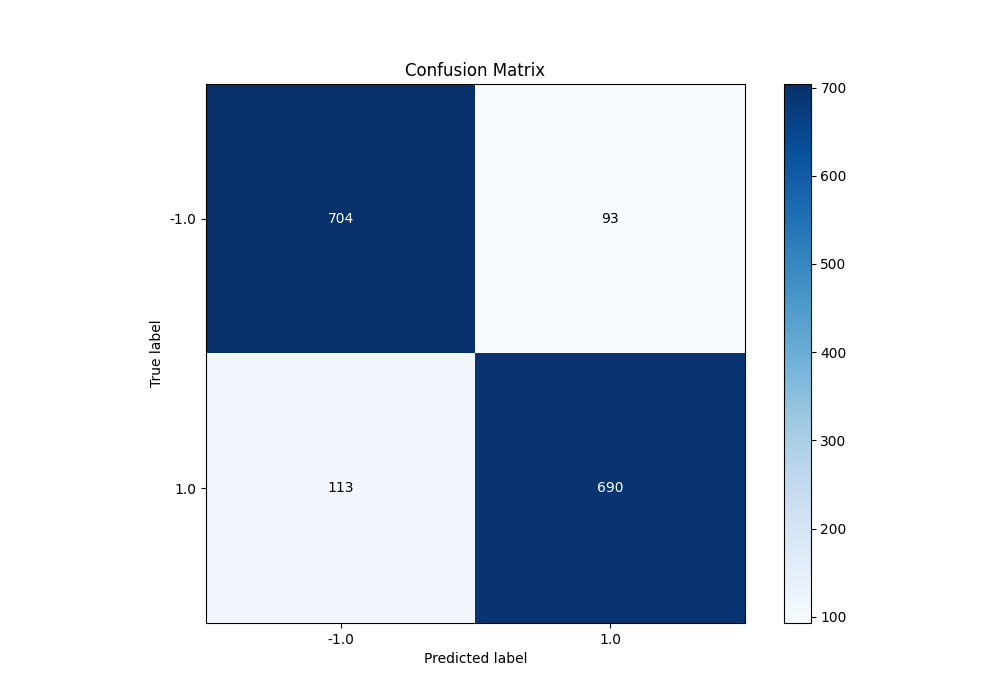
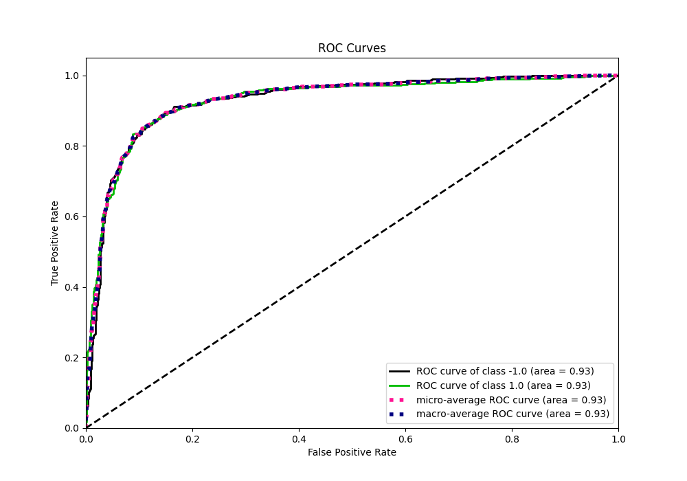
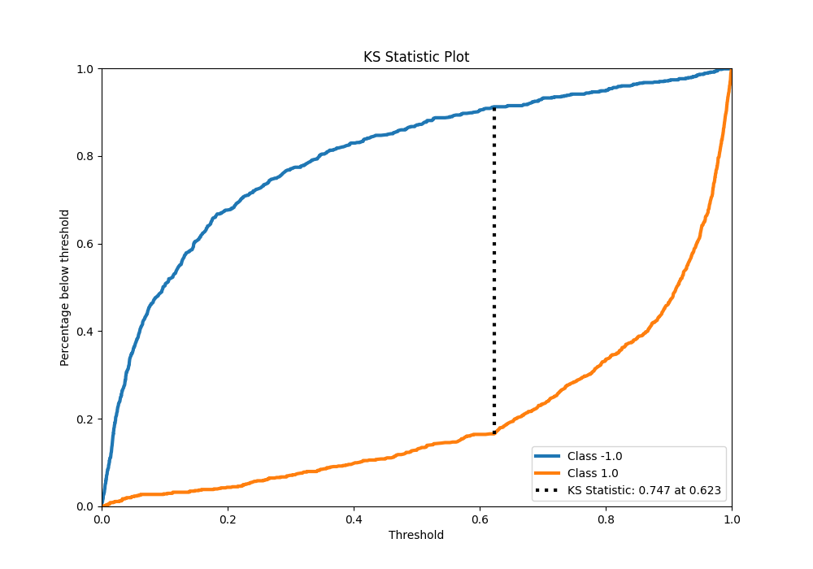
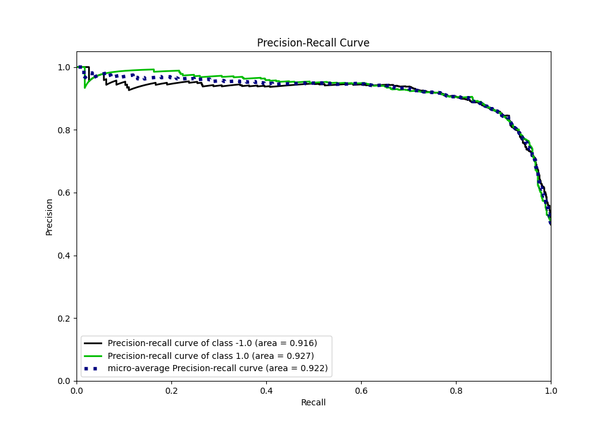
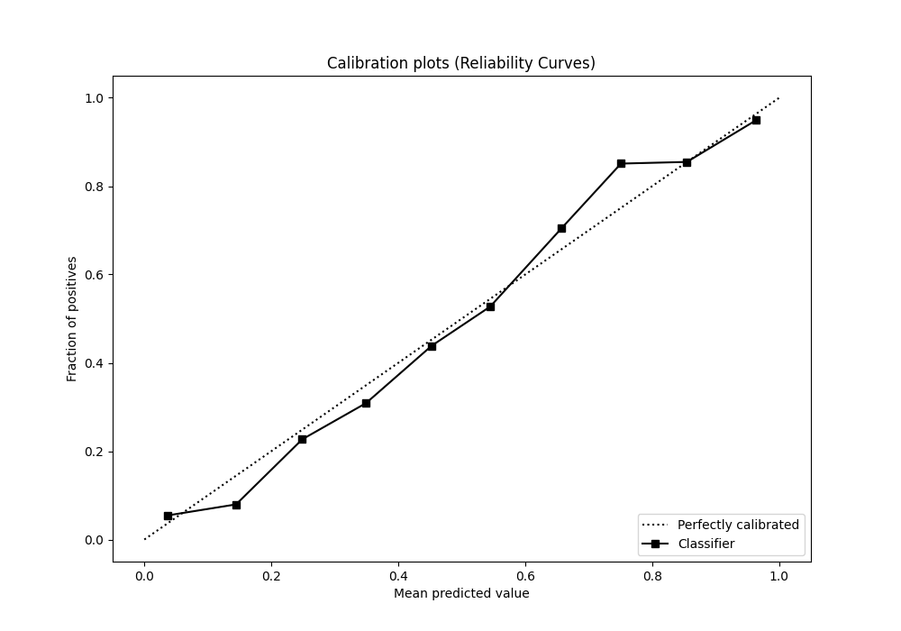
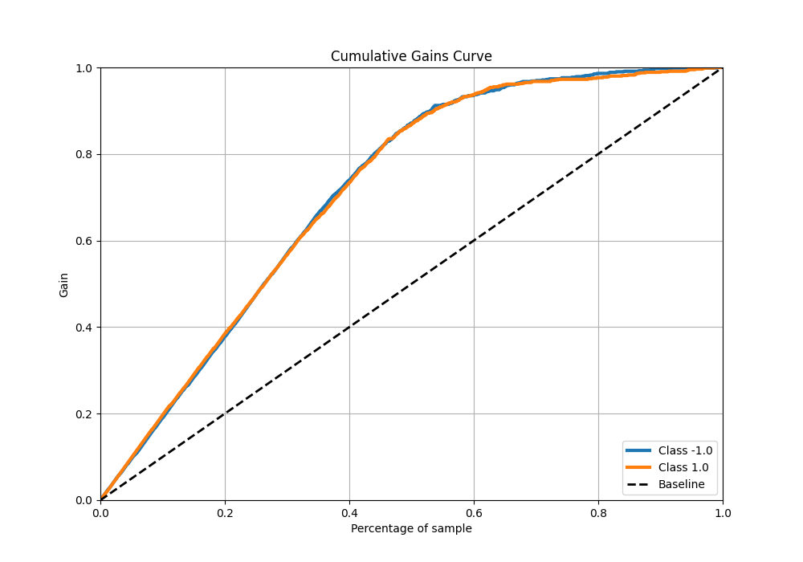
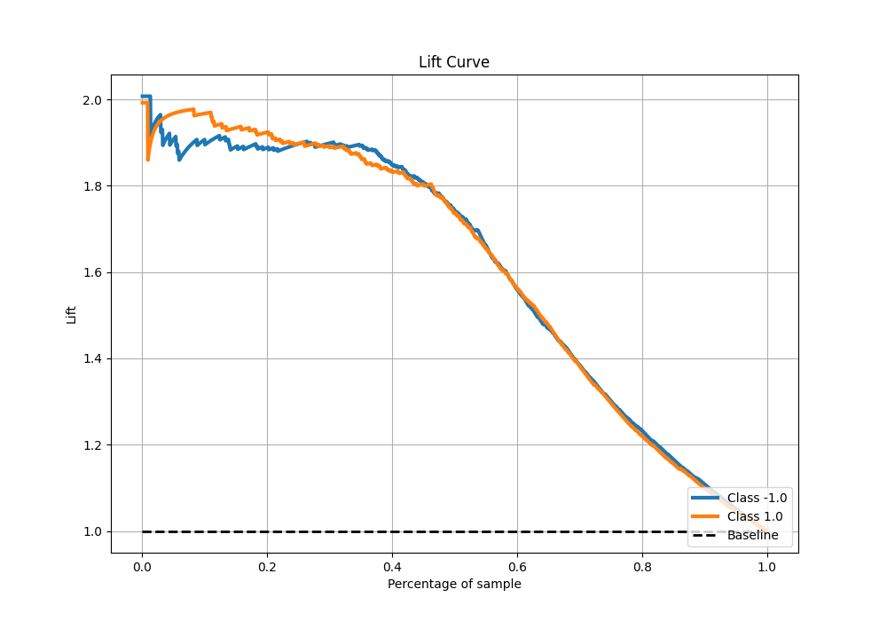

# Summary of 88_Xgboost

[<< Go back](../README.md)

## Extreme Gradient Boosting (Xgboost)
- **n_jobs**: -1
- **objective**: binary:logistic
- **eta**: 0.15
- **max_depth**: 8
- **min_child_weight**: 1
- **subsample**: 0.6
- **colsample_bytree**: 0.5
- **eval_metric**: f1
- **explain_level**: 0

## Validation
 - **validation_type**: kfold
 - **shuffle**: True
 - **stratify**: True
 - **k_folds**: 5

## Optimized metric
f1

## Training time

24.6 seconds

## Metric details
|           |    score |     threshold |
|:----------|---------:|--------------:|
| logloss   | 0.340645 | nan           |
| auc       | 0.929105 | nan           |
| f1        | 0.872705 |   0.463067    |
| accuracy  | 0.87125  |   0.526097    |
| precision | 0.992126 |   0.985371    |
| recall    | 1        |   9.09987e-05 |
| mcc       | 0.743293 |   0.568971    |

## Metric details with threshold from accuracy metric
|           |    score |   threshold |
|:----------|---------:|------------:|
| logloss   | 0.340645 |  nan        |
| auc       | 0.929105 |  nan        |
| f1        | 0.870113 |    0.526097 |
| accuracy  | 0.87125  |    0.526097 |
| precision | 0.881226 |    0.526097 |
| recall    | 0.859278 |    0.526097 |
| mcc       | 0.742753 |    0.526097 |

## Confusion matrix (at threshold=0.526097)
|                 |   Predicted as -1.0 |   Predicted as 1.0 |
|:----------------|--------------------:|-------------------:|
| Labeled as -1.0 |                 704 |                 93 |
| Labeled as 1.0  |                 113 |                690 |

## Learning curves

## Confusion Matrix

## Normalized Confusion Matrix

## ROC Curve

## Kolmogorov-Smirnov Statistic

## Precision-Recall Curve

## Calibration Curve

## Cumulative Gains Curve

## Lift Curve

[<< Go back](../README.md)
