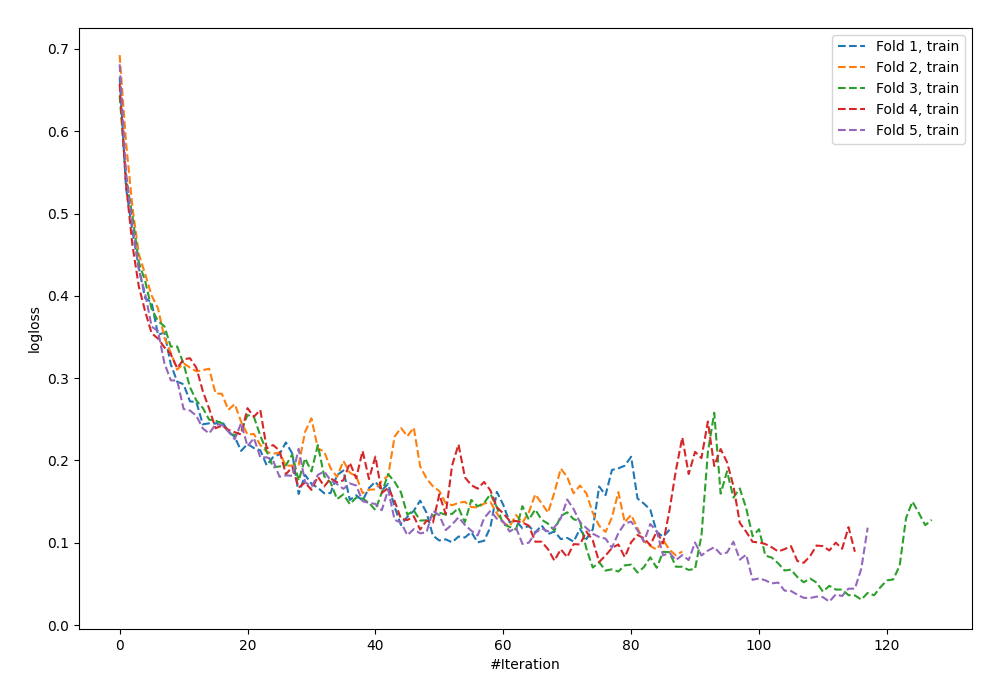
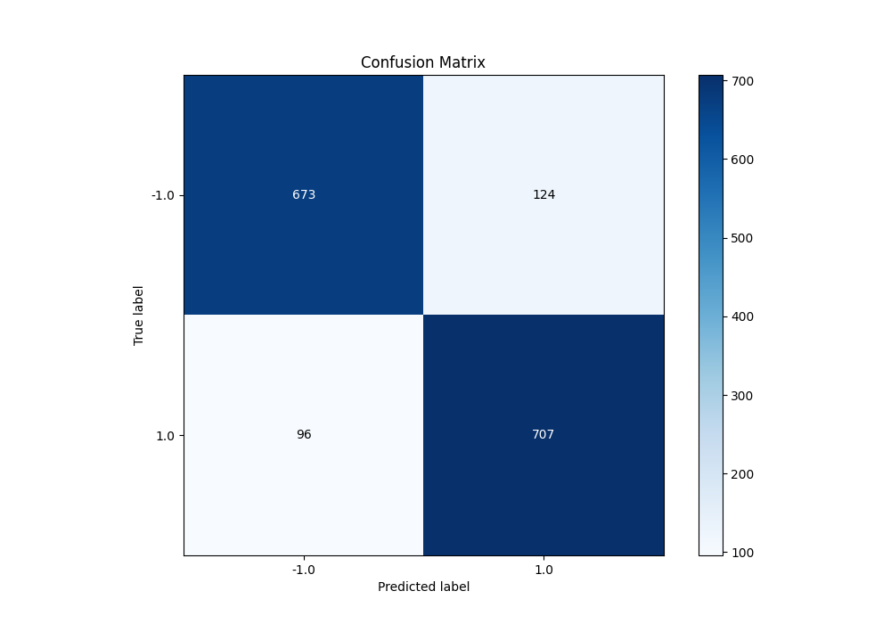
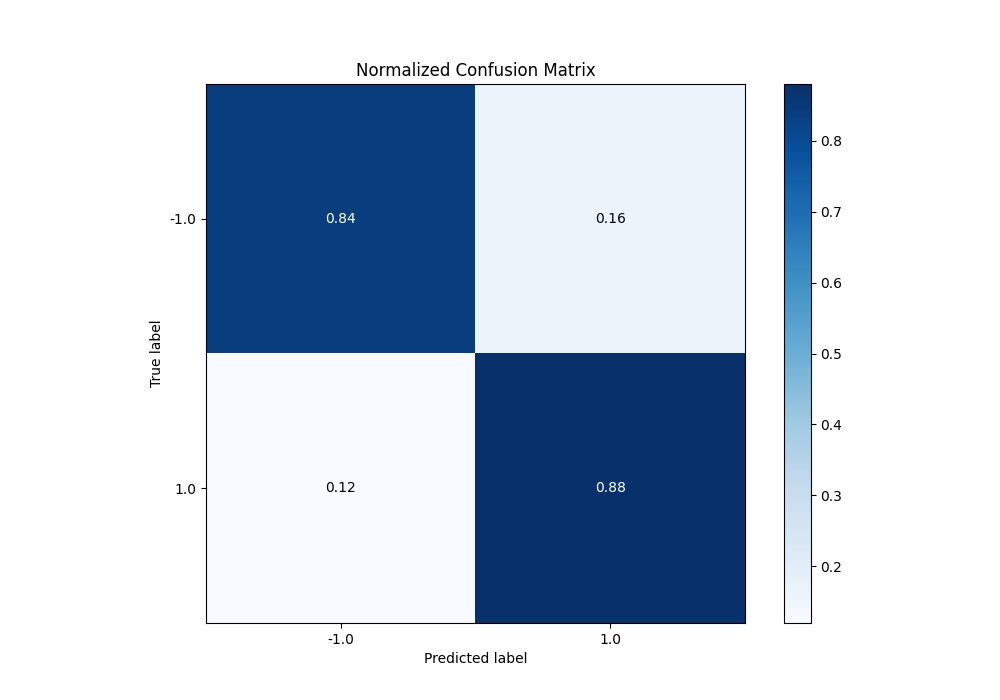
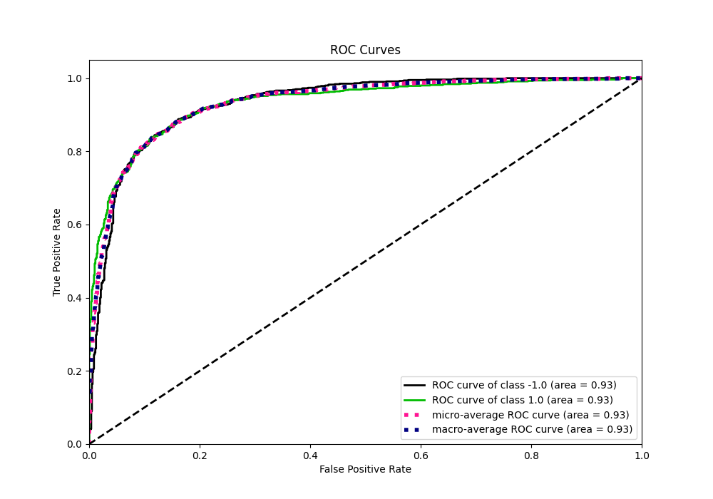
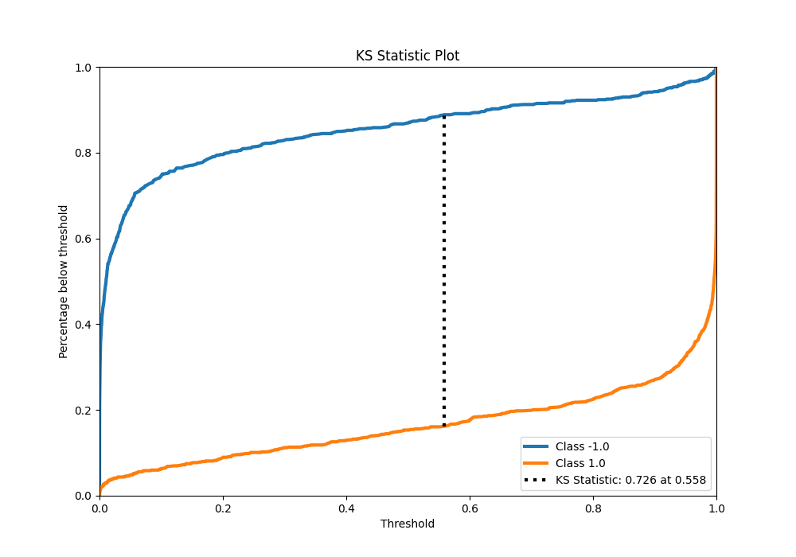
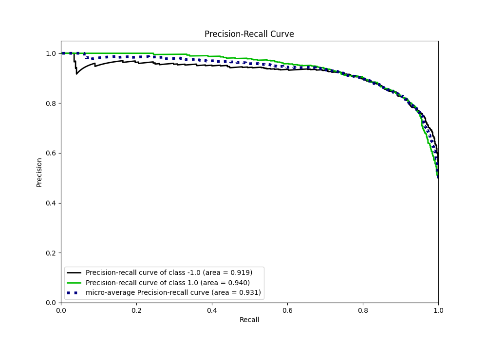
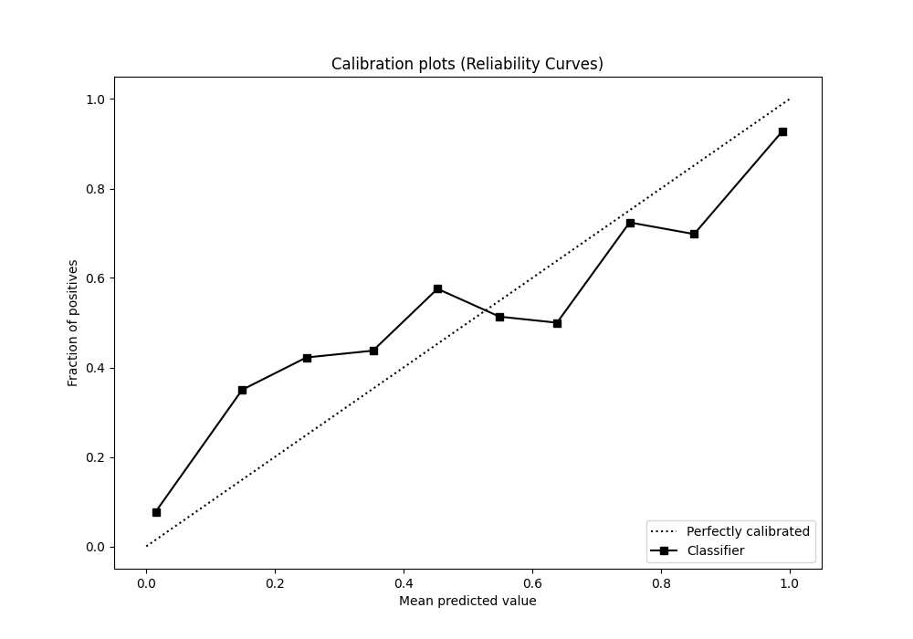
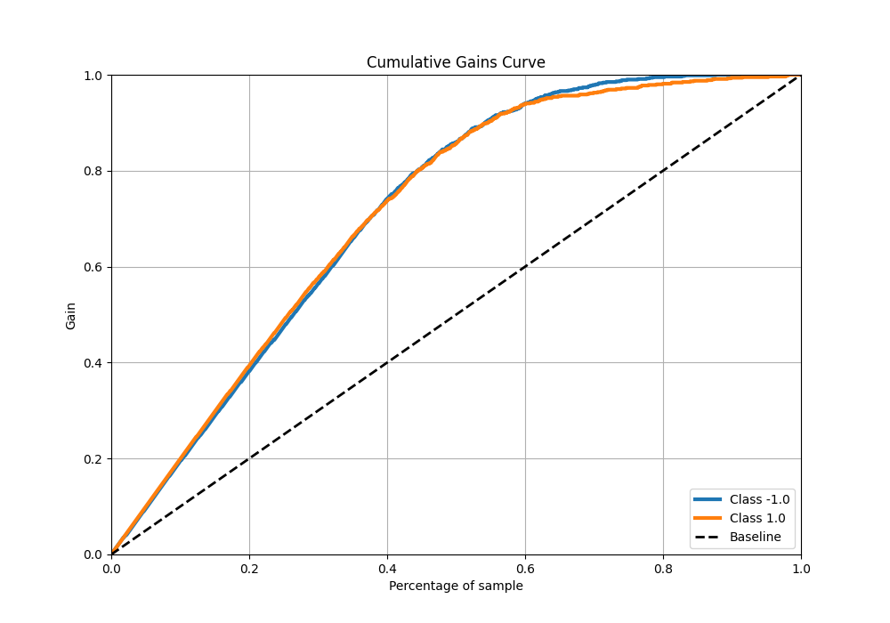
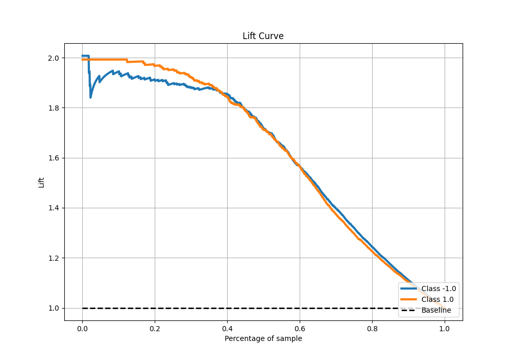

# Summary of 8_Default_NeuralNetwork

[<< Go back](../README.md)

## Neural Network
- **n_jobs**: -1
- **dense_1_size**: 32
- **dense_2_size**: 16
- **learning_rate**: 0.05
- **explain_level**: 0

## Validation
 - **validation_type**: kfold
 - **shuffle**: True
 - **stratify**: True
 - **k_folds**: 5

## Optimized metric
f1

## Training time

10.1 seconds

## Metric details
|           |    score |    threshold |
|:----------|---------:|-------------:|
| logloss   | 0.447354 | nan          |
| auc       | 0.932809 | nan          |
| f1        | 0.865546 |   0.273053   |
| accuracy  | 0.8625   |   0.36738    |
| precision | 1        |   0.999989   |
| recall    | 1        |   7.8944e-13 |
| mcc       | 0.725405 |   0.36738    |

## Metric details with threshold from accuracy metric
|           |    score |   threshold |
|:----------|---------:|------------:|
| logloss   | 0.447354 |   nan       |
| auc       | 0.932809 |   nan       |
| f1        | 0.865361 |     0.36738 |
| accuracy  | 0.8625   |     0.36738 |
| precision | 0.850782 |     0.36738 |
| recall    | 0.880448 |     0.36738 |
| mcc       | 0.725405 |     0.36738 |

## Confusion matrix (at threshold=0.36738)
|                 |   Predicted as -1.0 |   Predicted as 1.0 |
|:----------------|--------------------:|-------------------:|
| Labeled as -1.0 |                 673 |                124 |
| Labeled as 1.0  |                  96 |                707 |

## Learning curves

## Confusion Matrix

## Normalized Confusion Matrix

## ROC Curve

## Kolmogorov-Smirnov Statistic

## Precision-Recall Curve

## Calibration Curve

## Cumulative Gains Curve

## Lift Curve

[<< Go back](../README.md)
