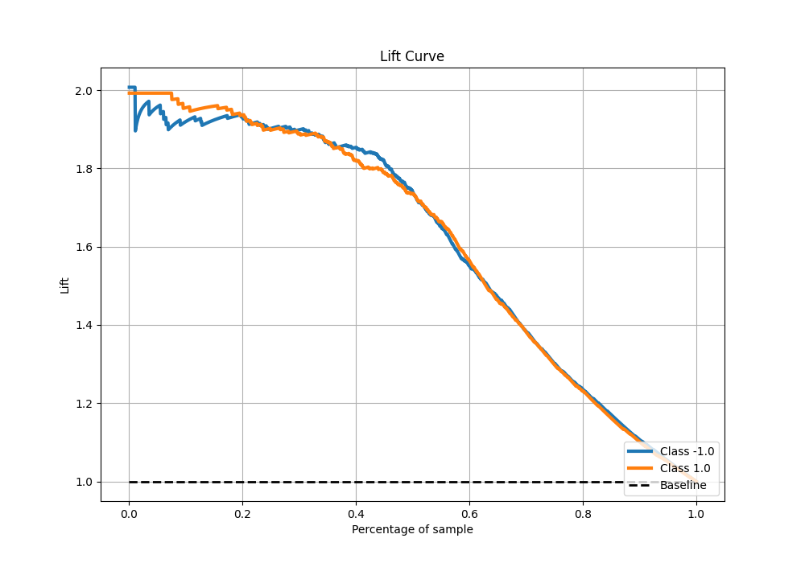

# Summary of 90_NeuralNetwork

[<< Go back](../README.md)

## Neural Network
- **n_jobs**: -1
- **dense_1_size**: 16
- **dense_2_size**: 32
- **learning_rate**: 0.05
- **explain_level**: 0

## Validation
 - **validation_type**: kfold
 - **shuffle**: True
 - **stratify**: True
 - **k_folds**: 5

## Optimized metric
f1

## Training time

17.0 seconds

## Metric details
|           |    score |     threshold |
|:----------|---------:|--------------:|
| logloss   | 0.449086 | nan           |
| auc       | 0.930177 | nan           |
| f1        | 0.872771 |   0.211922    |
| accuracy  | 0.86875  |   0.441446    |
| precision | 1        |   0.999996    |
| recall    | 1        |   3.54238e-27 |
| mcc       | 0.73751  |   0.441446    |

## Metric details with threshold from accuracy metric
|           |    score |   threshold |
|:----------|---------:|------------:|
| logloss   | 0.449086 |  nan        |
| auc       | 0.930177 |  nan        |
| f1        | 0.868914 |    0.441446 |
| accuracy  | 0.86875  |    0.441446 |
| precision | 0.871089 |    0.441446 |
| recall    | 0.86675  |    0.441446 |
| mcc       | 0.73751  |    0.441446 |

## Confusion matrix (at threshold=0.441446)
|                 |   Predicted as -1.0 |   Predicted as 1.0 |
|:----------------|--------------------:|-------------------:|
| Labeled as -1.0 |                 694 |                103 |
| Labeled as 1.0  |                 107 |                696 |

## Learning curves

## Confusion Matrix

## Normalized Confusion Matrix

## ROC Curve

## Kolmogorov-Smirnov Statistic

## Precision-Recall Curve

## Calibration Curve

## Cumulative Gains Curve

## Lift Curve

[<< Go back](../README.md)
