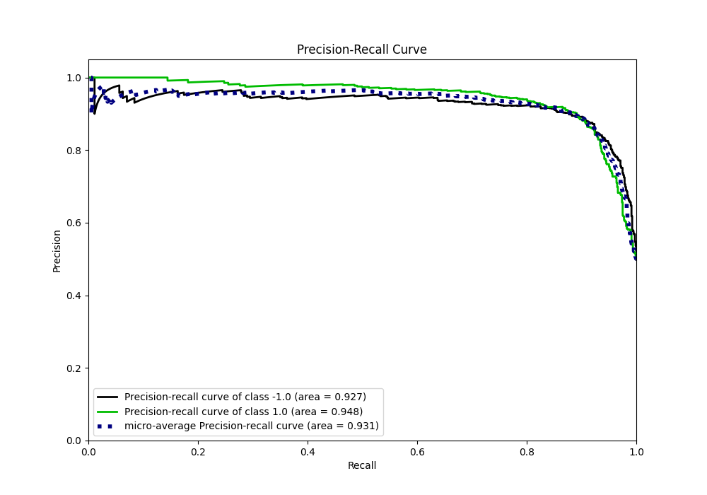

# Summary of 90_NeuralNetwork_Stacked

[<< Go back](../README.md)

## Neural Network
- **n_jobs**: -1
- **dense_1_size**: 16
- **dense_2_size**: 32
- **learning_rate**: 0.05
- **explain_level**: 0

## Validation
 - **validation_type**: kfold
 - **shuffle**: True
 - **stratify**: True
 - **k_folds**: 5

## Optimized metric
f1

## Training time

21.8 seconds

## Metric details
|           |    score |     threshold |
|:----------|---------:|--------------:|
| logloss   | 0.328043 | nan           |
| auc       | 0.943496 | nan           |
| f1        | 0.893883 |   0.521272    |
| accuracy  | 0.89375  |   0.521272    |
| precision | 1        |   0.980422    |
| recall    | 1        |   7.81042e-16 |
| mcc       | 0.787763 |   0.605118    |

## Metric details with threshold from accuracy metric
|           |    score |   threshold |
|:----------|---------:|------------:|
| logloss   | 0.328043 |  nan        |
| auc       | 0.943496 |  nan        |
| f1        | 0.893883 |    0.521272 |
| accuracy  | 0.89375  |    0.521272 |
| precision | 0.89612  |    0.521272 |
| recall    | 0.891656 |    0.521272 |
| mcc       | 0.787511 |    0.521272 |

## Confusion matrix (at threshold=0.521272)
|                 |   Predicted as -1.0 |   Predicted as 1.0 |
|:----------------|--------------------:|-------------------:|
| Labeled as -1.0 |                 714 |                 83 |
| Labeled as 1.0  |                  87 |                716 |

## Learning curves

## Confusion Matrix

## Normalized Confusion Matrix

## ROC Curve

## Kolmogorov-Smirnov Statistic

## Precision-Recall Curve

## Calibration Curve

## Cumulative Gains Curve

## Lift Curve

[<< Go back](../README.md)
