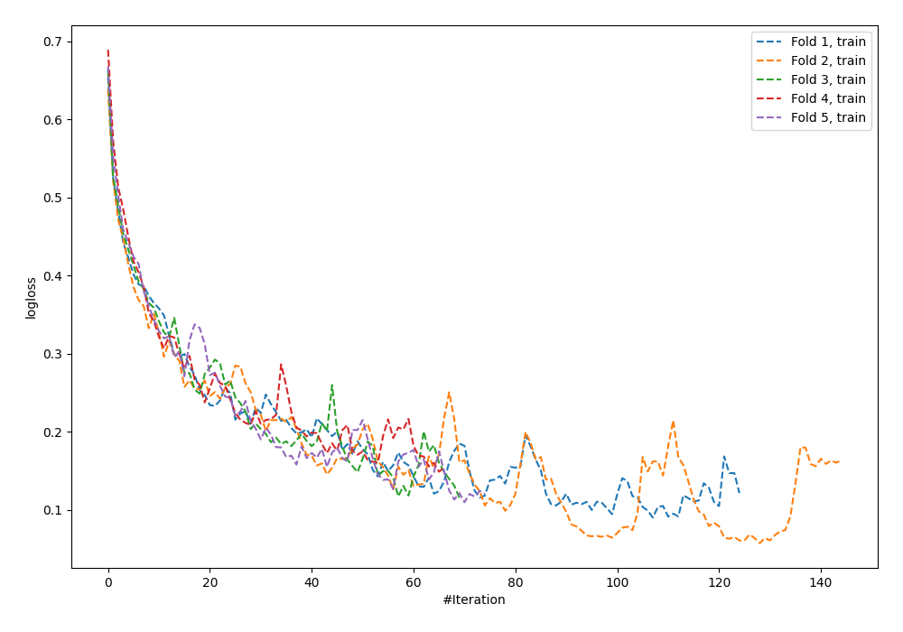
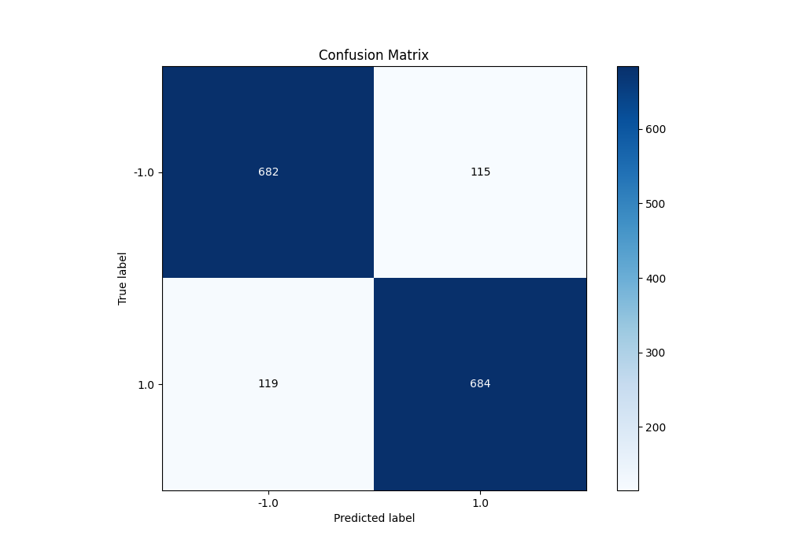
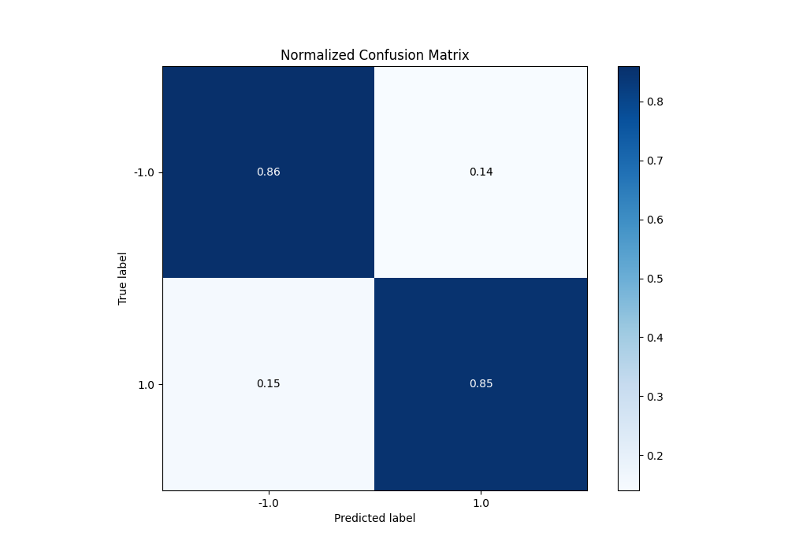
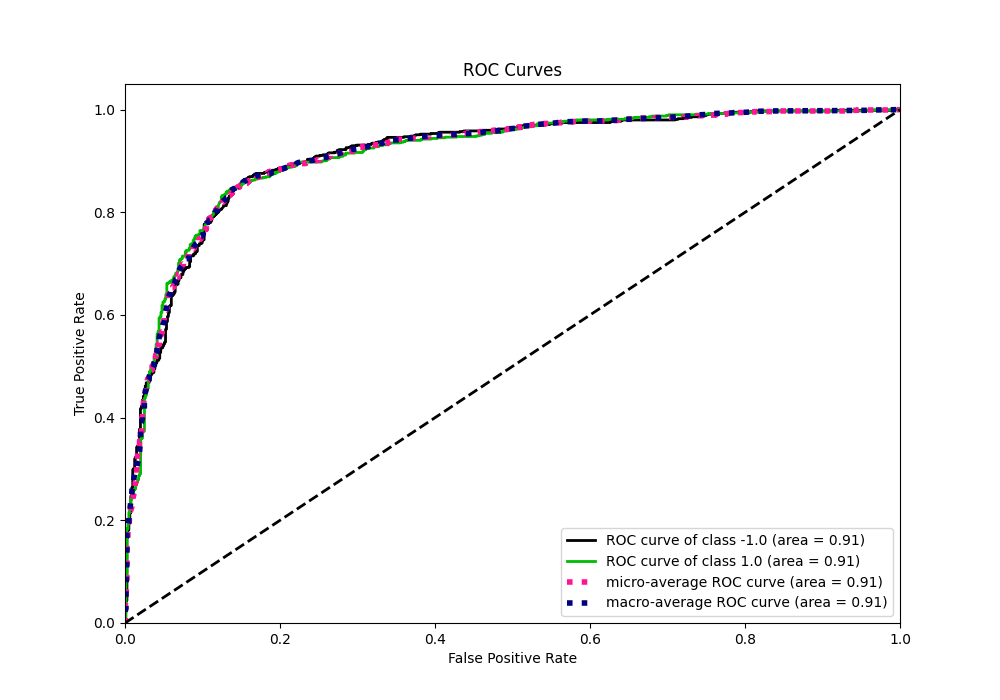
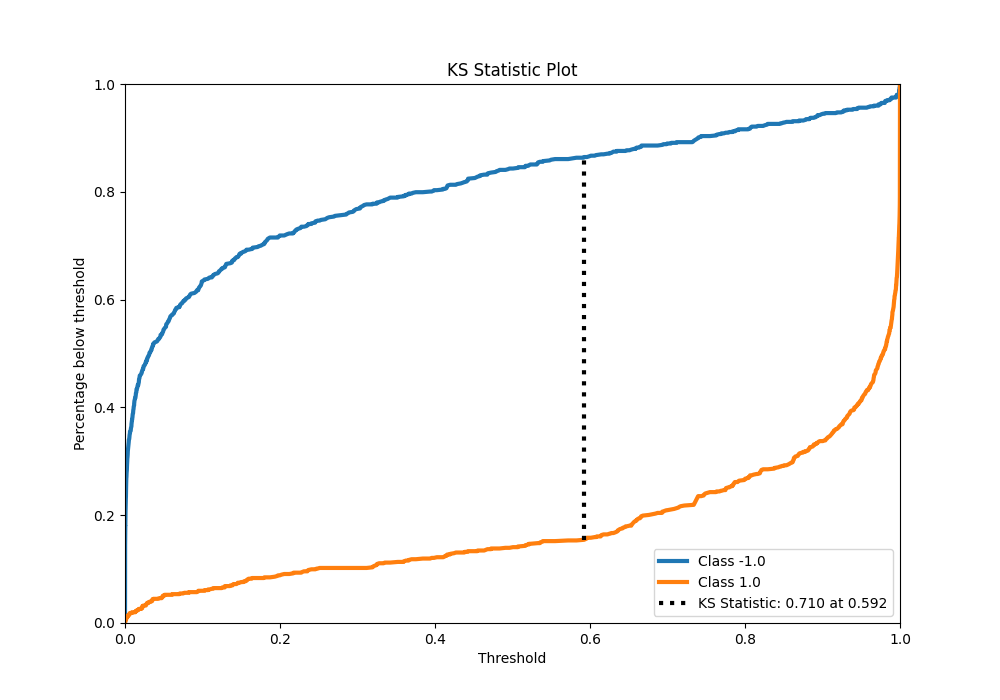
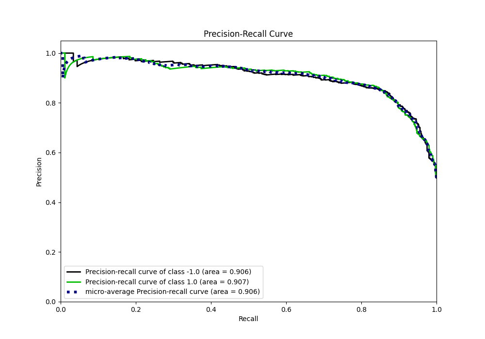
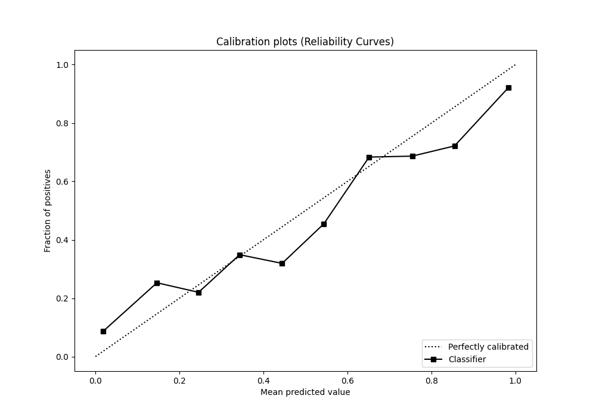
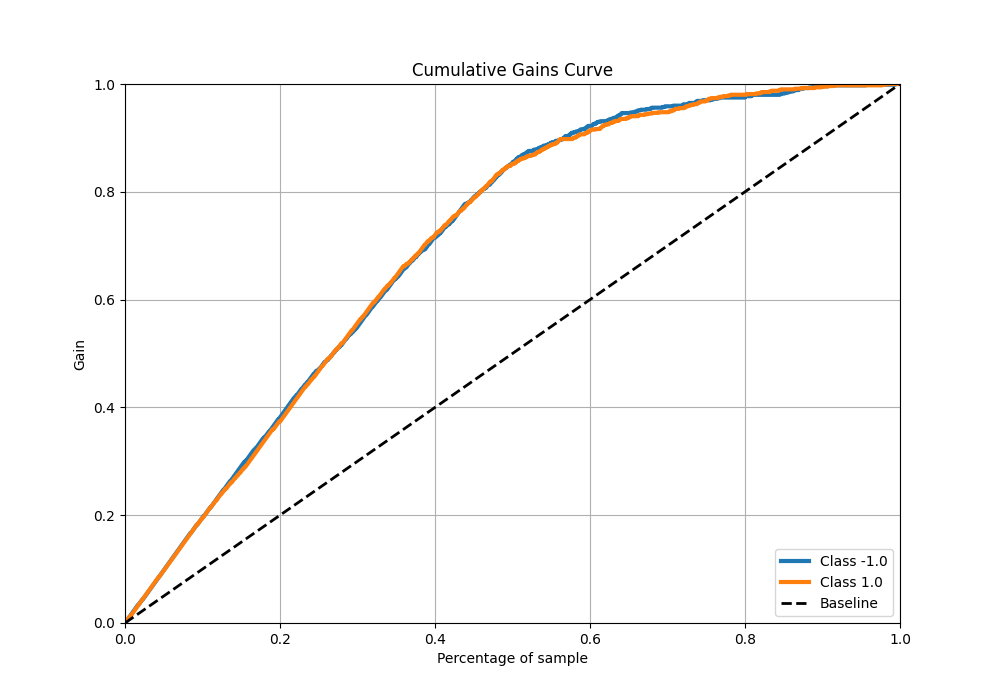
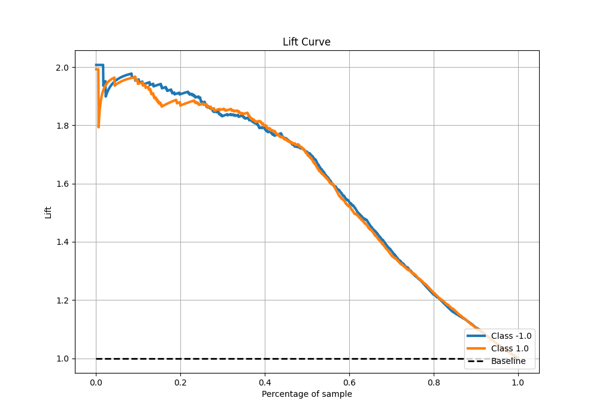

# Summary of 91_NeuralNetwork

[<< Go back](../README.md)

## Neural Network
- **n_jobs**: -1
- **dense_1_size**: 32
- **dense_2_size**: 8
- **learning_rate**: 0.05
- **explain_level**: 0

## Validation
 - **validation_type**: kfold
 - **shuffle**: True
 - **stratify**: True
 - **k_folds**: 5

## Optimized metric
f1

## Training time

16.8 seconds

## Metric details
|           |    score |     threshold |
|:----------|---------:|--------------:|
| logloss   | 0.48421  | nan           |
| auc       | 0.911936 | nan           |
| f1        | 0.853933 |   0.535381    |
| accuracy  | 0.85375  |   0.535381    |
| precision | 0.986014 |   0.999942    |
| recall    | 1        |   5.44717e-11 |
| mcc       | 0.707744 |   0.599994    |

## Metric details with threshold from accuracy metric
|           |    score |   threshold |
|:----------|---------:|------------:|
| logloss   | 0.48421  |  nan        |
| auc       | 0.911936 |  nan        |
| f1        | 0.853933 |    0.535381 |
| accuracy  | 0.85375  |    0.535381 |
| precision | 0.85607  |    0.535381 |
| recall    | 0.851806 |    0.535381 |
| mcc       | 0.70751  |    0.535381 |

## Confusion matrix (at threshold=0.535381)
|                 |   Predicted as -1.0 |   Predicted as 1.0 |
|:----------------|--------------------:|-------------------:|
| Labeled as -1.0 |                 682 |                115 |
| Labeled as 1.0  |                 119 |                684 |

## Learning curves

## Confusion Matrix

## Normalized Confusion Matrix

## ROC Curve

## Kolmogorov-Smirnov Statistic

## Precision-Recall Curve

## Calibration Curve

## Cumulative Gains Curve

## Lift Curve

[<< Go back](../README.md)
