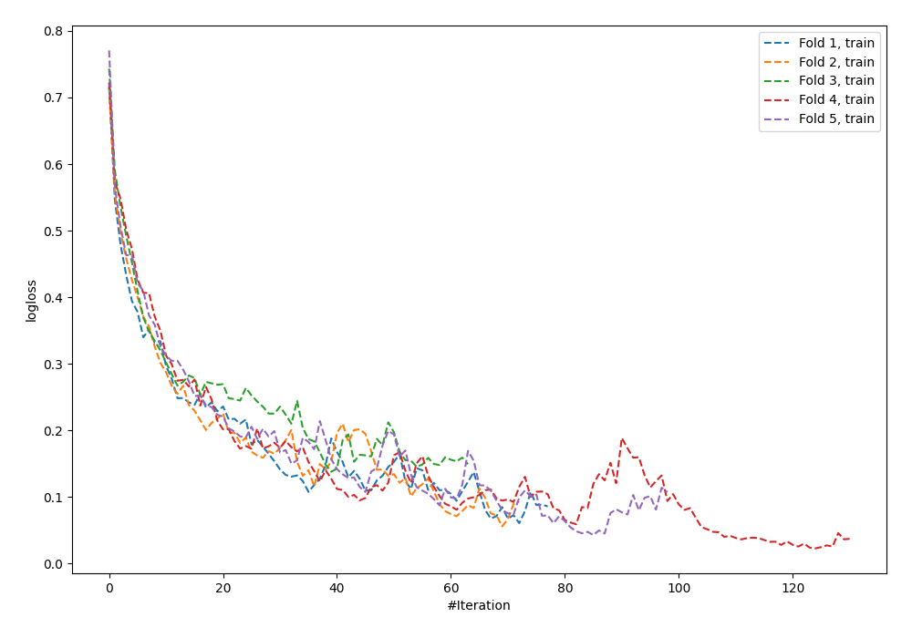
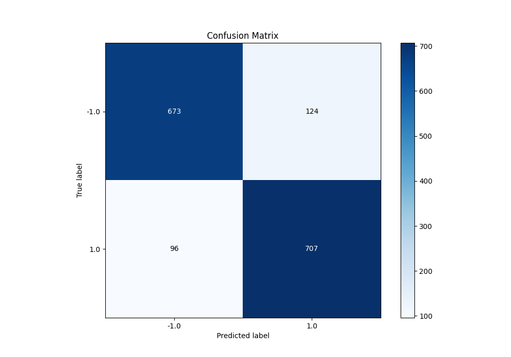
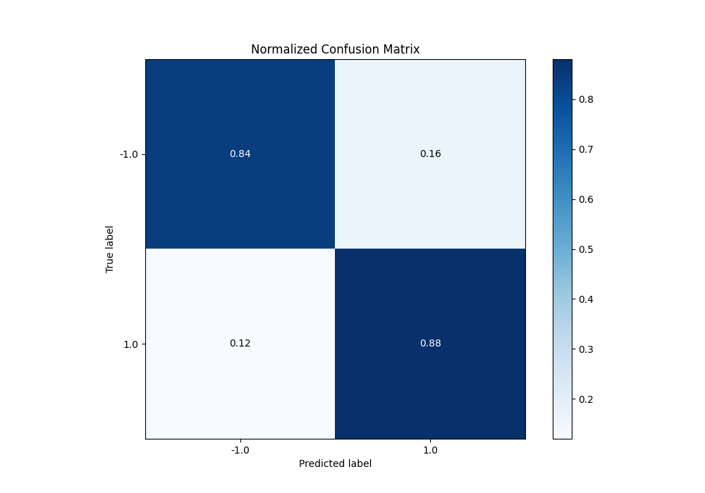
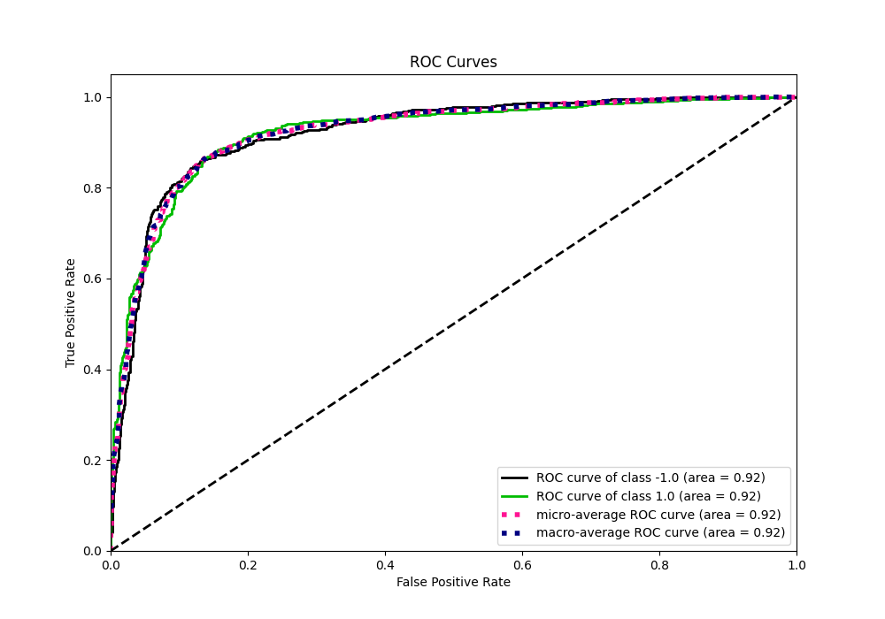
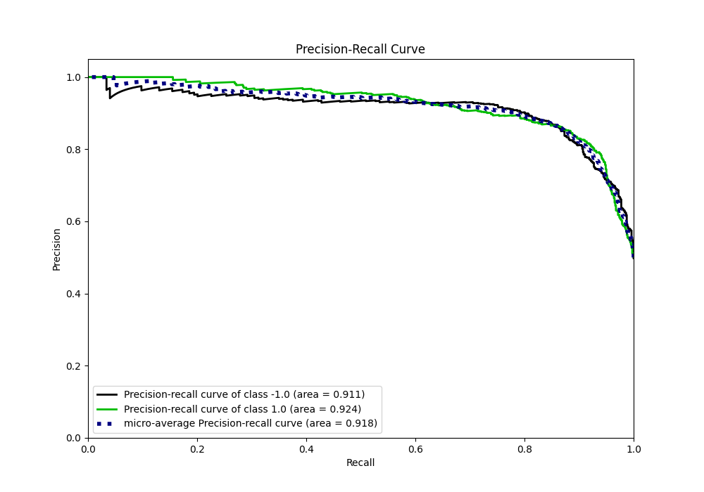
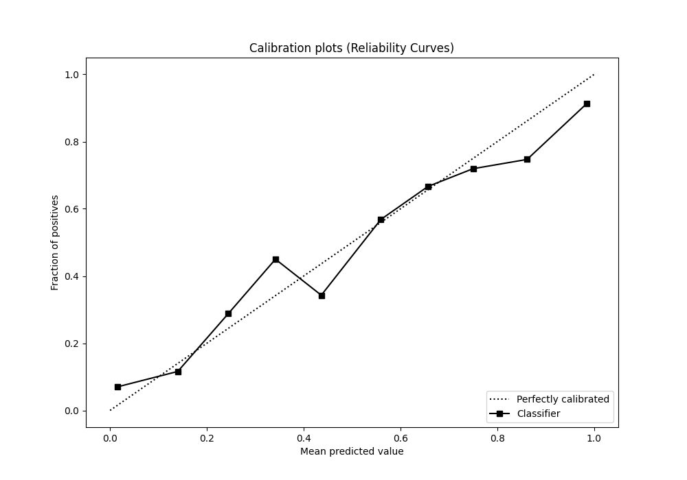
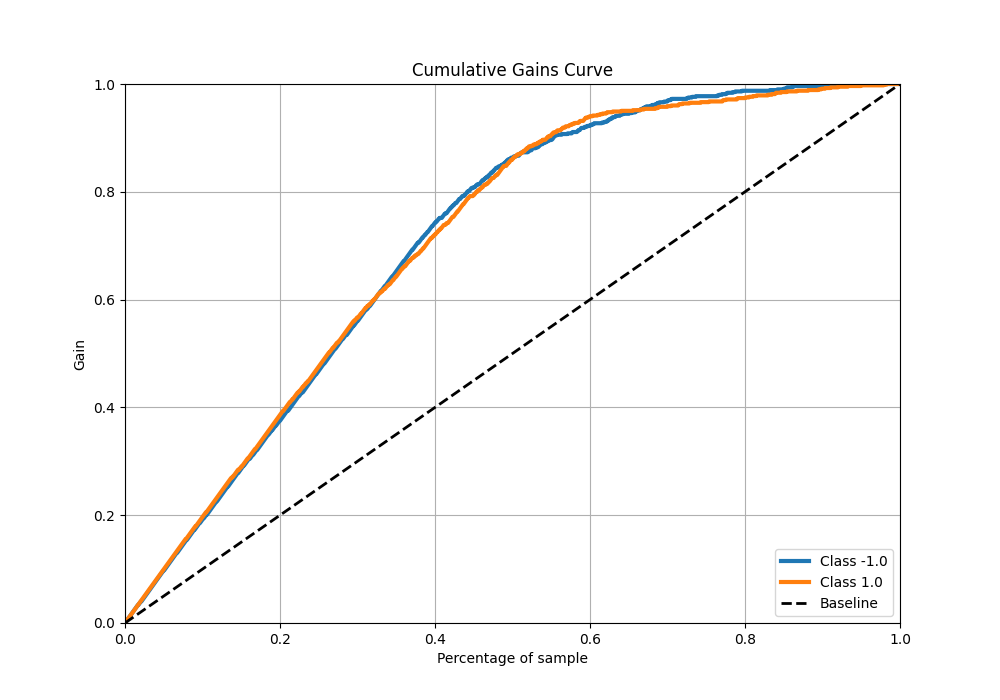
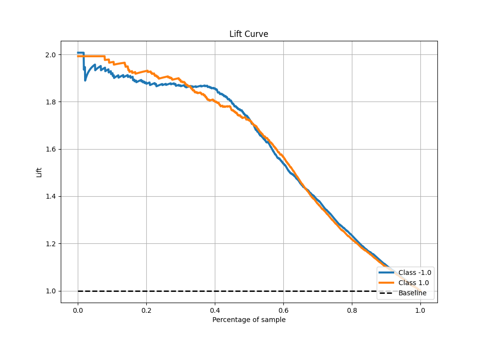

# Summary of 92_NeuralNetwork

[<< Go back](../README.md)

## Neural Network
- **n_jobs**: -1
- **dense_1_size**: 32
- **dense_2_size**: 32
- **learning_rate**: 0.05
- **explain_level**: 0

## Validation
 - **validation_type**: kfold
 - **shuffle**: True
 - **stratify**: True
 - **k_folds**: 5

## Optimized metric
f1

## Training time

16.9 seconds

## Metric details
|           |    score |    threshold |
|:----------|---------:|-------------:|
| logloss   | 0.471637 | nan          |
| auc       | 0.92229  | nan          |
| f1        | 0.865361 |   0.518613   |
| accuracy  | 0.8625   |   0.518613   |
| precision | 1        |   0.999996   |
| recall    | 1        |   5.1311e-18 |
| mcc       | 0.725405 |   0.518613   |

## Metric details with threshold from accuracy metric
|           |    score |   threshold |
|:----------|---------:|------------:|
| logloss   | 0.471637 |  nan        |
| auc       | 0.92229  |  nan        |
| f1        | 0.865361 |    0.518613 |
| accuracy  | 0.8625   |    0.518613 |
| precision | 0.850782 |    0.518613 |
| recall    | 0.880448 |    0.518613 |
| mcc       | 0.725405 |    0.518613 |

## Confusion matrix (at threshold=0.518613)
|                 |   Predicted as -1.0 |   Predicted as 1.0 |
|:----------------|--------------------:|-------------------:|
| Labeled as -1.0 |                 673 |                124 |
| Labeled as 1.0  |                  96 |                707 |

## Learning curves

## Confusion Matrix

## Normalized Confusion Matrix

## ROC Curve

## Kolmogorov-Smirnov Statistic

## Precision-Recall Curve

## Calibration Curve

## Cumulative Gains Curve

## Lift Curve

[<< Go back](../README.md)
