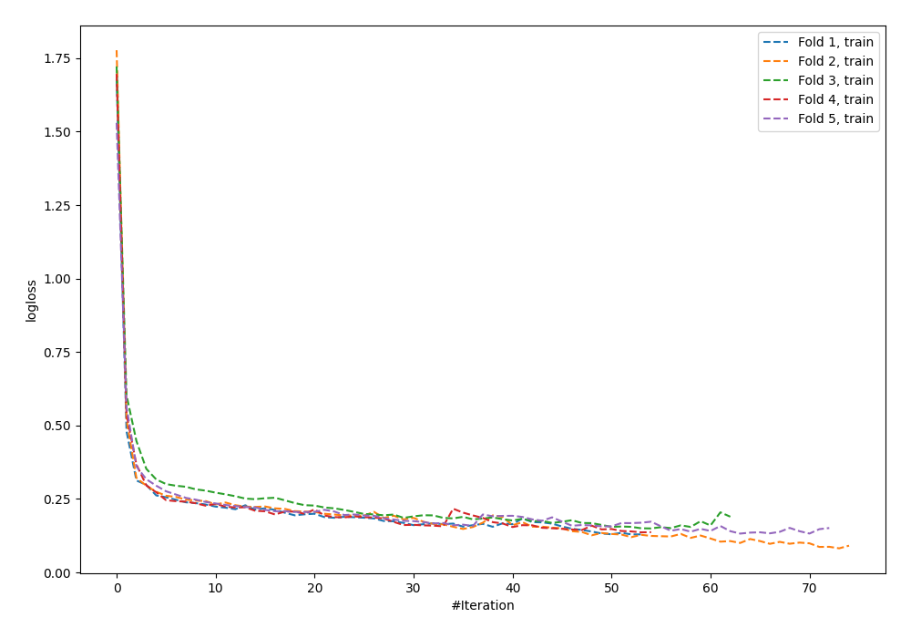

# Summary of 92_NeuralNetwork_Stacked

[<< Go back](../README.md)

## Neural Network
- **n_jobs**: -1
- **dense_1_size**: 32
- **dense_2_size**: 32
- **learning_rate**: 0.05
- **explain_level**: 0

## Validation
 - **validation_type**: kfold
 - **shuffle**: True
 - **stratify**: True
 - **k_folds**: 5

## Optimized metric
f1

## Training time

22.8 seconds

## Metric details
|           |    score |     threshold |
|:----------|---------:|--------------:|
| logloss   | 0.348633 | nan           |
| auc       | 0.941543 | nan           |
| f1        | 0.892634 |   0.630473    |
| accuracy  | 0.8925   |   0.630473    |
| precision | 1        |   0.991725    |
| recall    | 1        |   1.29097e-16 |
| mcc       | 0.785263 |   0.663483    |

## Metric details with threshold from accuracy metric
|           |    score |   threshold |
|:----------|---------:|------------:|
| logloss   | 0.348633 |  nan        |
| auc       | 0.941543 |  nan        |
| f1        | 0.892634 |    0.630473 |
| accuracy  | 0.8925   |    0.630473 |
| precision | 0.894869 |    0.630473 |
| recall    | 0.890411 |    0.630473 |
| mcc       | 0.785011 |    0.630473 |

## Confusion matrix (at threshold=0.630473)
|                 |   Predicted as -1.0 |   Predicted as 1.0 |
|:----------------|--------------------:|-------------------:|
| Labeled as -1.0 |                 713 |                 84 |
| Labeled as 1.0  |                  88 |                715 |

## Learning curves

## Confusion Matrix

## Normalized Confusion Matrix

## ROC Curve

## Kolmogorov-Smirnov Statistic

## Precision-Recall Curve

## Calibration Curve

## Cumulative Gains Curve

## Lift Curve

[<< Go back](../README.md)
