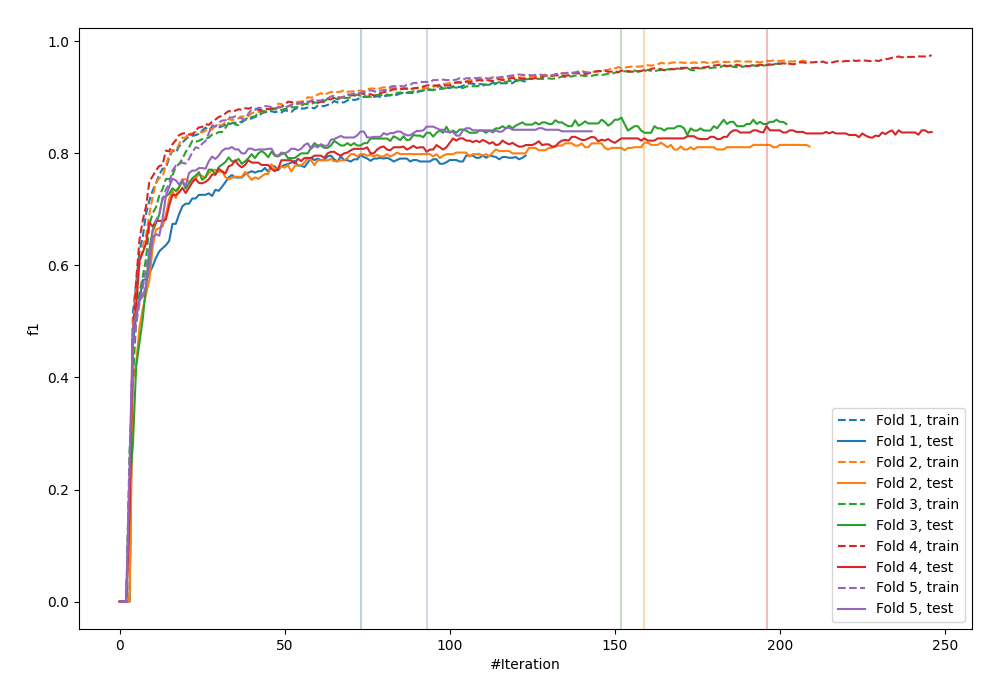
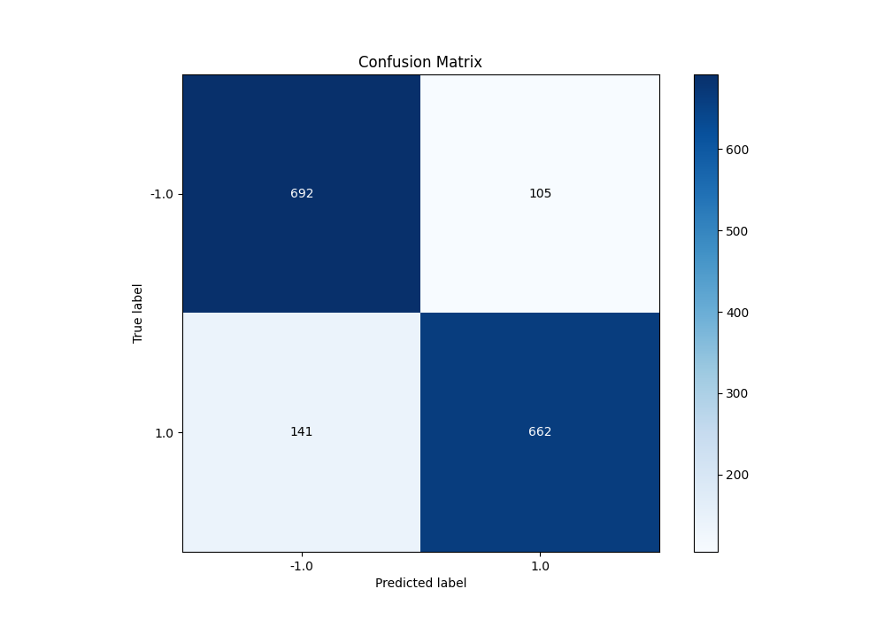
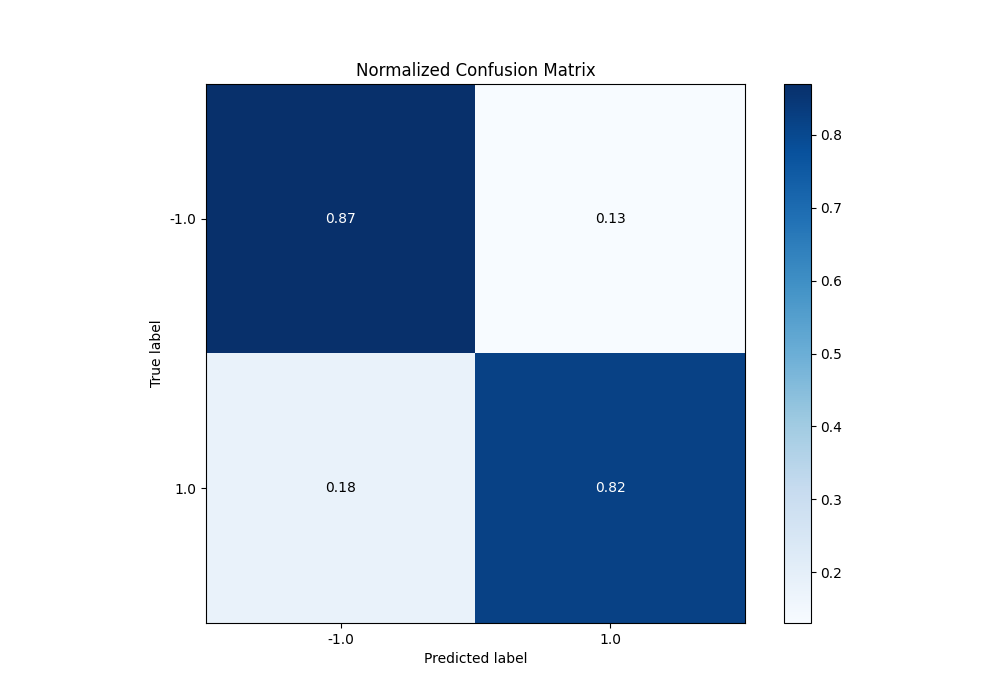
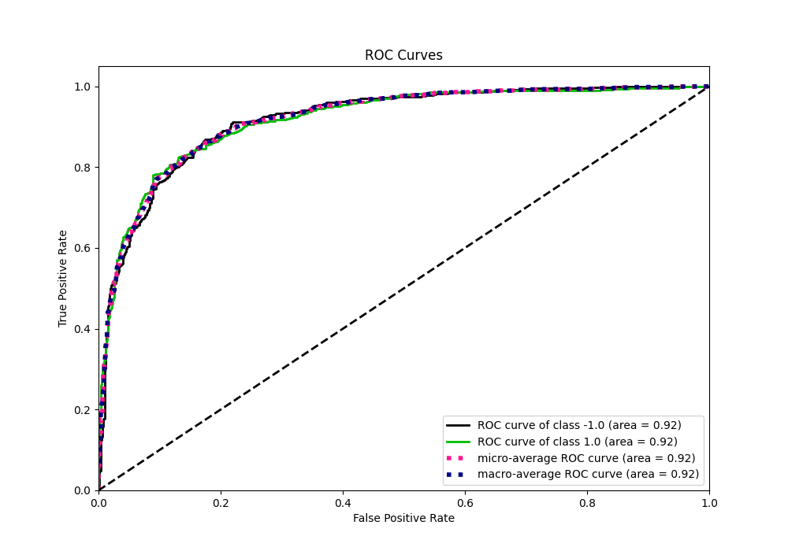
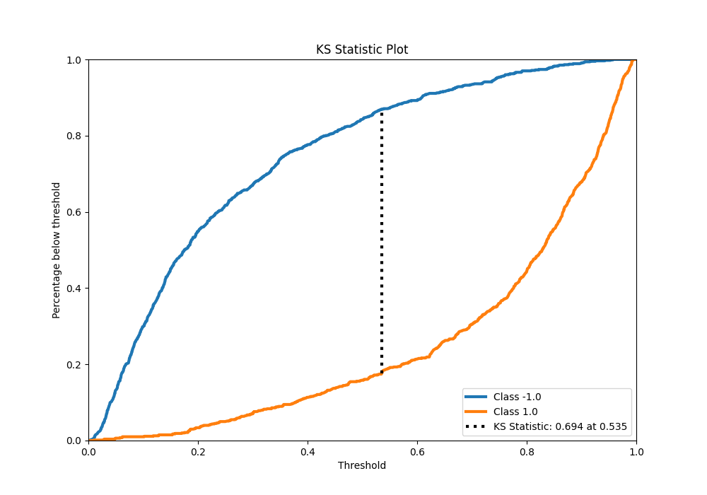
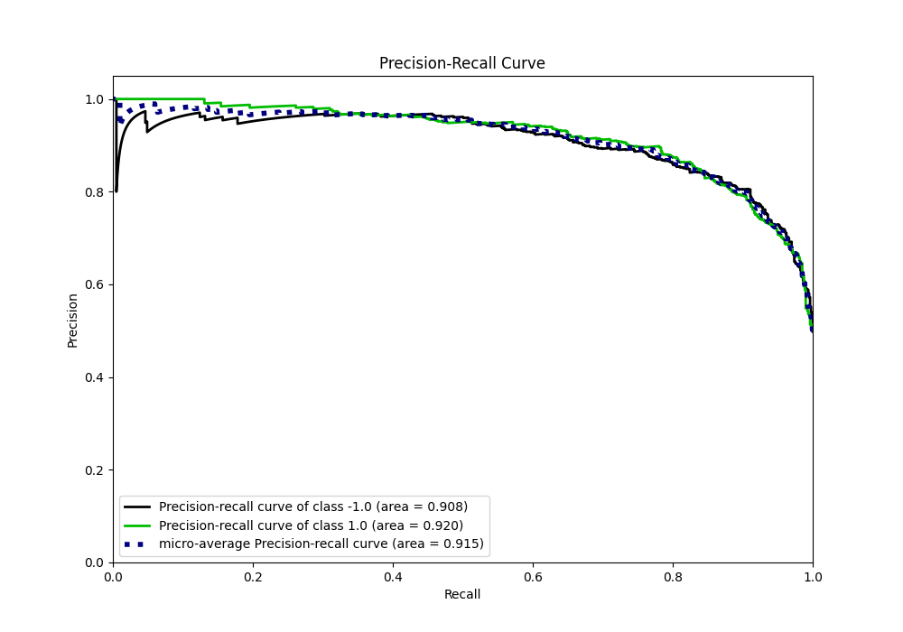
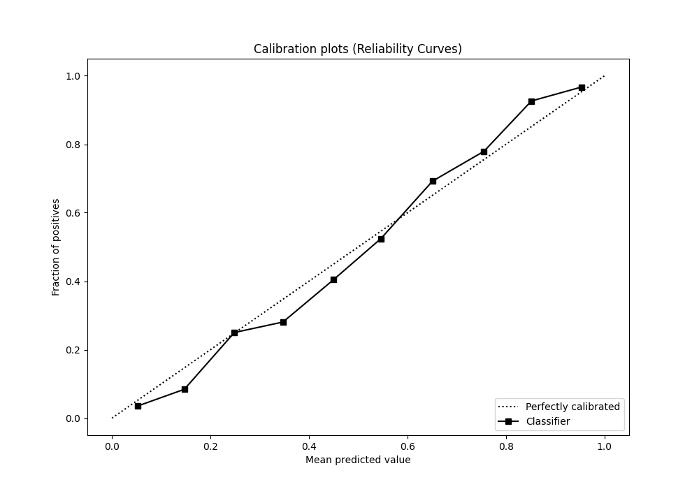
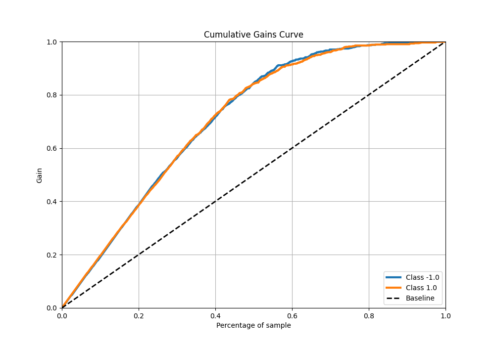
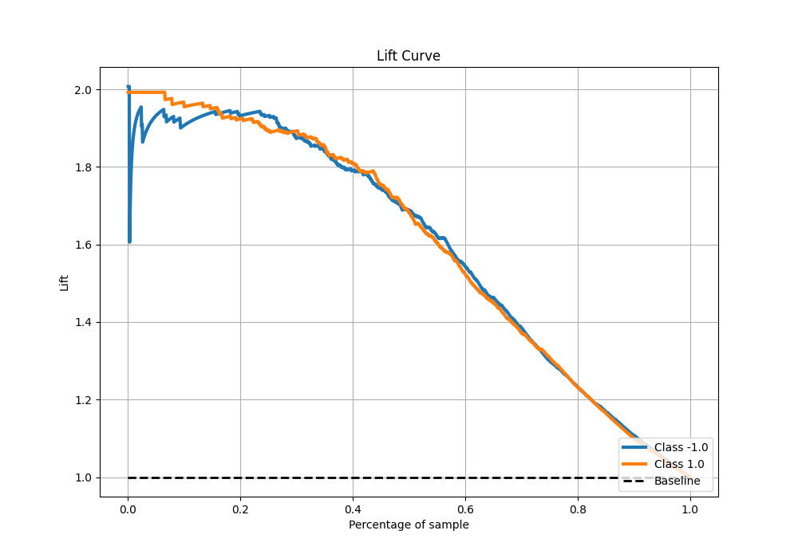

# Summary of 95_Xgboost

[<< Go back](../README.md)

## Extreme Gradient Boosting (Xgboost)
- **n_jobs**: -1
- **objective**: binary:logistic
- **eta**: 0.075
- **max_depth**: 5
- **min_child_weight**: 5
- **subsample**: 0.7
- **colsample_bytree**: 0.6
- **eval_metric**: f1
- **explain_level**: 0

## Validation
 - **validation_type**: kfold
 - **shuffle**: True
 - **stratify**: True
 - **k_folds**: 5

## Optimized metric
f1

## Training time

26.4 seconds

## Metric details
|           |    score |    threshold |
|:----------|---------:|-------------:|
| logloss   | 0.37261  | nan          |
| auc       | 0.918214 | nan          |
| f1        | 0.843938 |   0.429862   |
| accuracy  | 0.84625  |   0.534702   |
| precision | 1        |   0.960399   |
| recall    | 1        |   0.00377462 |
| mcc       | 0.695592 |   0.615756   |

## Metric details with threshold from accuracy metric
|           |    score |   threshold |
|:----------|---------:|------------:|
| logloss   | 0.37261  |  nan        |
| auc       | 0.918214 |  nan        |
| f1        | 0.843312 |    0.534702 |
| accuracy  | 0.84625  |    0.534702 |
| precision | 0.863103 |    0.534702 |
| recall    | 0.824408 |    0.534702 |
| mcc       | 0.69325  |    0.534702 |

## Confusion matrix (at threshold=0.534702)
|                 |   Predicted as -1.0 |   Predicted as 1.0 |
|:----------------|--------------------:|-------------------:|
| Labeled as -1.0 |                 692 |                105 |
| Labeled as 1.0  |                 141 |                662 |

## Learning curves

## Confusion Matrix

## Normalized Confusion Matrix

## ROC Curve

## Kolmogorov-Smirnov Statistic

## Precision-Recall Curve

## Calibration Curve

## Cumulative Gains Curve

## Lift Curve

[<< Go back](../README.md)
