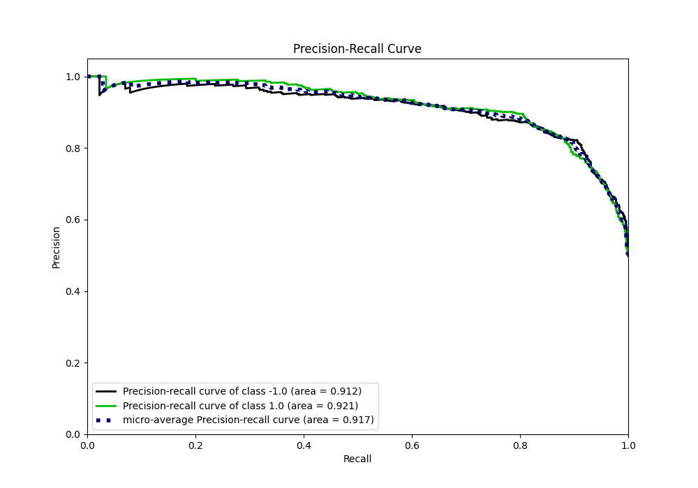
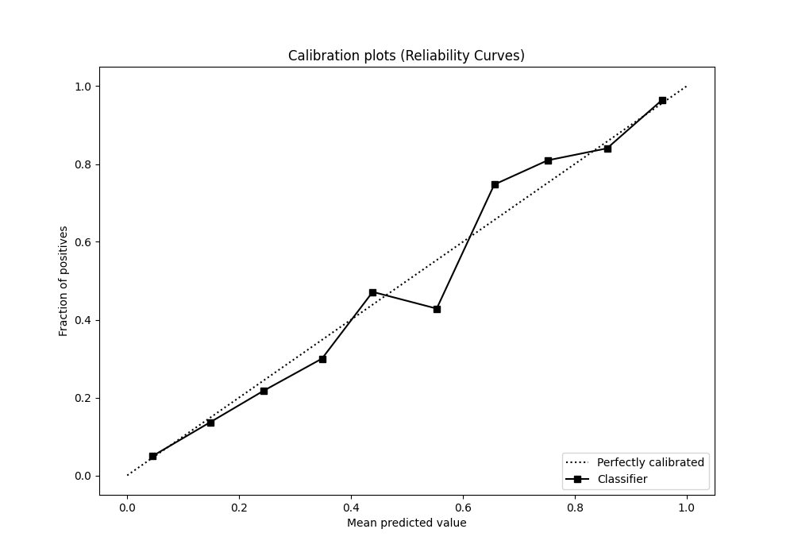

# Summary of 96_Xgboost

[<< Go back](../README.md)

## Extreme Gradient Boosting (Xgboost)
- **n_jobs**: -1
- **objective**: binary:logistic
- **eta**: 0.15
- **max_depth**: 5
- **min_child_weight**: 5
- **subsample**: 0.7
- **colsample_bytree**: 0.6
- **eval_metric**: f1
- **explain_level**: 0

## Validation
 - **validation_type**: kfold
 - **shuffle**: True
 - **stratify**: True
 - **k_folds**: 5

## Optimized metric
f1

## Training time

25.2 seconds

## Metric details
|           |    score |     threshold |
|:----------|---------:|--------------:|
| logloss   | 0.362374 | nan           |
| auc       | 0.919154 | nan           |
| f1        | 0.852121 |   0.411482    |
| accuracy  | 0.85375  |   0.624858    |
| precision | 1        |   0.995798    |
| recall    | 1        |   0.000979104 |
| mcc       | 0.711541 |   0.624858    |

## Metric details with threshold from accuracy metric
|           |    score |   threshold |
|:----------|---------:|------------:|
| logloss   | 0.362374 |  nan        |
| auc       | 0.919154 |  nan        |
| f1        | 0.846255 |    0.624858 |
| accuracy  | 0.85375  |    0.624858 |
| precision | 0.895688 |    0.624858 |
| recall    | 0.801993 |    0.624858 |
| mcc       | 0.711541 |    0.624858 |

## Confusion matrix (at threshold=0.624858)
|                 |   Predicted as -1.0 |   Predicted as 1.0 |
|:----------------|--------------------:|-------------------:|
| Labeled as -1.0 |                 722 |                 75 |
| Labeled as 1.0  |                 159 |                644 |

## Learning curves

## Confusion Matrix

## Normalized Confusion Matrix

## ROC Curve

## Kolmogorov-Smirnov Statistic

## Precision-Recall Curve

## Calibration Curve

## Cumulative Gains Curve

## Lift Curve

[<< Go back](../README.md)
