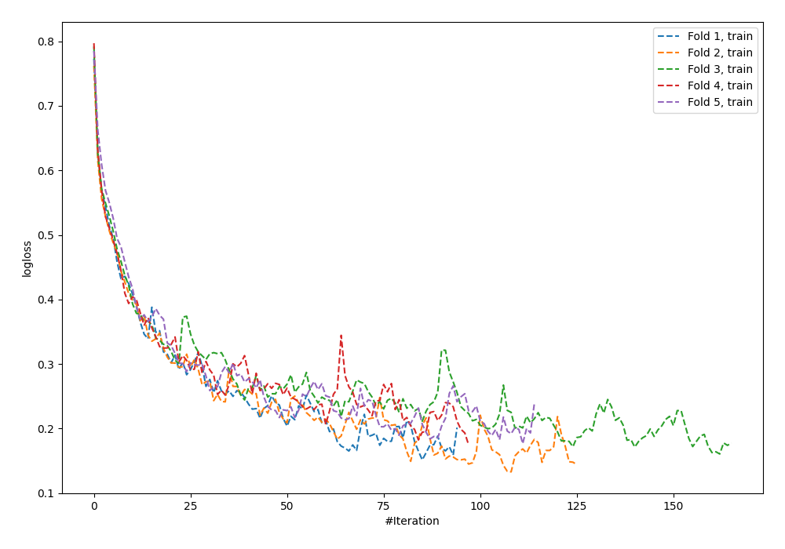
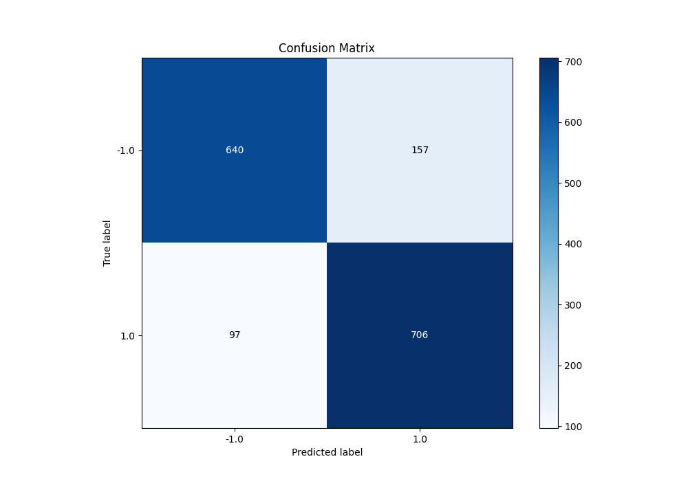
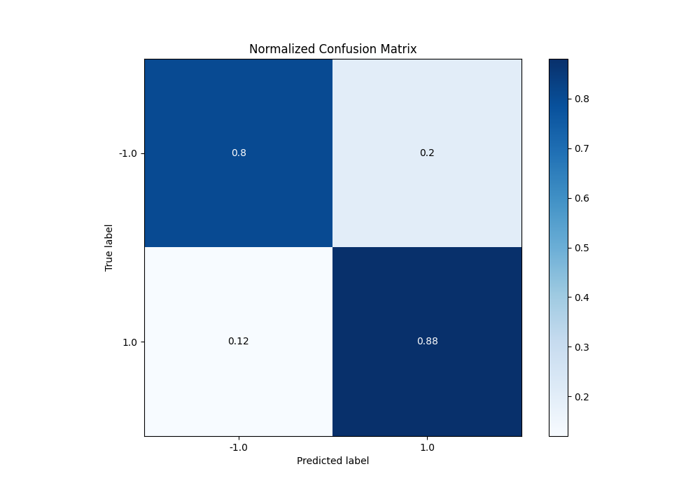
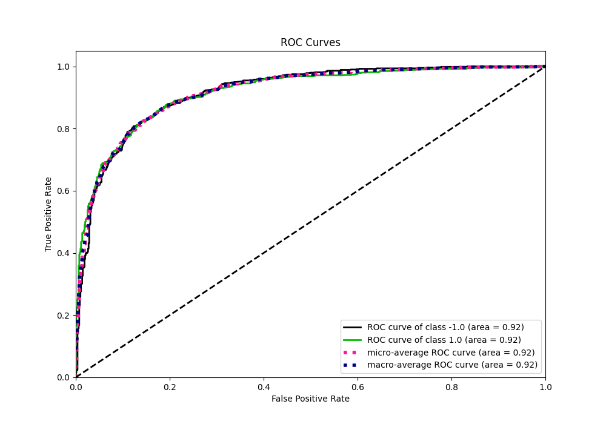
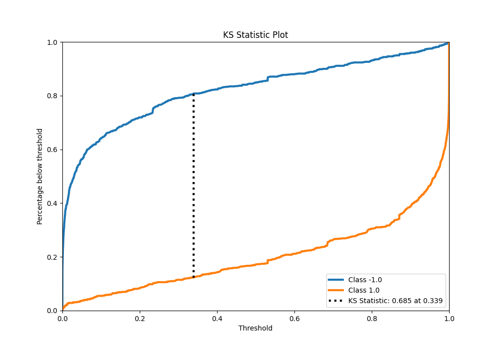
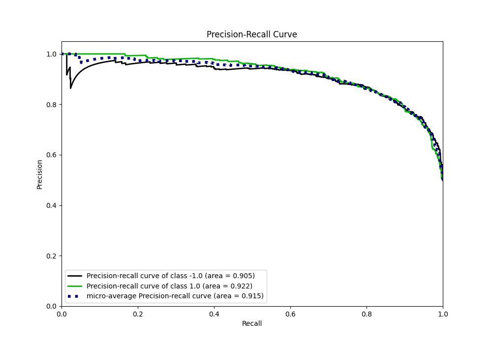
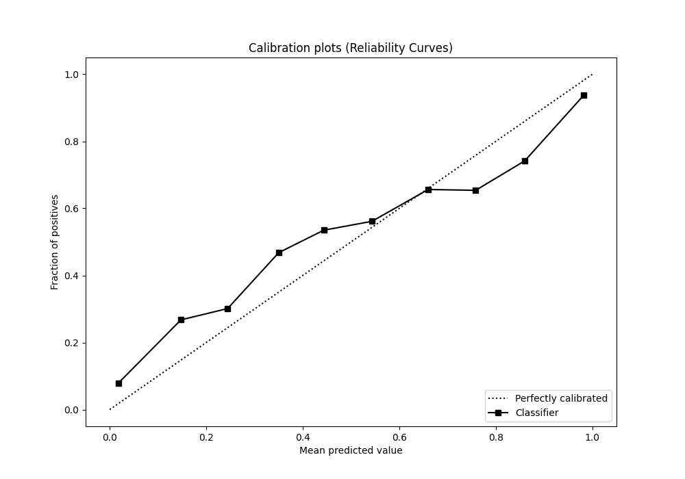
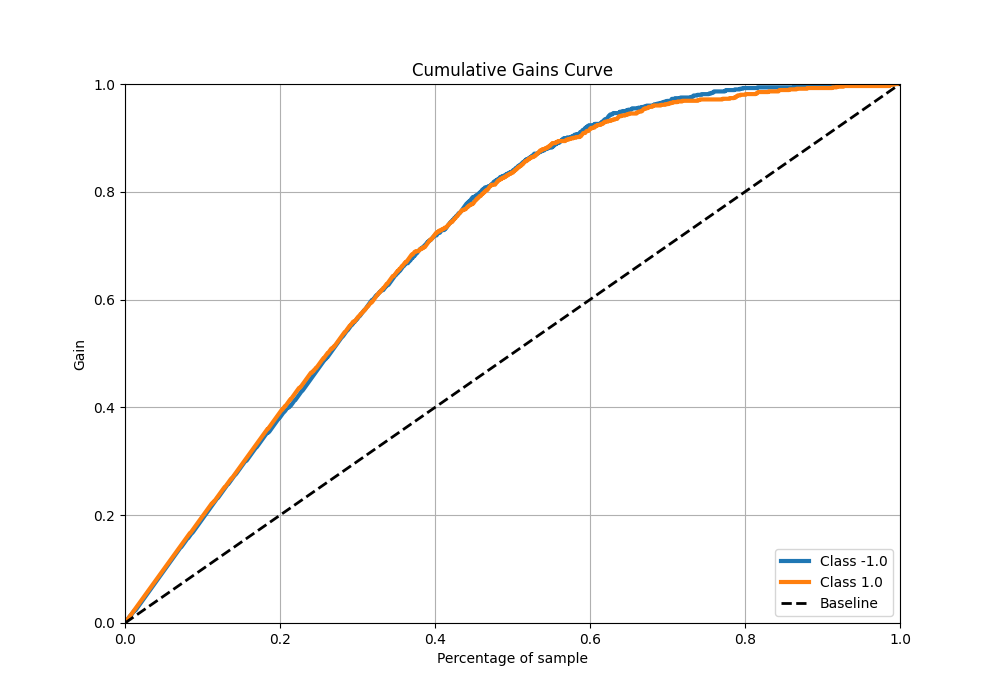
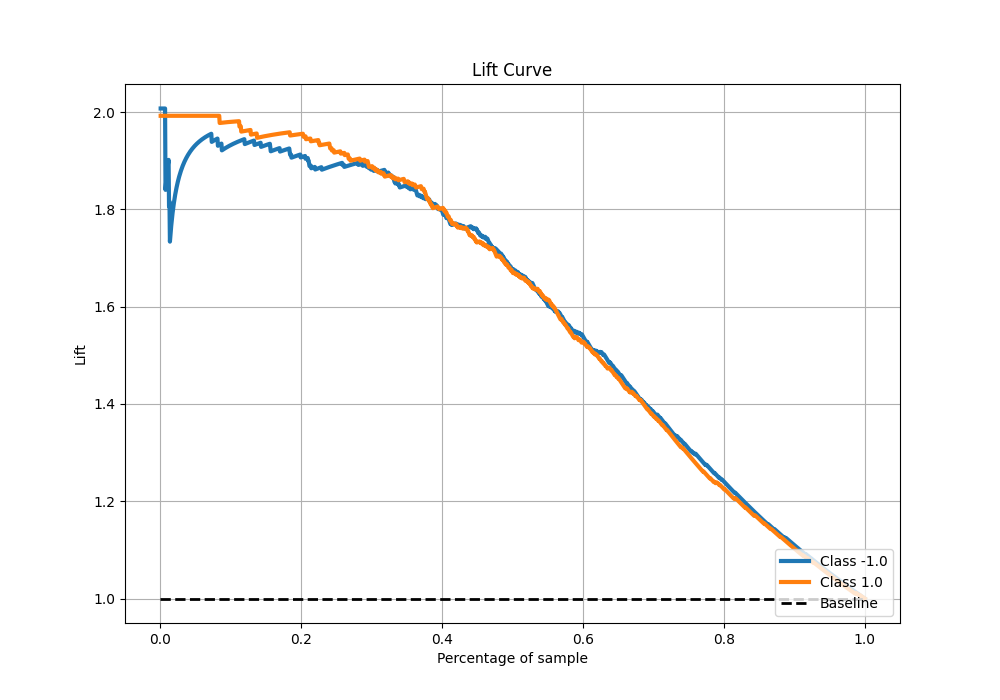

# Summary of 97_NeuralNetwork

[<< Go back](../README.md)

## Neural Network
- **n_jobs**: -1
- **dense_1_size**: 16
- **dense_2_size**: 8
- **learning_rate**: 0.08
- **explain_level**: 0

## Validation
 - **validation_type**: kfold
 - **shuffle**: True
 - **stratify**: True
 - **k_folds**: 5

## Optimized metric
f1

## Training time

17.8 seconds

## Metric details
|           |    score |     threshold |
|:----------|---------:|--------------:|
| logloss   | 0.435138 | nan           |
| auc       | 0.91749  | nan           |
| f1        | 0.847539 |   0.330095    |
| accuracy  | 0.84125  |   0.330095    |
| precision | 1        |   0.999956    |
| recall    | 1        |   1.63273e-15 |
| mcc       | 0.684335 |   0.330095    |

## Metric details with threshold from accuracy metric
|           |    score |   threshold |
|:----------|---------:|------------:|
| logloss   | 0.435138 |  nan        |
| auc       | 0.91749  |  nan        |
| f1        | 0.847539 |    0.330095 |
| accuracy  | 0.84125  |    0.330095 |
| precision | 0.818076 |    0.330095 |
| recall    | 0.879203 |    0.330095 |
| mcc       | 0.684335 |    0.330095 |

## Confusion matrix (at threshold=0.330095)
|                 |   Predicted as -1.0 |   Predicted as 1.0 |
|:----------------|--------------------:|-------------------:|
| Labeled as -1.0 |                 640 |                157 |
| Labeled as 1.0  |                  97 |                706 |

## Learning curves

## Confusion Matrix

## Normalized Confusion Matrix

## ROC Curve

## Kolmogorov-Smirnov Statistic

## Precision-Recall Curve

## Calibration Curve

## Cumulative Gains Curve

## Lift Curve

[<< Go back](../README.md)
