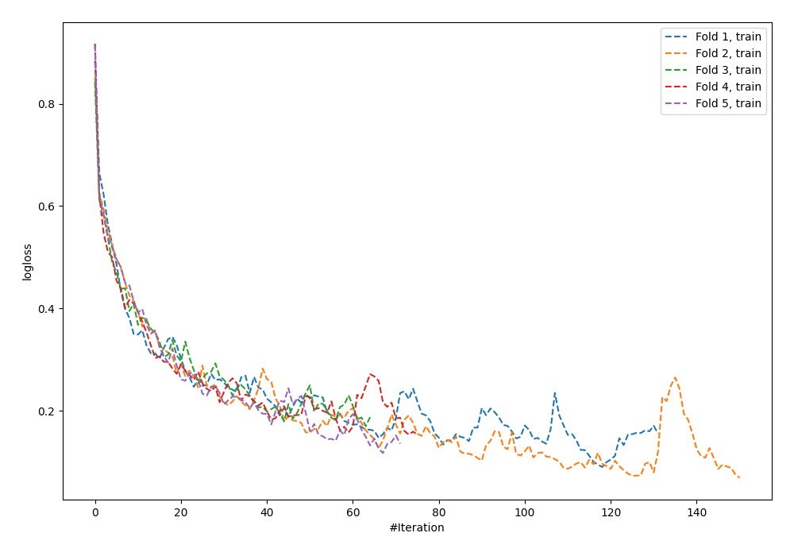
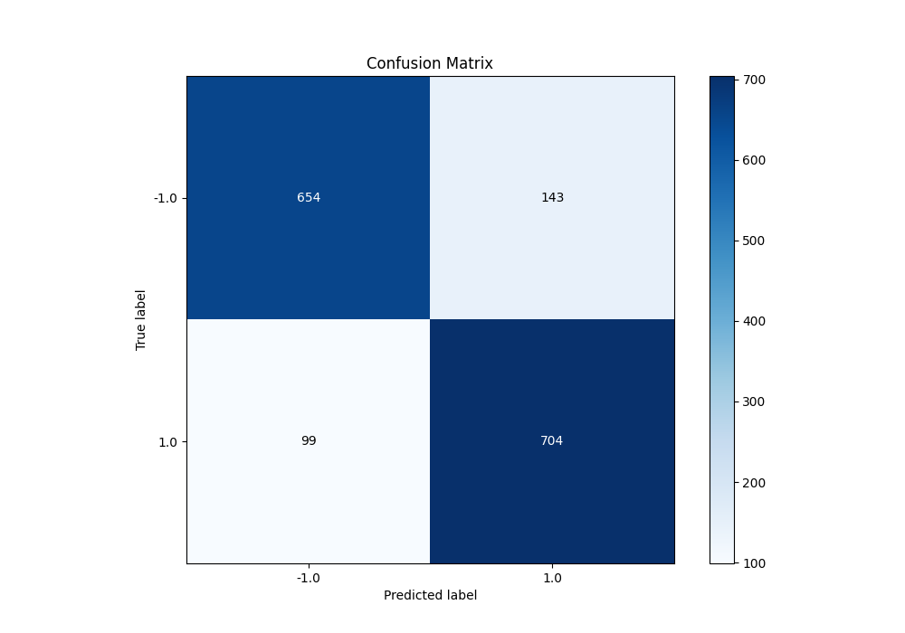
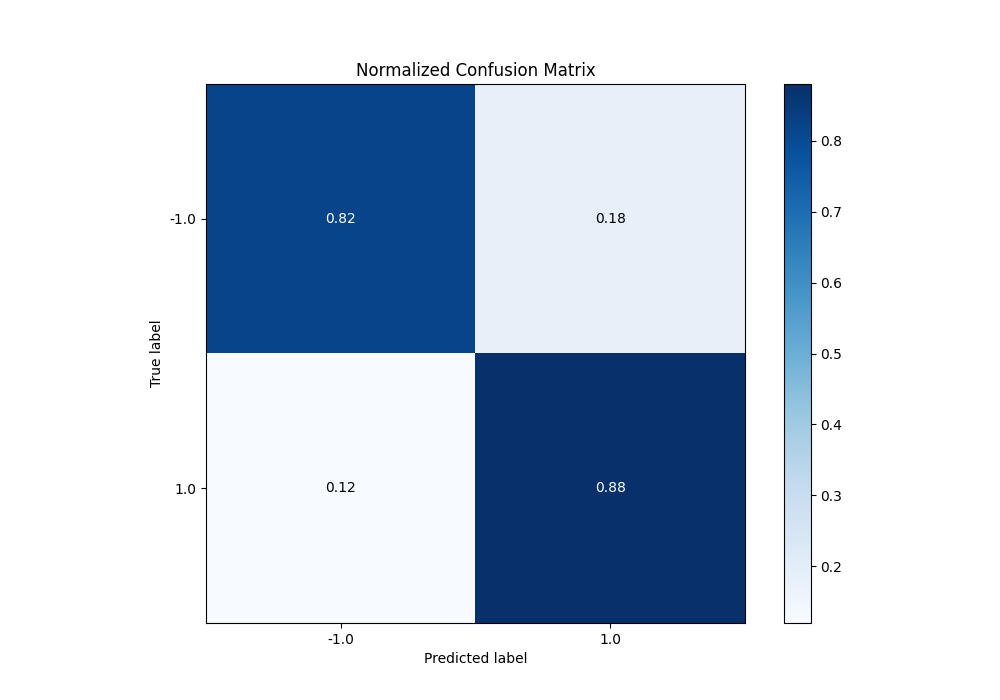
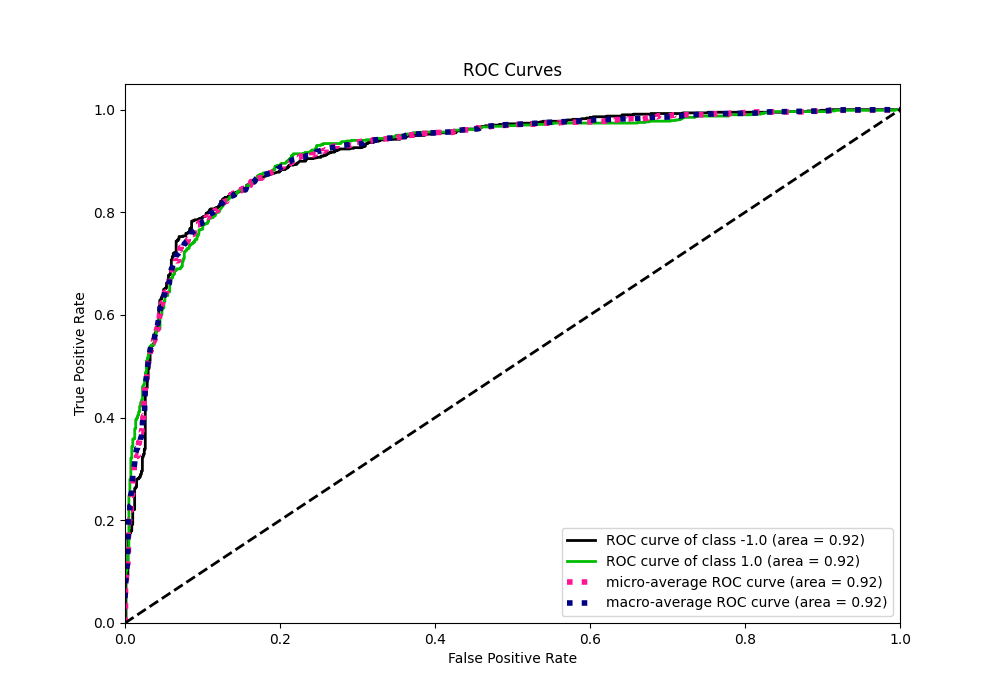
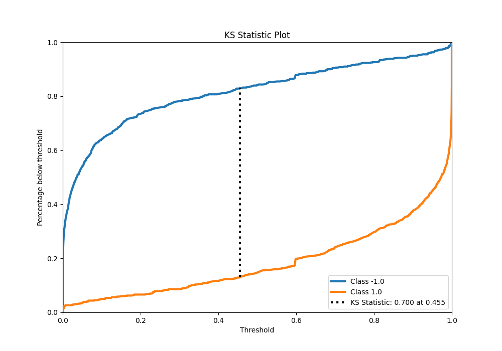
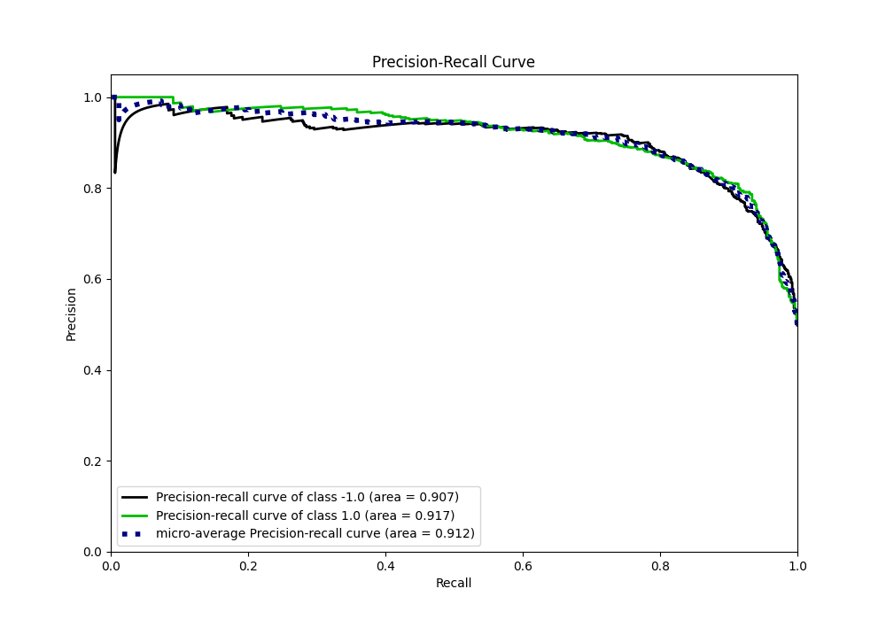
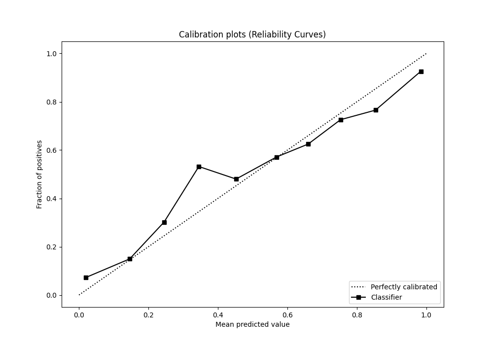
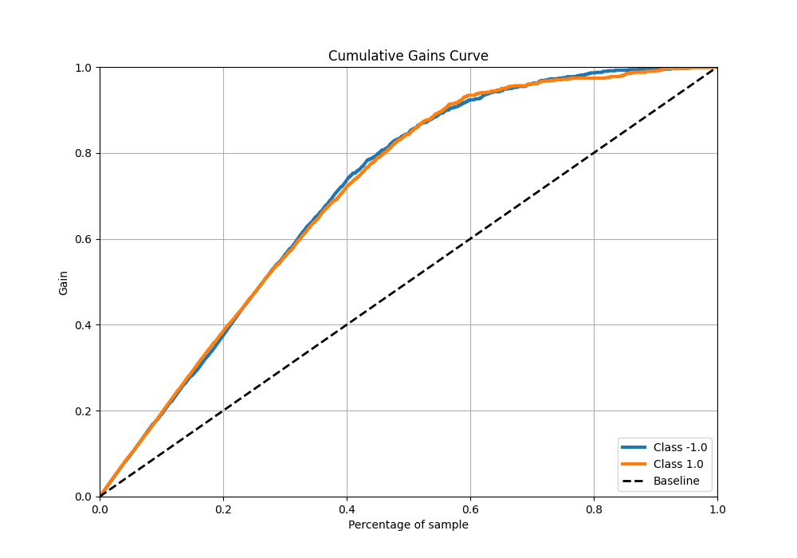
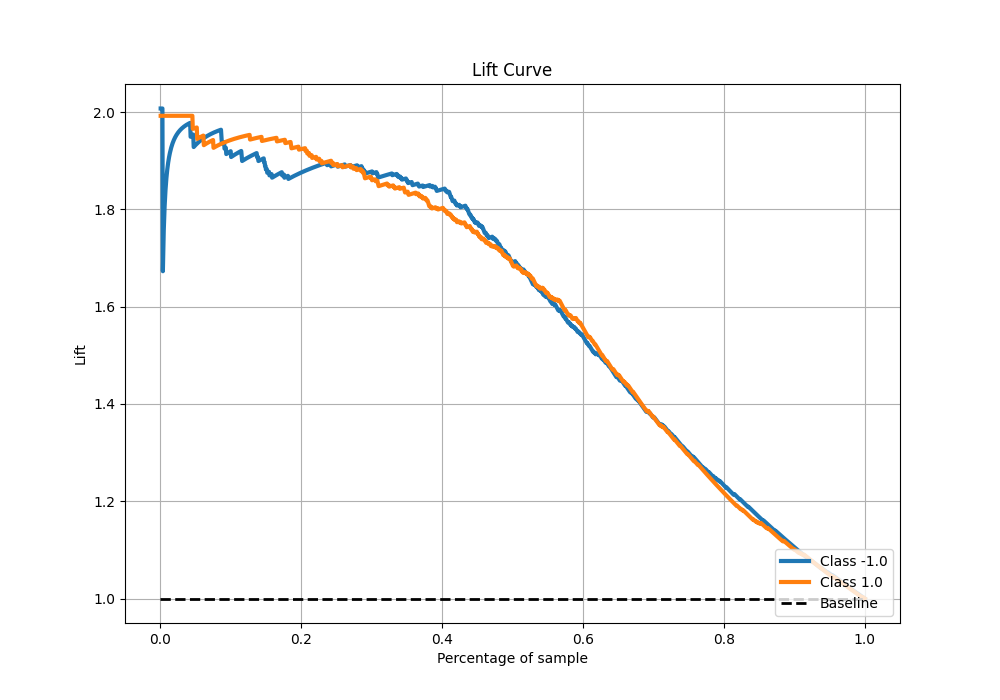

# Summary of 98_NeuralNetwork

[<< Go back](../README.md)

## Neural Network
- **n_jobs**: -1
- **dense_1_size**: 16
- **dense_2_size**: 32
- **learning_rate**: 0.08
- **explain_level**: 0

## Validation
 - **validation_type**: kfold
 - **shuffle**: True
 - **stratify**: True
 - **k_folds**: 5

## Optimized metric
f1

## Training time

17.6 seconds

## Metric details
|           |    score |     threshold |
|:----------|---------:|--------------:|
| logloss   | 0.456839 | nan           |
| auc       | 0.917397 | nan           |
| f1        | 0.856476 |   0.287421    |
| accuracy  | 0.84875  |   0.437657    |
| precision | 1        |   1           |
| recall    | 1        |   3.18702e-13 |
| mcc       | 0.698743 |   0.287421    |

## Metric details with threshold from accuracy metric
|           |    score |   threshold |
|:----------|---------:|------------:|
| logloss   | 0.456839 |  nan        |
| auc       | 0.917397 |  nan        |
| f1        | 0.853333 |    0.437657 |
| accuracy  | 0.84875  |    0.437657 |
| precision | 0.831169 |    0.437657 |
| recall    | 0.876712 |    0.437657 |
| mcc       | 0.698491 |    0.437657 |

## Confusion matrix (at threshold=0.437657)
|                 |   Predicted as -1.0 |   Predicted as 1.0 |
|:----------------|--------------------:|-------------------:|
| Labeled as -1.0 |                 654 |                143 |
| Labeled as 1.0  |                  99 |                704 |

## Learning curves

## Confusion Matrix

## Normalized Confusion Matrix

## ROC Curve

## Kolmogorov-Smirnov Statistic

## Precision-Recall Curve

## Calibration Curve

## Cumulative Gains Curve

## Lift Curve

[<< Go back](../README.md)
