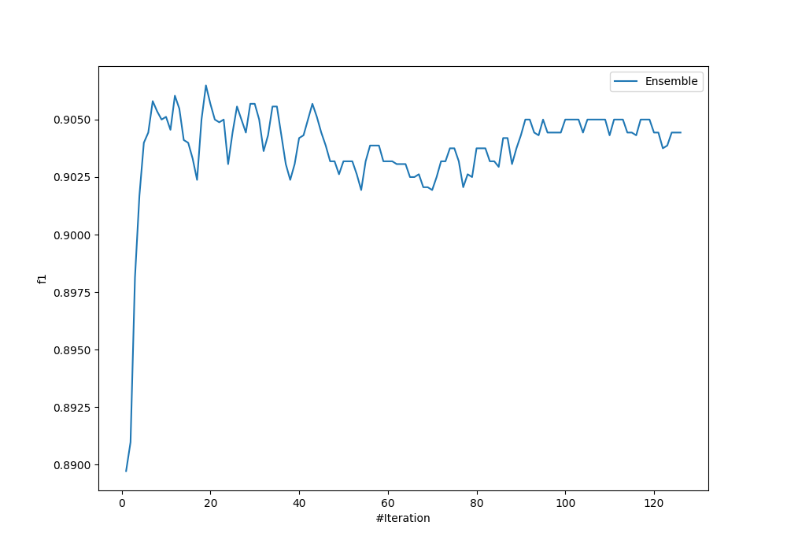
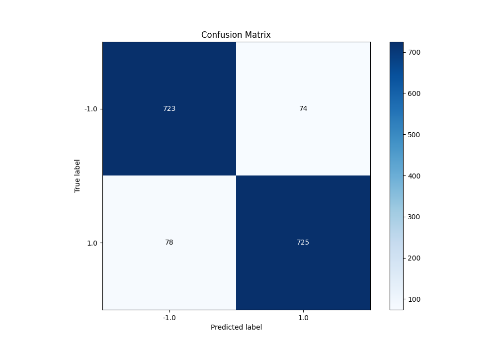
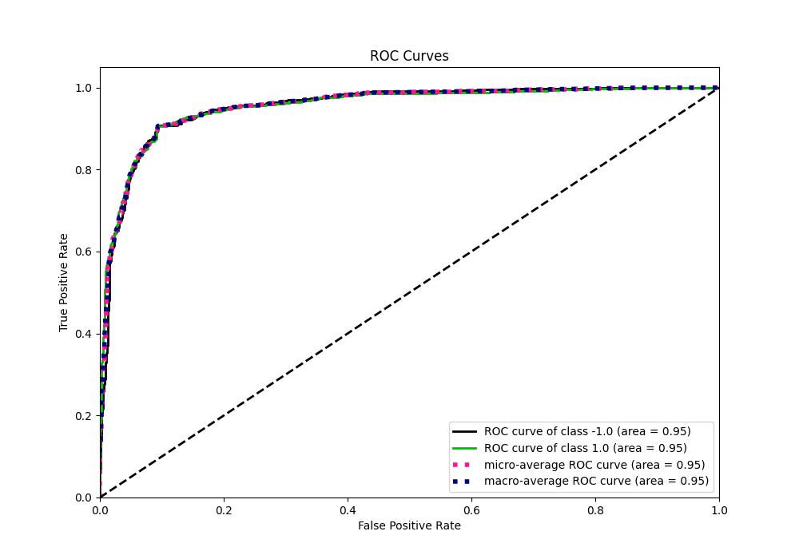
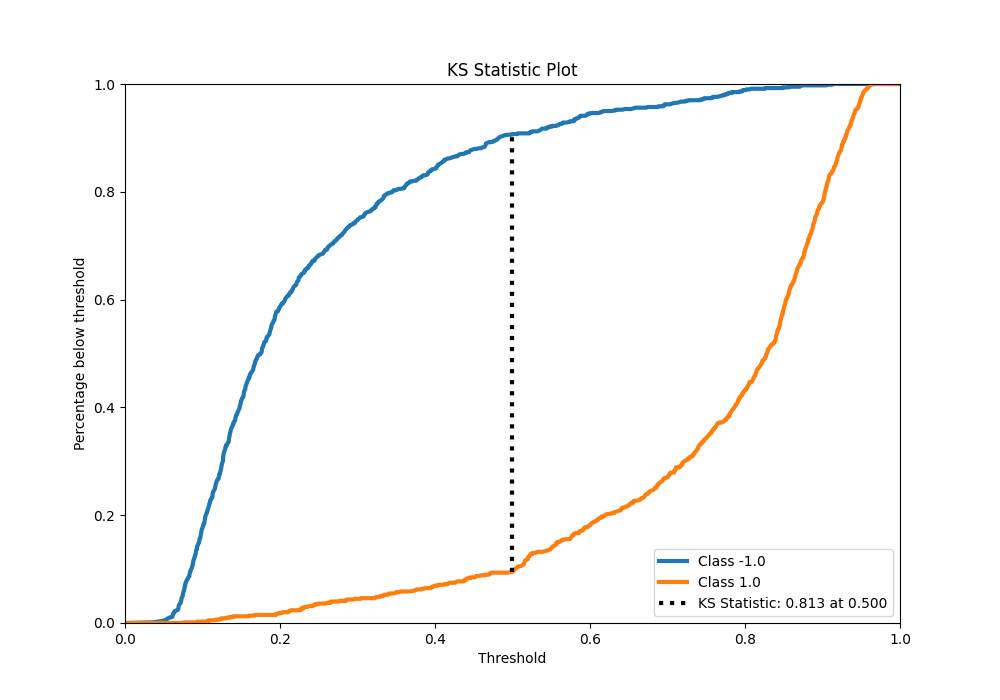
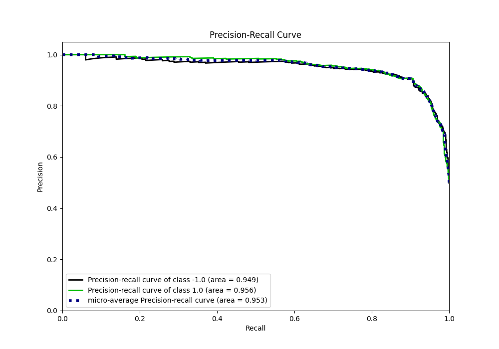
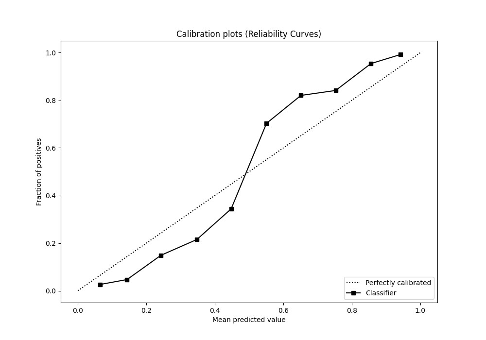
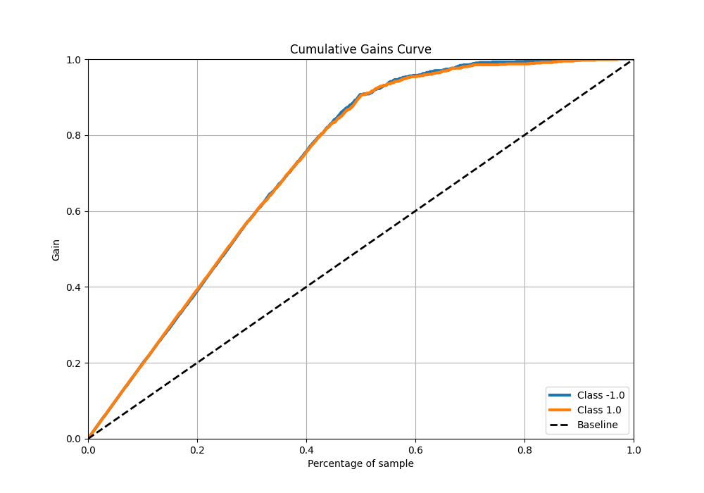
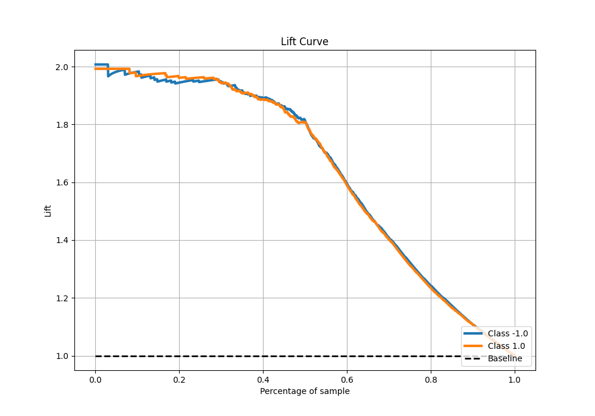

# Summary of Ensemble

[<< Go back](../README.md)

## Ensemble structure
| Model                              |   Weight |
|:-----------------------------------|---------:|
| 11_Default_NearestNeighbors        |        1 |
| 21_LightGBM                        |        1 |
| 23_LightGBM                        |        1 |
| 37_CatBoost                        |        1 |
| 49_ExtraTrees                      |        1 |
| 4_Linear                           |        1 |
| 54_ExtraTrees                      |        1 |
| 55_ExtraTrees                      |        1 |
| 60_NeuralNetwork                   |        1 |
| 64_NeuralNetwork                   |        1 |
| 67_NearestNeighbors_GoldenFeatures |        1 |
| 72_NearestNeighbors                |        1 |
| 77_CatBoost                        |        2 |
| 84_LightGBM                        |        1 |
| 8_Default_NeuralNetwork            |        1 |
| 90_NeuralNetwork                   |        2 |
| 98_NeuralNetwork                   |        1 |

## Metric details
|           |    score |   threshold |
|:----------|---------:|------------:|
| logloss   | 0.320211 | nan         |
| auc       | 0.954177 | nan         |
| f1        | 0.905119 |   0.501654  |
| accuracy  | 0.905    |   0.501654  |
| precision | 1        |   0.914382  |
| recall    | 1        |   0.0335456 |
| mcc       | 0.810011 |   0.501654  |

## Metric details with threshold from accuracy metric
|           |    score |   threshold |
|:----------|---------:|------------:|
| logloss   | 0.320211 |  nan        |
| auc       | 0.954177 |  nan        |
| f1        | 0.905119 |    0.501654 |
| accuracy  | 0.905    |    0.501654 |
| precision | 0.907384 |    0.501654 |
| recall    | 0.902864 |    0.501654 |
| mcc       | 0.810011 |    0.501654 |

## Confusion matrix (at threshold=0.501654)
|                 |   Predicted as -1.0 |   Predicted as 1.0 |
|:----------------|--------------------:|-------------------:|
| Labeled as -1.0 |                 723 |                 74 |
| Labeled as 1.0  |                  78 |                725 |

## Learning curves

## Confusion Matrix

## Normalized Confusion Matrix

## ROC Curve

## Kolmogorov-Smirnov Statistic

## Precision-Recall Curve

## Calibration Curve

## Cumulative Gains Curve

## Lift Curve

[<< Go back](../README.md)
