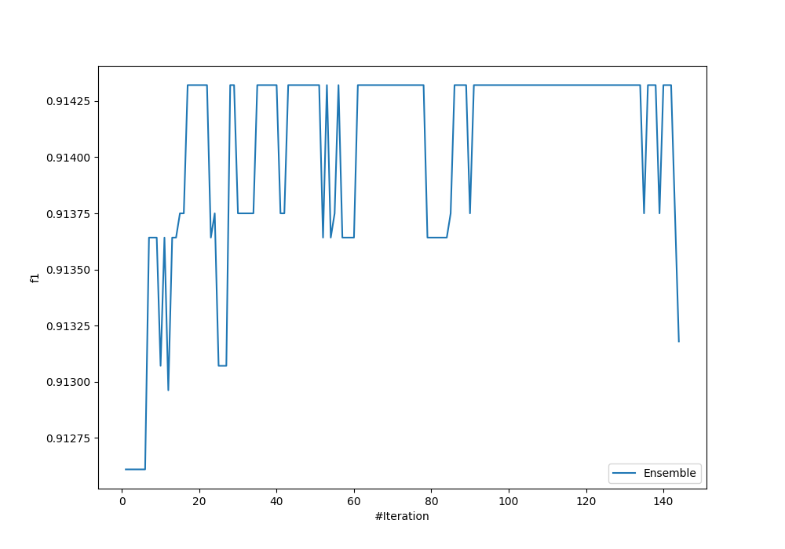
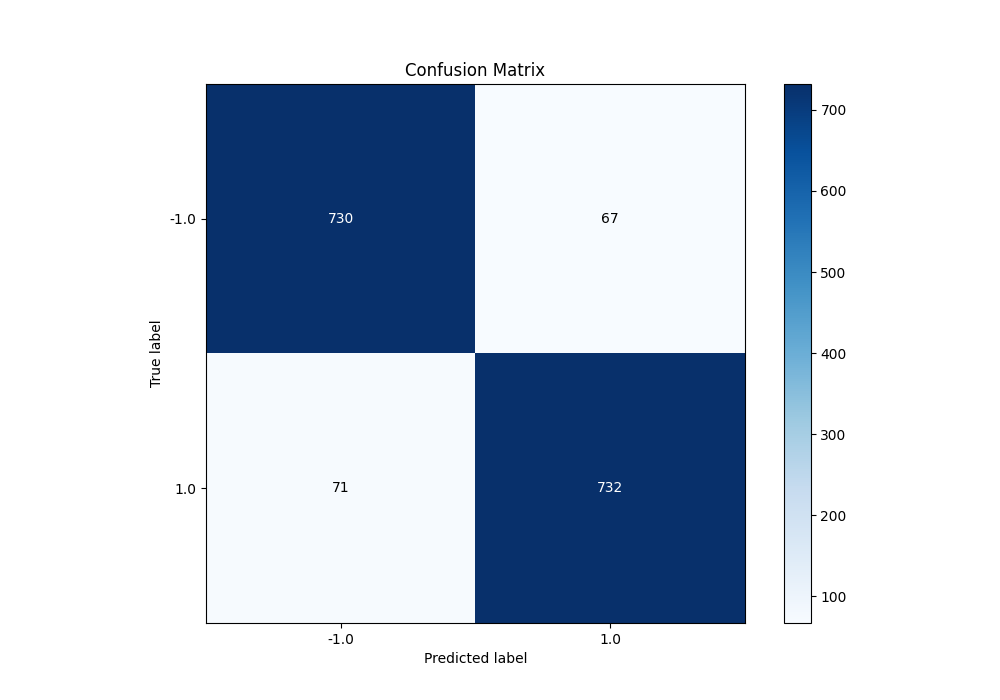
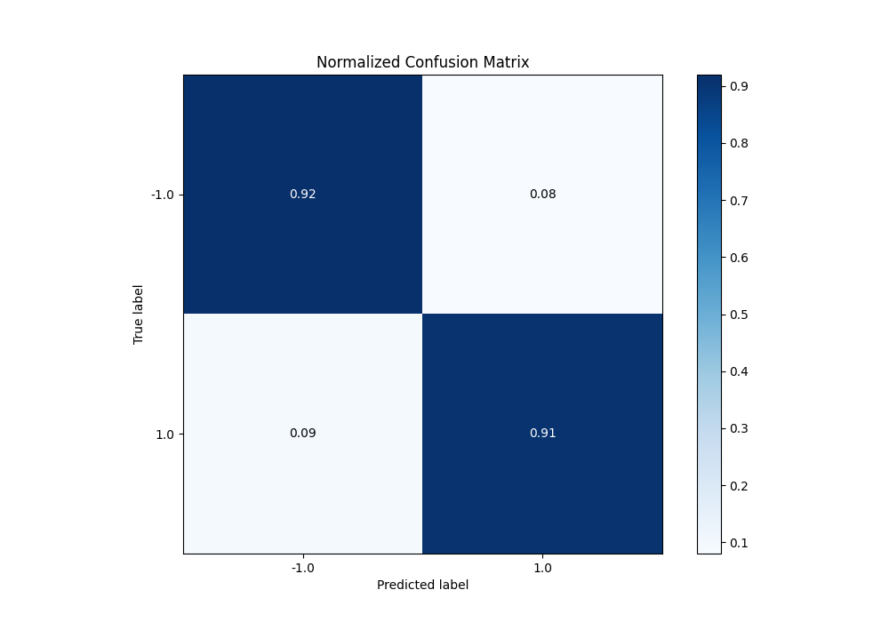
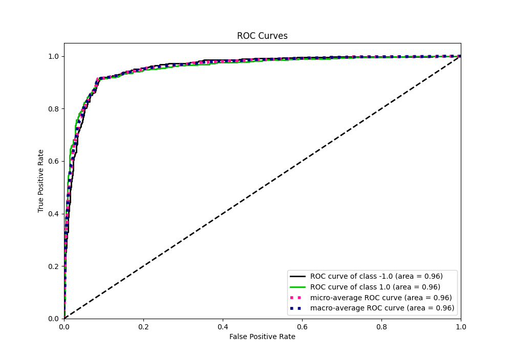
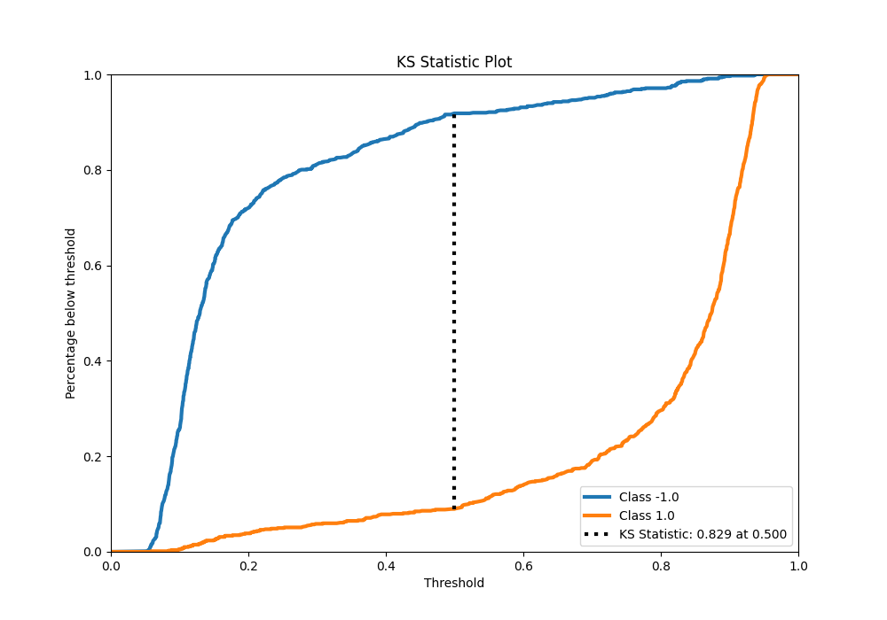
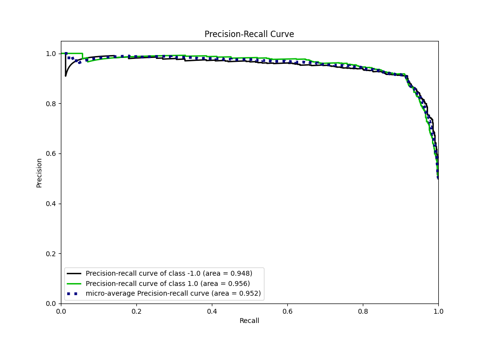
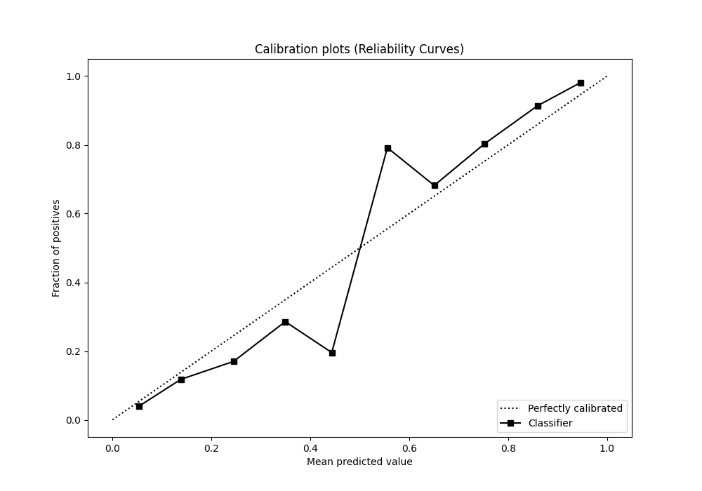
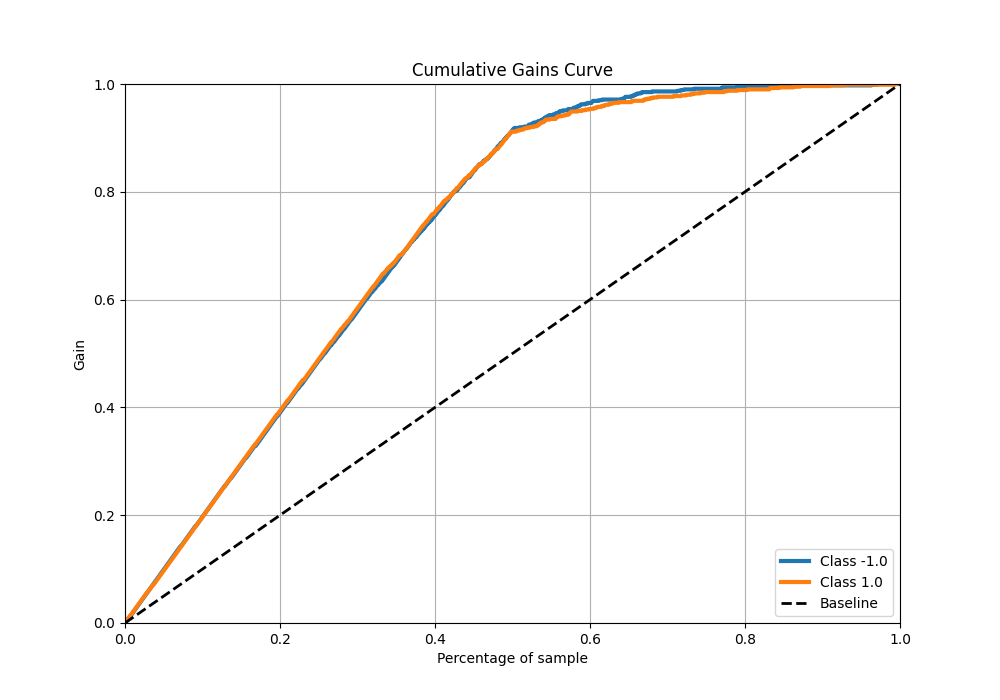
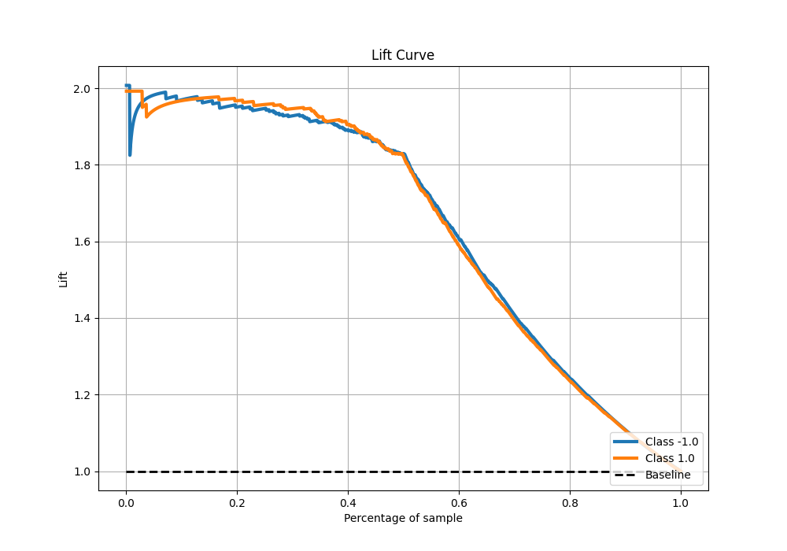

# Summary of Ensemble_Stacked

[<< Go back](../README.md)

## Ensemble structure
| Model                       |   Weight |
|:----------------------------|---------:|
| 114_CatBoost_Stacked        |       10 |
| 11_Default_NearestNeighbors |        1 |
| 2_DecisionTree              |        1 |
| 38_CatBoost                 |        1 |
| 4_Linear                    |        1 |
| 67_NearestNeighbors         |        1 |
| 73_NearestNeighbors         |        1 |
| 88_Xgboost_Stacked          |        1 |

## Metric details
|           |    score |   threshold |
|:----------|---------:|------------:|
| logloss   | 0.290473 |  nan        |
| auc       | 0.955928 |  nan        |
| f1        | 0.913858 |    0.490644 |
| accuracy  | 0.91375  |    0.490644 |
| precision | 1        |    0.940117 |
| recall    | 1        |    0.048037 |
| mcc       | 0.827511 |    0.490644 |

## Metric details with threshold from accuracy metric
|           |    score |   threshold |
|:----------|---------:|------------:|
| logloss   | 0.290473 |  nan        |
| auc       | 0.955928 |  nan        |
| f1        | 0.913858 |    0.490644 |
| accuracy  | 0.91375  |    0.490644 |
| precision | 0.916145 |    0.490644 |
| recall    | 0.911582 |    0.490644 |
| mcc       | 0.827511 |    0.490644 |

## Confusion matrix (at threshold=0.490644)
|                 |   Predicted as -1.0 |   Predicted as 1.0 |
|:----------------|--------------------:|-------------------:|
| Labeled as -1.0 |                 730 |                 67 |
| Labeled as 1.0  |                  71 |                732 |

## Learning curves

## Confusion Matrix

## Normalized Confusion Matrix

## ROC Curve

## Kolmogorov-Smirnov Statistic

## Precision-Recall Curve

## Calibration Curve

## Cumulative Gains Curve

## Lift Curve

[<< Go back](../README.md)
