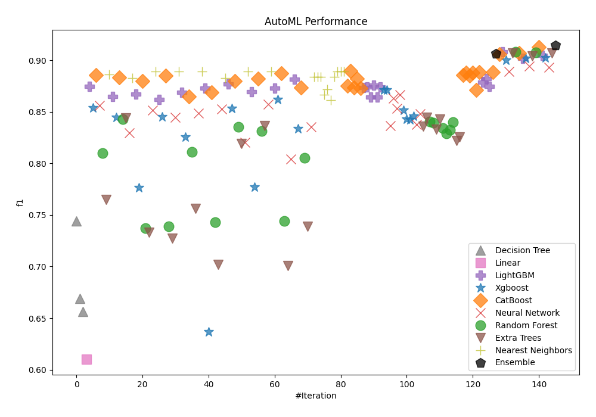
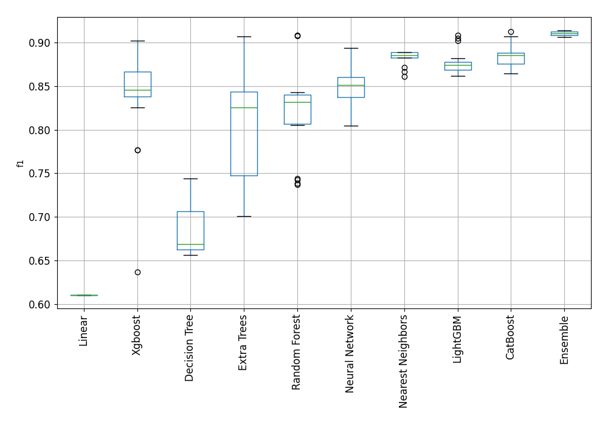
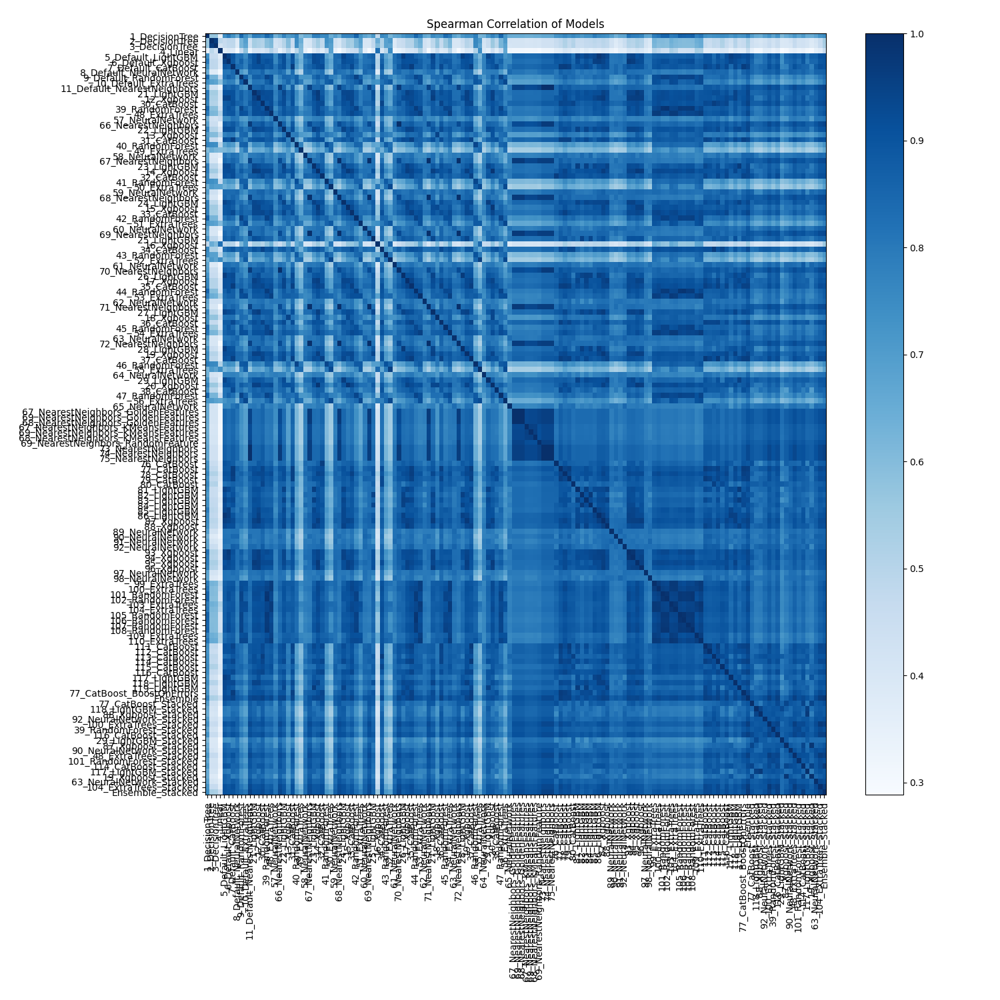

# AutoML Leaderboard

| Best model   | name                                                                               | model_type        | metric_type   |   metric_value |   train_time |
|:-------------|:-----------------------------------------------------------------------------------|:------------------|:--------------|---------------:|-------------:|
|              | [1_DecisionTree](1_DecisionTree/README.md)                                         | Decision Tree     | f1            |       0.744366 |         6.88 |
|              | [2_DecisionTree](2_DecisionTree/README.md)                                         | Decision Tree     | f1            |       0.668969 |         9.49 |
|              | [3_DecisionTree](3_DecisionTree/README.md)                                         | Decision Tree     | f1            |       0.656174 |         8.18 |
|              | [4_Linear](4_Linear/README.md)                                                     | Linear            | f1            |       0.610381 |        15.48 |
|              | [5_Default_LightGBM](5_Default_LightGBM/README.md)                                 | LightGBM          | f1            |       0.874534 |        38.67 |
|              | [6_Default_Xgboost](6_Default_Xgboost/README.md)                                   | Xgboost           | f1            |       0.853735 |        19.51 |
|              | [7_Default_CatBoost](7_Default_CatBoost/README.md)                                 | CatBoost          | f1            |       0.88543  |        15.93 |
|              | [8_Default_NeuralNetwork](8_Default_NeuralNetwork/README.md)                       | Neural Network    | f1            |       0.856423 |        11.77 |
|              | [9_Default_RandomForest](9_Default_RandomForest/README.md)                         | Random Forest     | f1            |       0.809938 |        17.6  |
|              | [10_Default_ExtraTrees](10_Default_ExtraTrees/README.md)                           | Extra Trees       | f1            |       0.765041 |        17.36 |
|              | [11_Default_NearestNeighbors](11_Default_NearestNeighbors/README.md)               | Nearest Neighbors | f1            |       0.886534 |         7.88 |
|              | [21_LightGBM](21_LightGBM/README.md)                                               | LightGBM          | f1            |       0.864966 |        15.85 |
|              | [12_Xgboost](12_Xgboost/README.md)                                                 | Xgboost           | f1            |       0.844666 |        19.69 |
|              | [30_CatBoost](30_CatBoost/README.md)                                               | CatBoost          | f1            |       0.883634 |        16.93 |
|              | [39_RandomForest](39_RandomForest/README.md)                                       | Random Forest     | f1            |       0.842759 |        19.64 |
|              | [48_ExtraTrees](48_ExtraTrees/README.md)                                           | Extra Trees       | f1            |       0.843887 |        15.27 |
|              | [57_NeuralNetwork](57_NeuralNetwork/README.md)                                     | Neural Network    | f1            |       0.829826 |        12.44 |
|              | [66_NearestNeighbors](66_NearestNeighbors/README.md)                               | Nearest Neighbors | f1            |       0.882611 |         7.59 |
|              | [22_LightGBM](22_LightGBM/README.md)                                               | LightGBM          | f1            |       0.866915 |        17.87 |
|              | [13_Xgboost](13_Xgboost/README.md)                                                 | Xgboost           | f1            |       0.776589 |        24.94 |
|              | [31_CatBoost](31_CatBoost/README.md)                                               | CatBoost          | f1            |       0.879852 |        15.2  |
|              | [40_RandomForest](40_RandomForest/README.md)                                       | Random Forest     | f1            |       0.737231 |        15.83 |
|              | [49_ExtraTrees](49_ExtraTrees/README.md)                                           | Extra Trees       | f1            |       0.732912 |        32.91 |
|              | [58_NeuralNetwork](58_NeuralNetwork/README.md)                                     | Neural Network    | f1            |       0.851645 |        26.19 |
|              | [67_NearestNeighbors](67_NearestNeighbors/README.md)                               | Nearest Neighbors | f1            |       0.889167 |        18.05 |
|              | [23_LightGBM](23_LightGBM/README.md)                                               | LightGBM          | f1            |       0.861748 |        19.9  |
|              | [14_Xgboost](14_Xgboost/README.md)                                                 | Xgboost           | f1            |       0.845141 |        28.01 |
|              | [32_CatBoost](32_CatBoost/README.md)                                               | CatBoost          | f1            |       0.885164 |        32.42 |
|              | [41_RandomForest](41_RandomForest/README.md)                                       | Random Forest     | f1            |       0.738728 |        16.62 |
|              | [50_ExtraTrees](50_ExtraTrees/README.md)                                           | Extra Trees       | f1            |       0.727273 |        15.81 |
|              | [59_NeuralNetwork](59_NeuralNetwork/README.md)                                     | Neural Network    | f1            |       0.84472  |        13.88 |
|              | [68_NearestNeighbors](68_NearestNeighbors/README.md)                               | Nearest Neighbors | f1            |       0.889167 |         9.61 |
|              | [24_LightGBM](24_LightGBM/README.md)                                               | LightGBM          | f1            |       0.869025 |       131.58 |
|              | [15_Xgboost](15_Xgboost/README.md)                                                 | Xgboost           | f1            |       0.825871 |        27.6  |
|              | [33_CatBoost](33_CatBoost/README.md)                                               | CatBoost          | f1            |       0.864629 |        16.16 |
|              | [42_RandomForest](42_RandomForest/README.md)                                       | Random Forest     | f1            |       0.811275 |        19.39 |
|              | [51_ExtraTrees](51_ExtraTrees/README.md)                                           | Extra Trees       | f1            |       0.756355 |        18.68 |
|              | [60_NeuralNetwork](60_NeuralNetwork/README.md)                                     | Neural Network    | f1            |       0.848787 |        14.58 |
|              | [69_NearestNeighbors](69_NearestNeighbors/README.md)                               | Nearest Neighbors | f1            |       0.889167 |         9.97 |
|              | [25_LightGBM](25_LightGBM/README.md)                                               | LightGBM          | f1            |       0.872908 |        19.29 |
|              | [16_Xgboost](16_Xgboost/README.md)                                                 | Xgboost           | f1            |       0.636533 |        23.56 |
|              | [34_CatBoost](34_CatBoost/README.md)                                               | CatBoost          | f1            |       0.868699 |        16.26 |
|              | [43_RandomForest](43_RandomForest/README.md)                                       | Random Forest     | f1            |       0.742751 |        18.2  |
|              | [52_ExtraTrees](52_ExtraTrees/README.md)                                           | Extra Trees       | f1            |       0.701995 |        18.37 |
|              | [61_NeuralNetwork](61_NeuralNetwork/README.md)                                     | Neural Network    | f1            |       0.85254  |        15.04 |
|              | [70_NearestNeighbors](70_NearestNeighbors/README.md)                               | Nearest Neighbors | f1            |       0.882611 |        11.07 |
|              | [26_LightGBM](26_LightGBM/README.md)                                               | LightGBM          | f1            |       0.877105 |        22.23 |
|              | [17_Xgboost](17_Xgboost/README.md)                                                 | Xgboost           | f1            |       0.853234 |        27.39 |
|              | [35_CatBoost](35_CatBoost/README.md)                                               | CatBoost          | f1            |       0.88     |        18.17 |
|              | [44_RandomForest](44_RandomForest/README.md)                                       | Random Forest     | f1            |       0.835301 |        23.77 |
|              | [53_ExtraTrees](53_ExtraTrees/README.md)                                           | Extra Trees       | f1            |       0.819083 |        23.74 |
|              | [62_NeuralNetwork](62_NeuralNetwork/README.md)                                     | Neural Network    | f1            |       0.82045  |        18.14 |
|              | [71_NearestNeighbors](71_NearestNeighbors/README.md)                               | Nearest Neighbors | f1            |       0.889167 |        11.77 |
|              | [27_LightGBM](27_LightGBM/README.md)                                               | LightGBM          | f1            |       0.86935  |       107.33 |
|              | [18_Xgboost](18_Xgboost/README.md)                                                 | Xgboost           | f1            |       0.77707  |        25.26 |
|              | [36_CatBoost](36_CatBoost/README.md)                                               | CatBoost          | f1            |       0.882353 |        18.27 |
|              | [45_RandomForest](45_RandomForest/README.md)                                       | Random Forest     | f1            |       0.831169 |        19.25 |
|              | [54_ExtraTrees](54_ExtraTrees/README.md)                                           | Extra Trees       | f1            |       0.836634 |        18.21 |
|              | [63_NeuralNetwork](63_NeuralNetwork/README.md)                                     | Neural Network    | f1            |       0.857498 |        14.4  |
|              | [72_NearestNeighbors](72_NearestNeighbors/README.md)                               | Nearest Neighbors | f1            |       0.889167 |        11.11 |
|              | [28_LightGBM](28_LightGBM/README.md)                                               | LightGBM          | f1            |       0.872976 |        21.31 |
|              | [19_Xgboost](19_Xgboost/README.md)                                                 | Xgboost           | f1            |       0.861789 |        23.94 |
|              | [37_CatBoost](37_CatBoost/README.md)                                               | CatBoost          | f1            |       0.887647 |        23.57 |
|              | [46_RandomForest](46_RandomForest/README.md)                                       | Random Forest     | f1            |       0.743985 |        21.23 |
|              | [55_ExtraTrees](55_ExtraTrees/README.md)                                           | Extra Trees       | f1            |       0.70098  |        20.62 |
|              | [64_NeuralNetwork](64_NeuralNetwork/README.md)                                     | Neural Network    | f1            |       0.804462 |        16.64 |
|              | [29_LightGBM](29_LightGBM/README.md)                                               | LightGBM          | f1            |       0.881587 |        21.85 |
|              | [20_Xgboost](20_Xgboost/README.md)                                                 | Xgboost           | f1            |       0.833539 |        30.8  |
|              | [38_CatBoost](38_CatBoost/README.md)                                               | CatBoost          | f1            |       0.873691 |        17.32 |
|              | [47_RandomForest](47_RandomForest/README.md)                                       | Random Forest     | f1            |       0.805337 |        19.05 |
|              | [56_ExtraTrees](56_ExtraTrees/README.md)                                           | Extra Trees       | f1            |       0.738716 |        23.29 |
|              | [65_NeuralNetwork](65_NeuralNetwork/README.md)                                     | Neural Network    | f1            |       0.835658 |        15.92 |
|              | [67_NearestNeighbors_GoldenFeatures](67_NearestNeighbors_GoldenFeatures/README.md) | Nearest Neighbors | f1            |       0.883721 |        31.43 |
|              | [69_NearestNeighbors_GoldenFeatures](69_NearestNeighbors_GoldenFeatures/README.md) | Nearest Neighbors | f1            |       0.883721 |        12.63 |
|              | [68_NearestNeighbors_GoldenFeatures](68_NearestNeighbors_GoldenFeatures/README.md) | Nearest Neighbors | f1            |       0.883721 |        12.55 |
|              | [67_NearestNeighbors_KMeansFeatures](67_NearestNeighbors_KMeansFeatures/README.md) | Nearest Neighbors | f1            |       0.866667 |        13.26 |
|              | [69_NearestNeighbors_KMeansFeatures](69_NearestNeighbors_KMeansFeatures/README.md) | Nearest Neighbors | f1            |       0.871571 |        13.24 |
|              | [68_NearestNeighbors_KMeansFeatures](68_NearestNeighbors_KMeansFeatures/README.md) | Nearest Neighbors | f1            |       0.861268 |        13.49 |
|              | [69_NearestNeighbors_RandomFeature](69_NearestNeighbors_RandomFeature/README.md)   | Nearest Neighbors | f1            |       0.884013 |        12.92 |
|              | [73_NearestNeighbors](73_NearestNeighbors/README.md)                               | Nearest Neighbors | f1            |       0.888889 |        12.99 |
|              | [74_NearestNeighbors](74_NearestNeighbors/README.md)                               | Nearest Neighbors | f1            |       0.888889 |        13    |
|              | [75_NearestNeighbors](75_NearestNeighbors/README.md)                               | Nearest Neighbors | f1            |       0.888889 |        12.83 |
|              | [76_CatBoost](76_CatBoost/README.md)                                               | CatBoost          | f1            |       0.875467 |        18.91 |
|              | [77_CatBoost](77_CatBoost/README.md)                                               | CatBoost          | f1            |       0.88972  |        33.23 |
|              | [78_CatBoost](78_CatBoost/README.md)                                               | CatBoost          | f1            |       0.873449 |        18.74 |
|              | [79_CatBoost](79_CatBoost/README.md)                                               | CatBoost          | f1            |       0.882243 |        21.12 |
|              | [80_CatBoost](80_CatBoost/README.md)                                               | CatBoost          | f1            |       0.873065 |        22.41 |
|              | [81_LightGBM](81_LightGBM/README.md)                                               | LightGBM          | f1            |       0.873292 |        21.98 |
|              | [82_LightGBM](82_LightGBM/README.md)                                               | LightGBM          | f1            |       0.874148 |        24.58 |
|              | [83_LightGBM](83_LightGBM/README.md)                                               | LightGBM          | f1            |       0.864564 |        24.62 |
|              | [84_LightGBM](84_LightGBM/README.md)                                               | LightGBM          | f1            |       0.875931 |        25.22 |
|              | [85_LightGBM](85_LightGBM/README.md)                                               | LightGBM          | f1            |       0.864596 |        22.77 |
|              | [86_LightGBM](86_LightGBM/README.md)                                               | LightGBM          | f1            |       0.874378 |        31.16 |
|              | [87_Xgboost](87_Xgboost/README.md)                                                 | Xgboost           | f1            |       0.871028 |        30.96 |
|              | [88_Xgboost](88_Xgboost/README.md)                                                 | Xgboost           | f1            |       0.871189 |        26.27 |
|              | [89_NeuralNetwork](89_NeuralNetwork/README.md)                                     | Neural Network    | f1            |       0.836634 |        17.81 |
|              | [90_NeuralNetwork](90_NeuralNetwork/README.md)                                     | Neural Network    | f1            |       0.863118 |        18.66 |
|              | [91_NeuralNetwork](91_NeuralNetwork/README.md)                                     | Neural Network    | f1            |       0.853613 |        18.38 |
|              | [92_NeuralNetwork](92_NeuralNetwork/README.md)                                     | Neural Network    | f1            |       0.866911 |        18.6  |
|              | [93_Xgboost](93_Xgboost/README.md)                                                 | Xgboost           | f1            |       0.851436 |        28.97 |
|              | [94_Xgboost](94_Xgboost/README.md)                                                 | Xgboost           | f1            |       0.842759 |        27.24 |
|              | [95_Xgboost](95_Xgboost/README.md)                                                 | Xgboost           | f1            |       0.842368 |        28.09 |
|              | [96_Xgboost](96_Xgboost/README.md)                                                 | Xgboost           | f1            |       0.846058 |        26.93 |
|              | [97_NeuralNetwork](97_NeuralNetwork/README.md)                                     | Neural Network    | f1            |       0.837736 |        19.6  |
|              | [98_NeuralNetwork](98_NeuralNetwork/README.md)                                     | Neural Network    | f1            |       0.848297 |        19.31 |
|              | [99_ExtraTrees](99_ExtraTrees/README.md)                                           | Extra Trees       | f1            |       0.835933 |        23.81 |
|              | [100_ExtraTrees](100_ExtraTrees/README.md)                                         | Extra Trees       | f1            |       0.844774 |        22.58 |
|              | [101_RandomForest](101_RandomForest/README.md)                                     | Random Forest     | f1            |       0.840472 |        28.94 |
|              | [102_RandomForest](102_RandomForest/README.md)                                     | Random Forest     | f1            |       0.839752 |        28    |
|              | [103_ExtraTrees](103_ExtraTrees/README.md)                                         | Extra Trees       | f1            |       0.832918 |        23.57 |
|              | [104_ExtraTrees](104_ExtraTrees/README.md)                                         | Extra Trees       | f1            |       0.843223 |        25.54 |
|              | [105_RandomForest](105_RandomForest/README.md)                                     | Random Forest     | f1            |       0.834363 |        27.79 |
|              | [106_RandomForest](106_RandomForest/README.md)                                     | Random Forest     | f1            |       0.829177 |        28.38 |
|              | [107_RandomForest](107_RandomForest/README.md)                                     | Random Forest     | f1            |       0.832306 |        29.3  |
|              | [108_RandomForest](108_RandomForest/README.md)                                     | Random Forest     | f1            |       0.840273 |        33.33 |
|              | [109_ExtraTrees](109_ExtraTrees/README.md)                                         | Extra Trees       | f1            |       0.822055 |        25.43 |
|              | [110_ExtraTrees](110_ExtraTrees/README.md)                                         | Extra Trees       | f1            |       0.825416 |        24.33 |
|              | [111_CatBoost](111_CatBoost/README.md)                                             | CatBoost          | f1            |       0.88543  |        40.79 |
|              | [112_CatBoost](112_CatBoost/README.md)                                             | CatBoost          | f1            |       0.887781 |        35.98 |
|              | [113_CatBoost](113_CatBoost/README.md)                                             | CatBoost          | f1            |       0.885307 |        29.34 |
|              | [114_CatBoost](114_CatBoost/README.md)                                             | CatBoost          | f1            |       0.888195 |        27.07 |
|              | [115_CatBoost](115_CatBoost/README.md)                                             | CatBoost          | f1            |       0.871128 |        20.97 |
|              | [116_CatBoost](116_CatBoost/README.md)                                             | CatBoost          | f1            |       0.888331 |        22.56 |
|              | [117_LightGBM](117_LightGBM/README.md)                                             | LightGBM          | f1            |       0.878505 |        24.86 |
|              | [118_LightGBM](118_LightGBM/README.md)                                             | LightGBM          | f1            |       0.881988 |        25.12 |
|              | [119_LightGBM](119_LightGBM/README.md)                                             | LightGBM          | f1            |       0.874923 |        28.54 |
|              | [77_CatBoost_BoostOnErrors](77_CatBoost_BoostOnErrors/README.md)                   | CatBoost          | f1            |       0.888474 |        40.95 |
|              | [Ensemble](Ensemble/README.md)                                                     | Ensemble          | f1            |       0.906484 |        68.04 |
|              | [77_CatBoost_Stacked](77_CatBoost_Stacked/README.md)                               | CatBoost          | f1            |       0.906036 |        67.32 |
|              | [118_LightGBM_Stacked](118_LightGBM_Stacked/README.md)                             | LightGBM          | f1            |       0.908416 |        24.63 |
|              | [88_Xgboost_Stacked](88_Xgboost_Stacked/README.md)                                 | Xgboost           | f1            |       0.900062 |        30.13 |
|              | [92_NeuralNetwork_Stacked](92_NeuralNetwork_Stacked/README.md)                     | Neural Network    | f1            |       0.889024 |        24.41 |
|              | [100_ExtraTrees_Stacked](100_ExtraTrees_Stacked/README.md)                         | Extra Trees       | f1            |       0.907049 |        24.66 |
|              | [39_RandomForest_Stacked](39_RandomForest_Stacked/README.md)                       | Random Forest     | f1            |       0.908411 |        43.33 |
|              | [116_CatBoost_Stacked](116_CatBoost_Stacked/README.md)                             | CatBoost          | f1            |       0.906933 |        27.77 |
|              | [29_LightGBM_Stacked](29_LightGBM_Stacked/README.md)                               | LightGBM          | f1            |       0.901863 |        26.58 |
|              | [87_Xgboost_Stacked](87_Xgboost_Stacked/README.md)                                 | Xgboost           | f1            |       0.901863 |        29.19 |
|              | [90_NeuralNetwork_Stacked](90_NeuralNetwork_Stacked/README.md)                     | Neural Network    | f1            |       0.894147 |        23.42 |
|              | [48_ExtraTrees_Stacked](48_ExtraTrees_Stacked/README.md)                           | Extra Trees       | f1            |       0.904229 |        27.26 |
|              | [101_RandomForest_Stacked](101_RandomForest_Stacked/README.md)                     | Random Forest     | f1            |       0.907731 |        41.4  |
|              | [114_CatBoost_Stacked](114_CatBoost_Stacked/README.md)                             | CatBoost          | f1            |       0.912609 |        44.61 |
|              | [117_LightGBM_Stacked](117_LightGBM_Stacked/README.md)                             | LightGBM          | f1            |       0.90491  |        28.5  |
|              | [19_Xgboost_Stacked](19_Xgboost_Stacked/README.md)                                 | Xgboost           | f1            |       0.902545 |        28.76 |
|              | [63_NeuralNetwork_Stacked](63_NeuralNetwork_Stacked/README.md)                     | Neural Network    | f1            |       0.893097 |        22.84 |
|              | [104_ExtraTrees_Stacked](104_ExtraTrees_Stacked/README.md)                         | Extra Trees       | f1            |       0.907165 |        26.36 |
| **the best** | [Ensemble_Stacked](Ensemble_Stacked/README.md)                                     | Ensemble          | f1            |       0.914321 |        88.73 |

### AutoML Performance

### AutoML Performance Boxplot

### Spearman Correlation of Models

